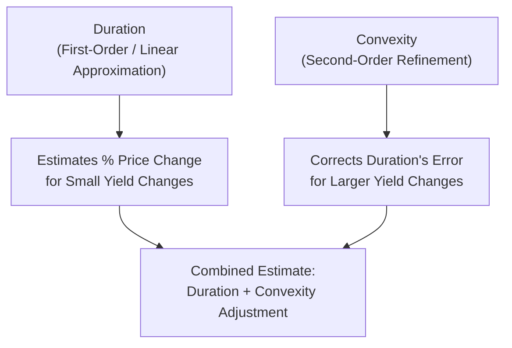

## Duration and Interest Rate Sensitivity

### Overview

Duration is a measure of a bond's price sensitivity to changes in interest rates, expressed in units of time. It serves as both a measure of interest rate risk and, in its original formulation, a weighted-average measure of the time until a bond's cash flows are received. Duration and its refinement, convexity, are essential tools for managing fixed-income portfolio risk.

### Macaulay Duration

Developed by Frederick Macaulay (1938), Macaulay Duration is the weighted average time until a bond's cash flows are received, with weights equal to the present value of each cash flow as a proportion of the bond's total price.

$$D_{Mac} = \frac{\displaystyle\sum_{t=1}^{n} t \times \frac{CF_t}{(1+r)^t}}{P}$$

Where $t$ is the time period, $CF_t$ is the cash flow at time $t$, $r$ is the periodic yield, and $P$ is the bond's current price (the sum of all discounted cash flows).

**Key Points**

- Macaulay Duration is expressed in years (or periods)
- For a zero-coupon bond, Macaulay Duration exactly equals its time to maturity, since there is only a single cash flow
- For a coupon-paying bond, Macaulay Duration is always less than its time to maturity, since some cash flows (coupons) are received before maturity
- Higher coupon rates result in lower Macaulay Duration (more of the bond's value is returned earlier), holding maturity and yield constant
- Longer maturity generally increases Macaulay Duration, holding coupon rate and yield constant

### Worked Example — Macaulay Duration Calculation

Bond details: Face Value = $1,000, Coupon Rate = 8% (annual), Maturity = 3 years, YTM = 8% (bond trades at par, so $P = \$1,000$)

**Step 1 — Determine Cash Flows and Present Values**

| Year ($t$) | Cash Flow ($CF_t$) | PV at 8% | $t \times PV$ |
| --- | --- | --- | --- |
| 1 | $80 | 74.07 | 74.07 |
| 2 | $80 | 68.59 | 137.17 |
| 3 | $1,080 | 857.34 | 2,572.02 |

**Step 2 — Sum the Weighted Present Values**

$$\sum t \times PV = 74.07 + 137.17 + 2{,}572.02 = 2{,}783.26$$

**Step 3 — Divide by Bond Price**

$$D_{Mac} = \frac{2{,}783.26}{1{,}000} = 2.783 \text{ years}$$

**Output**

- Macaulay Duration: ≈2.78 years

Even though the bond matures in 3 years, its Macaulay Duration of 2.78 years reflects that a portion of value is returned earlier via coupon payments.

### Modified Duration

Modified Duration adjusts Macaulay Duration to directly measure the approximate percentage price change of a bond for a 1% (100 basis point) change in yield — making it the more directly applicable measure for interest rate risk management.

$$D_{Mod} = \frac{D_{Mac}}{1+r}$$

Where $r$ is the periodic yield per compounding period.

**Approximate Price Change Formula:**

$$\%\Delta P \approx -D_{Mod} \times \Delta r$$

### Worked Example — Modified Duration and Price Sensitivity

Using the bond above ($D_{Mac} = 2.783$ years, annual YTM = 8%):

**Step 1 — Calculate Modified Duration**

$$D_{Mod} = \frac{2.783}{1.08} = 2.577$$

**Step 2 — Estimate Price Change for a 1% (100 bps) Yield Increase**

$$\%\Delta P \approx -2.577 \times 0.01 = -0.02577 = -2.577\%$$

**Step 3 — Apply to Dollar Price**

$$\Delta P \approx -0.02577 \times \$1{,}000 = -\$25.77$$

**Output**

- Modified Duration: 2.577
- Estimated Price Decline for +1% Yield Increase: ≈$25.77 (new approximate price: ≈$974.23)

This illustrates the inverse price-yield relationship: a rise in market yields produces an estimated decline in bond price of approximately 2.58%, based on duration alone.

<svg xmlns="http://www.w3.org/2000/svg" viewBox="0 0 600 350" font-family="Arial, sans-serif">
<text x="300" y="20" text-anchor="middle" font-size="14" font-weight="bold">Duration as a Linear Price Approximation (svg_diagram)</text>
<line x1="70" y1="300" x2="560" y2="300" stroke="black" stroke-width="1" />
<line x1="70" y1="300" x2="70" y2="40" stroke="black" stroke-width="1" />
<text x="315" y="330" text-anchor="middle" font-size="12">Yield to Maturity</text>
<text x="30" y="170" text-anchor="middle" font-size="12" transform="rotate(-90 30 170)">Bond Price</text>
<path d="M 90 280 Q 250 200 320 150 Q 400 90 540 60" fill="none" stroke="#c0392b" stroke-width="2.5" />
<line x1="140" y1="255" x2="480" y2="95" stroke="#2c6fbb" stroke-width="2" stroke-dasharray="5,3" />
<text x="480" y="85" font-size="11" fill="#2c6fbb">Duration (tangent line)</text>
<text x="400" y="70" font-size="11" fill="#c0392b">Actual price-yield curve</text>
<circle cx="320" cy="150" r="4" fill="black" />
<text x="330" y="145" font-size="10">Current Price</text>
</svg>

### Convexity

Because the actual bond price-yield relationship is curved (convex) rather than perfectly linear, duration alone systematically underestimates price increases and overestimates price decreases for large yield changes. Convexity is a second-order refinement that corrects for this curvature.

$$\text{Convexity} = \frac{1}{P(1+r)^2}\sum_{t=1}^{n} \left[CF_t \times t \times (t+1)\right] \times (1+r)^{-t}$$

**Refined Price Change Formula (Incorporating Convexity):**

$$\%\Delta P \approx \left[-D_{Mod} \times \Delta r\right] + \left[\frac{1}{2} \times \text{Convexity} \times (\Delta r)^2\right]$$

**Key Points**

- Convexity is always positive for standard (option-free) bonds, meaning it always improves the price change estimate relative to duration alone for both rising and falling yields
- Bonds with higher convexity are more valuable to investors, all else equal, since they benefit more from yield declines and lose less from yield increases than a bond with lower convexity, for the same duration
- Longer maturity and lower coupon rates generally increase convexity, similar to their effect on duration
- Callable bonds can exhibit **negative convexity** at lower yields, since the call option caps potential price appreciation as yields fall (issuers become more likely to call the bond)

### Worked Example — Convexity Adjustment Applied

Suppose a bond has Modified Duration = 7.0 and Convexity = 85. Estimate the price change for a 2% (200 bps) increase in yield.

**Step 1 — Duration-Only Estimate**

$$\%\Delta P_{duration} \approx -7.0 \times 0.02 = -0.14 = -14.0\%$$

**Step 2 — Convexity Adjustment**

$$\%\Delta P_{convexity} \approx \frac{1}{2} \times 85 \times (0.02)^2 = 0.5 \times 85 \times 0.0004 = 0.017 = 1.7\%$$

**Step 3 — Combined Estimate**

$$\%\Delta P_{total} \approx -14.0\% + 1.7\% = -12.3\%$$

**Output**

- Duration-Only Estimate: -14.0%
- Convexity-Adjusted Estimate: -12.3%

The convexity adjustment reduces the magnitude of the estimated price decline, since the actual price-yield curve falls less steeply than the linear duration approximation would suggest for a large yield increase.

### Determinants of Duration (Summary)

| Bond Characteristic | Effect on Duration |
| --- | --- |
| Longer time to maturity | Increases duration |
| Higher coupon rate | Decreases duration |
| Higher yield to maturity | Decreases duration |
| Zero-coupon structure | Duration equals maturity (maximum for given maturity) |
| Call feature (callable bond) | Generally decreases effective duration near the call price |

### Portfolio (Aggregate) Duration

Portfolio duration is the market-value-weighted average of the durations of individual bonds held in the portfolio:

$$D_{portfolio} = \sum_{i=1}^{n} w_i \times D_i$$

Where $w_i$ is the market value weight of bond $i$ in the portfolio.

**Key Points**

- Portfolio duration is a widely used tool for immunization strategies, where a portfolio's duration is matched to a specific investment horizon or liability duration to reduce reinvestment and price risk
- Bond portfolio managers actively adjust portfolio duration based on interest rate views: extending duration when rates are expected to fall (to maximize price gains) and shortening duration when rates are expected to rise (to minimize price losses)

### Effective Duration (For Bonds with Embedded Options)

For bonds with embedded options (callable, puttable, convertible), cash flows can change as yields change, making standard Macaulay/Modified Duration calculations inappropriate. Effective Duration instead uses a valuation model to estimate price changes under small parallel shifts in the yield curve:

$$D_{effective} = \frac{P_{-} - P_{+}}{2 \times P_0 \times \Delta y}$$

Where $P_-$ and $P_+$ are the bond's estimated prices after a small downward and upward shift in yield, respectively, and $P_0$ is the initial price.

[Inference] Effective duration requires an option-pricing or valuation model to estimate $P_-$ and $P_+$ under a changed cash flow scenario, making it more complex to calculate than Macaulay or Modified Duration for option-free bonds, and its accuracy depends on the quality of the underlying option-pricing model used.

### Applications in Corporate Finance

- **Interest Rate Risk Management**: Duration is the primary metric used by fixed-income portfolio managers and corporate treasurers to quantify and hedge exposure to interest rate movements
- **Asset-Liability Management (ALM)**: Financial institutions (banks, insurers, pension funds) match asset and liability durations to immunize their balance sheets against interest rate risk
- **Debt Issuance Strategy**: Corporate issuers consider the duration profile of their debt when planning issuance to align with cash flow generation and refinancing risk tolerance
- **Bond Portfolio Performance Attribution**: Duration and convexity contributions are commonly used to decompose sources of portfolio return arising from interest rate movements

### Limitations of Duration and Convexity

- Standard duration measures assume a parallel shift in the yield curve — in reality, curve shifts are often non-parallel (e.g., steepening, flattening, or twisting), which duration alone does not capture
- [Inference] Key rate duration (partial duration measuring sensitivity to specific points on the yield curve) is sometimes used to address non-parallel shift risk, though it requires more granular yield curve data and modeling
- Duration and convexity are point-in-time measures that change as yields change and as time passes, requiring periodic recalculation for accurate ongoing risk management
- For bonds with significant embedded optionality, standard duration/convexity measures can be materially misleading without adjustment to effective duration/convexity measures

**Related Topics**

- Bond pricing and yield to maturity
- The term structure of interest rates and non-parallel yield curve shifts
- Callable bond valuation and negative convexity
- Immunization strategies in fixed-income portfolio management
- Key rate duration and partial duration measures
- Interest rate derivatives (swaps, futures) for hedging duration risk