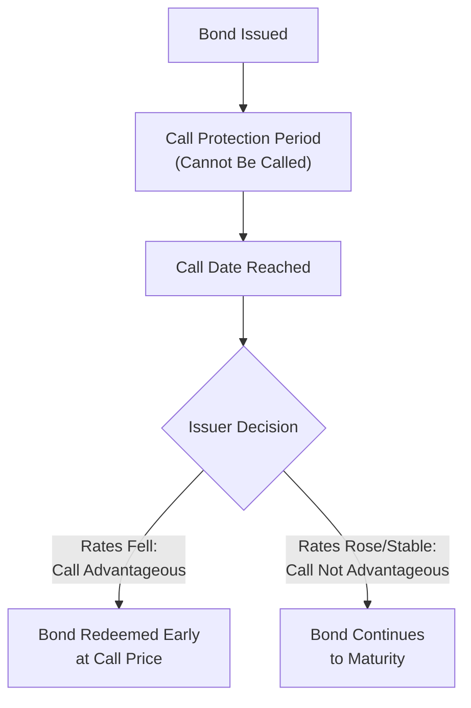
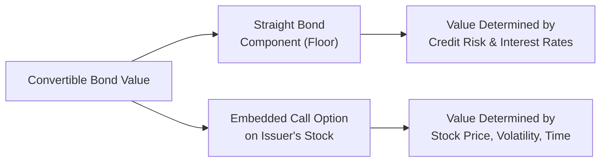

## Convertible and Callable Bond Features

### Overview

Convertible and callable bonds are hybrid or option-embedded debt instruments where a contractual right modifies the standard bond structure. Callable bonds grant the issuer an early redemption right, while convertible bonds grant the holder the right to exchange debt for equity. Both features materially affect pricing, yield, and risk allocation between issuer and investor relative to a plain vanilla bond.

### Callable Bonds

A callable bond gives the issuer the right, but not the obligation, to redeem the bond before its stated maturity date, typically at a predetermined call price.

**Key Points**

- Issuers exercise the call option when advantageous — typically when market interest rates have fallen below the bond's coupon rate, allowing refinancing at a lower cost
- Most callable bonds include a **call protection period** (e.g., the first 5 or 10 years), during which the bond cannot be called
- The **call price** is often set at a premium to face value initially, declining toward par as the bond approaches maturity (a "call schedule")
- Callable bonds compensate investors for the reinvestment risk they bear with a higher coupon rate than an otherwise identical option-free bond

### Callable Bond Cash Flow Structure

### Pricing a Callable Bond

A callable bond can be conceptually decomposed as a long position in an option-free (straight) bond combined with a short position in a call option held by the issuer (since the issuer, not the investor, holds the right to call):

$$P_{callable} = P_{straight} - \text{Value of Call Option}$$

**Key Points**

- Because the investor has effectively sold an option to the issuer, the callable bond is worth less than an equivalent straight bond, all else equal
- The value of the embedded call option increases as interest rate volatility increases (consistent with standard option pricing theory) and as yields fall further below the coupon rate
- This relationship implies callable bonds should offer a higher yield than comparable straight bonds, to compensate investors for the value of the option they have implicitly sold to the issuer

### Yield to Call (YTC)

For callable bonds, an additional yield measure calculates the return assuming the bond is called at the earliest possible call date rather than held to maturity:

$$P = \sum_{t=1}^{n_{call}} \frac{C}{(1+r)^t} + \frac{\text{Call Price}}{(1+r)^{n_{call}}}$$

Solving iteratively for $r$ gives Yield to Call, using the call date and call price in place of maturity date and face value.

**Yield to Worst (YTW)**: The lowest yield among all possible outcomes (YTM and YTC at each successive call date), used as the conservative baseline yield assumption for callable bonds, since investors should not assume they will realize a more favorable outcome than the worst-case scenario.

### Negative Convexity

Standard option-free bonds exhibit positive convexity throughout their price-yield relationship. Callable bonds, however, exhibit **negative convexity** at lower yield levels, since price appreciation is capped as the call becomes increasingly likely to be exercised.

<svg xmlns="http://www.w3.org/2000/svg" viewBox="0 0 600 350" font-family="Arial, sans-serif">
<text x="300" y="20" text-anchor="middle" font-size="14" font-weight="bold">Negative Convexity in Callable Bonds (svg_diagram)</text>
<line x1="70" y1="300" x2="560" y2="300" stroke="black" stroke-width="1" />
<line x1="70" y1="300" x2="70" y2="40" stroke="black" stroke-width="1" />
<text x="315" y="330" text-anchor="middle" font-size="12">Yield to Maturity (Decreasing →)</text>
<text x="30" y="170" text-anchor="middle" font-size="12" transform="rotate(-90 30 170)">Bond Price</text>
<path d="M 540 280 Q 400 200 300 130 Q 220 90 70 80" fill="none" stroke="#888" stroke-dasharray="4,4" stroke-width="2" />
<text x="120" y="70" font-size="11" fill="#888">Straight bond (positive convexity)</text>
<path d="M 540 280 Q 400 200 300 130 Q 250 100 70 95" fill="none" stroke="#c0392b" stroke-width="2.5" />
<text x="90" y="115" font-size="11" fill="#c0392b">Callable bond (flattens at low yields)</text>
<line x1="70" y1="95" x2="230" y2="95" stroke="#c0392b" stroke-dasharray="2,2" />
<text x="120" y="140" font-size="10">Call price ceiling</text>
</svg>

**Key Points**

- As yields decline, the callable bond's price appreciation flattens and can even decline slightly, since the probability of the issuer calling the bond (capping the investor's upside near the call price) increases
- This behavior contrasts with straight bonds, whose prices continue to rise without limit (in percentage terms) as yields decline
- Negative convexity implies that duration itself is not constant and can decrease as yields fall for callable bonds, requiring effective duration measures rather than standard Macaulay/Modified Duration

### Worked Example — Yield to Call Estimation

A callable bond: Face Value = $1,000, Coupon Rate = 7% (annual), currently priced at $1,050, callable in 4 years at a call price of $1,030.

**Approximation Formula:**

$$YTC \approx \frac{C + \dfrac{\text{Call Price}-P}{n_{call}}}{\dfrac{\text{Call Price}+P}{2}}$$

**Step 1 — Determine Inputs**

$$C = \$70 \quad \text{Call Price} = \$1{,}030 \quad P = \$1{,}050 \quad n_{call} = 4$$

**Step 2 — Apply Formula**

$$YTC \approx \frac{70 + \dfrac{1030-1050}{4}}{\dfrac{1030+1050}{2}} = \frac{70 - 5}{1040} = \frac{65}{1040} \approx 0.0625$$

**Output**

- Approximate Yield to Call: ≈6.25%

[Inference] As with the YTM approximation formula, this provides an estimate; precise YTC requires iterative solving, and the approximation's accuracy diminishes with longer periods to the call date or larger premium/discount magnitudes.

### Convertible Bonds

A convertible bond grants the holder the right to convert the bond into a predetermined number of the issuer's common shares, combining features of debt and equity.

**Key Terminology**

| Term | Definition |
| --- | --- |
| Conversion Ratio | Number of common shares received per bond upon conversion |
| Conversion Price | Face Value ÷ Conversion Ratio — the effective price per share paid if converted |
| Conversion Value | Current stock price × Conversion Ratio — the value if converted today |
| Conversion Premium | The percentage by which the bond's market price exceeds its conversion value |
| Straight (Bond) Value | The value of the convertible bond's cash flows if valued purely as a straight, non-convertible bond |

### Convertible Bond Pricing Framework

A convertible bond's price is generally the greater of its straight bond value or its conversion value, plus an additional premium reflecting the option's remaining time value:

$$P_{convertible} = \max(P_{straight}, \text{Conversion Value}) + \text{Option Time Value}$$

Equivalently, it can be conceptually decomposed as:

$$P_{convertible} = P_{straight} + \text{Value of Embedded Call Option on Stock}$$

### Worked Example — Conversion Metrics

A convertible bond has Face Value = $1,000, a conversion ratio of 25 shares per bond, and the issuer's stock currently trades at $32.

**Step 1 — Calculate Conversion Price**

$$\text{Conversion Price} = \frac{\$1{,}000}{25} = \$40 \text{ per share}$$

**Step 2 — Calculate Conversion Value**

$$\text{Conversion Value} = 25 \times \$32 = \$800$$

**Step 3 — Suppose the Bond Trades at $850; Calculate Conversion Premium**

$$\text{Conversion Premium} = \frac{850 - 800}{800} = 6.25\%$$

**Output**

- Conversion Price: $40 per share
- Conversion Value: $800
- Conversion Premium: 6.25%

The stock would need to rise from $32 to above $40 (a 25% increase) before conversion becomes more valuable than the bond's face value redemption — the 6.25% premium reflects the market's assessment of the remaining option value given the stock's current level and volatility.

### The "Bond Floor" and Convertible Behavior at Different Stock Prices

**Key Points**

- When the stock price is low relative to the conversion price, the convertible bond trades primarily based on its straight bond value ("bond floor"), behaving similarly to a regular fixed-income instrument, since conversion is unlikely to be economically attractive
- When the stock price is high relative to the conversion price, the convertible bond trades primarily based on its conversion value, behaving similarly to the underlying equity ("equity-like" behavior)
- In the intermediate ("hybrid") zone, the convertible exhibits characteristics of both debt and equity, with meaningful sensitivity to both interest rates/credit spreads and stock price movements

<svg xmlns="http://www.w3.org/2000/svg" viewBox="0 0 600 350" font-family="Arial, sans-serif">
<text x="300" y="20" text-anchor="middle" font-size="14" font-weight="bold">Convertible Bond Value vs. Stock Price (svg_diagram)</text>
<line x1="70" y1="300" x2="560" y2="300" stroke="black" stroke-width="1" />
<line x1="70" y1="300" x2="70" y2="40" stroke="black" stroke-width="1" />
<text x="315" y="330" text-anchor="middle" font-size="12">Stock Price</text>
<text x="30" y="170" text-anchor="middle" font-size="12" transform="rotate(-90 30 170)">Convertible Bond Value</text>
<line x1="70" y1="220" x2="560" y2="220" stroke="#888" stroke-dasharray="4,4" />
<text x="480" y="215" font-size="11" fill="#888">Straight Bond Value (Floor)</text>
<line x1="200" y1="300" x2="560" y2="90" stroke="#888" stroke-dasharray="4,4" />
<text x="450" y="120" font-size="11" fill="#888">Conversion Value</text>
<path d="M 70 218 Q 200 216 280 205 Q 400 170 560 95" fill="none" stroke="#2c6fbb" stroke-width="2.5" />
<text x="120" y="245" font-size="11" fill="#2c6fbb">Bond-like region</text>
<text x="440" y="70" font-size="11" fill="#2c6fbb">Equity-like region</text>
</svg>

### Why Issuers Use Convertible Bonds

**Key Points**

- Convertible bonds typically carry a lower coupon rate than comparable straight bonds, reducing near-term cash interest costs, since investors accept lower yield in exchange for equity upside potential
- Provides a form of deferred equity financing at a conversion price above the current stock price, potentially reducing dilution relative to issuing equity directly at the current price
- Attractive to issuers who believe their stock is undervalued and expect appreciation, since conversion effectively allows equity issuance at the higher conversion price
- Can carry call features allowing issuers to force conversion once the stock price rises sufficiently above the conversion price ("forced conversion")

### Why Investors Purchase Convertible Bonds

**Key Points**

- Provides downside protection via the straight bond floor value while retaining upside participation in equity appreciation
- Offers a risk/return profile between straight debt and common equity, appealing to investors seeking a hybrid instrument
- Coupon income provides a return stream even if the stock does not appreciate, unlike holding common equity directly

### Comparative Summary: Callable vs. Convertible Features

| Feature | Callable Bond | Convertible Bond |
| --- | --- | --- |
| Option Holder | Issuer | Investor |
| Effect on Coupon Rate (vs. straight bond) | Higher (compensates investor for option sold) | Lower (investor pays for option received) |
| Effect on Convexity | Negative convexity at low yields | Generally positive; equity-linked at high stock prices |
| Primary Risk Driver | Interest rate levels | Stock price and interest rates |
| Value to Whom | Benefits the issuer | Benefits the investor |

### Applications in Corporate Finance

- **Capital Structure Optimization**: Callable and convertible features allow issuers to tailor financing costs and flexibility to their interest rate views and equity market expectations
- **Cost of Capital Considerations**: Convertible bonds' lower coupon reduces reported interest expense, though this must be weighed against potential future equity dilution upon conversion
- **Refinancing Strategy**: Call features provide issuers flexibility to refinance debt opportunistically as rates decline, an important consideration in corporate debt management
- **Valuation Complexity**: Both features require option-pricing methodologies (e.g., binomial models, Black-Scholes-based approaches) for accurate valuation, beyond simple discounted cash flow techniques used for straight bonds

### Limitations and Caveats

- Valuing embedded options accurately requires assumptions about interest rate volatility (for callable bonds) and stock price volatility (for convertible bonds), introducing model risk
- [Inference] Actual issuer call decisions may not always be perfectly economically rational in a narrow interest-rate sense, since refinancing decisions can be influenced by other considerations (transaction costs, market timing preferences, broader capital structure strategy), meaning realized call behavior does not always match theoretical option-exercise predictions precisely
- Convertible bond valuation must also account for potential dilution effects on existing shareholders upon conversion, an important consideration distinct from the bond's standalone valuation

**Related Topics**

- Bond pricing and yield to maturity
- Duration and convexity, including effective duration for option-embedded bonds
- Option pricing theory (Black-Scholes and binomial models)
- Capital structure decisions and financing choice
- Credit risk and bond ratings
- Equity dilution and its effect on shareholder value