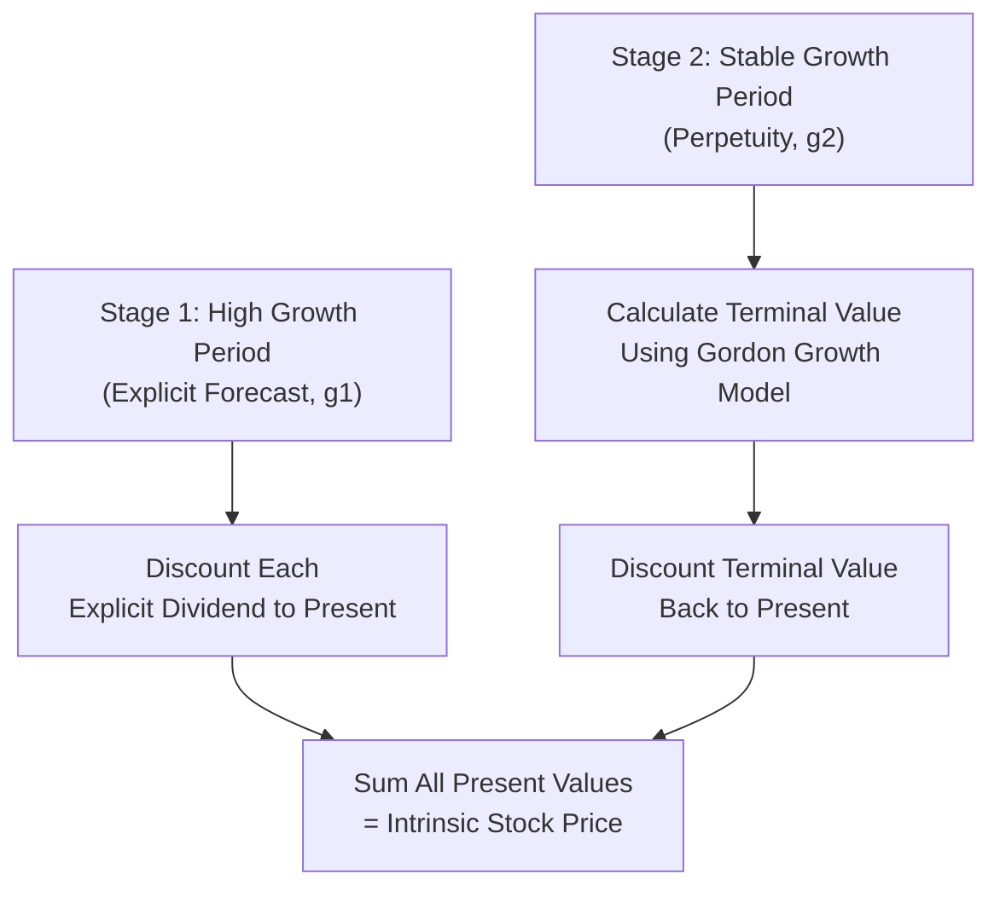
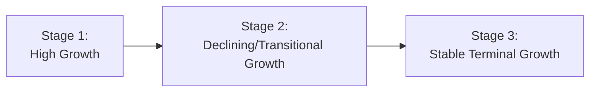

## Dividend Discount Models

### Overview

Dividend discount models (DDMs) value a share of common equity as the present value of all expected future dividend payments. Rooted in the fundamental principle that a stock's intrinsic value equals the discounted value of the cash flows an investor expects to receive, DDMs range from simple single-stage formulas to more complex multi-stage frameworks accommodating changing growth patterns.

### The General Dividend Discount Model

$$P_0 = \sum_{t=1}^{\infty} \frac{D_t}{(1+r)^t}$$

Where:

- $P_0$ = current intrinsic value (price) of the stock
- $D_t$ = expected dividend per share at time $t$
- $r$ = required rate of return on equity (often estimated via CAPM)

This general form requires forecasting dividends indefinitely into the future, which is impractical without simplifying assumptions about the pattern of dividend growth.

### The Gordon Growth Model (Constant Growth DDM)

Developed by Myron Gordon, this simplifies the general model by assuming dividends grow at a single, constant rate indefinitely:

$$P_0 = \frac{D_1}{r-g} = \frac{D_0(1+g)}{r-g}$$

Where:

- $D_1$ = expected dividend in the next period ($D_0 \times (1+g)$)
- $g$ = constant expected dividend growth rate
- $r$ = required rate of return (must exceed $g$ for the formula to yield a finite, meaningful value)

**Key Points**

- Best suited for mature, stable companies with a consistent, predictable dividend policy and growth pattern
- Requires $r > g$; if growth is assumed to equal or exceed the required return, the formula produces an undefined or negative result, indicating the assumption is inappropriate
- Highly sensitive to the assumed values of $r$ and $g$ — small changes in either input can produce large changes in estimated value, particularly as $r-g$ approaches zero

### Worked Example — Gordon Growth Model

A company just paid an annual dividend of $2.00 per share. Dividends are expected to grow at a constant 4% per year indefinitely. The required rate of return on equity is 9%.

**Step 1 — Calculate Next Year's Expected Dividend**

$$D_1 = D_0(1+g) = 2.00 \times 1.04 = \$2.08$$

**Step 2 — Apply the Gordon Growth Formula**

$$P_0 = \frac{2.08}{0.09 - 0.04} = \frac{2.08}{0.05} = \$41.60$$

**Output**

- Intrinsic Value per Share: $41.60

### Sensitivity of Gordon Growth Model to Inputs

| Required Return ($r$) | Growth Rate ($g$) | Implied Price |
| --- | --- | --- |
| 9% | 3% | $34.67 |
| 9% | 4% | $41.60 |
| 9% | 5% | $52.00 |
| 8% | 4% | $52.00 |
| 10% | 4% | $34.67 |

**Key Points**

- As the spread $(r-g)$ narrows, the implied valuation increases disproportionately, illustrating the model's sensitivity near this boundary
- [Inference] Because of this sensitivity, small forecasting errors in either the growth rate or the required return assumption can produce materially different valuations, which is a commonly cited practical limitation of the model

### Zero-Growth (Preferred Stock / Perpetuity) Model

A special case of the Gordon Growth Model where $g = 0$, appropriate for valuing preferred stock or companies with a stable, non-growing dividend:

$$P_0 = \frac{D}{r}$$

**Worked Example**: A preferred share pays a fixed annual dividend of $5.00, with a required return of 7%.

$$P_0 = \frac{5.00}{0.07} \approx \$71.43$$

### Two-Stage Dividend Discount Model

For companies expected to experience a period of above-normal (or below-normal) growth before settling into a stable, long-term growth rate, the two-stage model separately values the high-growth period and the subsequent stable-growth terminal value.

$$P_0 = \sum_{t=1}^{n} \frac{D_0(1+g_1)^t}{(1+r)^t} + \frac{P_n}{(1+r)^n}$$

Where $P_n$ (terminal value at the end of the high-growth period) is calculated using the Gordon Growth Model with the stable long-term growth rate $g_2$:

$$P_n = \frac{D_n(1+g_2)}{r-g_2}$$

### Worked Example — Two-Stage DDM

A company currently pays a dividend of $1.50. It is expected to grow dividends at 15% annually for the next 3 years, then settle into a stable 5% long-term growth rate. The required return is 11%.

**Step 1 — Project High-Growth Dividends**

| Year | Dividend Calculation | Dividend ($D_t$) |
| --- | --- | --- |
| 1 | $1.50 \times 1.15$ | $1.725 |
| 2 | $1.725 \times 1.15$ | $1.984 |
| 3 | $1.984 \times 1.15$ | $2.282 |

**Step 2 — Discount Explicit-Period Dividends to Present**

$$PV_1 = \frac{1.725}{(1.11)^1} = 1.554$$

$$PV_2 = \frac{1.984}{(1.11)^2} = 1.610$$

$$PV_3 = \frac{2.282}{(1.11)^3} = 1.668$$

$$\sum PV = 1.554 + 1.610 + 1.668 = 4.832$$

**Step 3 — Calculate Terminal Value at End of Year 3**

$$D_4 = D_3 \times (1+g_2) = 2.282 \times 1.05 = 2.396$$

$$P_3 = \frac{2.396}{0.11-0.05} = \frac{2.396}{0.06} = 39.933$$

**Step 4 — Discount Terminal Value to Present**

$$PV_{terminal} = \frac{39.933}{(1.11)^3} = 29.184$$

**Step 5 — Sum Both Components**

$$P_0 = 4.832 + 29.184 = \$34.02$$

**Output**

- Intrinsic Value per Share: ≈$34.02

Note that the terminal value component ($29.18) represents approximately 86% of the total valuation, illustrating a common characteristic of DDM and DCF valuations generally: long-term terminal value assumptions often dominate the overall result.

### Three-Stage (Multi-Stage) Dividend Discount Model

An extension incorporating a transitional growth phase between the initial high-growth stage and the final stable-growth stage, useful for companies expected to gradually decelerate rather than shift abruptly to a stable rate.

**Key Points**

- Transitional growth rates are often modeled as declining linearly from the initial high-growth rate toward the terminal stable-growth rate over the transition period
- Provides a more gradual, arguably more realistic growth trajectory than the abrupt shift assumed in the two-stage model
- Requires additional forecasting assumptions (length of each stage, transition pattern), increasing model complexity and the number of inputs subject to estimation uncertainty

### The H-Model (Approximation for Declining Growth)

A simplified alternative to the full three-stage model, the H-Model approximates a linearly declining growth rate without requiring explicit year-by-year dividend projection:

$$P_0 = \frac{D_0(1+g_2)}{r-g_2} + \frac{D_0 \times H \times (g_1-g_2)}{r-g_2}$$

Where $H$ is half the length of the transition (high-growth) period, $g_1$ is the initial growth rate, and $g_2$ is the terminal stable growth rate.

### When Dividend Discount Models Are Most and Least Applicable

**Key Points**

- **Most applicable**: Mature, dividend-paying companies with a stable, well-established dividend policy (e.g., utilities, consumer staples firms)
- **Least applicable**: Companies that pay no dividends or have highly irregular dividend policies (e.g., many growth-stage technology companies), since the model has no cash flow basis to value in the near term
- For non-dividend-paying firms, analysts commonly substitute alternative valuation approaches (discounted free cash flow models, relative valuation multiples) rather than forcing a DDM framework
- [Inference] Even for dividend-paying firms, DDM valuations can diverge meaningfully from actual market prices when a company's payout ratio is low relative to its earnings and growth potential, since the model captures only the dividend stream rather than the firm's broader value creation

### Relationship to the Required Rate of Return

The required return $r$ used in DDM is typically estimated via the Capital Asset Pricing Model:

$$r = R_f + \beta(E(R_m) - R_f)$$

This links dividend discount valuation directly back to the broader asset pricing framework, since the discount rate reflects the stock's systematic risk.

### Implied Growth Rate and Reverse Engineering

The Gordon Growth Model can be rearranged to solve for the growth rate implied by the current market price, useful for assessing whether the market's embedded growth expectations appear reasonable:

$$g_{implied} = r - \frac{D_1}{P_0}$$

**Worked Example**: A stock trades at $50, pays an expected dividend next year of $2.00, and the required return is 10%.

$$g_{implied} = 0.10 - \frac{2.00}{50} = 0.10 - 0.04 = 0.06$$

**Output**

- Implied Growth Rate: 6%

This tells the analyst that the current market price is consistent with the market pricing in a 6% long-term dividend growth rate, which can then be compared against independent growth forecasts to assess relative valuation.

### Comparative Summary of DDM Variants

| Model | Growth Assumption | Best Suited For |
| --- | --- | --- |
| Zero-Growth (Perpetuity) | No growth | Preferred stock, stable non-growing dividends |
| Gordon Growth (Constant Growth) | Single constant growth rate forever | Mature, stable-growth companies |
| Two-Stage | High growth then abrupt shift to stable growth | Companies with a defined high-growth period |
| H-Model | Linearly declining growth (approximated) | Companies transitioning gradually to maturity |
| Three-Stage | High growth, transition, then stable growth | Companies with complex, multi-phase growth trajectories |

### Applications in Corporate Finance

- **Equity Valuation**: DDM provides a fundamentals-based intrinsic value estimate, used alongside or in comparison with market-based relative valuation multiples
- **Cost of Equity Estimation (Alternative to CAPM)**: The Gordon Growth Model rearranged to solve for $r$ provides the "dividend growth model" approach to estimating cost of equity, an alternative to CAPM: $r = \dfrac{D_1}{P_0} + g$
- **Dividend Policy Analysis**: Understanding DDM mechanics informs how changes in payout ratio and growth rate trade-offs affect shareholder value
- **Investment Decision-Making**: Analysts compare DDM-implied intrinsic value against current market price to form buy/sell/hold assessments

### Limitations of Dividend Discount Models

- Inapplicable or unreliable for non-dividend-paying or infrequently dividend-paying companies
- Highly sensitive to the assumed growth rate and required return, particularly in the Gordon Growth Model, given the $(r-g)$ denominator
- Assumes management's dividend policy accurately reflects the firm's underlying value creation, which may not hold if dividends are held artificially low or high relative to sustainable earnings power
- Terminal value assumptions (in multi-stage models) often dominate the overall valuation, meaning the model's output is highly dependent on long-term assumptions that are inherently difficult to forecast with precision
- [Inference] DDM values can differ substantially from market prices for reasons including differing growth/return assumptions, market sentiment, or the market pricing additional value drivers not captured in the dividend stream (e.g., anticipated share buybacks, M&A activity)

**Next Steps**

- Free cash flow valuation models (FCFF and FCFE) as alternatives to DDM
- Cost of equity estimation via CAPM and the dividend growth model approach
- Relative valuation using price multiples (P/E, P/B, EV/EBITDA)
- Terminal value estimation methodologies
- Dividend policy theory and the Modigliani-Miller dividend irrelevance proposition
- Sustainable growth rate calculation (ROE × retention ratio)