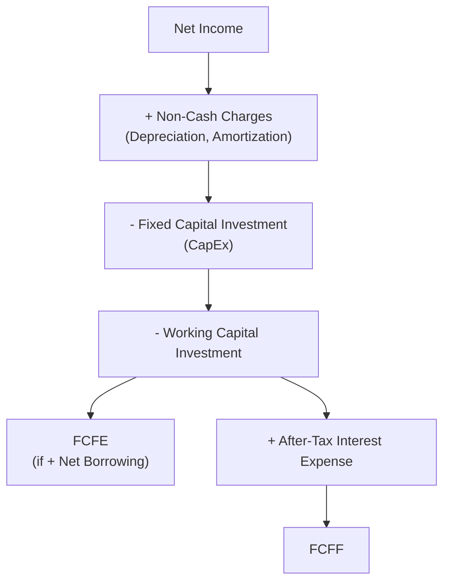
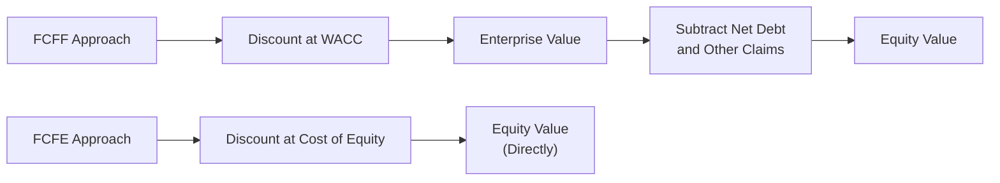

## Free Cash Flow to Equity and Free Cash Flow to the Firm Models

### Overview

Free cash flow valuation models value a company (or its equity) based on the actual cash generated by the business that is available for distribution to capital providers, rather than relying solely on dividends actually paid. Free Cash Flow to the Firm (FCFF) values the entire enterprise, encompassing all capital providers, while Free Cash Flow to Equity (FCFE) values the equity claim directly. These models are widely preferred over dividend discount models for companies with irregular, low, or no dividend payments.

### Free Cash Flow to the Firm (FCFF)

FCFF represents the cash flow available to all capital providers (both debt and equity holders) after the firm has covered operating expenses, taxes, and reinvestment needs (capital expenditures and working capital), but before any financing-related cash flows (interest payments, debt repayment/issuance, dividends).

**Calculating FCFF from Net Income:**

$$FCFF = NI + NCC + Int(1-t) - FCInv - WCInv$$

**Calculating FCFF from EBIT:**

$$FCFF = EBIT(1-t) + Dep - FCInv - WCInv$$

**Calculating FCFF from EBITDA:**

$$FCFF = EBITDA(1-t) + Dep(t) - FCInv - WCInv$$

**Calculating FCFF from Cash Flow from Operations (CFO):**

$$FCFF = CFO + Int(1-t) - FCInv$$

| Symbol | Meaning |
| --- | --- |
| $NI$ | Net Income |
| $NCC$ | Non-cash charges (depreciation, amortization, etc.) |
| $Int$ | Interest expense |
| $t$ | Marginal tax rate |
| $FCInv$ | Fixed capital investment (capital expenditures) |
| $WCInv$ | Investment in working capital (increase in net working capital) |
| $Dep$ | Depreciation and amortization |

**Key Points**

- The $Int(1-t)$ add-back reflects that FCFF is calculated on a pre-financing, after-tax operating basis — interest expense is added back (net of its tax shield) because FCFF represents cash available to all providers of capital, including debt holders who will subsequently receive that interest
- All four calculation approaches should theoretically yield the same FCFF figure when applied consistently to the same underlying financial data

### Free Cash Flow to Equity (FCFE)

FCFE represents the cash flow available specifically to common equity holders after all operating expenses, taxes, reinvestment needs, and net debt-related cash flows (interest, principal repayment, new borrowing) have been accounted for.

**Calculating FCFE from FCFF:**

$$FCFE = FCFF - Int(1-t) + Net\ Borrowing$$

**Calculating FCFE from Net Income:**

$$FCFE = NI + NCC - FCInv - WCInv + Net\ Borrowing$$

**Calculating FCFE from Cash Flow from Operations (CFO):**

$$FCFE = CFO - FCInv + Net\ Borrowing$$

| Symbol | Meaning |
| --- | --- |
| $Net\ Borrowing$ | New debt issued minus debt repaid during the period |

**Key Points**

- FCFE differs from FCFF by removing the portion of cash flow attributable to debt holders (after-tax interest) and adding back net new borrowing (or subtracting net debt repayment)
- FCFE is conceptually similar to dividends but represents the maximum cash that could theoretically be distributed to shareholders, rather than what is actually paid out — capturing cash retained for purposes other than distribution (e.g., building cash reserves)

### FCFF vs. FCFE: Key Distinction

| Aspect | FCFF | FCFE |
| --- | --- | --- |
| Claims Valued | All capital providers (debt + equity) | Equity holders only |
| Includes Interest Adjustments? | Yes — after-tax interest added back | No — interest already excluded (post-financing basis) |
| Includes Net Borrowing? | No | Yes |
| Appropriate Discount Rate | WACC (Weighted Average Cost of Capital) | Cost of Equity ($r_e$, e.g., via CAPM) |
| Resulting Valuation | Enterprise Value (Firm Value) | Equity Value directly |

### Valuing the Firm/Equity Using FCFF

$$\text{Enterprise Value} = \sum_{t=1}^{n} \frac{FCFF_t}{(1+WACC)^t} + \frac{TV_n}{(1+WACC)^n}$$

Once enterprise value is calculated, equity value is derived by subtracting net debt (and other non-common claims, such as preferred stock or minority interest):

$$\text{Equity Value} = \text{Enterprise Value} - \text{Net Debt} - \text{Preferred Stock} - \text{Minority Interest}$$

### Valuing Equity Directly Using FCFE

$$\text{Equity Value} = \sum_{t=1}^{n} \frac{FCFE_t}{(1+r_e)^t} + \frac{TV_n}{(1+r_e)^n}$$

Since FCFE already reflects cash flow net of debt-related cash flows, this approach yields equity value directly, without requiring a subsequent enterprise-to-equity value bridge.

### Worked Example — FCFF Calculation

Given the following data for a company:

- EBIT = $500 million
- Tax Rate = 25%
- Depreciation & Amortization = $80 million
- Capital Expenditures = $120 million
- Increase in Net Working Capital = $30 million

**Step 1 — Calculate After-Tax EBIT**

$$EBIT(1-t) = 500 \times (1-0.25) = 500 \times 0.75 = \$375 \text{ million}$$

**Step 2 — Add Back Depreciation**

$$375 + 80 = \$455 \text{ million}$$

**Step 3 — Subtract Capital Expenditures and Working Capital Investment**

$$FCFF = 455 - 120 - 30 = \$305 \text{ million}$$

**Output**

- FCFF: $305 million

### Worked Example — FCFE from FCFF

Continuing the example, assume Interest Expense = $40 million and Net Borrowing (new debt issued minus repaid) = $15 million.

**Step 1 — Calculate After-Tax Interest**

$$Int(1-t) = 40 \times (1-0.25) = \$30 \text{ million}$$

**Step 2 — Apply the FCFE Formula**

$$FCFE = FCFF - Int(1-t) + Net\ Borrowing = 305 - 30 + 15 = \$290 \text{ million}$$

**Output**

- FCFE: $290 million

### Terminal Value Estimation

Since explicit forecast periods are finite, a terminal value captures the value of cash flows beyond the forecast horizon, typically using either:

**Gordon Growth (Perpetuity) Approach:**

$$TV_n = \frac{FCF_{n+1}}{r-g} = \frac{FCF_n(1+g)}{r-g}$$

**Exit Multiple Approach:**

$$TV_n = \text{Terminal Year Metric} \times \text{Comparable Exit Multiple}$$

(e.g., Terminal Year EBITDA × industry-appropriate EV/EBITDA multiple)

**Key Points**

- The Gordon Growth approach requires an assumed long-term sustainable growth rate, typically constrained to be at or below the long-term nominal GDP growth rate for a mature company
- The exit multiple approach relies on current market pricing of comparable companies, introducing relative valuation assumptions into an otherwise intrinsic (DCF) framework
- [Inference] Terminal value often represents a substantial majority of total DCF-derived value (frequently cited as commonly exceeding half, and often a large majority, of total enterprise or equity value in typical multi-year forecast models), making the terminal value assumption one of the most consequential judgment calls in the entire valuation

### Choosing Between FCFF and FCFE Approaches

**Key Points**

- **FCFF is often preferred** when a company's capital structure is expected to change significantly over the forecast period, since WACC-based discounting more cleanly separates operating performance from financing decisions
- **FCFE may be more direct** when capital structure is expected to remain relatively stable, allowing equity value to be calculated without the additional enterprise-to-equity bridge step
- **FCFF is generally preferred** for companies with negative or highly volatile net income/FCFE (e.g., due to significant leverage), since FCFF calculations starting from EBIT are less distorted by financing-related volatility
- Both approaches, when applied consistently and correctly, should theoretically converge on the same equity value

### Sensitivity of FCF Models to Key Assumptions

| Assumption | Effect of Increase |
| --- | --- |
| Discount Rate (WACC or $r_e$) | Decreases valuation |
| Terminal Growth Rate ($g$) | Increases valuation (particularly sensitive as it approaches the discount rate) |
| Forecasted Revenue Growth | Increases valuation (through higher projected FCF) |
| Capital Expenditure Assumptions | Decreases valuation (higher reinvestment reduces near-term FCF) |
| Tax Rate | Decreases valuation (reduces after-tax cash flow) |

### Applications in Corporate Finance

- **Equity and Enterprise Valuation**: FCFF/FCFE models are the primary intrinsic valuation methodology used in equity research, investment banking, and corporate finance more broadly, particularly for companies with irregular or no dividend payments
- **Mergers and Acquisitions**: Discounted cash flow models using FCFF are standard in M&A valuation to determine a target company's standalone and synergy-adjusted value
- **Capital Budgeting**: The same fundamental FCF calculation principles used at the firm level apply to individual project-level capital budgeting decisions (incremental FCFF for a specific project)
- **Leveraged Buyout (LBO) Analysis**: FCFE-oriented thinking is central to LBO modeling, where available cash flow after debt service directly determines the pace of debt paydown

### Limitations of FCF Valuation Models

- Highly sensitive to forecast assumptions (growth rates, margins, reinvestment needs) over the explicit forecast period, and even more sensitive to terminal value assumptions
- Requires numerous detailed financial statement forecasts (income statement, balance sheet changes, capital expenditure schedules), making the process more data- and assumption-intensive than simpler relative valuation approaches
- [Inference] Small changes in discount rate or terminal growth rate assumptions can produce disproportionately large changes in estimated value, particularly for companies with long high-growth forecast periods, which is a commonly cited criticism of DCF-based approaches generally
- Working capital and capital expenditure forecasts can be difficult to project accurately for companies undergoing significant business model transitions or rapid growth

**Related Topics**

- Weighted Average Cost of Capital (WACC) estimation
- Cost of equity estimation via CAPM
- Dividend discount models as an alternative valuation approach
- Terminal value estimation methodologies (Gordon Growth vs. exit multiple)
- Relative valuation using price and enterprise value multiples
- Sensitivity and scenario analysis in DCF modeling