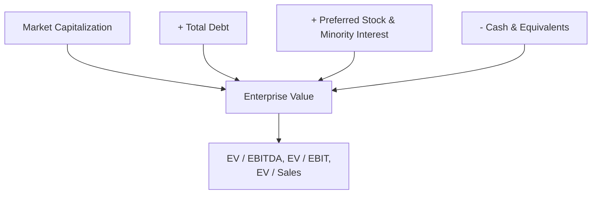
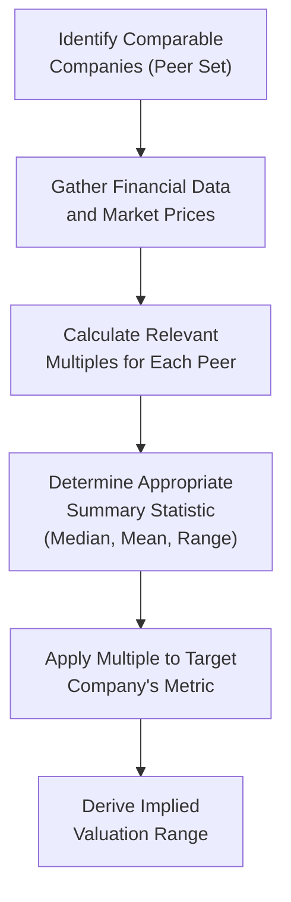
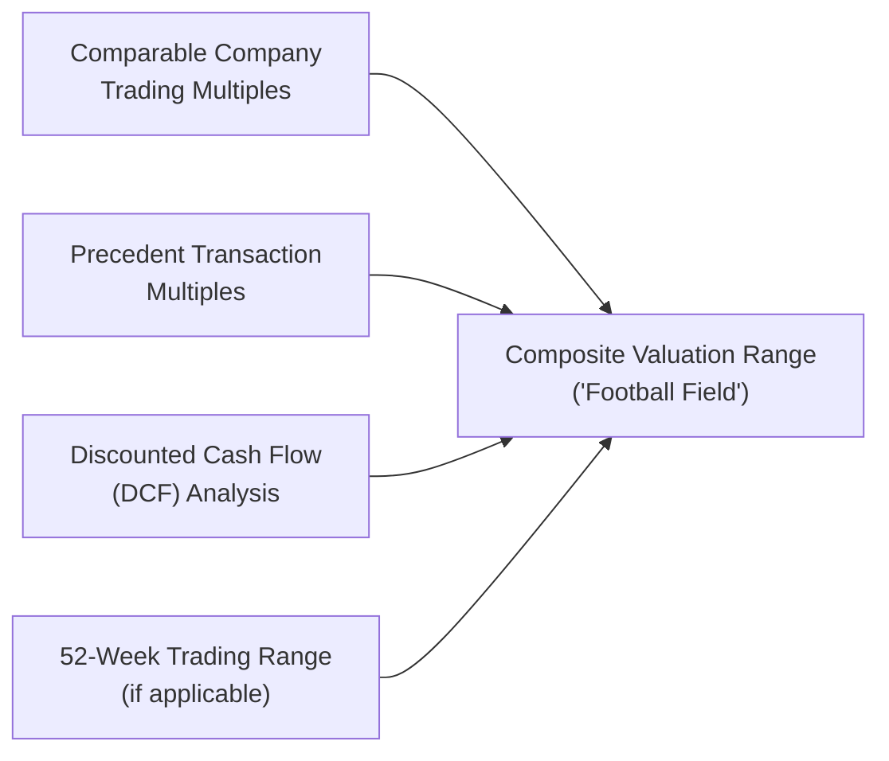

## Relative Valuation Using Trading Multiples

### Overview

Relative valuation estimates the value of a company by comparing it to similar companies (or its own historical trading levels) using standardized valuation ratios called multiples. Unlike intrinsic valuation methods (DDM, DCF), relative valuation relies on market-based pricing observed for comparable assets, applying the principle that similar assets should trade at similar valuation levels.

### Conceptual Framework

The core logic of relative valuation rests on the "Law of One Price": similar assets generating similar cash flows and risk profiles should trade at similar prices relative to a chosen financial metric. A multiple standardizes value by dividing a market price (or enterprise value) by a relevant financial or operating metric, enabling comparison across companies of different sizes.

$$\text{Multiple} = \frac{\text{Market Value Measure}}{\text{Financial/Operating Metric}}$$

### Classification of Multiples

**Equity Value Multiples** (numerator reflects only the equity claim):

| Multiple | Formula | Best Used When |
| --- | --- | --- |
| Price-to-Earnings (P/E) | Price per Share / Earnings per Share | Company is profitable with stable, comparable accounting earnings |
| Price-to-Book (P/B) | Price per Share / Book Value per Share | Asset-heavy industries (financials, real estate) |
| Price-to-Sales (P/S) | Price per Share / Sales per Share | Companies with negative earnings but positive revenue |
| Price/Earnings-to-Growth (PEG) | P/E Ratio / Expected EPS Growth Rate | Comparing companies with differing growth rates |

**Enterprise Value Multiples** (numerator reflects total firm value, capital-structure-neutral):

| Multiple | Formula | Best Used When |
| --- | --- | --- |
| EV/EBITDA | Enterprise Value / EBITDA | Comparing companies with different capital structures or tax rates |
| EV/EBIT | Enterprise Value / EBIT | Similar to EV/EBITDA but incorporates depreciation differences |
| EV/Sales (EV/Revenue) | Enterprise Value / Revenue | Early-stage or currently unprofitable companies |
| EV/Invested Capital | Enterprise Value / Invested Capital | Capital-intensive industries |

### Calculating Enterprise Value

$$EV = \text{Market Capitalization} + \text{Total Debt} + \text{Preferred Stock} + \text{Minority Interest} - \text{Cash and Cash Equivalents}$$

**Key Points**

- Enterprise value represents the total value of the firm's operations, independent of how that value is financed (debt vs. equity)
- Cash is subtracted because it is a non-operating asset that could theoretically be used to immediately reduce net debt, and EV is meant to capture the value of core operations
- Enterprise value multiples are generally preferred over equity value multiples when comparing companies with meaningfully different leverage levels, since they remove the distorting effect of capital structure differences on the multiple

### The Comparable Company Analysis Process

### Worked Example — P/E-Based Valuation

A peer group of five comparable companies has the following trailing P/E ratios: 14.2x, 16.8x, 15.5x, 18.1x, 13.9x. The target company has trailing twelve-month EPS of $3.20.

**Step 1 — Calculate the Median Peer P/E**

Ordering the values: 13.9, 14.2, 15.5, 16.8, 18.1 → Median = 15.5x

**Step 2 — Apply the Median Multiple to the Target's EPS**

$$\text{Implied Share Price} = 15.5 \times \$3.20 = \$49.60$$

**Output**

- Implied Value per Share (P/E Approach): $49.60

### Worked Example — EV/EBITDA-Based Valuation

A peer group's median EV/EBITDA multiple is 9.5x. The target company has EBITDA of $150 million, total debt of $200 million, cash of $50 million, and 40 million shares outstanding.

**Step 1 — Calculate Implied Enterprise Value**

$$EV = 9.5 \times \$150\text{ million} = \$1{,}425\text{ million}$$

**Step 2 — Bridge from Enterprise Value to Equity Value**

$$\text{Equity Value} = EV - \text{Total Debt} + \text{Cash} = 1{,}425 - 200 + 50 = \$1{,}275\text{ million}$$

**Step 3 — Calculate Implied Value per Share**

$$\text{Value per Share} = \frac{1{,}275\text{ million}}{40\text{ million shares}} = \$31.88$$

**Output**

- Implied Enterprise Value: $1,425 million
- Implied Value per Share (EV/EBITDA Approach): $31.88

### Selecting Comparable Companies

**Key Points**

- Comparability is typically assessed based on industry classification, business model similarity, growth prospects, profitability margins, size, and geographic exposure
- A narrower, more precisely matched peer set generally produces a more reliable valuation range, though it may result in a smaller sample size
- Analysts commonly consider both direct industry competitors and companies with similar risk/return/growth characteristics even outside the exact same industry classification
- [Inference] No peer set is ever a perfect match to the target company, so professional judgment plays a meaningful role in selecting and weighting the comparable set, introducing an element of subjectivity into the relative valuation process

### PEG Ratio: Adjusting for Growth

The PEG ratio adjusts the P/E multiple for differences in expected earnings growth rates, allowing more meaningful comparison between companies growing at different rates.

$$PEG = \frac{P/E \text{ Ratio}}{\text{Expected Annual EPS Growth Rate} \times 100}$$

**Key Points**

- A lower PEG ratio is generally interpreted as indicating a stock is relatively cheaper after accounting for its growth rate, though this is a heuristic rather than a rigorous valuation methodology
- [Unverified] Common rule-of-thumb interpretations (e.g., "a PEG below 1.0 suggests undervaluation") are widely cited in practitioner literature but lack a rigorous theoretical foundation and should be treated as approximate heuristics rather than precise valuation signals

### Multiples Based on Precedent Transactions

An alternative to trading multiples uses multiples paid in prior M&A transactions involving comparable companies, rather than current public market trading levels.

**Key Points**

- Transaction multiples typically incorporate a **control premium**, reflecting the additional value an acquirer is willing to pay for control of the target company, and therefore tend to be higher than public trading multiples for otherwise comparable companies
- Useful specifically for M&A valuation contexts, where the relevant question is what a strategic or financial buyer might pay for full control
- Transaction data can be less current than trading multiples, since relevant precedent transactions may have occurred at different points in the economic cycle

| Approach | Basis | Typical Use Case |
| --- | --- | --- |
| Comparable Company (Trading) Multiples | Current public market trading levels | General valuation, IPO pricing, minority stake valuation |
| Precedent Transaction Multiples | Historical M&A deal pricing | M&A valuation, incorporates control premium |

### Advantages of Relative Valuation

**Key Points**

- Simpler and faster to apply than intrinsic valuation methods (DCF, DDM), requiring fewer explicit long-term forecasting assumptions
- Directly reflects current market sentiment and pricing, which can be advantageous when the goal is to estimate what the market is currently willing to pay
- Widely used and understood across the finance industry, facilitating communication of valuation conclusions
- Useful as a cross-check against intrinsic valuation methods, helping identify whether DCF-based assumptions are reasonable relative to how the market is actually pricing comparable businesses

### Limitations of Relative Valuation

- Relies on the assumption that the broader market (or the selected peer set) is correctly priced — if the entire peer group or market segment is overvalued or undervalued, the resulting relative valuation inherits that mispricing
- Finding truly comparable companies is often difficult in practice, particularly for unique businesses, niche industries, or companies with unusual capital structures
- Accounting differences across companies (e.g., differing depreciation policies, lease accounting treatment, one-time items) can distort multiples if not carefully normalized
- Multiples are a single-period snapshot and do not explicitly capture differences in expected future growth, risk, or capital structure unless specifically adjusted for (as with the PEG ratio)
- [Inference] Because relative valuation is inherently comparative rather than fundamentals-driven from first principles, it can perpetuate mispricing across an entire sector during periods of broad market or sector-wide over- or under-valuation, a limitation not shared to the same degree by intrinsic valuation approaches

### Applications in Corporate Finance

- **Equity Research and Investment Analysis**: Relative valuation multiples are a standard component of equity research reports, used alongside intrinsic valuation methods
- **Mergers and Acquisitions**: Both trading and precedent transaction multiples are core components of M&A valuation "football field" analyses, presenting a range of value estimates from multiple methodologies
- **Initial Public Offering (IPO) Pricing**: Underwriters commonly reference comparable public company multiples to help establish an appropriate IPO pricing range
- **Fairness Opinions**: Investment banks providing fairness opinions in M&A transactions typically incorporate relative valuation analysis alongside DCF and precedent transaction analysis
- **Private Company Valuation**: In the absence of a public market price, relative valuation using public comparables (often with an illiquidity discount adjustment) is a common approach for valuing private companies

### Building a Valuation Range: The "Football Field" Approach

**Key Points**

- Combining multiple valuation methodologies into a single visual range helps triangulate a reasonable overall valuation estimate rather than relying on any single method in isolation
- Discrepancies between methods (e.g., DCF suggesting a materially different value than trading comparables) often prompt further analysis into which underlying assumptions are driving the difference

**Related Topics**

- Enterprise value calculation and capital structure adjustments
- Discounted cash flow valuation (FCFF and FCFE models)
- Precedent transaction analysis and control premiums
- Comparable company selection methodology
- Accounting adjustments and normalization in valuation multiples
- Sum-of-the-parts valuation for diversified/conglomerate companies