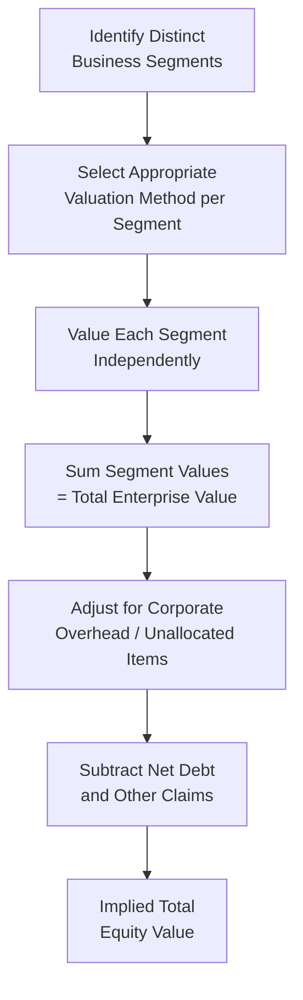
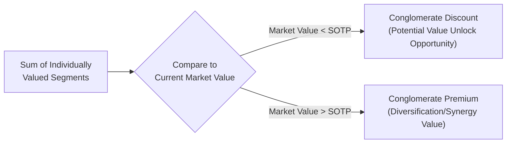

## Sum of the Parts Valuation

### Overview

Sum-of-the-parts (SOTP) valuation is a method for valuing a diversified or multi-segment company by separately valuing each of its distinct business units or segments, then aggregating these individual valuations to arrive at a total enterprise or equity value. This approach is particularly useful when a company's segments have materially different growth rates, risk profiles, margins, or appropriate valuation methodologies, making a single blended valuation approach inappropriate.

### Rationale for Sum-of-the-Parts Analysis

**Key Points**

- Conglomerates and diversified companies often trade at a discount to the aggregate value of their individual segments if valued separately — commonly referred to as a **"conglomerate discount"**
- Applying a single valuation multiple or discount rate to a company with fundamentally different business lines can obscure or distort the true underlying value of each segment
- SOTP analysis is frequently used to identify potential value creation opportunities through corporate restructuring, spin-offs, or divestitures
- Particularly relevant for holding companies, diversified industrials, and companies operating across multiple distinct industries (e.g., a company with both a stable utility segment and a high-growth technology segment)

### The Sum-of-the-Parts Process

### Selecting Valuation Methods by Segment

**Key Points**

- Different segments may warrant entirely different valuation approaches based on their specific characteristics and available comparable data
- A mature, stable-cash-flow segment might be valued using EV/EBITDA multiples from direct industry comparables
- A high-growth, early-stage segment might be valued using EV/Revenue multiples (given limited or negative near-term profitability) or a standalone DCF
- An asset-heavy segment (e.g., real estate holdings) might be valued using net asset value (NAV) or replacement cost approaches
- A regulated utility segment might use a distinct set of regulatory-comparable multiples reflecting its unique risk and return characteristics

| Segment Type | Common Valuation Approach |
| --- | --- |
| Mature, stable-cash-flow business | EV/EBITDA multiple (industry comparables) |
| High-growth/early-stage business | EV/Revenue multiple or standalone DCF |
| Asset-heavy business (real estate, natural resources) | Net Asset Value (NAV) or replacement cost |
| Regulated utility or financial segment | Segment-specific regulatory comparable multiples |
| Investment holdings/minority stakes | Market value (if publicly traded) or cost/fair value basis |

### Worked Example — Sum-of-the-Parts Valuation

A diversified company operates three segments. Analysts apply segment-specific multiples to each:

| Segment | Metric | Value | Appropriate Multiple | Implied Segment EV |
| --- | --- | --- | --- | --- |
| Industrial Products | EBITDA | $200 million | 8.0x | $1,600 million |
| Consumer Technology | Revenue | $150 million | 3.5x | $525 million |
| Financial Services | Book Value | $400 million | 1.2x | $480 million |

**Step 1 — Sum the Segment Enterprise Values**

$$\text{Total Segment EV} = 1{,}600 + 525 + 480 = \$2{,}605\text{ million}$$

**Step 2 — Adjust for Unallocated Corporate Overhead**

Assume unallocated corporate costs are capitalized as a negative value using an 8x multiple on -$40 million of annual corporate overhead EBITDA:

$$\text{Corporate Overhead Value} = -40 \times 8.0 = -\$320\text{ million}$$

$$\text{Total Enterprise Value} = 2{,}605 - 320 = \$2{,}285\text{ million}$$

**Step 3 — Bridge to Equity Value**

Assume Total Debt = $500 million, Cash = $100 million, no preferred stock or minority interest:

$$\text{Equity Value} = 2{,}285 - 500 + 100 = \$1{,}885\text{ million}$$

**Step 4 — Calculate Value per Share** (assume 100 million shares outstanding)

$$\text{Value per Share} = \frac{1{,}885\text{ million}}{100\text{ million}} = \$18.85$$

**Output**

- Total Enterprise Value: $2,285 million
- Implied Equity Value: $1,885 million
- Implied Value per Share: $18.85

### Comparing SOTP Value to Current Market Value

A core application of SOTP analysis is comparing the implied value from segment-level analysis against the company's current consolidated market valuation, to assess whether a conglomerate discount (or premium) exists.

$$\text{Conglomerate Discount/Premium} = \frac{\text{Current Market Value} - \text{SOTP Implied Value}}{\text{SOTP Implied Value}}$$

**Worked Example**: Using the $18.85 SOTP-implied share price above, suppose the stock currently trades at $16.00.

$$\text{Discount} = \frac{16.00 - 18.85}{18.85} = \frac{-2.85}{18.85} \approx -15.1\%$$

**Output**

- Implied Conglomerate Discount: ≈15.1%

This suggests the market is valuing the company at approximately 15% below the sum of its individually valued segments, which analysts might interpret as a potential catalyst for value-unlocking corporate actions (e.g., a spin-off).

### Why Conglomerate Discounts May Exist

**Key Points**

- **Complexity and Analyst Coverage**: Diversified companies can be more difficult for analysts and investors to fully understand and value accurately, potentially resulting in a valuation discount due to informational complexity
- **Capital Misallocation Concerns**: Investors may be skeptical that management can efficiently allocate capital across fundamentally different businesses, sometimes referred to in the corporate finance literature as inefficient "internal capital markets"
- **Investor Preference for Pure-Play Exposure**: Some investors prefer to construct their own diversified portfolios by holding pure-play companies directly, rather than paying for company-level diversification they did not choose
- **Loss of Segment-Specific Investor Base**: A diversified company may fail to attract the specialized institutional investor base (e.g., sector-focused funds) that a pure-play company in each respective segment might attract individually
- [Inference] The existence and magnitude of conglomerate discounts is a subject of ongoing academic and practitioner debate, and not all diversified companies trade at a discount — some exhibit a premium if the market perceives genuine synergies, more stable diversified cash flows, or effective capital allocation across the corporate portfolio

### Adjusting for Unallocated Corporate Costs

**Key Points**

- Corporate overhead (executive compensation, centralized administrative functions, shared corporate services) typically is not directly attributable to any single business segment
- This overhead is commonly valued as a separate "negative segment," capitalized using an appropriate multiple, and subtracted from the sum of the operating segment values
- Failing to properly account for corporate overhead can result in an overstated SOTP valuation, since the positive segment values would otherwise ignore this real, ongoing cash outflow

### Using SOTP Analysis for Strategic Decision-Making

**Key Points**

- SOTP analysis often informs management and board decisions regarding potential divestitures, spin-offs, or carve-outs of underperforming or undervalued segments
- Activist investors frequently employ SOTP analysis to build a case for corporate restructuring, arguing that separating segments would unlock shareholder value by allowing each business to be valued (and managed) independently
- Conversely, SOTP analysis can also support a company's strategic rationale for maintaining a diversified structure if the analysis reveals genuine cross-segment synergies not otherwise captured in a standalone valuation

### Applications in Corporate Finance

- **Conglomerate and Diversified Company Valuation**: The primary use case, providing a more granular valuation than a single blended multiple applied to consolidated financials
- **Spin-off and Divestiture Analysis**: SOTP analysis directly supports the financial case for separating business units, estimating the potential value creation from such actions
- **M&A Analysis**: When acquiring a multi-segment target, SOTP analysis helps identify which specific segments are driving deal value and informs post-acquisition integration or divestiture strategy
- **Activist Investment Strategy**: A standard analytical tool used by activist investors to identify potential undervaluation and build the investment/engagement thesis
- **Holding Company Valuation**: Particularly relevant for valuing holding companies with stakes in multiple, often publicly traded, subsidiary businesses

### Limitations of Sum-of-the-Parts Valuation

- Requires reliable segment-level financial data, which may not always be disclosed with sufficient granularity in public financial statements, particularly for smaller or less material segments
- Selecting appropriate, truly comparable peer multiples for each individual segment can be as challenging as (or more challenging than) finding comparables for the consolidated company as a whole
- Does not automatically capture potential dis-synergies (e.g., shared infrastructure, cross-selling relationships, tax efficiencies) that might be lost if segments were actually separated, potentially overstating the achievable value from a hypothetical breakup
- [Inference] The magnitude of any calculated conglomerate discount is highly sensitive to the specific multiples and valuation methods chosen for each segment, meaning different analysts applying reasonable but differing assumptions could arrive at meaningfully different discount estimates for the same company

**Related Topics**

- Relative valuation using trading multiples
- Discounted cash flow valuation (FCFF and FCFE models)
- Corporate restructuring, spin-offs, and divestitures
- Conglomerate discount empirical research
- Segment reporting and financial statement disclosure requirements
- Activist investing strategies and shareholder value creation