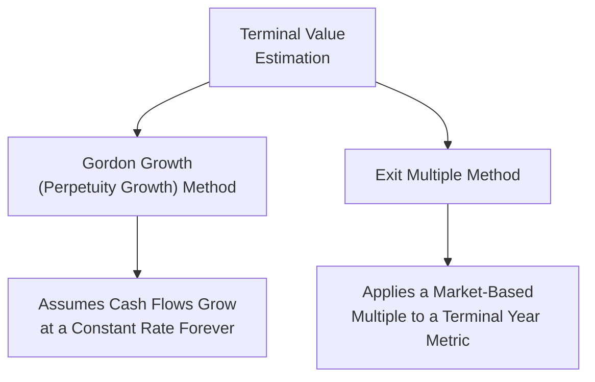

## Terminal Value Estimation

### Overview

Terminal value represents the value of all cash flows a business is expected to generate beyond an explicit forecast period, discounted back to the present. Since realistically forecasting individual cash flows indefinitely into the future is impractical, terminal value allows analysts to capture the substantial portion of a company's value that extends beyond a finite, detailed projection horizon. Given that terminal value frequently represents the majority of total valuation in a discounted cash flow model, its estimation method and underlying assumptions warrant particular scrutiny.

### Why Terminal Value Is Necessary

**Key Points**

- Explicit cash flow forecasts are typically limited to a period during which detailed, credible projections can reasonably be made (commonly 5-10 years)
- Businesses are generally assumed to continue operating beyond this explicit period (the "going concern" assumption), requiring some mechanism to capture this remaining value
- Without a terminal value component, a DCF valuation would systematically understate a company's true value by ignoring all cash flows beyond the explicit forecast window

$$\text{Total Value} = \sum_{t=1}^{n} \frac{CF_t}{(1+r)^t} + \frac{TV_n}{(1+r)^n}$$

Where $TV_n$ is the terminal value calculated as of the end of the explicit forecast period (year $n$), which must then be discounted back to present value.

### Two Primary Terminal Value Methodologies

### Method 1: Gordon Growth (Perpetuity Growth) Method

This method assumes that cash flows grow at a constant, sustainable rate indefinitely after the explicit forecast period, applying the same mathematical logic as the Gordon Growth dividend discount model.

$$TV_n = \frac{CF_{n+1}}{r-g} = \frac{CF_n(1+g)}{r-g}$$

Where:

- $CF_n$ = cash flow in the final explicit forecast year
- $g$ = assumed constant long-term growth rate
- $r$ = appropriate discount rate (WACC for FCFF, cost of equity for FCFE)

**Key Points**

- The terminal growth rate $g$ should generally not exceed the long-term expected growth rate of the overall economy (e.g., long-term nominal GDP growth), since no company can realistically grow faster than the broader economy indefinitely without eventually representing an implausibly large share of it
- Common practitioner convention anchors $g$ to a modest rate reflecting long-term inflation and real GDP growth expectations, often in a range of approximately 2%-4% for mature economies, though the specific appropriate figure depends on the geography and economic context
- The formula requires $r > g$; as $(r-g)$ approaches zero, the calculated terminal value becomes extremely sensitive to small changes in either input

### Worked Example — Gordon Growth Terminal Value

A company's final explicit-year (Year 5) FCFF is projected at $80 million. The long-term growth rate is assumed at 2.5%, and WACC is 9%.

**Step 1 — Calculate Year 6 (First Terminal-Period) Cash Flow**

$$CF_6 = 80 \times (1+0.025) = \$82.0\text{ million}$$

**Step 2 — Apply the Gordon Growth Formula**

$$TV_5 = \frac{82.0}{0.09-0.025} = \frac{82.0}{0.065} \approx \$1{,}261.5\text{ million}$$

**Step 3 — Discount Terminal Value to Present**

$$PV(TV) = \frac{1{,}261.5}{(1.09)^5} = \frac{1{,}261.5}{1.5386} \approx \$819.6\text{ million}$$

**Output**

- Terminal Value (as of Year 5): ≈$1,261.5 million
- Present Value of Terminal Value: ≈$819.6 million

### Method 2: Exit Multiple Method

This method estimates terminal value by applying a market-observed valuation multiple (derived from comparable company trading multiples or precedent transactions) to a relevant terminal-year financial metric.

$$TV_n = \text{Terminal Year Metric} \times \text{Exit Multiple}$$

Most commonly applied to EBITDA:

$$TV_n = EBITDA_n \times \text{EV/EBITDA Exit Multiple}$$

**Key Points**

- The exit multiple is typically derived from current trading multiples of comparable companies, or from precedent transaction multiples in the relevant industry
- This method implicitly assumes the company will be valued similarly to current market comparables at the end of the forecast period, effectively substituting a relative valuation assumption into an otherwise intrinsic valuation framework
- Sensitive to the specific comparable companies selected and prevailing market valuation conditions at the time of analysis

### Worked Example — Exit Multiple Terminal Value

Using the same company (Year 5 EBITDA = $140 million), assume an industry-appropriate EV/EBITDA exit multiple of 8.5x.

**Step 1 — Apply the Exit Multiple**

$$TV_5 = 140 \times 8.5 = \$1{,}190\text{ million}$$

**Step 2 — Discount Terminal Value to Present** (using the same 9% WACC)

$$PV(TV) = \frac{1{,}190}{(1.09)^5} = \frac{1{,}190}{1.5386} \approx \$773.3\text{ million}$$

**Output**

- Terminal Value (Exit Multiple Method): $1,190 million
- Present Value of Terminal Value: ≈$773.3 million

Comparing both methods for the same company shows a modest difference ($819.6 million vs. $773.3 million in present value terms), illustrating how methodology choice affects the result even for identical underlying operating projections.

### Cross-Checking: Implied Growth Rate from Exit Multiple

A useful validation technique involves solving the Gordon Growth formula in reverse using the terminal value derived from the exit multiple method, to check whether the implied long-term growth rate is economically reasonable.

$$g_{implied} = r - \frac{CF_{n+1}}{TV_n}$$

**Worked Example**: Using the exit-multiple-derived $TV_5 = \$1,190$ million and $CF_6 \approx 80 \times 1.025 = \$82.0$ million (assuming similar underlying growth), with WACC = 9%:

$$g_{implied} = 0.09 - \frac{82.0}{1{,}190} = 0.09 - 0.0689 \approx 0.0211$$

**Output**

- Implied Perpetuity Growth Rate from Exit Multiple: ≈2.11%

Since this implied growth rate (2.11%) falls within a plausible long-term range, this cross-check suggests reasonable consistency between the two terminal value methodologies for this example. [Inference] Performing this reverse cross-check is a widely recommended practice, since it can reveal whether an exit multiple assumption implies an unrealistic (e.g., negative or excessively high) long-term growth rate that might otherwise go unnoticed.

### Comparative Summary: Gordon Growth vs. Exit Multiple

| Aspect | Gordon Growth Method | Exit Multiple Method |
| --- | --- | --- |
| Basis | Intrinsic (perpetuity cash flow growth) | Relative (market-based multiple) |
| Key Assumption | Long-term sustainable growth rate | Appropriate terminal-year multiple |
| Sensitivity | Highly sensitive as $(r-g) \to 0$ | Sensitive to peer group/multiple selection |
| Consistency | Purely intrinsic throughout the model | Introduces a market-based (relative) element into an intrinsic model |
| Common Practice | Often used as the primary method, especially in academic/theoretical contexts | Often used as a cross-check, or preferred in practitioner/banking contexts |

### Sensitivity of Terminal Value to Key Assumptions

<svg xmlns="http://www.w3.org/2000/svg" viewBox="0 0 600 350" font-family="Arial, sans-serif">
<text x="300" y="20" text-anchor="middle" font-size="14" font-weight="bold">Terminal Value Sensitivity to (r - g) Spread (svg_diagram)</text>
<line x1="70" y1="300" x2="560" y2="300" stroke="black" stroke-width="1" />
<line x1="70" y1="300" x2="70" y2="40" stroke="black" stroke-width="1" />
<text x="315" y="330" text-anchor="middle" font-size="12">Discount Rate minus Growth Rate (r - g)</text>
<text x="30" y="170" text-anchor="middle" font-size="12" transform="rotate(-90 30 170)">Terminal Value</text>
<path d="M 100 60 Q 150 120 220 200 Q 320 260 540 285" fill="none" stroke="#2c6fbb" stroke-width="2.5" />
<text x="100" y="50" font-size="11" fill="#c0392b">Extremely sensitive at narrow spreads</text>
<text x="400" y="270" font-size="11" fill="#2c6fbb">Less sensitive at wider spreads</text>
</svg>

**Key Points**

- Because $(r-g)$ appears in the denominator of the Gordon Growth formula, small changes in either the discount rate or growth rate produce disproportionately large changes in terminal value as the spread narrows
- This sensitivity is a primary reason terminal value assumptions receive substantial scrutiny in valuation review processes and sensitivity/scenario analysis

### Proportion of Total Value Attributable to Terminal Value

**Key Points**

- [Inference] It is commonly observed in practitioner DCF models that terminal value represents a substantial majority (often well over half, and frequently 70%-80% or more) of total calculated enterprise or equity value, particularly for companies with shorter explicit forecast periods or higher assumed long-term growth rates, though the precise proportion varies significantly by company, industry, and the specific assumptions used
- A high proportion of value attributable to terminal value does not necessarily indicate a flawed valuation, but it does underscore the importance of carefully justifying and stress-testing the terminal value assumptions specifically, since they carry outsized influence on the final result

### Extending the Explicit Forecast Period

**Key Points**

- One method to reduce reliance on terminal value assumptions is extending the explicit forecast period (e.g., to 10-15 years) until the company is projected to reach a genuinely "steady-state" level of growth and margins
- This does not eliminate the need for a terminal value calculation but can reduce its relative weight in the overall valuation and may improve confidence in the terminal growth assumption, since the company is modeled explicitly closer to a mature, stable state
- Longer explicit forecast periods introduce their own forecasting uncertainty for the additional years projected, representing a trade-off rather than a strictly superior solution

### Applications in Corporate Finance

- **Discounted Cash Flow Valuation**: Terminal value is a required component of essentially any multi-period DCF valuation (FCFF, FCFE, or dividend discount model variants)
- **Mergers and Acquisitions**: Terminal value assumptions are closely scrutinized in M&A valuation, since they significantly influence the justifiable purchase price range
- **Fairness Opinions**: Terminal value methodology and sensitivity analysis are standard disclosure components in fairness opinions supporting M&A transactions
- **Capital Budgeting**: For long-lived capital projects, a terminal (continuing) value calculation may similarly be used to capture value beyond an explicit project forecast horizon

### Limitations and Best Practices

- Terminal value calculations should be internally consistent with the explicit forecast period's ending assumptions (e.g., margins, growth trajectory, capital intensity) to avoid an unrealistic discontinuity between the final explicit year and the assumed terminal state
- Analysts commonly present a sensitivity table or range of terminal values under varying growth rate and discount rate (or exit multiple) assumptions, rather than relying on a single point estimate
- [Inference] Given the outsized influence and inherent uncertainty of terminal value assumptions, presenting a valuation as a range (rather than a single precise figure) is generally considered better practice than implying false precision through a single-point terminal value estimate

**Related Topics**

- Free cash flow to equity and free cash flow to the firm models
- Dividend discount models and the Gordon Growth formula
- Weighted Average Cost of Capital (WACC) estimation
- Relative valuation using trading multiples
- Sensitivity and scenario analysis in DCF modeling
- Sustainable growth rate calculation