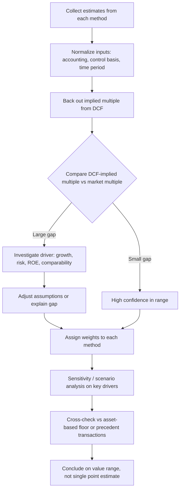

## Reconciling Valuation Approaches

### Overview

Reconciling valuation approaches refers to the analytical process of comparing, contrasting, and synthesizing the value estimates produced by different equity valuation methodologies — primarily discounted cash flow (DCF)/present value models, relative valuation (multiples-based comparables), and asset-based approaches — to arrive at a single defensible estimate of intrinsic value or a justified valuation range. Because no single model captures every dimension of a firm's value, analysts must understand why estimates diverge, which assumptions drive the divergence, and how to weight or triangulate across methods to produce a credible conclusion.

### Why Reconciliation Is Necessary

**Key Points**

- Different valuation models rest on different theoretical foundations (absolute vs. relative value) and therefore respond differently to the same underlying facts.
- Divergent outputs are not automatically "errors" — they often reflect genuinely different assumptions, time horizons, or market conditions embedded in each method.
- A single-model valuation is fragile; reconciliation improves robustness and defensibility, particularly in contexts requiring disclosure (fairness opinions, litigation, regulatory filings).
- Reconciliation forces explicit articulation of assumptions, which is often more valuable to decision-makers than the point estimate itself.

### The Three Major Valuation Families

#### 1. Absolute (Intrinsic) Valuation — Present Value Models

Estimates value as the present value of expected future cash flows discounted at a risk-appropriate rate.

- **Dividend Discount Model (DDM):** $V_0 = \sum_{t=1}^{n} \dfrac{D_t}{(1+r)^t}$, or in the Gordon growth (constant-growth) case, $V_0 = \dfrac{D_1}{r-g}$
- **Free Cash Flow to Equity (FCFE):** discounts cash flows available to equity holders after debt obligations and reinvestment
- **Free Cash Flow to Firm (FCFF):** discounts cash flows available to all capital providers, then subtracts the market value of debt to derive equity value
- **Residual Income Model (RIM):** $V_0 = B_0 + \sum_{t=1}^{n} \dfrac{RI_t}{(1+r)^t}$, where $RI_t = E_t - r \cdot B_{t-1}$

These models are sensitive to inputs such as the discount rate (cost of equity via CAPM, or WACC), terminal growth rate, and the length/reliability of the explicit forecast period.

#### 2. Relative Valuation — Market Multiples

Estimates value by applying multiples derived from comparable companies or transactions to the subject firm's own fundamentals.

- Price multiples: $P/E$, $P/B$, $P/S$, $P/CF$
- Enterprise value multiples: $EV/EBITDA$, $EV/EBIT$, $EV/Sales$
- Method of comparables (trading comps) vs. method of transaction comps (precedent transactions, which typically embed a control premium)

Relative valuation is anchored to current market pricing and therefore reflects prevailing sentiment — useful for cross-checking absolute valuations but vulnerable to broad market mispricing (the whole peer set can be simultaneously over- or undervalued).

#### 3. Asset-Based Valuation

Estimates value as the fair value of assets minus liabilities (adjusted net asset value), most relevant for:

- Asset-heavy or natural resource firms
- Holding companies and investment companies
- Firms in financial distress or liquidation scenarios (liquidation value as a floor)

Least useful for firms whose value derives primarily from intangible growth options, human capital, or brand — asset-based methods tend to understate going-concern value in those cases.

### Sources of Divergence Between Methods

**Key Points**

- **Time horizon mismatch:** DCF embeds a multi-year explicit forecast plus terminal value assumptions; multiples reflect a single point-in-time market snapshot.
- **Growth and risk assumptions:** DCF requires explicit, analyst-specified growth and discount-rate assumptions; multiples implicitly embed the market's *consensus* growth/risk expectations for the peer group, which may not match the subject firm.
- **Comparable company selection bias:** relative valuation results are highly sensitive to which peers are chosen and whether their capital structures, growth profiles, and accounting policies are truly comparable.
- **Market efficiency assumption:** relative valuation assumes the market has priced peers correctly on average; DCF makes no such assumption and can identify mispricing that comparables-based methods cannot.
- **Terminal value sensitivity:** in DCF, terminal value often represents 60–80% of total present value, making the model highly sensitive to the terminal growth rate and exit multiple/perpetuity assumptions.
- **Accounting distortions:** differences in depreciation policy, lease accounting, inventory methods (FIFO vs. weighted average), and non-recurring items can distort multiples-based comparisons unless normalized.
- **Control premium inclusion:** transaction comps typically embed a control premium; trading comps and DCF (absent a control adjustment) generally reflect minority-interest value.
- **Cyclicality:** current-period multiples can be distorted if the peer group or subject firm is at an unusual point in its earnings cycle; DCF can smooth this via multi-year forecasts.

### Framework for Reconciliation

#### Step 1: Normalize Inputs Across Models

Before comparing outputs, ensure inputs are on a consistent basis:

- Adjust reported earnings/EBITDA for non-recurring items, differing accounting policies, and off-balance-sheet items (e.g., operating lease capitalization) across both the DCF forecast and the comparable set.
- Confirm whether each model is being applied on a **pre-money vs. post-money**, **cum-dividend vs. ex-dividend**, and **control vs. minority** basis consistently.
- Align the discount rate methodology (CAPM-derived cost of equity for FCFE/DDM; WACC for FCFF) with the cash flow definition being discounted.

#### Step 2: Decompose the Multiple Implied by the DCF

A useful reconciliation technique is to back out the implied multiple from the DCF output and compare it directly to observed market multiples.

$$\text{Implied } P/E = \dfrac{V_0^{DCF}}{E_1}$$

If the DCF-implied $P/E$ is materially higher than the peer group's traded $P/E$, the analyst should be able to explain *why* — e.g., superior expected growth, lower risk, or higher expected ROE — rather than treating the gap as unexplained noise.

#### Step 3: Sensitivity and Scenario Analysis

- Run DCF sensitivity tables on discount rate and terminal growth rate (a two-way data table is standard) to establish a valuation *range* rather than a single point estimate.
- Compare that range against the range implied by the low/high multiples in the comparable set.
- Where the ranges overlap, confidence in the estimate increases; where they diverge sharply, the analyst must investigate which model's assumptions are least reliable.

#### Step 4: Weight the Methods

Weighting is judgment-based but should reflect:

| Consideration | Favors DCF/Absolute | Favors Relative (Multiples) |
| --- | --- | --- |
| Data availability | Reliable long-term forecasts exist | Forecasts unreliable/unavailable |
| Comparable universe | Few or no true comparables | Large, homogeneous peer group |
| Market conditions | Market is believed to be mispricing peers | Market is reasonably efficient |
| Company stage | Mature, stable cash flows | High-growth or early-stage (multiples of forward metrics common) |
| Purpose of valuation | Intrinsic/fundamental investment decision | Fairness opinion, M&A pricing benchmark |

A common approach is a weighted average of method outputs (e.g., 60% DCF / 40% comparables) with the weights explicitly disclosed and justified, rather than an unweighted average, which implicitly (and often inappropriately) treats all methods as equally reliable.

#### Step 5: Triangulate to a Conclusion

- Present the valuation as a **range**, not a false-precision point estimate.
- Cross-check the concluded range against a third method (e.g., asset-based floor value, precedent transactions) as a sanity check.
- Explicitly document which assumptions, if changed, would most affect the conclusion (key value drivers) — this is often more decision-useful than the number itself.

### Illustrative Example

**Example**

A DCF (FCFE, two-stage model, 10% cost of equity, 3% terminal growth) produces an intrinsic value estimate of $52/share. The peer group's median forward $P/E$ of 14.0x applied to the subject firm's forecast EPS of $3.20 implies $44.80/share.

Reconciliation process:

1. Back out the DCF-implied forward $P/E$: $52 / 3.20 = 16.25x$ — roughly 16% above the peer median.
2. Investigate the gap: the subject firm's forecast 5-year revenue CAGR (9%) exceeds the peer median (5%), and its ROE (18%) exceeds the peer median (13%), which is consistent with a premium multiple under the Gordon growth relationship $\dfrac{P}{E} = \dfrac{ROE - g}{r - g} \times$ (payout adjustment logic embedded in justified multiples).
3. Conclusion: the premium is at least partially justified by fundamentals; the analyst narrows the concluded range to $47–$52/share, weighting the DCF more heavily (65%) given the credibility of the growth forecast, while using the comparables output as a lower sanity-check bound.

### Reconciliation Process Flow

### Common Pitfalls

**Key Points**

- Treating an unweighted average of DCF and comparables output as automatically superior — it implicitly assumes equal reliability, which is rarely justified.
- Failing to normalize for control premiums when mixing trading comps (minority basis) with transaction comps (control basis) in the same reconciliation.
- Ignoring that both DCF and relative valuation can be simultaneously wrong if driven by shared, overly optimistic macro or industry assumptions (lack of independence between methods).
- Presenting a single point estimate without disclosing the sensitivity range, which overstates precision. [Inference: this is a widely cited best-practice critique in valuation literature, though the degree of emphasis varies by firm/institution.]
- Using stale or inappropriate comparable sets (different growth stage, geography, or capital structure) without adjustment.

### Conclusion

Reconciling valuation approaches is not a mechanical averaging exercise but an analytical discipline: it requires normalizing inputs to a common basis, decomposing why estimates from different models diverge, weighting methods according to data quality and company/industry characteristics, and concluding with a defensible range supported by sensitivity analysis rather than a false-precision point estimate. The reconciliation process itself — the explicit articulation of which assumptions drive value and why methods agree or disagree — is often as valuable to a valuation's users as the final number.

**Related Topics**

- Free cash flow valuation (FCFF vs. FCFE mechanics and reconciliation)
- Method of comparables and method of comparable transactions
- Residual income valuation and its relationship to DDM/FCFE equivalence
- Estimating the equity risk premium and cost of equity (CAPM, build-up method)
- Terminal value estimation (Gordon growth vs. exit multiple methods)
- Control premiums and minority discounts in valuation
- Sum-of-the-parts valuation for diversified/conglomerate firms
- Sensitivity analysis and Monte Carlo simulation in equity valuation