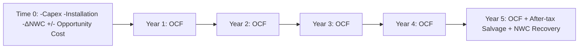
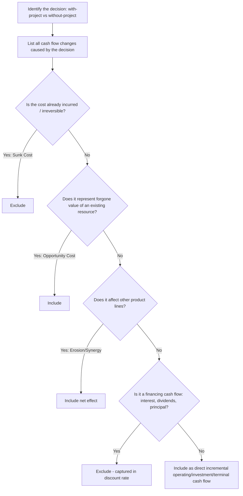

## Identifying Incremental Cash Flows

### Overview

Incremental cash flows are the additional cash flows — incoming or outgoing — that arise *specifically because* a firm undertakes a given investment project, measured as the difference between the firm's total cash flows with the project and total cash flows without it. Correctly identifying incremental cash flows is the foundation of capital budgeting: net present value (NPV), internal rate of return (IRR), and payback calculations are only as valid as the cash flow inputs feeding them. Errors here — including irrelevant costs or excluding relevant ones — propagate directly into flawed accept/reject decisions.

### The Core Principle: With-vs-Without

**Key Points**

- Incremental cash flow = (Cash flows of the firm *with* the project) − (Cash flows of the firm *without* the project)
- This is distinct from a "with vs. before" comparison, which incorrectly ignores changes that would have happened anyway (e.g., organic growth or decline in an existing product line).
- Only cash flows that change as a direct consequence of the decision are relevant; accounting profit, non-cash allocations, and past expenditures are not decision-relevant unless they affect actual cash movements or taxes.

### Components of Incremental Cash Flow

#### 1. Initial Investment Outlay (Time 0)

- Purchase price of new fixed assets (capital expenditure)
- Installation, shipping, and testing costs required to bring the asset into service (these are capitalized, not expensed)
- Increase in net working capital (NWC) — increases in inventory, receivables, and cash required to support the project, net of any spontaneous increase in payables
- After-tax proceeds from sale of any replaced/old asset (relevant in replacement decisions), including tax effects of any gain or loss on disposal relative to book value
- Opportunity cost of any existing asset being repurposed for the project (see below)

#### 2. Operating Cash Flows (Over the Project's Life)

The standard formulation, starting from EBIT:

$$OCF = (\text{Revenue} - \text{Operating Costs} - \text{Depreciation}) \times (1 - T) + \text{Depreciation}$$

Equivalently:

$$OCF = EBIT \times (1-T) + \text{Depreciation}$$

Or via the cash-flow-from-top formulation:

$$OCF = (\text{Revenue} - \text{Cash Operating Costs}) \times (1-T) + (\text{Depreciation} \times T)$$

This last form isolates the **depreciation tax shield**, $\text{Depreciation} \times T$, which is the cash benefit depreciation provides even though depreciation itself is a non-cash expense.

#### 3. Terminal (Non-Operating) Cash Flows (End of Project)

- After-tax salvage value of the asset: $\text{Salvage} - T \times (\text{Salvage} - \text{Book Value})$
- Recovery of net working capital originally invested (assumed recoverable at project end, generally not taxed since it merely reverses the initial outlay)
- Any shutdown, remediation, or decommissioning costs, net of tax effects

### What to Include vs. Exclude

| Include (Relevant) | Exclude (Irrelevant) |
| --- | --- |
| Changes in net working capital | Sunk costs (already incurred, irreversible) |
| Opportunity costs of using existing assets/resources | Allocated (non-incremental) overhead |
| Side effects: erosion and synergies on other product lines | Financing costs (interest, dividends) — captured in the discount rate, not the cash flows |
| After-tax salvage value | Costs that would be incurred regardless of the decision |
| Depreciation tax shields (cash effect via taxes, not depreciation itself) | Accounting depreciation as a direct cash outflow (it isn't one) |

#### Sunk Costs

Costs already incurred and unrecoverable regardless of whether the project proceeds. Because they do not change based on the accept/reject decision, they must be excluded entirely from the analysis — including money already spent on feasibility studies, market research, or R&D related to the project.

#### Opportunity Costs

The cash flow forgone by using an asset or resource for this project instead of its next-best alternative use (e.g., using company-owned land or a warehouse that could otherwise be sold or leased). This forgone value **must** be included as a cost of the project, even though no new cash changes hands directly.

#### Side Effects: Erosion and Synergies (Cannibalization)

- **Erosion (cannibalization):** loss of sales/cash flows on existing products caused by the new project (e.g., a new product line reducing sales of the firm's existing product) — must be included as a cost.
- **Synergies (enhancement):** increase in cash flows on existing products caused by the new project (e.g., a new accessory boosting sales of an existing core product) — must be included as a benefit.

#### Allocated (Sunk) Overhead

General and administrative overhead that would be incurred by the firm regardless of the project is not incremental and should be excluded, *unless* the project causes overhead to genuinely increase (in which case only the incremental increase is relevant).

#### Financing Costs

Interest expense, principal repayment, and dividend payments are **excluded** from project cash flows. The cost of financing is already captured in the discount rate (WACC) used to discount the cash flows; including it in the cash flows themselves would double-count the cost of capital.

### Taxes and Depreciation Tax Shields

Because depreciation is non-cash but tax-deductible, it reduces taxable income and therefore reduces the actual cash tax paid — this reduction is the depreciation tax shield.

$$\text{Depreciation Tax Shield} = \text{Depreciation} \times T$$

The choice of depreciation method (straight-line vs. an accelerated method such as MACRS) does not change *total* depreciation over an asset's life, but it changes the **timing** of the tax shield. Because of the time value of money, accelerated depreciation is generally preferred — it front-loads tax savings, increasing the present value of the tax shield even though the undiscounted total is unchanged. [Inference: this preference follows directly from standard time-value-of-money logic and is a well-established conclusion in capital budgeting texts, not merely an opinion.]

### Nominal vs. Real Cash Flows: Consistency with the Discount Rate

**Key Points**

- Cash flows and discount rates must be matched on an inflation basis: nominal cash flows must be discounted at a nominal rate; real cash flows must be discounted at a real rate.
- Mismatching (e.g., discounting nominal cash flows at a real rate) systematically overstates project value.
- The (approximate) Fisher relation links the two: $(1 + \text{Nominal Rate}) = (1 + \text{Real Rate})(1 + \text{Inflation Rate})$
- Depreciation tax shields are typically fixed in nominal terms (based on historical cost), so inflation erodes their real value over time — this asymmetry must be handled carefully when converting between nominal and real cash flow frameworks.

### Net Working Capital Treatment

- An increase in NWC (e.g., higher receivables/inventory needed to support higher sales) is a cash **outflow** at the time it occurs.
- NWC investment is typically assumed to be fully recovered as a cash **inflow** at the end of the project (inventory sold off, receivables collected, payables settled), though in practice recovery may be partial.
- NWC changes should be projected year-by-year over the life of the project, not just at the beginning and end, since sales (and therefore required NWC) typically change annually.

### Worked Example

**Example**

A firm evaluates a new machine costing $500,000, with $20,000 in installation costs (total depreciable basis = $520,000, straight-line over 5 years to zero salvage for tax purposes, actual salvage of $40,000 at year 5). The project requires an immediate $30,000 increase in NWC, fully recovered at year 5. Incremental annual revenue is $300,000; incremental cash operating costs are $150,000. Tax rate = 25%.

**Depreciation:** $520,000 / 5 = \$104,000$ per year

**Annual Operating Cash Flow (Years 1–5):**

$$OCF = (300,000 - 150,000 - 104,000)(1 - 0.25) + 104,000 = (46,000)(0.75) + 104,000 = 34,500 + 104,000 = \$138,500$$

**Time 0 Cash Flow:**

$$-500,000 - 20,000 - 30,000 = -\$550,000$$

**Terminal Cash Flow (Year 5, in addition to Year 5 OCF):**

- After-tax salvage: $40,000 - 0.25 \times (40,000 - 0) = 40,000 - 10,000 = \$30,000$
- NWC recovery: $+\$30,000$
- Total terminal add-on: $\$60,000$

**Year 5 total cash flow:** $138,500 + 60,000 = \$198,500$

### Cash Flow Timeline

### Identification Process Flow

### Common Pitfalls

**Key Points**

- Including sunk costs (e.g., prior R&D or feasibility study spend) as part of the initial outlay.
- Omitting opportunity costs when an existing company asset (land, equipment) is used without an explicit new purchase.
- Ignoring erosion effects on existing product lines when launching a related new product.
- Including interest expense or debt service in project cash flows, double-counting the cost of capital already reflected in the discount rate.
- Mismatching nominal and real cash flows against the wrong type of discount rate.
- Forgetting that NWC changes must be tracked annually (not just at the start and end) when sales grow or decline over the project's life.
- Treating book depreciation (per financial-reporting standards) rather than tax depreciation (e.g., MACRS) as the basis for the tax shield calculation, which overstates or understates the true cash tax effect. [Inference: which depreciation schedule governs the tax shield depends on the applicable tax jurisdiction's rules, so this point is general guidance rather than a universal rule.]

### Conclusion

Identifying incremental cash flows requires disciplined application of the with-vs-without principle: including all cash flows that change because of the investment decision (opportunity costs, erosion/synergy effects, NWC changes, after-tax salvage value, and depreciation tax shields) while rigorously excluding cash flows that do not change with the decision (sunk costs, unallocated overhead, and financing costs, which belong in the discount rate rather than the cash flow stream). Getting this classification right is typically more consequential to valuation accuracy than the choice of discount rate or valuation technique itself.

**Related Topics**

- Net present value (NPV) and internal rate of return (IRR) decision rules
- Weighted average cost of capital (WACC) estimation
- Replacement vs. expansion project analysis
- Capital rationing and mutually exclusive project ranking
- Real options in capital budgeting
- Depreciation methods and their tax implications (straight-line vs. MACRS)
- Scenario, sensitivity, and break-even analysis in capital budgeting
- Inflation and its treatment in project valuation