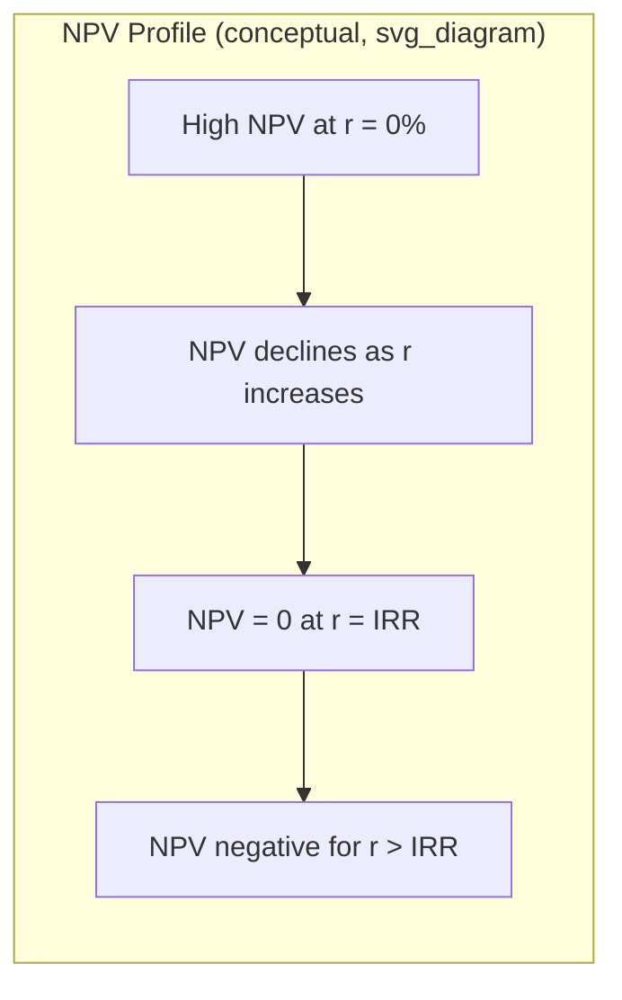
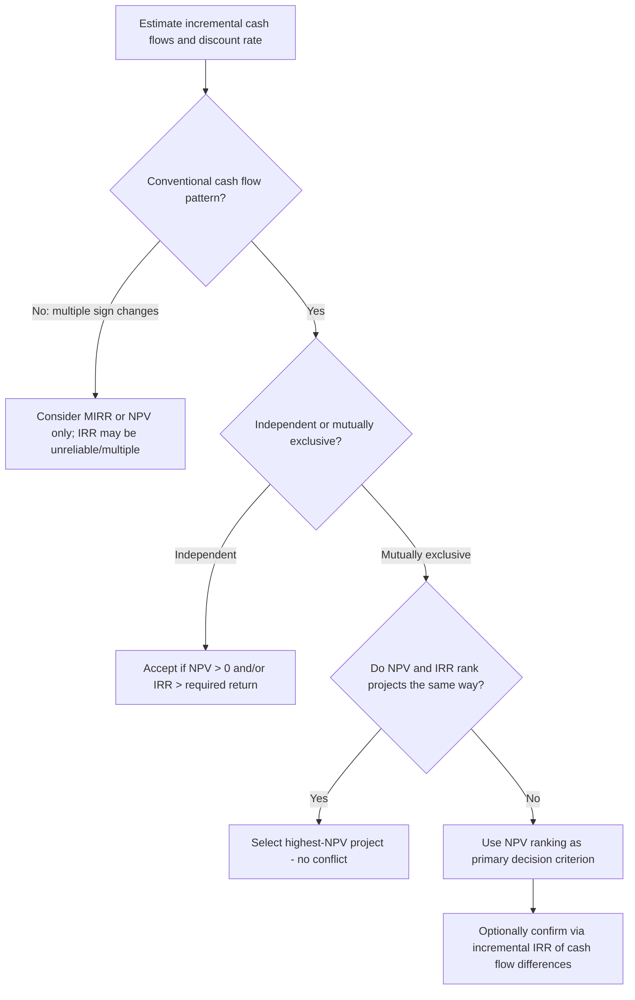

## Net Present Value and Internal Rate of Return

### Overview

Net present value (NPV) and internal rate of return (IRR) are the two most widely used discounted cash flow criteria for evaluating capital investment projects. Both incorporate the time value of money and the full stream of a project's incremental cash flows, distinguishing them from non-discounted techniques such as payback period. NPV measures the absolute dollar value a project is expected to add to the firm; IRR measures the project's implied percentage rate of return. While closely related and often in agreement for simple, conventional projects, the two criteria can conflict under specific, well-defined circumstances — understanding when and why this occurs is essential to sound capital budgeting practice.

### Net Present Value (NPV)

#### Definition and Formula

NPV is the sum of the present values of all incremental cash flows associated with a project, discounted at the firm's required rate of return (typically the weighted average cost of capital, WACC, or a project-specific discount rate reflecting its risk).

$$NPV = \sum_{t=0}^{n} \dfrac{CF_t}{(1+r)^t}$$

where $CF_0$ is typically the (negative) initial investment, $CF_t$ are subsequent incremental cash flows, $r$ is the discount rate, and $n$ is the project's life.

#### Decision Rule

- **Independent projects:** accept if $NPV > 0$; reject if $NPV < 0$.
- **Mutually exclusive projects:** accept the project with the highest positive NPV.
- $NPV = 0$ indicates the project earns exactly the required rate of return — value-neutral, but not value-destroying.

#### Interpretation

NPV represents the expected increase in shareholder wealth, in today's dollars, from undertaking the project. A positive NPV implies the project's return exceeds the cost of the capital used to finance it, after accounting for the time value of money and the risk embedded in the discount rate.

### Internal Rate of Return (IRR)

#### Definition and Formula

IRR is the discount rate that sets a project's NPV exactly equal to zero — the break-even rate of return.

$$0 = \sum_{t=0}^{n} \dfrac{CF_t}{(1+IRR)^t}$$

IRR generally has no closed-form algebraic solution for $n > 2$ periods and must be found iteratively (trial and error, financial calculator, or software such as Excel's `IRR()`/`XIRR()` functions).

#### Decision Rule

- **Independent projects:** accept if $IRR > r$ (the required rate of return / hurdle rate); reject if $IRR < r$.
- **Mutually exclusive projects:** the highest-IRR project is *not* automatically the correct choice — this is a key area where IRR can mislead (see conflicts below).

#### Interpretation

IRR expresses project profitability as a percentage rate, which many practitioners find intuitive for communication purposes, but this simplicity conceals important reinvestment and scale assumptions.

### NPV Profile

A useful visualization is the **NPV profile**: a graph of a project's NPV plotted against a range of discount rates. The point where the NPV profile crosses the x-axis (NPV = 0) is the project's IRR.

<svg viewBox="0 0 600 380" xmlns="http://www.w3.org/2000/svg">
<text x="300" y="25" text-anchor="middle" font-size="16" font-weight="bold" fill="#1a1a1a">NPV Profile: NPV vs. Discount Rate (svg_diagram)</text>
<line x1="70" y1="320" x2="560" y2="320" stroke="#333" stroke-width="2"/>
<line x1="70" y1="60" x2="70" y2="320" stroke="#333" stroke-width="2"/>

<text x="315" y="355" text-anchor="middle" font-size="13" fill="#333">Discount Rate (r)</text>

<text x="30" y="190" text-anchor="middle" font-size="13" fill="#333" transform="rotate(-90 30 190)">NPV ($)</text>

<line x1="70" y1="190" x2="560" y2="190" stroke="#999" stroke-width="1" stroke-dasharray="4,4"/>
<text x="65" y="194" text-anchor="end" font-size="11" fill="#666">0</text>
<path d="M 90 90 Q 250 100 380 190 Q 470 250 545 300" fill="none" stroke="#2563eb" stroke-width="3"/>
<line x1="380" y1="190" x2="380" y2="320" stroke="#dc2626" stroke-width="1.5" stroke-dasharray="3,3"/>
<circle cx="380" cy="190" r="5" fill="#dc2626"/>
<text x="380" y="335" text-anchor="middle" font-size="12" fill="#dc2626" font-weight="bold">IRR</text>

<text x="140" y="80" font-size="11" fill="`#2563eb`">NPV > 0 (Accept)</text>

<text x="470" y="280" font-size="11" fill="`#2563eb`">NPV < 0 (Reject)</text>

<text x="90" y="80" font-size="11" fill="#666">NPV at r=0%</text>

</svg>

### Comparing NPV and IRR

| Dimension | NPV | IRR |
| --- | --- | --- |
| Output | Dollar amount | Percentage rate |
| Reinvestment assumption | Cash flows reinvested at $r$ (the discount rate/cost of capital) | Cash flows reinvested at IRR itself |
| Scale sensitivity | Reflects absolute value added — accounts for project size | Ignores project scale — a small project can have a high IRR but low dollar value |
| Multiple solutions | Always a single, unique value for a given $r$ | Can have multiple mathematically valid IRRs with non-conventional cash flows |
| Ranking mutually exclusive projects | Theoretically correct ranking criterion | Can give incorrect rankings |
| Ease of communication | Less intuitive (absolute $ figure) | More intuitive (a %, easily compared to hurdle rate) |

### Why NPV and IRR Can Conflict

**Key Points**

- For **conventional, independent** projects (a single initial outflow followed only by inflows), NPV and IRR always agree on the accept/reject decision.
- Conflicts arise specifically when comparing **mutually exclusive** projects, due to differences in **scale** and/or **timing** of cash flows.
- Conflicts can also arise with **non-conventional cash flows** (cash flow signs change more than once over the project's life), which can produce **multiple IRRs** or no real IRR at all.

#### 1. Scale (Size) Differences

A small project can have a very high IRR but a small NPV, while a large project has a lower IRR but a much larger NPV. Since NPV measures absolute wealth creation, it correctly favors the higher-NPV project regardless of IRR, because shareholders care about total dollars added, not the percentage return on a comparatively small investment.

#### 2. Timing Differences

Projects with different cash flow timing patterns (e.g., one project front-loads cash flows, another back-loads them) can produce crossing NPV profiles. At low discount rates, the project with later, larger cash flows may show a higher NPV; at high discount rates, the project with earlier cash flows may dominate. The discount rate at which the two NPV profiles intersect is called the **crossover rate**, found by computing the IRR of the difference in cash flows between the two projects.

#### 3. The Reinvestment Rate Assumption

- NPV implicitly assumes interim cash flows are reinvested at the firm's cost of capital ($r$) — a generally realistic, conservative assumption tied to the firm's actual opportunity cost of funds.
- IRR implicitly assumes interim cash flows are reinvested at the IRR itself, which for high-IRR projects is often an unrealistic assumption (few firms have abundant opportunities to reinvest at, say, 35%).
- This is widely regarded as NPV's key theoretical advantage over IRR. [Inference: the reinvestment-rate critique of IRR is a long-standing and broadly accepted point in corporate finance theory, though some practitioners consider the "implicit reinvestment rate" framing itself a simplification of IRR's underlying mathematics rather than a literal behavioral assumption.]

#### 4. Multiple IRRs / No Real IRR (Non-Conventional Cash Flows)

When a project's cash flow stream changes sign more than once (e.g., $-, +, +, -$, as might occur with a project requiring a major cash outlay for decommissioning or environmental remediation at the end of its life), Descartes' rule of signs implies there can be as many IRRs as there are sign changes. In such cases:

- Multiple mathematically valid IRRs may exist, none of which has a clear economic interpretation.
- It is possible for no real-valued IRR to exist at all.
- NPV remains well-defined and unambiguous in all these cases, since it does not require solving a polynomial for a break-even rate.

**MIRR (Modified Internal Rate of Return)** is often used to address both the reinvestment-rate critique and the multiple-IRR problem: it explicitly compounds all cash inflows forward to the project's terminal date at the reinvestment rate, discounts all outflows back to time 0 at the financing rate, and then solves for a single rate that equates the two, producing one unambiguous rate of return.

### Resolving NPV–IRR Conflicts

**Key Points**

- For mutually exclusive projects, when NPV and IRR rankings conflict, the project selection should follow **NPV**, since NPV directly measures the absolute increase in firm value and rests on the more defensible reinvestment assumption.
- The **incremental IRR** approach can reconcile the two: compute the IRR of the *difference* in cash flows between the two projects (Project B − Project A). If this incremental IRR exceeds the required return, the incremental investment (the larger/costlier project) is justified, agreeing with the NPV-based conclusion.
- This conflict is purely a *ranking* issue between mutually exclusive alternatives — it does not affect the accept/reject decision for a single independent project.

### Worked Example: NPV–IRR Conflict

**Example**

Two mutually exclusive projects, each with a 10% required rate of return:

| Year | Project A | Project B |
| --- | --- | --- |
| 0 | −$100,000 | −$100,000 |
| 1 | $70,000 | $10,000 |
| 2 | $60,000 | $40,000 |
| 3 | $10,000 | $120,000 |

**Project A:**

$$NPV_A = -100{,}000 + \dfrac{70{,}000}{1.10} + \dfrac{60{,}000}{1.10^2} + \dfrac{10{,}000}{1.10^3} \approx \$16{,}870$$

$IRR_A \approx 21.6\%$

**Project B:**

$$NPV_B = -100{,}000 + \dfrac{10{,}000}{1.10} + \dfrac{40{,}000}{1.10^2} + \dfrac{120{,}000}{1.10^3} \approx \$27{,}330$$

$IRR_B \approx 18.1\%$

**Conflict:** Project A has the higher IRR (21.6% vs. 18.1%), but Project B has the higher NPV ($27,330 vs. $16,870). Because these are mutually exclusive projects, the theoretically correct choice is **Project B**, since it adds more absolute value to the firm. The conflict arises from the timing difference — Project A generates cash flows earlier, while Project B is more back-loaded, making Project B relatively more attractive at the 10% discount rate despite its lower percentage return.

### NPV/IRR Evaluation Process

### Strengths and Limitations Summary

**Key Points**

*NPV strengths:*

- Directly measures value creation in absolute terms.
- Additive across projects (NPVs can be summed — the "value additivity principle").
- Reinvestment assumption (at cost of capital) is generally more realistic.
- Always yields a single, unambiguous result.

*NPV limitations:*

- Requires an explicit, defensible discount rate, which can be difficult to estimate precisely.
- Output (a dollar figure) does not indicate relative efficiency or rate of return, complicating capital-rationing decisions.

*IRR strengths:*

- Intuitive percentage format, easily compared across projects and to a hurdle rate.
- Does not require the discount rate to be specified in advance to compute the rate itself (though it does require one for the accept/reject comparison).

*IRR limitations:*

- Unrealistic implicit reinvestment rate assumption for high-return projects.
- Can produce multiple or no solutions with non-conventional cash flows.
- Can give incorrect rankings for mutually exclusive projects differing in scale or timing.
- Not additive across projects.

### Conclusion

NPV and IRR both incorporate the time value of money and generally lead to the same accept/reject decision for conventional, independent projects. However, they can conflict when ranking mutually exclusive projects that differ in scale or the timing of cash flows, and IRR specifically suffers from an unrealistic reinvestment-rate assumption and the potential for multiple or undefined solutions under non-conventional cash flow patterns. Where the two criteria disagree, NPV is the theoretically preferred decision rule because it directly and unambiguously measures the absolute dollar contribution to firm value, consistent with the goal of shareholder wealth maximization.

**Related Topics**

- Identifying incremental cash flows
- Modified Internal Rate of Return (MIRR)
- Payback period and discounted payback period
- Profitability Index (PI) and capital rationing
- Crossover rate and incremental IRR analysis
- Estimating the weighted average cost of capital (WACC)
- Sensitivity, scenario, and break-even analysis
- Real options and strategic value in capital budgeting