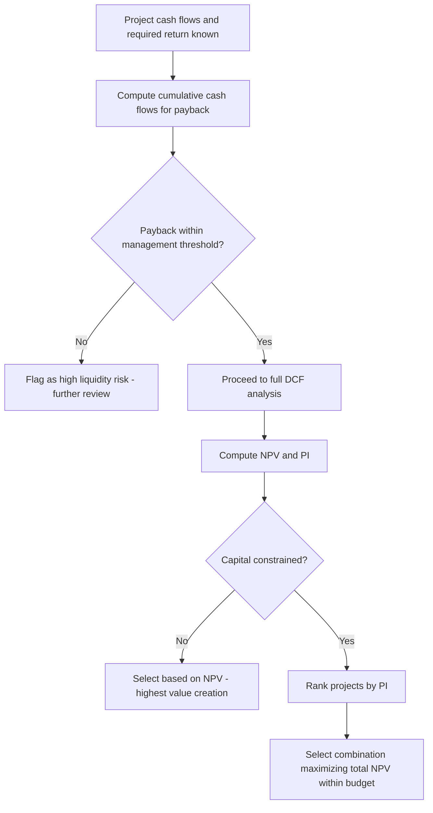

## Payback Period and Profitability Index

### Overview

Payback period and profitability index (PI) are two supplementary capital budgeting techniques used alongside NPV and IRR. Payback period is a simple, non-discounted (or, in its refined form, discounted) measure of how quickly a project recovers its initial investment. Profitability index is a discounted, relative measure of value created per dollar invested. Each addresses a specific limitation of NPV in isolation — payback provides a liquidity/risk screen, while PI provides a scale-adjusted ranking tool particularly useful under capital rationing.

### Payback Period

#### Definition and Formula

The payback period is the length of time required for a project's cumulative cash flows to recover the initial investment.

For projects with **even** annual cash flows:

$$\text{Payback Period} = \dfrac{\text{Initial Investment}}{\text{Annual Cash Flow}}$$

For projects with **uneven** cash flows, payback is found by cumulating cash flows year by year until the cumulative total turns positive:

$$\text{Payback Period} = Y + \dfrac{\text{Unrecovered Cost at Start of Year } Y+1}{\text{Cash Flow During Year } Y+1}$$

where $Y$ is the last year with a negative cumulative cash flow balance.

#### Decision Rule

- Accept the project if its payback period is less than or equal to a management-specified maximum acceptable payback threshold.
- When ranking mutually exclusive projects, the project with the shorter payback period is preferred.
- The threshold itself is set subjectively by management — it has no theoretical basis analogous to NPV's zero cutoff.

#### Worked Example: Simple Payback

**Example**

A project requires an initial investment of $120,000 and generates the following cash flows:

| Year | Cash Flow | Cumulative Cash Flow |
| --- | --- | --- |
| 0 | −$120,000 | −$120,000 |
| 1 | $40,000 | −$80,000 |
| 2 | $50,000 | −$30,000 |
| 3 | $45,000 | $15,000 |
| 4 | $30,000 | $45,000 |

Cumulative cash flow turns positive during Year 3. Unrecovered balance at the start of Year 3 is $30,000, and Year 3's cash flow is $45,000.

$$\text{Payback Period} = 2 + \dfrac{30{,}000}{45{,}000} = 2.67 \text{ years}$$

#### Strengths and Limitations

**Key Points**

*Strengths:*

- Simple to calculate and communicate; widely used as a quick screening tool, particularly for smaller firms or lower-stakes decisions.
- Provides a rough proxy for liquidity risk — projects that recover investment sooner expose the firm to less risk of adverse long-term events.
- Useful in capital-constrained environments or industries with high technological obsolescence risk, where recovering investment quickly is itself a strategic priority.

*Limitations:*

- **Ignores the time value of money** — a dollar received in Year 1 is weighted identically to a dollar received in Year 5 (in its simple/non-discounted form).
- **Ignores all cash flows after the payback threshold is reached**, which can lead to rejecting projects with large, highly profitable cash flows late in their life.
- **No objective, theoretically grounded cutoff** — the maximum acceptable payback period is an arbitrary management choice, unlike NPV's zero-based decision rule.
- Can conflict with NPV and IRR, potentially leading to suboptimal project selection if used as the sole criterion.
- Provides no direct measure of profitability or value added — a project can have a short payback but a low or even negative NPV, and vice versa.

#### Discounted Payback Period

A refinement that addresses the time-value-of-money criticism (though not the truncation criticism) by discounting each period's cash flow at the required rate of return before cumulating.

$$\text{Discounted Payback Period} = Y + \dfrac{\text{Unrecovered Discounted Cost at Start of Year } Y+1}{\text{Discounted Cash Flow During Year } Y+1}$$

**Example**

Using the same cash flows as above with a 10% discount rate:

| Year | Cash Flow | PV Factor (10%) | Discounted CF | Cumulative Discounted CF |
| --- | --- | --- | --- | --- |
| 0 | −$120,000 | 1.000 | −$120,000 | −$120,000 |
| 1 | $40,000 | 0.909 | $36,360 | −$83,640 |
| 2 | $50,000 | 0.826 | $41,300 | −$42,340 |
| 3 | $45,000 | 0.751 | $33,795 | −$8,545 |
| 4 | $30,000 | 0.683 | $20,490 | $11,945 |

$$\text{Discounted Payback} = 3 + \dfrac{8{,}545}{20{,}490} = 3.42 \text{ years}$$

Note that discounted payback (3.42 years) is always longer than simple payback (2.67 years) for a project with positive cash flows, since discounting reduces the present value of each future inflow, requiring more nominal cash to reach the same recovery threshold. A project can have a finite simple payback but never recover its investment on a discounted basis (i.e., no discounted payback may exist even though NPV components partially offset).

### Profitability Index (PI)

#### Definition and Formula

The profitability index, also called the benefit-cost ratio, measures the present value of future cash flows generated per dollar of initial investment.

$$PI = \dfrac{PV \text{ of Future Cash Flows}}{\text{Initial Investment}} = \dfrac{NPV + \text{Initial Investment}}{\text{Initial Investment}} = 1 + \dfrac{NPV}{\text{Initial Investment}}$$

For projects with investment outlays occurring over multiple periods, PI is more generally defined as the ratio of the present value of all cash inflows to the present value (absolute value) of all cash outflows.

#### Decision Rule

- **Independent projects:** accept if $PI > 1.0$ (equivalent to accepting if $NPV > 0$, since $PI > 1$ implies the present value of inflows exceeds the initial investment).
- **Mutually exclusive projects:** in the absence of capital rationing, NPV should still govern the final decision, since PI (like IRR) can misrank projects that differ in scale.
- **Capital rationing (limited investment budget):** PI is particularly useful for ranking and selecting a combination of projects that maximizes total NPV subject to a fixed capital constraint, since it measures "value per dollar invested" rather than absolute value.

#### Relationship to NPV

Because $PI = 1 + \dfrac{NPV}{\text{Initial Investment}}$, PI and NPV will always agree on the accept/reject decision for a single independent project: $NPV > 0 \iff PI > 1$. The two measures can, however, rank mutually exclusive projects of different sizes differently — exactly analogous to the NPV–IRR scale conflict.

#### Worked Example: PI Calculation

**Example**

A project requires an initial investment of $200,000 and has a present value of future cash inflows (at the firm's 12% required return) of $248,000.

$$NPV = 248{,}000 - 200{,}000 = \$48{,}000$$

$$PI = \dfrac{248{,}000}{200{,}000} = 1.24$$

Since $PI > 1.0$ (and equivalently $NPV > 0$), the project is acceptable on a standalone basis.

#### PI and Capital Rationing

**Key Points**

- Under capital rationing, the firm cannot fund every positive-NPV project and must select the combination that maximizes total NPV within a fixed budget.
- Ranking projects by PI (highest to lowest) and funding down the list until the capital budget is exhausted generally produces a better outcome than ranking by NPV alone, because PI accounts for the "bang per dollar invested" rather than absolute dollar contribution.
- This approach is a heuristic, not a guaranteed optimum — true optimization under multiple constraints (e.g., multi-period rationing, indivisible projects) generally requires integer/linear programming techniques, since simple PI ranking can fail when project sizes don't divide evenly into the available budget. [Inference: this is a well-established qualification in capital budgeting theory regarding the limits of simple ranking heuristics under complex or multi-period rationing constraints.]

#### Worked Example: Capital Rationing with PI

**Example**

A firm has a $1,000,000 capital budget and is evaluating four independent, divisible projects:

| Project | Initial Investment | NPV | PI |
| --- | --- | --- | --- |
| A | $400,000 | $120,000 | 1.30 |
| B | $300,000 | $105,000 | 1.35 |
| C | $500,000 | $130,000 | 1.26 |
| D | $200,000 | $50,000 | 1.25 |

Ranking by PI: B (1.35) > A (1.30) > D (1.25) > C (1.26 — note C actually ranks below D; corrected order: B, A, C, D)

Selecting B ($300,000) + A ($400,000) + D ($200,000) = $900,000 invested, remaining $100,000 budget, total NPV = $105,000 + $120,000 + $50,000 = **$275,000**.

Compare to simply selecting the two highest-NPV projects, C ($130,000) and A ($120,000) = $900,000 invested, total NPV = **$250,000** — a worse outcome despite including the single highest-NPV project, illustrating why PI-based ranking better serves capital-constrained decisions.

### Comparison Table: Payback, Discounted Payback, PI, NPV, IRR

| Criterion | Time Value of Money | Considers All Cash Flows | Absolute or Relative | Best Use Case |
| --- | --- | --- | --- | --- |
| Payback Period | No | No (ignores post-payback flows) | Neither (time measure) | Quick liquidity/risk screen |
| Discounted Payback | Yes | No (ignores post-payback flows) | Neither (time measure) | Liquidity screen with TVM adjustment |
| Profitability Index | Yes | Yes | Relative (ratio) | Capital rationing / ranking |
| NPV | Yes | Yes | Absolute ($) | Primary decision criterion, value maximization |
| IRR | Yes | Yes | Relative (%) | Communication; secondary check |

### Decision Process Flow

### Common Pitfalls

**Key Points**

- Using simple (non-discounted) payback period as the sole capital budgeting criterion, ignoring both the time value of money and cash flows beyond the cutoff.
- Setting an arbitrary payback threshold without linking it to the firm's actual risk tolerance or strategic rationale.
- Using PI to rank mutually exclusive projects of different scale without also checking NPV, risking the same scale-driven conflict seen with IRR.
- Applying simple PI-ranking heuristics to capital rationing problems with indivisible projects or multi-period constraints, where linear/integer programming may be required for a true optimum.
- Forgetting that discounted payback, while addressing the time-value critique, still ignores cash flows that occur after the payback point is reached.

### Conclusion

Payback period (simple or discounted) offers a fast, intuitive screen for investment recovery speed and liquidity risk but should never be used as a firm's sole capital budgeting criterion, since it disregards cash flows beyond the cutoff and lacks a theoretically grounded acceptance threshold. Profitability index refines NPV into a per-dollar-invested ratio, agreeing with NPV's accept/reject conclusion for independent projects while providing superior ranking guidance specifically in capital-rationing situations where the firm cannot fund every project with positive NPV. Both techniques are best used as complements to — not replacements for — NPV as the primary capital budgeting decision criterion.

**Related Topics**

- Net present value and internal rate of return
- Identifying incremental cash flows
- Capital rationing and project selection under constraints
- Modified Internal Rate of Return (MIRR)
- Real options in capital budgeting
- Risk-adjusted discount rates and sensitivity analysis
- Linear and integer programming for project selection