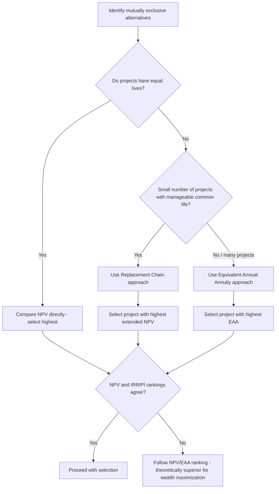

## Comparing Mutually Exclusive Projects

### Overview

Mutually exclusive projects are investment alternatives where selecting one automatically precludes selecting any other — accepting Project A means Project B cannot also be undertaken, even if B has a positive NPV in isolation. This arises commonly when a firm faces alternative ways of achieving the same objective (e.g., choosing between two different machines to perform the same function, or two different building designs on the same plot of land). Comparing mutually exclusive projects introduces analytical complications beyond simple accept/reject decisions: project ranking criteria can conflict, and projects with unequal lives or unequal initial scale require specific adjustment techniques to permit a valid comparison.

### Mutually Exclusive vs. Independent Projects

**Key Points**

- **Independent projects:** acceptance of one project has no bearing on the acceptance of another; each is evaluated using the standard $NPV > 0$ / $IRR > r$ rule in isolation, and all positive-NPV independent projects should be accepted (subject to capital availability).
- **Mutually exclusive projects:** only one project from the competing set can be chosen; the firm must select the single best alternative, not simply every alternative that clears the hurdle rate.
- **Contingent (dependent) projects:** a special case where undertaking one project requires or enables another — not the primary focus here, but relevant to distinguish from mutual exclusivity.

### The Primary Decision Rule: NPV

For mutually exclusive projects, the theoretically correct decision rule is to select the project with the **highest positive NPV**, not the highest IRR or PI. This follows directly from the goal of shareholder wealth maximization: NPV directly measures the absolute dollar increase in firm value, while IRR and PI are relative (percentage or ratio) measures that can be distorted by differences in project scale or cash flow timing.

### Sources of Ranking Conflict

#### 1. Scale (Size) Differences

A smaller project can exhibit a higher IRR or PI than a larger project while generating substantially less total NPV. Because shareholders' wealth is increased by dollars, not percentages, the larger-NPV project should be selected even if its rate of return is comparatively modest — provided the firm has the capital available and is not under capital rationing constraints (see the payback/PI reference material for the capital-rationing exception).

#### 2. Timing Differences

Projects with different patterns of cash flow distribution over time (front-loaded vs. back-loaded) can produce crossing NPV profiles: one project dominates at low discount rates, the other dominates at high discount rates. The discount rate at which their NPV profiles intersect is the **crossover rate**, calculated as the IRR of the cash flow differences between the two projects (Project A − Project B, computed year by year).

#### 3. Unequal Project Lives

When mutually exclusive projects have different useful lives, comparing raw NPVs directly is misleading, because a longer-lived project has more time to accumulate value. Two standard techniques address this: the **Replacement Chain (Common Life) approach** and the **Equivalent Annual Annuity (EAA) approach**.

### Replacement Chain (Common Life) Approach

#### Methodology

Extend the shorter-lived project through replication until both projects' lives align at a common time horizon (typically the least common multiple of the two lives), then compare total NPVs over that common horizon.

$$NPV_{\text{extended}} = NPV_{\text{original}} + \dfrac{NPV_{\text{original}}}{(1+r)^{n}} + \dfrac{NPV_{\text{original}}}{(1+r)^{2n}} + \ldots$$

where $n$ is the original project's life, repeated until the common horizon is reached.

#### Worked Example: Replacement Chain

**Example**

Project X has a 2-year life with $NPV_X = \$10,000$. Project Y has a 3-year life with $NPV_Y = \$13,000$. The required return is 10%. The least common multiple of 2 and 3 is 6 years.

Project X repeated 3 times (at $t=0, 2, 4$):

$$NPV_{X,6yr} = 10{,}000 + \dfrac{10{,}000}{1.10^2} + \dfrac{10{,}000}{1.10^4} = 10{,}000 + 8{,}264.5 + 6{,}830.1 = \$25{,}094.6$$

Project Y repeated 2 times (at $t=0, 3$):

$$NPV_{Y,6yr} = 13{,}000 + \dfrac{13{,}000}{1.10^3} = 13{,}000 + 9{,}767.6 = \$22{,}767.6$$

Over the common 6-year horizon, **Project X** is preferred ($25,094.6 > $22,767.6), despite having the lower NPV on a single-cycle basis.

#### Limitations

- Becomes unwieldy when project lives do not share a small common multiple (e.g., 7-year vs. 11-year lives require a 77-year horizon).
- Assumes the project can be identically replicated at the same cost and cash flow profile in the future — often unrealistic given technological change, inflation, or competitive shifts. [Inference: this replication assumption is a standard textbook simplification widely acknowledged as a limitation rather than a literal real-world expectation.]

### Equivalent Annual Annuity (EAA) Approach

#### Methodology

Convert each project's NPV into an equivalent constant annual cash flow (annuity) over its own life, then compare the annuities directly — mathematically equivalent to the replacement chain approach but computationally simpler.

$$EAA = \dfrac{NPV}{\left[\dfrac{1 - (1+r)^{-n}}{r}\right]} = \dfrac{NPV \times r}{1 - (1+r)^{-n}}$$

The project with the higher EAA is preferred, since EAA represents the annual, perpetuity-equivalent value each project contributes.

#### Worked Example: EAA

**Example**

Using the same Project X ($NPV = \$10,000$, $n=2$) and Project Y ($NPV = \$13,000$, $n=3$) at $r = 10\%$:

**Project X:**

$$EAA_X = \dfrac{10{,}000 \times 0.10}{1 - (1.10)^{-2}} = \dfrac{1{,}000}{0.17355} \approx \$5{,}762$$

**Project Y:**

$$EAA_Y = \dfrac{13{,}000 \times 0.10}{1 - (1.10)^{-3}} = \dfrac{1{,}300}{0.24869} \approx \$5{,}227$$

**Project X** is preferred ($EAA_X > EAA_Y$), consistent with the replacement chain conclusion above.

#### When EAA Is Preferred Over Replacement Chain

- EAA is computationally simpler and avoids constructing long cash flow chains, particularly valuable when project lives have no small common multiple.
- EAA is the standard approach when the analysis involves more than two competing projects with varying lives, since pairwise replacement chains become cumbersome.
- Both methods rely on the same replication assumption and will always produce the same ranking conclusion when applied correctly.

### Comparison: Replacement Chain vs. EAA

| Dimension | Replacement Chain | Equivalent Annual Annuity |
| --- | --- | --- |
| Computation | Requires extending cash flows to a common horizon | Directly converts NPV to an annuity via a single formula |
| Complexity with many projects | High (pairwise LCM can be large) | Low (each project's EAA computed independently) |
| Underlying assumption | Project can be replicated identically | Same (implicit in treating EAA as a perpetuity-equivalent annual value) |
| Typical use case | Two projects with a manageable common life | Three or more projects, or projects with lives lacking a small LCM |

### Other Considerations in Mutually Exclusive Comparisons

**Key Points**

- **Risk differences:** if mutually exclusive projects carry different risk profiles, using a single firm-wide discount rate for both is inappropriate — project-specific, risk-adjusted discount rates should be applied before comparing NPVs.
- **Capital rationing interaction:** if the firm faces a binding capital constraint in addition to mutual exclusivity, the profitability index (adjusted for the mutually exclusive nature of the choice) or explicit optimization techniques may be needed rather than simple NPV/EAA comparison alone.
- **Abandonment and flexibility options:** projects with embedded real options (e.g., the option to expand, delay, or abandon) may have strategic value not captured by a static NPV/EAA comparison — real options analysis can supplement the decision in such cases.
- **Qualitative/strategic factors:** competitive positioning, regulatory considerations, and alignment with corporate strategy may justify overriding a marginal NPV/EAA difference, though this should be an explicit, documented judgment rather than an implicit override of the quantitative analysis.

### Decision Process Flow

### Common Pitfalls

**Key Points**

- Comparing raw NPVs of mutually exclusive projects with materially different lives without adjusting via replacement chain or EAA, which biases the comparison toward the longer-lived project.
- Selecting the highest-IRR or highest-PI mutually exclusive project without checking whether NPV ranks them differently due to scale.
- Applying a single discount rate across mutually exclusive projects that differ meaningfully in risk.
- Assuming identical replication is realistic when applying the replacement chain approach to projects involving fast-changing technology.
- Ignoring embedded real options (e.g., the flexibility to abandon or expand) that could change the relative attractiveness of two otherwise similar NPVs.

### Conclusion

Comparing mutually exclusive projects requires more than checking whether each individually clears the NPV or IRR hurdle — the firm must select the single alternative that maximizes value, which is why NPV (not IRR or PI in isolation) is the primary ranking criterion. When competing projects have unequal lives, the replacement chain or equivalent annual annuity approach must be used to place them on a comparable footing; both methods rest on the assumption that shorter-lived projects can be identically replicated, a simplification that should be weighed against real-world considerations such as technological change, risk differences, and embedded strategic options.

**Related Topics**

- Net present value and internal rate of return
- Payback period and profitability index
- Identifying incremental cash flows
- Capital rationing and project selection under constraints
- Real options in capital budgeting
- Risk-adjusted discount rates for projects of differing risk
- Crossover rate and incremental IRR analysis