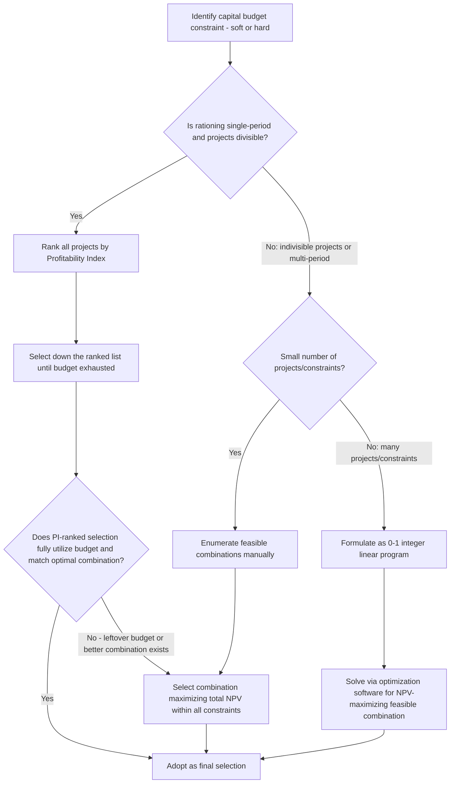

## Capital Rationing Decisions

### Overview

Capital rationing occurs when a firm faces a binding constraint on the total funds available for investment, preventing it from accepting every project that independently satisfies the positive-NPV criterion. Under normal (unconstrained) capital budgeting, the rule is simple: accept all independent projects with positive NPV. Under capital rationing, the objective shifts to selecting the *combination* of projects that maximizes total NPV subject to the budget constraint — a problem that can require different tools than simple NPV or IRR ranking, particularly when projects are indivisible or the constraint spans multiple periods.

### Why Capital Rationing Occurs

**Key Points**

- **Soft (internal) rationing:** self-imposed by management, often as an internal control mechanism to maintain financial discipline, limit organizational risk-taking, or preserve managerial oversight over the pace of expansion — not driven by an actual inability to raise external capital.
- **Hard (external) rationing:** imposed by external capital markets — the firm is genuinely unable to raise sufficient debt or equity capital, whether due to poor credit standing, market conditions, debt covenant restrictions, or the high transaction costs of raising small amounts of external capital.
- Capital rationing is, in a strict theoretical sense, a violation of the Modigliani-Miller assumption of perfect capital markets (where any positive-NPV project could always be financed) — its existence in practice reflects real-world market frictions, information asymmetries, and agency considerations. [Inference: the framing of capital rationing as a departure from perfect-market assumptions is a standard theoretical characterization in corporate finance texts.]

### The Core Problem: Ranking Under a Budget Constraint

When a fixed budget prevents funding every positive-NPV project, the firm cannot simply accept projects one at a time in order of individual attractiveness — it must find the combination of projects that, taken together, maximizes total NPV without exceeding the budget. Naively selecting the projects with the single highest NPVs, or the highest IRRs, can produce a suboptimal combination, because neither approach accounts for how efficiently each project uses the scarce capital.

### Profitability Index as the Primary Ranking Tool

#### Why PI Outperforms NPV or IRR for Ranking Under Rationing

$$PI = \dfrac{PV \text{ of Future Cash Flows}}{\text{Initial Investment}}$$

PI measures value created **per dollar of scarce capital invested**, which is precisely the relevant metric when capital — not project availability — is the binding constraint. Ranking projects by PI (highest to lowest) and funding down the list until the budget is exhausted typically produces a higher total NPV than ranking by NPV or IRR alone, because PI explicitly accounts for capital efficiency rather than absolute scale.

#### Worked Example: PI Ranking Under a Single-Period Constraint

**Example**

A firm has a fixed capital budget of $1,000,000 for the current period and is evaluating five independent, divisible projects:

| Project | Initial Investment | NPV | PI |
| --- | --- | --- | --- |
| A | $300,000 | $90,000 | 1.30 |
| B | $250,000 | $100,000 | 1.40 |
| C | $400,000 | $96,000 | 1.24 |
| D | $350,000 | $105,000 | 1.30 |
| E | $200,000 | $44,000 | 1.22 |

Ranking by PI (descending): B (1.40) > A (1.30) = D (1.30) > C (1.24) > E (1.22)

Selecting B ($250,000) + A ($300,000) + D ($350,000) = $900,000 invested, $100,000 budget remaining (insufficient to fully fund any remaining project). Total NPV = $100,000 + $90,000 + $105,000 = **$295,000**.

Compare with ranking by NPV alone: D ($105,000) > B ($100,000) > C ($96,000) > A ($90,000) > E ($44,000). Selecting D + B + C would require $350,000 + $250,000 + $400,000 = $1,000,000 exactly, total NPV = $105,000 + $100,000 + $96,000 = **$301,000** — in this particular case, the full-budget-utilizing NPV-based combination outperforms the PI-based one, illustrating that PI ranking is a strong heuristic but must still be checked against total budget utilization and alternative combinations, not applied mechanically.

### Limitations of Simple PI Ranking

**Key Points**

- **Indivisible projects:** if projects cannot be partially funded, PI ranking can leave part of the budget unused, and a lower-PI combination that fully utilizes the budget may generate higher total NPV (as the example above demonstrates).
- **Multi-period constraints:** when capital is rationed in more than one future period (not just the current period), a single-period PI ranking is insufficient — the timing of each project's cash requirements across periods must be considered jointly.
- **Mutually exclusive or contingent projects:** simple PI ranking assumes project independence; interdependencies (mutual exclusivity, or one project enabling another) require the ranking process to first resolve those relationships before ranking on a per-dollar basis.
- **Non-linear or lumpy investment requirements:** PI ranking works best when project sizes are small relative to the total budget; for a small number of large, "lumpy" projects, exhaustively comparing feasible combinations may outperform simple ranking.

### Integer (0-1) Programming for Optimal Selection

#### Methodology

When projects are indivisible (each project is either fully accepted or fully rejected — a binary decision), the capital rationing problem can be formulated as a 0-1 integer linear program:

$$\text{Maximize} \sum_{i=1}^{n} NPV_i \times x_i$$

subject to:

$$\sum_{i=1}^{n} I_i \times x_i \leq B \quad \text{(budget constraint)}$$

$$x_i \in \{0, 1\} \quad \text{for all } i$$

where $x_i$ is a binary decision variable (1 = accept project $i$, 0 = reject), $I_i$ is the initial investment required for project $i$, and $B$ is the total capital budget.

#### When to Use Integer Programming vs. PI Ranking

- For a small number of projects, exhaustive enumeration of feasible combinations (checking all subsets that satisfy the budget constraint) can directly identify the NPV-maximizing combination, as illustrated in the worked example above.
- For a larger number of projects or multiple constraints (e.g., budget limits in several future periods, or additional constraints such as project interdependencies), formal linear/integer programming techniques (solved via specialized software) become necessary to find the true optimum efficiently. [Inference: the practical threshold at which manual enumeration becomes impractical and formal optimization software is warranted depends on the specific number of projects and constraints, and is a matter of computational judgment rather than a fixed rule.]
- Multi-period capital rationing problems are typically formulated with a separate budget constraint for each period, requiring the optimization to jointly satisfy all period constraints simultaneously.

### Multi-Period Capital Rationing

**Key Points**

- Projects often require staged investment outlays across multiple future periods, not just at time 0.
- A firm facing capital constraints in, say, both Year 0 and Year 1 must select a combination of projects whose cumulative investment requirements fit within *each* period's separate budget — not merely the total budget across all periods combined.
- This significantly increases the complexity of the selection problem and is a primary reason formal optimization techniques are used in practice for firms with genuinely constrained, multi-period capital budgets.

### Soft vs. Hard Rationing: Implications for Analysis

| Dimension | Soft (Internal) Rationing | Hard (External) Rationing |
| --- | --- | --- |
| Cause | Management policy choice | Actual capital market constraint |
| Theoretical implication | Firm is knowingly forgoing some positive-NPV projects | Firm is unable to fund all positive-NPV projects even if desired |
| Typical firm response | Reassess policy if genuinely value-destroying combinations are being forced | Focus on maximizing NPV within the true constraint; consider relaxing the constraint via alternative financing |
| Analytical approach | Same optimization techniques apply; question is whether the constraint itself should be revisited | Optimization techniques apply directly to the binding, non-negotiable constraint |

### Decision Process Flow

### Common Pitfalls

**Key Points**

- Mechanically applying PI ranking without checking whether an alternative combination more fully utilizes the available budget and produces a higher total NPV.
- Ignoring multi-period budget constraints and only checking the current period's budget, which can lead to selecting a combination infeasible in a future constrained period.
- Treating soft (self-imposed) rationing as an immutable constraint without periodically reassessing whether the policy itself is destroying value by forgoing genuinely attractive positive-NPV projects.
- Applying capital rationing logic (PI-based ranking) to a firm that is not actually capital-constrained, which can needlessly reject value-creating independent projects.
- Failing to account for project interdependencies (mutual exclusivity, contingencies) before applying PI ranking, which assumes independence.

### Conclusion

Capital rationing decisions require shifting from a simple accept/reject NPV rule to a combinatorial optimization problem: selecting the set of projects that maximizes total NPV within one or more binding budget constraints. The profitability index provides an effective and computationally simple first-pass ranking tool for single-period, divisible-project scenarios, but its limitations — particularly with indivisible projects or multi-period constraints — often necessitate combination enumeration or formal integer/linear programming to identify the truly value-maximizing set of investments. Understanding whether rationing is self-imposed (soft) or market-imposed (hard) further informs whether the constraint itself, not just the project selection within it, merits reassessment.

**Related Topics**

- Payback period and profitability index
- Net present value and internal rate of return
- Comparing mutually exclusive projects
- Linear and integer programming for project selection
- Capital structure and the cost of raising external capital
- Agency costs and internal capital allocation
- Real options and staged investment decisions