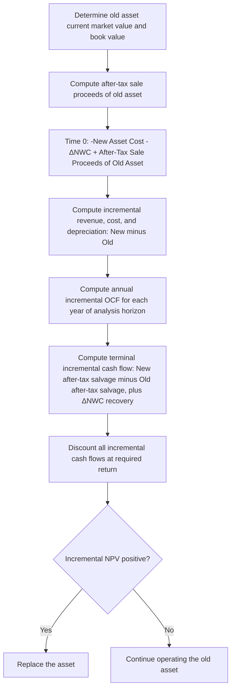

## Replacement and Expansion Analysis

### Overview

Replacement and expansion analyses are two common applications of incremental cash flow analysis within capital budgeting, each with distinct cash flow structures. Expansion analysis evaluates a new investment undertaken to grow the firm's operations without displacing an existing asset — the cash flows are typically evaluated in isolation, since there is no comparison asset generating an offsetting cash flow stream. Replacement analysis evaluates whether to substitute an existing (old) asset with a new one, requiring the analyst to isolate the *incremental difference* between continuing to operate the old asset versus replacing it — a structurally more complex problem because both the initial outlay and every subsequent cash flow must be computed on a differential basis.

### Expansion Analysis

#### Definition and Approach

Expansion investment adds new productive capacity, a new product line, or entry into a new market, without displacing any existing asset. Because there is no "old asset" cash flow stream to net out, expansion project cash flows are generally evaluated directly, following the standard incremental cash flow framework (see *Identifying incremental cash flows*): initial outlay, annual operating cash flows, and terminal cash flows (after-tax salvage plus NWC recovery).

#### Key Considerations Specific to Expansion

**Key Points**

- **Erosion/cannibalization:** if the new project draws sales away from the firm's existing products (e.g., a new product line competing with an established one), that lost contribution margin is a relevant incremental cost and must be included, even though no old asset is being replaced.
- **Synergies:** conversely, if the expansion enhances sales of existing products (e.g., a complementary product), the incremental benefit must be included.
- **Opportunity costs:** if the expansion uses an existing company resource (idle land, unused facility capacity) that has an alternative use or sale value, that forgone value is a relevant cost of the expansion project.
- **Financing and capacity constraints:** expansion decisions are more likely to interact with capital rationing considerations than replacement decisions, since they typically represent discretionary growth rather than necessary maintenance of existing operations.

### Replacement Analysis

#### Definition and Approach

Replacement analysis evaluates whether to retire an existing, still-functioning asset in favor of a new one — distinct from a simple expansion decision because the relevant cash flows are the *difference* between the two scenarios (keep the old asset vs. buy the new asset), not the new asset's cash flows in isolation.

#### Structuring the Incremental Cash Flows

**Initial (Time 0) Incremental Outlay:**

$$\Delta CF_0 = -(\text{Cost of New Asset}) + (\text{After-Tax Proceeds from Sale of Old Asset}) - \Delta NWC$$

The after-tax proceeds from selling the old asset require calculating the tax effect of any gain or loss relative to the old asset's current book value:

$$\text{After-Tax Sale Proceeds} = \text{Sale Price} - T \times (\text{Sale Price} - \text{Book Value})$$

- If Sale Price > Book Value: a taxable gain reduces net proceeds (tax is owed on the gain, generally taxed as ordinary income for the depreciation-recapture portion and/or capital gains depending on jurisdiction).
- If Sale Price < Book Value: a loss generates a tax **shield/benefit**, increasing net proceeds.
- If Sale Price = Book Value: no tax effect; proceeds equal book value.

**Annual Incremental Operating Cash Flows:**

$$\Delta OCF = (\Delta \text{Revenue} - \Delta \text{Operating Costs} - \Delta \text{Depreciation})(1-T) + \Delta \text{Depreciation}$$

Every component must be computed as the *difference* between the new asset's figures and the old asset's figures (had it been kept):

- $\Delta \text{Revenue}$: incremental revenue from the new asset (e.g., higher output, better quality) minus what the old asset would have generated.
- $\Delta \text{Operating Costs}$: new asset's operating costs (often lower, reflecting the efficiency motivation for replacement) minus old asset's operating costs.
- $\Delta \text{Depreciation}$: new asset's depreciation minus the old asset's remaining depreciation (had it not been replaced) — this changes the incremental depreciation tax shield.

**Terminal Incremental Cash Flow:**

$$\Delta CF_n = \Delta \text{After-Tax Salvage} + \Delta NWC \text{ Recovery}$$

Equal to the new asset's after-tax salvage value at the end of the analysis horizon, minus what the old asset's after-tax salvage value *would have been* at that same point had it been kept and eventually sold.

#### Why the Old Asset's Current Book Value (Not Original Cost) Matters

A common error is using the old asset's original purchase price in the analysis. The relevant figures are:

- The old asset's **current market/sale value** (a relevant opportunity cost if kept, or actual proceeds if sold now) — this is what matters for the Time 0 comparison, not the original cost, which is sunk.
- The old asset's **current book value** — relevant only for computing the tax effect of selling it now versus continuing to depreciate it.

### Worked Example: Replacement Analysis

**Example**

A firm is considering replacing an old machine with a new, more efficient one. Required return = 10%, tax rate = 25%.

**Old machine:** original cost $200,000, currently has a book value of $60,000 (after 4 years of $35,000/year straight-line depreciation), current market/sale value = $80,000, remaining useful life = 4 years, remaining depreciation = $15,000/year for 4 more years (to zero salvage), annual operating costs = $90,000, generates annual revenue = $250,000.

**New machine:** cost = $220,000, installation = $10,000 (total depreciable basis $230,000), 4-year life, straight-line depreciation = $57,500/year, annual operating costs = $60,000, generates annual revenue = $260,000, expected salvage value at year 4 = $20,000 (book value at year 4 = $0).

**Step 1 — Time 0 Incremental Outlay:**

After-tax sale proceeds on old machine: $80,000 - 0.25 \times (80,000 - 60,000) = 80,000 - 5,000 = \$75,000$

$$\Delta CF_0 = -(220{,}000 + 10{,}000) + 75{,}000 = -230{,}000 + 75{,}000 = -\$155{,}000$$

**Step 2 — Annual Incremental Operating Cash Flow (Years 1–4):**

|  | New Machine | Old Machine | Incremental (Δ) |
| --- | --- | --- | --- |
| Revenue | $260,000 | $250,000 | $10,000 |
| Operating Costs | $60,000 | $90,000 | −$30,000 (cost saving) |
| Depreciation | $57,500 | $15,000 | $42,500 |

$$\Delta EBIT = 10{,}000 - (-30{,}000) - 42{,}500 = 10{,}000 + 30{,}000 - 42{,}500 = -2{,}500$$

Wait — combining correctly: $\Delta \text{Revenue} - \Delta \text{Operating Costs} - \Delta \text{Depreciation} = 10{,}000 - (-30{,}000) - 42{,}500 = -2{,}500$

$$\Delta OCF = (-2{,}500)(1 - 0.25) + 42{,}500 = -1{,}875 + 42{,}500 = \$40{,}625 \text{ per year}$$

**Step 3 — Terminal Incremental Cash Flow (Year 4):**

New machine after-tax salvage: $20,000 - 0.25 \times (20,000 - 0) = 20,000 - 5,000 = \$15,000$

Old machine, had it been kept, would have had $0 book value and assumed $0 salvage value at year 4 (fully depreciated with no market value assumed).

$$\Delta \text{Terminal CF} = 15{,}000 - 0 = \$15{,}000$$

**Step 4 — NPV of Replacement Decision:**

$$NPV = -155{,}000 + \sum_{t=1}^{4} \dfrac{40{,}625}{1.10^t} + \dfrac{15{,}000}{1.10^4}$$

$$NPV = -155{,}000 + 40{,}625 \times 3.16987 + 15{,}000 \times 0.68301$$

$$NPV = -155{,}000 + 128{,}776 + 10{,}245 = -\$15{,}979$$

Since incremental NPV is negative, the replacement is **not** justified on a purely financial basis at this required return — the firm should continue operating the old machine, despite the new machine's higher revenue and lower operating costs, because the initial net outlay and depreciation tax shield differential are not sufficiently offset within the 4-year horizon.

### Expansion vs. Replacement: Key Structural Differences

| Dimension | Expansion Analysis | Replacement Analysis |
| --- | --- | --- |
| Baseline comparison | New project vs. no project | New asset vs. continuing to operate old asset |
| Initial outlay | Cost of new asset (plus NWC, less any relevant opportunity costs) | Cost of new asset minus after-tax proceeds from selling old asset |
| Operating cash flows | New asset's cash flows evaluated directly | *Difference* between new and old asset's cash flows |
| Depreciation tax shield | Based on new asset's depreciation alone | Based on the *change* in depreciation (new minus old asset's remaining depreciation) |
| Terminal cash flow | New asset's after-tax salvage plus NWC recovery | *Difference* between new and old asset's terminal values |
| Typical complexity | Lower — single cash flow stream | Higher — requires careful "with vs. without" differencing at every stage |
| Erosion/synergy relevance | Relevant if new project affects existing product lines | Relevant if replacement changes output affecting other product lines |

### Replacement Analysis Cash Flow Structure

### Common Pitfalls

**Key Points**

- Using the old asset's original purchase price instead of its current market value and book value in the replacement analysis — original cost is a sunk cost and irrelevant except for its role in determining current book value for tax purposes.
- Computing the new asset's depreciation tax shield in isolation, forgetting to net out the depreciation tax shield the old asset would have continued generating had it not been replaced.
- Ignoring the tax effect (gain or loss) on the sale of the old asset when computing the initial incremental outlay.
- Treating an expansion project's cash flows as if a replacement comparison is needed when no existing asset is actually being displaced (unnecessary complexity), or conversely, evaluating a replacement decision using only the new asset's standalone cash flows (an incomplete analysis that ignores the forgone old-asset cash flows).
- Failing to check for erosion/synergy effects on other product lines in both expansion and replacement contexts.
- Assuming the old asset has no salvage/terminal value at the end of the analysis horizon without explicitly verifying that assumption.

### Conclusion

Expansion and replacement analyses both apply the standard incremental cash flow framework, but replacement analysis introduces the added complexity of computing every cash flow component — initial outlay, operating cash flows, and terminal value — as a *difference* between the new and old asset scenarios, rather than evaluating the new investment in isolation. The tax treatment of the old asset's disposal and the change in depreciation tax shields are frequent sources of error and require particular care. Correctly structuring these differential cash flows is essential, since even a new asset that appears clearly superior on operating metrics (lower costs, higher revenue) can yield a negative incremental NPV once the full initial outlay and depreciation tax shield effects are properly netted against continuing to operate the existing asset.

**Related Topics**

- Identifying incremental cash flows
- Net present value and internal rate of return
- Comparing mutually exclusive projects
- Depreciation methods and their tax implications
- Capital rationing decisions
- Real options: the option to abandon or defer replacement
- Equivalent annual annuity for unequal-life asset comparisons