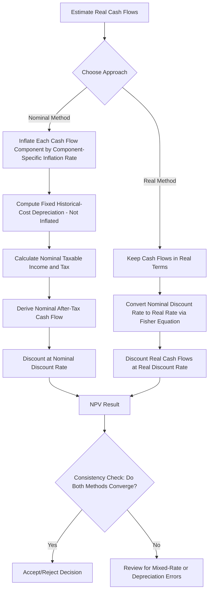

## Inflation Adjusted Capital Budgeting

### Overview

Inflation adjusted capital budgeting is the practice of explicitly incorporating expected price-level changes into the evaluation of long-term investment projects. Because capital budgeting decisions involve cash flows spread across many future periods, even moderate inflation rates compound significantly over a project's life, distorting the accuracy of Net Present Value (NPV) and Internal Rate of Return (IRR) calculations if left unaddressed. The core principle governing this topic is the **consistency rule**: nominal cash flows must be discounted at a nominal discount rate, and real cash flows must be discounted at a real discount rate. Mixing these approaches is the single most common analytical error in capital budgeting practice.

### The Consistency Principle

There are two internally consistent methods for evaluating a project under inflation, and both should mathematically produce the same NPV if applied correctly.

**Method 1 — Nominal Approach**

Forecast cash flows in nominal (current, inflated) terms and discount using the nominal (market) discount rate.

**Method 2 — Real Approach**

Forecast cash flows in real (constant purchasing power) terms and discount using the real discount rate.

Analysts must never discount nominal cash flows with a real rate, or real cash flows with a nominal rate. Doing so systematically biases the NPV — typically overstating it when real cash flows are discounted at a nominal rate, since the discount rate embeds an inflation premium that the numerator does not.

### The Fisher Equation

The relationship between nominal and real rates is captured by the Fisher equation:

$$(1 + r_{nominal}) = (1 + r_{real})(1 + i)$$

Where:

- $r_{nominal}$ = nominal discount rate (includes inflation premium)
- $r_{real}$ = real discount rate (excludes inflation premium)
- $i$ = expected inflation rate

Solving for the real rate:

$$r_{real} = \frac{1 + r_{nominal}}{1 + i} - 1$$

**Approximation shortcut**: For low inflation rates, practitioners often use the simplified (Fisher approximation) version:

$$r_{real} \approx r_{nominal} - i$$

[Inference] This approximation introduces increasing error as inflation rises above roughly 5-6%, since it ignores the cross-product term $r_{real} \times i$; for high-inflation environments the exact Fisher formula should be used.

### Adjusting Cash Flows for Inflation

Nominal cash flow forecasting requires inflating each individual cash flow component — not applying a single blanket rate to the total. This matters because revenue, operating costs, and non-cash items like depreciation often inflate at different rates or not at all.

**Nominal cash flow formula for a given year $t$:**

$$CF_{nominal,t} = CF_{real,t} \times (1 + i)^t$$

If components inflate at different rates (differential inflation):

$$CF_{nominal,t} = \sum_{j} \left[ CF_{real,j,t} \times (1 + i_j)^t \right]$$

Where $i_j$ is the specific inflation rate applicable to component $j$ (e.g., labor cost inflation vs. raw material inflation vs. selling price escalation).

### The Depreciation Tax Shield Problem

Depreciation is a critical exception in inflation-adjusted analysis. Depreciation is calculated on the **historical (original) cost** of an asset and, under most tax jurisdictions, is **not** adjusted for inflation. This means the depreciation tax shield loses real value over time as inflation rises, because the nominal tax savings it generates stay fixed while the purchasing power of that saving erodes.

**Key Points**

- Depreciation itself should never be inflated when constructing nominal cash flows.
- The depreciation tax shield ($Depreciation \times Tax\ Rate$) is calculated once on historical cost and remains a fixed nominal figure across the asset's life.
- All other cash flow components (revenue, cash operating expenses) should be inflated, then depreciation is subtracted only for tax calculation purposes, and added back afterward, in nominal terms.
- Higher inflation erodes the real value of the depreciation tax shield, reducing real project NPV — a frequently overlooked effect that penalizes capital-intensive projects during inflationary periods.

### Worked Example

**Scenario:** A firm is evaluating a project with the following real (today's dollars) figures:

- Initial investment: $500,000, depreciated straight-line over 5 years, zero salvage value
- Real annual pre-tax operating cash inflow (before depreciation): $180,000, expected to grow with inflation
- Tax rate: 30%
- Expected inflation: 4% per year
- Real discount rate: 8%

**Step 1 — Find the nominal discount rate**

$$r_{nominal} = (1.08)(1.04) - 1 = 1.1232 - 1 = 12.32\%$$

**Step 2 — Compute fixed annual depreciation (historical cost basis)**

$$Depreciation = \frac{500{,}000}{5} = 100{,}000 \text{ per year (nominal, fixed)}$$

**Step 3 — Build Year 1 nominal cash flow**

Nominal operating cash inflow (inflated once for Year 1):

$$180{,}000 \times 1.04 = 187{,}200$$

Taxable income:

$$187{,}200 - 100{,}000 = 87{,}200$$

Tax:

$$87{,}200 \times 0.30 = 26{,}160$$

After-tax nominal cash flow:

$$187{,}200 - 26{,}160 = 161{,}040$$

Equivalently, using the operating-cash-flow-plus-tax-shield method:

$$OCF = (Revenue - Cost)(1 - T) + (Depreciation \times T)$$

$$OCF = 187{,}200(0.70) + 100{,}000(0.30) = 131{,}040 + 30{,}000 = 161{,}040$$

This process repeats for Years 2 through 5, inflating the operating cash inflow by $(1.04)^t$ each year while holding depreciation at a constant $100,000, then discounting each year's total nominal cash flow at 12.32%.

**Step 4 — Discount at the nominal rate**

Each year's nominal after-tax cash flow is discounted using $\frac{1}{(1.1232)^t}$, and the sum of discounted cash flows less the initial investment yields NPV. [Unverified] The exact multi-year NPV figure depends on precise year-by-year computation and is not restated here in full, but the method above is the standard, correct procedure.

### Common Errors to Avoid

**Key Points**

- **Mixing rates**: Discounting nominal cash flows with a real rate (or vice versa) is the most frequent and most damaging error.
- **Inflating depreciation**: Applying an inflation factor to depreciation overstates the tax shield and inflates NPV incorrectly.
- **Ignoring differential inflation**: Assuming all cash flow components inflate at the identical rate when revenues, costs, and wages may inflate differently in practice.
- **Ignoring inflation's effect on working capital**: Inflation increases the nominal investment required in receivables, inventory, and payables (net working capital), which represents a real cash outflow that is easy to omit.
- **Applying inflation to sunk costs or already-nominal contractual cash flows**: Fixed-price contracts or already-locked lease payments should not be re-inflated.

### Impact on Net Working Capital

Under inflation, the nominal dollar amount tied up in net working capital (NWC) rises even if the *real* level of inventory or receivables stays constant, because unit prices are higher. This incremental nominal NWC investment must be treated as a cash outflow in the year it occurs, with the balance typically recovered (added back) at project termination.

$$\Delta NWC_t = NWC_t - NWC_{t-1}$$

Where each $NWC_t$ is measured in nominal terms reflecting prevailing prices in year $t$.

### Decision Rule Consistency Check

$$\text{Real Approach: } NPV = \sum_{t=0}^{n} \frac{CF_{real,t}}{(1+r_{real})^t}$$

$$\text{Nominal Approach: } NPV = \sum_{t=0}^{n} \frac{CF_{nominal,t}}{(1+r_{nominal})^t}$$

Both formulas should converge to the same NPV **only if** all cash flow components (including depreciation's distinct treatment) are handled consistently with the chosen approach. In practice, the nominal approach is more widely used in corporate settings because tax authorities compute depreciation and tax liabilities on nominal (historical cost) figures, making it easier to align with actual tax filings and financing cash flows.

### Process Flow Diagram

### Sensitivity Considerations

**Key Points**

- Projects with high fixed asset intensity (heavy reliance on depreciation tax shields) are more adversely affected by inflation than labor-intensive service projects, due to the fixed-nominal depreciation shield problem.
- Projects with revenues fixed by long-term contracts (not indexed to inflation) but variable costs that rise with inflation face margin compression — this should be modeled explicitly rather than assumed away.
- [Inference] Sensitivity analysis varying the inflation assumption (e.g., ±2% from the base case) is standard practice to test the robustness of the investment decision, since inflation forecasts carry meaningful estimation uncertainty over multi-year project horizons.

### Related Topics

- Fisher Effect and interest rate theory
- Real options analysis in capital budgeting
- Net Present Value (NPV) and Internal Rate of Return (IRR) foundations
- Weighted Average Cost of Capital (WACC) estimation under inflation
- Purchasing Power Parity and international capital budgeting
- Depreciation methods (straight-line vs. accelerated) and tax shield valuation
- Working capital forecasting and cash conversion cycle under inflation
- Scenario and sensitivity analysis in project evaluation
- Capital budgeting under differential (component-specific) inflation rates
- Replacement decisions and inflation-adjusted equivalent annual cost (EAC)