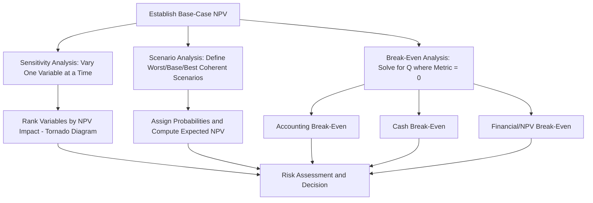

## Sensitivity, Scenario, and Break-Even Analysis

### Overview

These three techniques form the core toolkit for assessing risk in capital budgeting beyond the single-point-estimate NPV. Where a base-case NPV calculation assumes every input forecast is certain, sensitivity, scenario, and break-even analysis instead ask "what if the inputs are wrong?" — systematically exploring how variability and estimation error in key assumptions affect the viability of a project. Each technique addresses risk from a different angle: sensitivity analysis isolates one variable at a time, scenario analysis moves multiple variables together in coherent combinations, and break-even analysis solves for the threshold value at which the project's attractiveness flips.

### Sensitivity Analysis

**Definition**

Sensitivity analysis measures how NPV changes when a single input variable is varied while all other variables are held constant at their base-case values. It answers the question: "Which assumption, if wrong, does the most damage to this project?"

**Process**

1. Establish the base-case NPV using expected (most likely) values for all inputs.
2. Select one variable (e.g., unit sales, sale price, variable cost per unit, discount rate).
3. Recalculate NPV using a pessimistic and an optimistic value for that variable, holding all others at base case.
4. Repeat for each key variable independently.
5. Rank variables by the magnitude of NPV swing they produce.

**Key Points**

- The variable producing the largest NPV range between pessimistic and optimistic cases is the project's most critical assumption and warrants the most forecasting effort and managerial attention.
- Sensitivity analysis identifies risk exposure but does not assign probabilities to outcomes — it shows magnitude of impact, not likelihood.
- A major limitation is that it changes variables in isolation, which is often unrealistic since real-world variables tend to move together (e.g., higher input costs often accompany higher inflation-driven selling prices).

**Worked Example**

Base case: Unit sales = 10,000, Price = $50, Variable cost = $30, Fixed costs = $100,000, Discount rate = 10%, Initial investment = $300,000, 5-year life, ignoring taxes and depreciation for simplicity.

Base-case annual cash flow:

$$CF = (10{,}000 \times 50) - (10{,}000 \times 30) - 100{,}000 = 500{,}000 - 300{,}000 - 100{,}000 = 100{,}000$$

Base-case NPV:

$$NPV = -300{,}000 + 100{,}000 \times \left[\frac{1 - (1.10)^{-5}}{0.10}\right] = -300{,}000 + 100{,}000 \times 3.7908 = 79{,}080$$

**Sensitivity on unit sales** (pessimistic = 8,000, optimistic = 12,000):

Pessimistic:

$$CF = (8{,}000 \times 50) - (8{,}000 \times 30) - 100{,}000 = 60{,}000$$

$$NPV = -300{,}000 + 60{,}000 \times 3.7908 = -72{,}552$$

Optimistic:

$$CF = (12{,}000 \times 50) - (12{,}000 \times 30) - 100{,}000 = 140{,}000$$

$$NPV = -300{,}000 + 140{,}000 \times 3.7908 = 230{,}712$$

This produces an NPV swing of roughly $303,264 from a ±20% change in unit sales alone, illustrating high sensitivity to volume — the project moves from significantly value-destroying to strongly value-creating based on this single variable.

**Tornado Diagram**

Sensitivity results are commonly visualized as a tornado diagram, with variables ranked from largest to smallest NPV impact, creating a descending bar-width pattern.

### Scenario Analysis

**Definition**

Scenario analysis evaluates NPV under a small number of internally consistent, holistic combinations of variables — typically a worst case, base case, and best case — where all variables move together in a plausible, coordinated fashion rather than one at a time.

**Process**

1. Define a limited set of scenarios (commonly 3: pessimistic, base, optimistic; sometimes more, including named macroeconomic scenarios like "recession" or "boom").
2. For each scenario, specify a coherent set of values for all key variables simultaneously (e.g., in a recession scenario: lower sales volume AND lower price AND possibly lower variable costs due to weaker input demand).
3. Compute NPV for each complete scenario.
4. Optionally assign subjective probabilities to each scenario and compute an expected NPV.

**Key Points**

- Scenario analysis addresses sensitivity analysis's key weakness — variables changing in isolation — by modeling realistic joint movements.
- The output is a small set of discrete outcomes (not a continuous distribution), making it more limited than full Monte Carlo simulation but far more tractable for standard corporate use.
- Scenario definitions require sound managerial judgment; a poorly constructed "worst case" that mixes an unrealistically pessimistic assumption for one variable with an optimistic assumption for another produces misleading results.

**Worked Example (continuing prior inputs)**

| Scenario | Unit Sales | Price | Variable Cost | Annual CF | NPV |
| --- | --- | --- | --- | --- | --- |
| Worst | 7,500 | $45 | $32 | $(7{,}500 \times 45) - (7{,}500 \times 32) - 100{,}000 = -2{,}500$ | $-300{,}000 + (-2{,}500)(3.7908) = -309{,}477$ |
| Base | 10,000 | $50 | $30 | $100{,}000$ | $79{,}080$ |
| Best | 12,500 | $55 | $28 | $(12{,}500 \times 55) - (12{,}500 \times 28) - 100{,}000 = 237{,}500$ | $-300{,}000 + 237{,}500(3.7908) = 600{,}315$ |

If probabilities of 25% (Worst), 50% (Base), and 25% (Best) are assigned:

$$E(NPV) = 0.25(-309{,}477) + 0.50(79{,}080) + 0.25(600{,}315) = -77{,}369 + 39{,}540 + 150{,}079 = 112{,}250$$

**Key Points**

- Expected NPV from scenario analysis can differ meaningfully from the single-point base-case NPV, since the underlying relationship between inputs and NPV is often non-linear (e.g., due to fixed costs creating operating leverage).
- The standard deviation of NPV across scenarios (weighted by probability) provides a rough quantitative measure of total project risk, useful for comparing relative riskiness between competing projects.

### Break-Even Analysis

**Definition**

Break-even analysis solves for the specific value of a variable at which a defined outcome measure equals zero (or a target threshold), identifying the "tipping point" beyond which a project becomes unprofitable or unacceptable. In capital budgeting, break-even is most commonly assessed on three bases: accounting break-even, cash break-even, and financial (NPV) break-even.

**Accounting Break-Even**

The sales volume at which net income equals zero (Total Revenue = Total Costs, including depreciation).

$$Q_{accounting} = \frac{Fixed\ Costs + Depreciation}{Price - Variable\ Cost\ per\ Unit}$$

**Cash Break-Even**

The sales volume at which operating cash flow equals zero — a less conservative threshold than accounting break-even because it excludes the non-cash depreciation charge.

$$Q_{cash} = \frac{Fixed\ Costs}{Price - Variable\ Cost\ per\ Unit}$$

**Financial (NPV) Break-Even**

The sales volume at which NPV equals exactly zero — the most economically meaningful break-even measure, since it accounts for the time value of money and the required return on invested capital, not merely accounting profitability.

$$Q_{financial} = \frac{Fixed\ Costs + \left(\dfrac{Initial\ Investment}{Annuity\ Factor}\right)}{Price - Variable\ Cost\ per\ Unit}$$

Where the Annuity Factor is $\frac{1 - (1+r)^{-n}}{r}$ for the project's discount rate $r$ and life $n$.

**Worked Example (financial break-even, using prior inputs)**

$$Q_{financial} = \frac{100{,}000 + \left(\dfrac{300{,}000}{3.7908}\right)}{50 - 30} = \frac{100{,}000 + 79{,}150}{20} = \frac{179{,}150}{20} = 8{,}958 \text{ units}$$

**Interpretation**: The project requires selling at least approximately 8,958 units annually merely to earn exactly its required 10% return — below this, the project destroys shareholder value even though it may still show positive accounting net income. This is precisely why financial break-even is always higher than accounting break-even (which does not require compensating investors for the opportunity cost of capital) — accounting break-even understates the true minimum viable sales level from a value-creation perspective.

**Key Points**

- Ranking: $Q_{financial} > Q_{accounting} > Q_{cash}$, since financial break-even is the most stringent test (it demands full recovery of the required return on capital) and cash break-even is the least stringent (it ignores both depreciation and the cost of the original investment).
- Break-even analysis is especially valuable for assessing operating risk and margin of safety — how far current or projected sales sit above the minimum viable threshold.
- Managers often use the gap between projected sales and the financial break-even quantity as a simple, intuitive margin-of-safety metric when presenting a project to a capital committee.

### Comparison of the Three Techniques

| Technique | Variables Changed | Output | Primary Use |
| --- | --- | --- | --- |
| Sensitivity Analysis | One at a time | NPV range per variable | Identify which assumption matters most |
| Scenario Analysis | Multiple, jointly, in coherent combinations | NPV under discrete named scenarios | Assess realistic best/worst outcomes and expected NPV |
| Break-Even Analysis | Solve for threshold value of one variable | The exact tipping-point value | Determine minimum viable performance level |

### Integrated Process Flow

### Limitations and Practical Considerations

**Key Points**

- None of these three techniques produces a full probability distribution of NPV outcomes; for that, Monte Carlo simulation is required, drawing repeatedly from specified probability distributions for each input variable.
- Sensitivity and scenario analysis both rely on subjective selection of pessimistic/optimistic bounds and scenario definitions, introducing analyst judgment and potential bias into the results.
- [Inference] In practice, sensitivity analysis is often used first as a screening tool to identify the two or three variables most worth building detailed scenarios or simulations around, since analyzing every variable in full scenario or simulation detail is rarely a productive use of analytical effort.
- These techniques evaluate risk in isolation from the firm's other projects; they do not capture portfolio diversification effects, which is a separate consideration under total firm risk versus project-specific (stand-alone) risk frameworks.

### Related Topics

- Monte Carlo simulation in capital budgeting
- Decision tree analysis and real options
- Operating leverage and degree of operating leverage (DOL)
- Stand-alone risk vs. corporate risk vs. market (beta) risk
- Certainty equivalent method for risk adjustment
- Risk-adjusted discount rates
- Capital rationing and project ranking under uncertainty
- Inflation adjusted capital budgeting
- Replacement analysis and equivalent annual cost