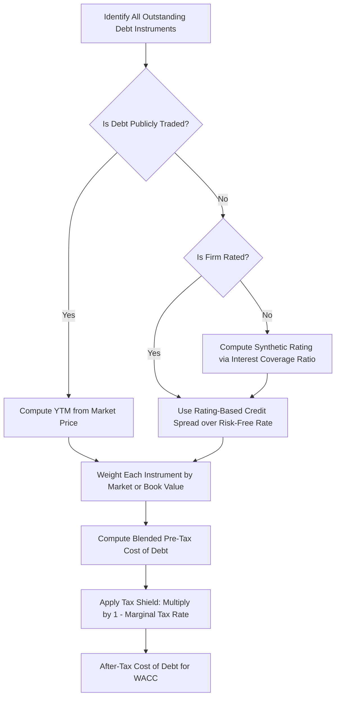

## Cost of Debt Estimation

### Overview

Cost of debt estimation quantifies the effective rate a firm pays for borrowed capital, forming one of the three primary inputs (alongside cost of equity and cost of preferred stock) into the Weighted Average Cost of Capital (WACC). Unlike cost of equity, which must be inferred indirectly through models like CAPM or the Dividend Discount Model, cost of debt is generally the most directly observable component of a firm's capital structure, since debt contracts specify explicit interest obligations. The analysis distinguishes between the **pre-tax cost of debt** (the raw borrowing rate) and the **after-tax cost of debt** (the rate relevant for WACC, reflecting the tax deductibility of interest expense).

### Why the Tax Adjustment Matters

Interest expense is tax-deductible in most jurisdictions, meaning the government effectively subsidizes a portion of the firm's borrowing cost. This creates the **interest tax shield**, which must be reflected when computing the cost of debt for WACC purposes.

$$r_{d,after-tax} = r_{d,pre-tax} \times (1 - T)$$

Where:

- $r_{d,pre-tax}$ = the market-required rate of return on the firm's debt
- $T$ = the firm's marginal tax rate

**Key Points**

- WACC always uses the after-tax cost of debt, never the pre-tax rate, because free cash flow projections used in valuation are typically unlevered (pre-financing) and the tax benefit of debt is captured entirely through this adjustment in the discount rate rather than in the cash flows themselves.
- The appropriate tax rate is the firm's marginal tax rate, not necessarily its effective (average) tax rate reported on financial statements, since the marginal rate best reflects the tax savings on the next dollar of interest paid.
- If a firm has substantial net operating loss carryforwards or is not currently taxable, the effective tax shield may be reduced or delayed, requiring analyst judgment on which tax rate to apply.

### Methods for Estimating Pre-Tax Cost of Debt

**Method 1 — Yield to Maturity (YTM) on Existing Publicly Traded Debt**

The most direct and preferred method when the firm has outstanding, actively traded bonds. YTM represents the market's current required return on the firm's debt, which is more forward-looking and accurate than the coupon rate (a historical, fixed contractual rate).

$$P_0 = \sum_{t=1}^{n} \frac{C}{(1+YTM)^t} + \frac{F}{(1+YTM)^n}$$

Where:

- $P_0$ = current market price of the bond
- $C$ = periodic coupon payment
- $F$ = face value
- $n$ = number of periods to maturity

**Key Points**

- YTM, not the coupon rate, should be used because the coupon rate reflects conditions at the time of issuance, while YTM reflects current market conditions and credit risk.
- If a firm has multiple bond issues outstanding, a weighted average YTM (weighted by market value of each issue) provides the most representative estimate.
- Illiquid or thinly traded bonds may produce unreliable YTM estimates due to stale pricing; in such cases, matrix pricing or comparable bond yields are used instead.

**Worked Example**

A firm's bond: Face value = $1,000, Coupon rate = 6% (paid annually), 10 years to maturity, currently trading at $950.

Solving for YTM (via iteration or financial calculator), the YTM that equates the present value of cash flows to the $950 price is approximately 6.67%.

$$950 = \sum_{t=1}^{10} \frac{60}{(1+YTM)^t} + \frac{1{,}000}{(1+YTM)^{10}}$$

[Unverified] The exact YTM depends on precise iterative solution; 6.67% is an approximate result consistent with a bond trading at a discount to face value with a 6% coupon.

**Method 2 — Bond Rating / Credit Spread Approach**

Used when a firm's debt is not publicly traded, or when estimating cost of debt for a private company or a division. The firm's credit rating (from agencies such as S&P, Moody's, or Fitch) is used to identify a representative yield or credit spread for bonds of similar rating and maturity, which is then added to a risk-free benchmark rate.

$$r_{d} = r_{f} + Credit\ Spread_{rating}$$

Where $r_f$ is typically the yield on a government bond of comparable maturity, and the credit spread is sourced from current market data for bonds of the same rating class.

**Key Points**

- This method requires an accurate credit rating; if the firm is unrated, analysts often use a **synthetic credit rating** approach, estimating a rating based on financial ratios (most commonly the interest coverage ratio).

**Method 3 — Synthetic Credit Rating (for Unrated or Private Firms)**

1. Compute the firm's interest coverage ratio: $\frac{EBIT}{Interest\ Expense}$
2. Compare this ratio against published rating-agency benchmark tables that map interest coverage ranges to equivalent bond ratings (e.g., an interest coverage ratio above 8.5 might correspond to an AAA-equivalent rating, while a ratio below 0.5 might correspond to a D-equivalent rating).
3. Apply the default spread associated with that synthetic rating to the risk-free rate.

**Worked Example**

A private firm has EBIT of $50 million and interest expense of $8 million.

$$Interest\ Coverage = \frac{50{,}000{,}000}{8{,}000{,}000} = 6.25$$

[Inference] A coverage ratio of 6.25 would typically map to an investment-grade rating in the A to AA range under commonly referenced synthetic rating tables, though exact cutoffs vary by source, by industry, and by firm size, and should be verified against current published benchmark tables before use in a specific analysis.

If this synthetic rating corresponds to a credit spread of 1.20% over the risk-free rate, and the risk-free rate is 4.5%:

$$r_d = 4.5\% + 1.20\% = 5.70\%$$

**Method 4 — Weighted Average of Multiple Debt Instruments**

Firms often carry several types of debt simultaneously — bonds, bank term loans, revolving credit facilities, leases treated as debt. The overall cost of debt should be a market-value-weighted average across all instruments.

$$r_{d,blended} = \sum_{k=1}^{m} w_k \times r_{d,k}$$

Where $w_k$ is the proportion of total debt represented by instrument $k$ (ideally at market value, though book value is used as a practical proxy when market values are unavailable), and $r_{d,k}$ is the cost associated with that specific instrument.

### Complete Worked Example — After-Tax Cost of Debt

A firm has two debt instruments:

- Bond A: Market value = $40 million, YTM = 6.5%
- Bank Term Loan B: Market value = $10 million, contractual rate = 5.8%

Marginal tax rate = 25%.

**Step 1 — Compute weights**

$$Total\ Debt = 40 + 10 = 50 \text{ million}$$

$$w_A = \frac{40}{50} = 0.80, \quad w_B = \frac{10}{50} = 0.20$$

**Step 2 — Compute blended pre-tax cost of debt**

$$r_{d,pre-tax} = (0.80 \times 6.5\%) + (0.20 \times 5.8\%) = 5.20\% + 1.16\% = 6.36\%$$

**Step 3 — Apply the tax shield**

$$r_{d,after-tax} = 6.36\% \times (1 - 0.25) = 6.36\% \times 0.75 = 4.77\%$$

This 4.77% is the figure that flows directly into the WACC calculation.

### Special Considerations

**Floating-Rate Debt**

For debt with a variable interest rate (e.g., indexed to a reference rate plus a spread), the current cost of debt should use the current reference rate plus the contractual spread, not a historical average, since floating-rate debt costs reset with market conditions.

**Leases as Debt**

Under modern lease accounting standards (e.g., ASC 842, IFRS 16), operating leases are capitalized on the balance sheet, and the implicit or incremental borrowing rate embedded in lease liabilities should be incorporated into the overall cost of debt calculation when leases represent a material financing source.

**Foreign Currency Debt**

For multinational firms with debt denominated in multiple currencies, cost of debt should be estimated separately by currency and then converted or blended carefully, since interest rates differ substantially by currency due to differing inflation expectations and country risk premiums.

**Key Points**

- Book value of debt is commonly used as a proxy for market value in practice, since corporate debt (especially bank loans) is often illiquid or non-public, but this introduces potential distortion when interest rates have moved significantly since issuance, causing book and market values to diverge.
- [Inference] Analysts frequently default to book value weights for debt (unlike equity, where market value is essentially always used) primarily because debt market values are harder to observe, not because book value is theoretically preferred.

### Process Flow Diagram

### Common Errors to Avoid

**Key Points**

- Using the coupon rate instead of YTM as the cost of debt — the coupon rate is a historical artifact of issuance terms and does not reflect current market-required returns.
- Forgetting to apply the tax adjustment, or applying the statutory tax rate when the firm's effective marginal rate differs materially (e.g., due to tax credits, foreign tax rate differences, or loss carryforwards).
- Using book value weights for debt when market values are readily available and diverge significantly from book values (common in periods of large interest rate movements).
- Ignoring off-balance-sheet or quasi-debt obligations (e.g., certain leases, underfunded pension obligations treated as debt-like) that should be incorporated into a complete cost of debt and capital structure analysis.

### Related Topics

- Weighted Average Cost of Capital (WACC) construction
- Cost of equity estimation (CAPM, Dividend Discount Model, Bond-Yield-Plus-Risk-Premium)
- Cost of preferred stock
- Capital structure weights: market value vs. book value
- Credit rating methodology and synthetic ratings
- Interest tax shield and Modigliani-Miller propositions with taxes
- Bond valuation and yield to maturity mechanics
- Marginal vs. effective tax rate in corporate finance