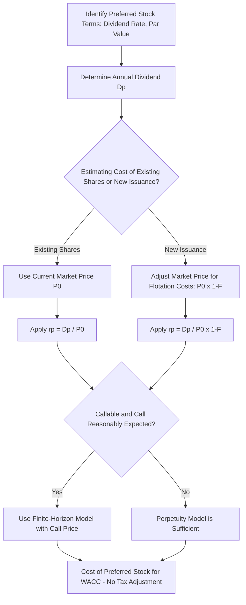

## Cost of Preferred Stock

### Overview

Cost of preferred stock represents the required rate of return demanded by preferred shareholders, and constitutes the third major component (alongside cost of debt and cost of equity) in the Weighted Average Cost of Capital calculation for firms that have preferred shares outstanding. Preferred stock occupies a hybrid position in the capital structure: it shares debt-like characteristics (fixed periodic payments, priority over common equity in liquidation and dividend distribution) while also sharing equity-like characteristics (dividends are not tax-deductible, and preferred stock typically has no maturity date). This hybrid nature makes its cost estimation more straightforward than common equity but distinct from debt in one critical respect — the absence of a tax shield.

### Core Formula

For non-callable, non-convertible, perpetual preferred stock with a fixed dividend, the cost of preferred stock is calculated using the perpetuity valuation formula, since preferred stock is economically a perpetual stream of fixed dividend payments.

$$r_p = \frac{D_p}{P_0}$$

Where:

- $r_p$ = cost of preferred stock
- $D_p$ = annual preferred dividend per share
- $P_0$ = current market price per share of preferred stock

This formula is derived directly from the perpetuity present value formula, $P_0 = \frac{D_p}{r_p}$, rearranged to solve for $r_p$.

**Key Points**

- Unlike interest on debt, preferred dividends are paid from after-tax income and are **not tax-deductible** to the issuing firm in most jurisdictions. Therefore, no tax adjustment is applied to the cost of preferred stock — the formula above already represents the effective cost to the firm.
- This lack of a tax shield makes preferred stock a more expensive source of financing than debt on an after-tax comparative basis, all else being equal, which is a key reason preferred stock is used less extensively than debt in most capital structures.
- The market price $P_0$ should be the current trading price, not the par (face) value, since market price reflects the current risk and return environment demanded by investors.

### Determining the Preferred Dividend

The preferred dividend $D_p$ is typically specified as either a fixed dollar amount per share or as a percentage of par value.

$$D_p = Dividend\ Rate \times Par\ Value$$

**Worked Example**

A firm's preferred stock has a par value of $100, an 8% dividend rate, and currently trades at $95 per share.

$$D_p = 0.08 \times 100 = 8.00 \text{ per share annually}$$

$$r_p = \frac{8.00}{95} = 0.0842 = 8.42\%$$

Note that because the stock trades below par ($95 vs. $100 par), the required return (8.42%) exceeds the stated dividend rate (8%) — this relationship is analogous to a bond trading at a discount yielding more than its coupon rate.

### Adjusting for Flotation Costs

When cost of preferred stock is being estimated for a **new issuance** (rather than as a market-implied rate for existing shares), flotation costs (underwriting fees, legal costs, and other issuance expenses) reduce the net proceeds received by the firm and must be incorporated.

$$r_p = \frac{D_p}{P_0 (1 - F)}$$

Where $F$ is the flotation cost expressed as a percentage of the issue price.

**Worked Example**

Using the prior example, if the firm is issuing new preferred stock at $95 per share with flotation costs of 4%:

$$r_p = \frac{8.00}{95 \times (1 - 0.04)} = \frac{8.00}{95 \times 0.96} = \frac{8.00}{91.20} = 0.0877 = 8.77\%$$

**Key Points**

- Flotation costs increase the effective cost of preferred stock because the firm nets less cash from the issuance while still owing the full stated dividend on the shares outstanding.
- Flotation cost adjustment is only relevant when estimating the cost of *newly issued* preferred stock for a specific financing decision (e.g., in NPV analysis of a project funded partly by a new preferred issuance); it is not used when simply computing an existing security's market-implied cost of capital for overall WACC purposes.

### Special Structural Variations

**Callable Preferred Stock**

If preferred stock is callable (the issuer can redeem it before any stated date, often at a premium to par), and a call is reasonably anticipated within a defined horizon, the analysis shifts from a perpetuity model to a finite-horizon model similar to bond YTM, solving for the rate that equates the current price to the present value of dividends plus the call price.

P_0 = \sum_{t=1}^{n} \frac left. \frac{D_p}{(1+r_p)^t} \right. + \frac{Call\ Price}{(1+r_p)^n}

[Inference] In practice, most preferred stock cost-of-capital estimates for WACC purposes still use the simple perpetuity formula unless a call is imminent and highly likely, since the perpetuity assumption is a reasonable simplification for preferred stock without a clear near-term redemption catalyst.

**Cumulative vs. Non-Cumulative Preferred Stock**

Cumulative preferred stock requires that any skipped dividends accumulate and must be paid before common shareholders receive any dividend. This feature reduces risk to preferred shareholders relative to non-cumulative preferred, and consequently cumulative preferred stock typically trades at a lower required yield (lower cost to the firm) than otherwise-similar non-cumulative preferred stock, all else equal.

**Convertible Preferred Stock**

If preferred stock is convertible into common shares, its market price embeds a conversion option value. Using the simple $D_p / P_0$ formula on convertible preferred stock will understate the true cost of the security, since part of the market price reflects option value rather than pure fixed-income value. [Inference] Estimating the cost of convertible preferred stock more accurately generally requires separating the straight (non-convertible) value component from the embedded option value, which is a more advanced valuation exercise beyond the basic perpetuity approach.

**Adjustable-Rate / Floating-Rate Preferred Stock**

For preferred stock with a dividend rate that resets periodically (often tied to a reference rate), the current dividend rate at the time of the WACC calculation should be used rather than a historical rate, since the cost of this instrument moves with prevailing market rates.

### Comparison: Preferred Stock vs. Debt vs. Common Equity

| Feature | Debt | Preferred Stock | Common Equity |
| --- | --- | --- | --- |
| Payment obligation | Contractually fixed, legally binding | Fixed but discretionary (can be skipped, especially non-cumulative) | Variable, fully discretionary |
| Tax deductibility of payment | Yes (interest) | No | No |
| Priority in liquidation | Highest | Middle | Lowest (residual claim) |
| Typical maturity | Fixed maturity date | Usually perpetual (unless callable) | No maturity |
| Cost formula | YTM, then tax-adjusted | $D_p / P_0$, no tax adjustment | CAPM, DDM, or other equity models |
| Relative cost to firm | Generally lowest | Generally higher than debt | Generally highest |

### Why No Tax Shield on Preferred Dividends

**Key Points**

- From the paying firm's perspective, preferred dividends are distributed from after-tax net income, identical in tax treatment to common stock dividends, despite preferred stock's fixed, debt-like payment structure.
- This is a deliberate feature of most tax codes: only interest — a payment associated with a legally enforceable creditor claim — receives tax-deductible treatment; equity-type claims (common and preferred) do not.
- This tax asymmetry is a central reason firms generally prioritize debt financing over preferred stock when both are otherwise similarly accessible, since debt provides a tax shield that preferred stock does not.

### Role in WACC

$$WACC = w_d \times r_d(1-T) + w_p \times r_p + w_e \times r_e$$

Where:

- $w_p$ = proportion of preferred stock in the firm's total capital structure (at market value)
- $r_p$ = cost of preferred stock (no tax adjustment applied)

**Key Points**

- Preferred stock's weight $w_p$ in the WACC formula should reflect its market value relative to total capital (debt + preferred + common equity), consistent with how debt and equity weights are determined.
- Many firms carry no preferred stock at all, in which case this term drops out of the WACC formula entirely; preferred stock is more common in specific industries, such as banking and utilities, and in specific financing situations, such as private equity or venture capital structuring.

### Process Flow Diagram

### Common Errors to Avoid

**Key Points**

- Applying a tax adjustment to preferred dividends by analogy to debt — this is incorrect, since preferred dividends are not tax-deductible.
- Using par value instead of current market price when the security is publicly traded and market price is available and differs from par.
- Omitting flotation cost adjustment when the calculation's purpose is evaluating a new financing decision (as opposed to computing the firm's current overall cost of capital).
- Treating convertible preferred stock's market price as pure fixed-income value without recognizing the embedded conversion option premium.

### Related Topics

- Cost of debt estimation
- Cost of equity estimation (CAPM, Dividend Discount Model)
- Weighted Average Cost of Capital (WACC) construction
- Capital structure weights: market value vs. book value
- Perpetuity and growing perpetuity valuation
- Convertible securities valuation
- Flotation cost adjustments in capital budgeting
- Hybrid securities and mezzanine financing