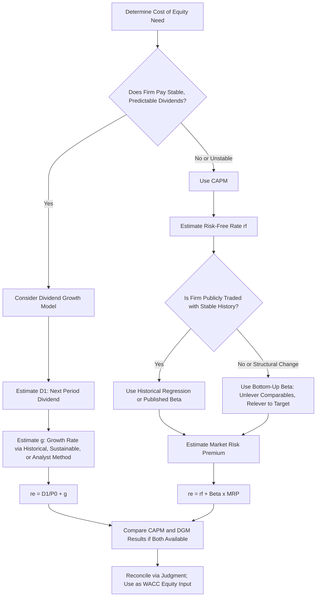

## Cost of Equity Using CAPM and Dividend Growth Approaches

### Overview

Cost of equity represents the return required by common shareholders to compensate them for the risk of holding a firm's stock, and is typically the most challenging component of the Weighted Average Cost of Capital to estimate, since — unlike debt or preferred stock — common equity carries no contractual payment obligation from which a required return can be directly observed. Two dominant methodologies exist for estimating cost of equity: the **Capital Asset Pricing Model (CAPM)**, which derives required return from systematic risk, and the **Dividend Growth Model (DGM)**, also called the Gordon Growth Model, which derives required return from the current market price and expected future dividend stream. Each has distinct assumptions, data requirements, and limitations, and practitioners often calculate both and reconcile differences using judgment.

### Capital Asset Pricing Model (CAPM) Approach

**Core Formula**

$$r_e = r_f + \beta(r_m - r_f)$$

Where:

- $r_e$ = required return on equity (cost of equity)
- $r_f$ = risk-free rate
- $\beta$ = the stock's beta, measuring systematic (non-diversifiable) risk relative to the market
- $r_m$ = expected return on the market portfolio
- $(r_m - r_f)$ = market risk premium (MRP), also called equity risk premium

**Theoretical Basis**

CAPM rests on the principle that investors are compensated only for systematic risk (risk that cannot be eliminated through diversification), not for total risk, since rational, diversified investors can eliminate unsystematic (firm-specific) risk by holding a broad portfolio. Beta measures the sensitivity of a stock's returns to overall market movements — a beta of 1.0 indicates the stock moves in line with the market, a beta above 1.0 indicates greater volatility than the market, and a beta below 1.0 indicates lower volatility than the market.

**Estimating Each Input**

**Risk-Free Rate ($r_f$)**

Typically proxied by the yield on a government security. The choice of maturity should match the investment horizon of the project or valuation being conducted — long-term projects generally use long-term government bond yields (e.g., 10-year or longer), while short-term analyses may use shorter-term instruments.

**Beta ($\beta$)**

Commonly obtained from one of the following sources:

1. **Historical regression beta**: Regressing the stock's historical returns against market index returns over a defined period (commonly 2-5 years of monthly or weekly data).
2. **Published beta** from financial data providers (e.g., Bloomberg, financial data services), often "adjusted" or "smoothed" toward 1.0 using a formula such as the Blume adjustment.
3. **Bottom-up (unlevered/relevered) beta**: Especially useful for private companies, divisions, or firms undergoing significant capital structure change. This method uses comparable publicly traded firms' betas, unlevers them to remove the effect of each comparable's capital structure, averages the unlevered betas, then relevers the average to the target firm's own capital structure.

**Bottom-Up Beta Formula**

$$\beta_{unlevered} = \frac{\beta_{levered}}{1 + (1-T)\left(\frac{D}{E}\right)}$$

$$\beta_{relevered} = \beta_{unlevered} \times \left[1 + (1-T)\left(\frac{D}{E}\right)_{target}\right]$$

**Market Risk Premium ($r_m - r_f$)**

Can be estimated using either a historical approach (long-run average of realized market returns in excess of risk-free returns) or a forward-looking/implied approach (derived from current market valuations and expected growth rates). [Inference] Historical market risk premium estimates vary meaningfully depending on the time period examined, the geometric versus arithmetic averaging method used, and the specific market index selected, so analysts should specify and justify their chosen source and methodology rather than treating this figure as a single universally agreed constant.

**Worked Example**

A firm has a beta of 1.3. The risk-free rate is 4.0%, and the estimated market risk premium is 5.5%.

$$r_e = 4.0\% + 1.3 \times 5.5\% = 4.0\% + 7.15\% = 11.15\%$$

**Bottom-Up Beta Worked Example**

A private firm operates in an industry where three comparable public firms have the following levered betas and debt-to-equity ratios, with a corporate tax rate of 25% for all firms:

| Comparable | Levered Beta | D/E |
| --- | --- | --- |
| Firm X | 1.45 | 0.60 |
| Firm Y | 1.20 | 0.40 |
| Firm Z | 1.35 | 0.50 |

Unlevering each:

$$\beta_{X,unlevered} = \frac{1.45}{1 + (0.75)(0.60)} = \frac{1.45}{1.45} = 1.0000$$

$$\beta_{Y,unlevered} = \frac{1.20}{1 + (0.75)(0.40)} = \frac{1.20}{1.30} = 0.9231$$

$$\beta_{Z,unlevered} = \frac{1.35}{1 + (0.75)(0.50)} = \frac{1.35}{1.375} = 0.9818$$

Average unlevered beta:

$$\beta_{unlevered,avg} = \frac{1.0000 + 0.9231 + 0.9818}{3} = \frac{2.9049}{3} = 0.9683$$

If the private target firm has a target D/E of 0.45:

$$\beta_{relevered} = 0.9683 \times [1 + (0.75)(0.45)] = 0.9683 \times 1.3375 = 1.2951$$

This relevered beta (approximately 1.30) reflects the comparables' industry business risk combined with the target firm's own specific capital structure, and would then be used in the CAPM formula.

### Dividend Growth Model (DGM / Gordon Growth Model) Approach

**Core Formula**

$$r_e = \frac{D_1}{P_0} + g$$

Where:

- $r_e$ = required return on equity
- $D_1$ = expected dividend per share to be paid at the end of the next period
- $P_0$ = current market price per share
- $g$ = constant expected long-term growth rate of dividends

This formula is the algebraic rearrangement of the constant-growth (Gordon Growth) stock valuation model, $P_0 = \frac{D_1}{r_e - g}$, solved for $r_e$.

**Estimating $D_1$**

If only the current dividend $D_0$ is known, $D_1$ is projected forward using the expected growth rate:

$$D_1 = D_0 \times (1+g)$$

**Estimating $g$**

Growth rate can be estimated through several methods:

1. **Historical dividend growth rate**: Computing the compound annual growth rate of dividends over a historical window.
2. **Sustainable growth rate**: $g = ROE \times Retention\ Ratio$, where Retention Ratio $= 1 - Payout\ Ratio$.
3. **Analyst consensus forecasts**: Using published analyst long-term earnings/dividend growth estimates.

**Worked Example**

A stock currently pays an annual dividend of $2.00 per share ($D_0$), trades at $40.00 per share, and dividends are expected to grow at a constant rate of 5% indefinitely.

$$D_1 = 2.00 \times 1.05 = 2.10$$

$$r_e = \frac{2.10}{40.00} + 0.05 = 0.0525 + 0.05 = 0.1025 = 10.25\%$$

**Sustainable Growth Rate Example**

A firm has ROE of 15% and a dividend payout ratio of 40%.

$$Retention\ Ratio = 1 - 0.40 = 0.60$$

$$g = 0.15 \times 0.60 = 0.09 = 9.0\%$$

**Key Points**

- The DGM requires the firm to currently pay dividends and to be expected to continue doing so in a stable, predictable growth pattern — it is not applicable to non-dividend-paying firms (common among high-growth technology firms) or firms with highly volatile or unpredictable dividend policies.
- The model is highly sensitive to the growth rate assumption, particularly as $g$ approaches $r_e$, since the denominator $(r_e - g)$ approaches zero, causing implied cost of equity (or valuation) to swing dramatically for small changes in $g$.
- The constant-growth assumption is a simplification; firms with irregular or multi-stage expected dividend growth require a multi-stage DGM variant, which segments the forecast into distinct growth phases before converging to a stable terminal growth rate.

### Comparison of CAPM vs. DGM

| Factor | CAPM | Dividend Growth Model |
| --- | --- | --- |
| Data required | Risk-free rate, beta, market risk premium | Current price, current/expected dividend, growth rate |
| Applicable to non-dividend payers | Yes | No |
| Sensitivity to key input | Sensitive to beta and market risk premium estimates | Highly sensitive to growth rate assumption, especially as $g \to r_e$ |
| Theoretical grounding | Modern portfolio theory; compensates only for systematic risk | Simple present value of expected cash flows to equity holders |
| Forward-looking element | Market risk premium can be historical or forward-looking | Growth rate is inherently a forward-looking estimate |
| Common use case | Most widely used in practice across all firm types | Best suited to stable, mature, dividend-paying firms (e.g., utilities) |

**Key Points**

- CAPM is more broadly applicable across firm types (including non-dividend payers) and is the more commonly used method in general corporate finance and valuation practice.
- When both methods are calculable for the same firm, analysts often compute both as a cross-check; a large divergence between the two estimates signals that at least one method's underlying assumptions (beta stability, growth rate constancy) may not hold well for that particular firm, warranting further investigation rather than an automatic averaging of the two results.
- [Inference] Some practitioners average CAPM and DGM estimates when both are reasonably reliable and produce similar results, though this is a pragmatic convention rather than a theoretically derived rule, and averaging results that diverge substantially can mask rather than resolve the underlying estimation uncertainty.

### Multi-Stage Dividend Growth Model (Brief Extension)

For firms expected to experience a period of above-normal growth before settling into stable long-term growth, the value (and implied cost of equity) incorporates distinct growth phases:

$$P_0 = \sum_{t=1}^{n} \frac{D_0(1+g_{high})^t}{(1+r_e)^t} + \frac{\frac{D_n(1+g_{stable})}{r_e - g_{stable}}}{(1+r_e)^n}$$

Where $g_{high}$ applies during the explicit high-growth forecast period (years 1 through $n$) and $g_{stable}$ applies to the terminal (perpetual) value calculated at the end of year $n$. Solving this equation for $r_e$ generally requires iterative or numerical methods rather than a simple closed-form rearrangement, since $r_e$ appears in both the explicit-period discounting and the terminal value denominator.

### Process Flow Diagram

### Common Errors to Avoid

**Key Points**

- Applying the Dividend Growth Model to firms that do not pay dividends, or applying it with an unsustainable growth rate assumption (e.g., $g$ exceeding the long-term nominal GDP growth rate, which is generally not sustainable in perpetuity).
- Using a levered beta from a comparable firm with a very different capital structure without unlevering and relevering it to the target firm's own structure.
- Mismatching the risk-free rate maturity with the investment horizon (e.g., using a short-term Treasury bill yield for a 20-year project valuation).
- Using a market risk premium estimate without disclosing or being consistent about whether it is historical or forward-looking, and over what time period it was measured, since these choices produce materially different premium estimates.
- Treating $g$ as a precise, known figure rather than an estimate subject to meaningful uncertainty, especially given the DGM's sensitivity near $r_e \approx g$.

### Related Topics

- Cost of debt estimation
- Cost of preferred stock
- Weighted Average Cost of Capital (WACC) construction
- Beta estimation: levered vs. unlevered, historical vs. bottom-up
- Market risk premium estimation methods
- Multi-stage dividend discount models
- Arbitrage Pricing Theory (APT) and multi-factor models as CAPM alternatives
- Build-up method for cost of equity in private company valuation