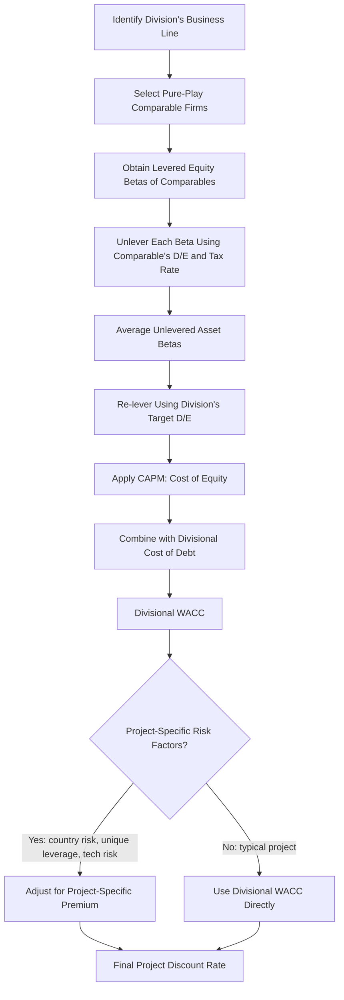

## Divisional and Project Specific Discount Rates

### Overview

Using a single firm-wide **weighted average cost of capital (WACC)** to evaluate all projects is only valid when every project shares the firm's average risk. In practice, firms operate multiple divisions or evaluate individual projects with systematically different risk profiles, capital structures, or industry exposures than the firm as a whole. Applying the firm-wide WACC to such projects causes **capital misallocation**: low-risk divisions are underfunded (discounted too harshly) and high-risk divisions are overfunded (discounted too leniently).

### Why a Single Corporate WACC Is Insufficient

**Key Points**

- Firm-wide WACC reflects the *average* systematic risk of the firm's existing asset portfolio
- A conglomerate with a low-risk utility division and a high-risk technology division has a blended WACC that misrepresents both
- Using the blended rate causes a **cross-subsidization effect**: the risky division's projects look artificially attractive (discounted at too low a rate), while the safe division's projects look artificially unattractive (discounted at too high a rate)
- Over time, capital drifts toward riskier divisions, systematically increasing the firm's overall risk profile beyond what shareholders intended

**[Inference]** This cross-subsidization dynamic is a widely cited rationale in the corporate finance literature for divisional cost of capital, though the magnitude of real-world misallocation is difficult to observe directly and is typically demonstrated through stylized examples rather than large-sample empirical measurement.

### The Pure-Play (Comparable Company) Method

**Key Points**

- The most common approach to estimating a **divisional cost of capital**
- Identify publicly traded "pure-play" companies operating solely (or primarily) in the same line of business as the division
- Use those comparables' **equity betas**, unlever them to remove the comparable firm's capital structure effect, average the unlevered (asset) betas, then re-lever using the division's (or parent's) target capital structure

**Formula: Unlevering Beta (Hamada Equation, no taxes on debt beta assumption)**

$$\beta_{Asset} = \frac{\beta_{Equity}}{1 + (1 - T_c)\left(\dfrac{D}{E}\right)}$$

Where:

- $\beta_{Asset}$ = unlevered (asset) beta, reflecting pure business risk
- $\beta_{Equity}$ = observed levered equity beta of the comparable firm
- $T_c$ = comparable firm's marginal tax rate
- $D/E$ = comparable firm's debt-to-equity ratio

**Formula: Re-levering Beta for the Division/Project**

$$\beta_{Equity,\,Division} = \beta_{Asset} \times \left[1 + (1 - T_c)\left(\dfrac{D}{E}\right)_{Division}\right]$$

The re-levered beta uses the division's own target $D/E$ ratio, not the comparable company's capital structure.

**Steps**

1. Identify 3–6 pure-play comparable firms in the division's industry
2. Obtain each comparable's levered equity beta (from historical regression or a beta service)
3. Unlever each comparable's beta using its own $D/E$ and tax rate
4. Average the unlevered betas (arithmetic mean is standard; some practitioners weight by market cap)
5. Re-lever the averaged asset beta using the division's target $D/E$ ratio
6. Apply CAPM to obtain the division's cost of equity
7. Combine with the division's target cost of debt to compute a divisional WACC

**Example**

A conglomerate's semiconductor division needs a divisional discount rate. Three pure-play semiconductor firms have levered betas of 1.40, 1.55, and 1.30, with $D/E$ ratios of 0.25, 0.30, and 0.20 respectively, and a 25% tax rate.

Unlevering each:

$$\beta_{Asset,1} = \frac{1.40}{1 + 0.75(0.25)} = \frac{1.40}{1.1875} = 1.179$$

$$\beta_{Asset,2} = \frac{1.55}{1 + 0.75(0.30)} = \frac{1.55}{1.225} = 1.265$$

$$\beta_{Asset,3} = \frac{1.30}{1 + 0.75(0.20)} = \frac{1.30}{1.15} = 1.130$$

Average unlevered beta $\approx 1.191$. Re-levering at the division's target $D/E$ of 0.35:

$$\beta_{Equity,Division} = 1.191 \times [1 + 0.75(0.35)] = 1.191 \times 1.2625 \approx 1.503$$

This re-levered beta feeds into CAPM to derive the division's cost of equity, distinct from the parent's consolidated beta.

### CAPM Application at the Divisional Level

$$r_e = r_f + \beta_{Division} \times \left(r_m - r_f\right)$$

Where $r_f$ is the risk-free rate, $\beta_{Division}$ is the re-levered divisional beta, and $(r_m - r_f)$ is the market equity risk premium. The division's cost of debt should similarly reflect its own credit risk (via a synthetic credit rating based on divisional interest coverage, if not separately rated) rather than the parent's consolidated cost of debt.

### The Full-Information Beta (Fama-French / Kaplan-Peterson) Approach

**Key Points**

- An alternative when pure-play comparables are scarce or when divisions overlap multiple industries
- Uses regression across many multi-segment firms to decompose observed conglomerate betas into implied industry-segment betas, weighted by each segment's revenue or asset share
- **[Inference]** This approach is more statistically robust when clean single-segment comparables don't exist, but it requires access to detailed segment-level data across a large cross-section of firms and is less commonly applied in standard corporate practice than the simpler pure-play method

### Risk-Adjusted Discount Rate Method (Subjective Risk Classes)

**Key Points**

- Used when reliable pure-play comparables are unavailable (e.g., a genuinely novel project or an internal R&D initiative)
- The firm classifies projects into subjective risk categories (e.g., "cost reduction," "expansion of existing business," "new product/market," "speculative venture") and assigns a discount rate adjustment to each category relative to the firm's base WACC

| Risk Category | Example | Typical Adjustment |
| --- | --- | --- |
| Cost reduction / replacement | Equipment upgrade in existing operations | WACC − 1% to 2% |
| Expansion of existing business | New store in an existing market | WACC (base rate) |
| New product / new market | Entering an adjacent product line | WACC + 2% to 4% |
| Speculative / new venture | Unproven technology, new geography | WACC + 5% or more |

**[Speculation]** Because these adjustments are set judgmentally rather than derived from market data, this method is more prone to inconsistency across firms and over time, and it is generally viewed as a pragmatic fallback rather than a theoretically rigorous solution.

### Divisional Capital Structure Considerations

**Key Points**

- Divisions do not have their own publicly traded securities, so their "capital structure" for WACC purposes is typically a **target/notional structure**, often based on:
  - The typical capital structure of the pure-play comparable industry, or
  - An internally assigned notional debt capacity based on the division's asset risk, cash flow stability, and tangibility of assets
- More stable, asset-heavy divisions (e.g., real estate, utilities) can typically support higher notional leverage than volatile, asset-light divisions (e.g., software, biotech)

### Project-Specific vs. Divisional Discount Rates

**Key Points**

- **Divisional discount rates** apply to the ongoing, "typical" risk of a division's regular capital budgeting activity
- **Project-specific discount rates** go a step further, adjusting for risk characteristics unique to an individual project even within a division — such as:
  - Country/political risk (for cross-border projects)
  - Technology risk (unproven vs. mature technology)
  - Operating leverage differences from the division's typical projects
  - Financing risk (project-specific leverage, e.g., project finance structures with high, ring-fenced debt)

**Example**

A domestic utility division normally uses a divisional WACC of 6%. It is now evaluating a wind farm project in a politically unstable foreign jurisdiction, financed with 70% project-level debt (versus the division's typical 40%). The project discount rate should reflect both the added country risk premium and the different capital structure — not simply reuse the 6% divisional rate.

### Country Risk Premium Adjustment

For cross-border projects, a common adjustment adds a **country risk premium (CRP)** to the CAPM cost of equity:

$$r_e = r_f + \beta_{Division} \times \left(r_m - r_f\right) + CRP$$

Where $CRP$ is often estimated from sovereign bond default spreads, sometimes adjusted by the relative volatility of the local equity market to the local bond market:

$$CRP_{adjusted} = \text{Sovereign Default Spread} \times \left(\frac{\sigma_{equity}}{\sigma_{bond}}\right)$$

**[Inference]** This adjusted CRP formulation (associated with Aswath Damodaran's work) is a widely taught heuristic in practitioner and academic settings, but it is one of several competing methods for incorporating country risk, and reasonable practitioners disagree on whether country risk is fully diversifiable to a globally diversified investor.

### Diagram: Divisional Discount Rate Derivation Process

### Common Pitfalls

**Key Points**

- Using the parent firm's consolidated beta for all divisions (ignores risk heterogeneity)
- Using comparable firms' *actual* capital structure instead of re-levering to the division's target structure
- Failing to adjust the comparable's beta for differences in tax rates between jurisdictions
- Applying purely subjective risk adjustments without any market-based anchor, leading to inconsistent capital allocation across the firm over time
- Ignoring operating leverage differences: two firms in the same industry can have different asset betas if their fixed-cost structures differ significantly

### Conclusion

Divisional and project-specific discount rates correct a fundamental flaw in single-WACC capital budgeting: not all cash flows a firm evaluates carry the same systematic risk. The pure-play method, grounded in unlevering and re-levering comparable firms' betas, provides the most theoretically defensible approach when suitable comparables exist. Where they do not, firms fall back on subjective risk-class adjustments, and cross-border or uniquely structured projects require further adjustments for country risk and project-specific financing. Correctly matching the discount rate to the risk of the cash flow being evaluated is essential to avoiding systematic capital misallocation across a diversified firm.

**Related Topics**

- CAPM and the security market line
- Unlevering and re-levering beta (Hamada equation)
- Weighted average cost of capital (WACC) estimation
- Country risk premium and cross-border capital budgeting
- Pure-play method vs. accounting beta method
- Capital structure theory and target leverage ratios
- Real options in capital budgeting under project-specific uncertainty
- Segment reporting and full-information beta estimation