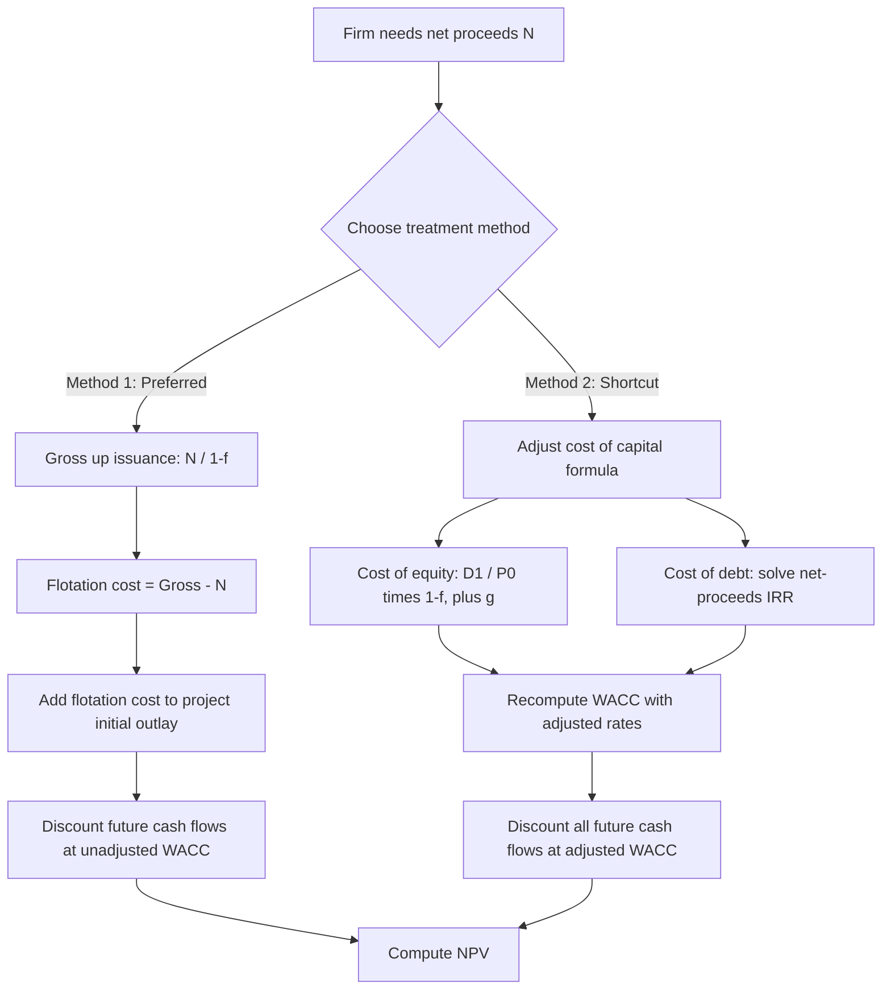

## Flotation Costs and Tax Adjustments

### Definition and Conceptual Overview

Flotation costs are the expenses a firm incurs when issuing new securities (equity or debt) to raise external capital. These include underwriting fees, legal fees, registration fees, and other issuance-related costs. Because flotation costs reduce the net proceeds a firm actually receives, they create a wedge between the "sticker price" cost of capital investors require and the true effective cost of capital to the firm raising funds.

Tax adjustments enter cost of capital analysis primarily through the deductibility of interest expense (creating the after-tax cost of debt) and, more narrowly, through the tax treatment of flotation costs themselves, which some jurisdictions allow to be amortized and deducted over time.

### Why Flotation Costs Matter

**Key Points**

- Flotation costs are a *one-time* cash outflow at the time of issuance, not a recurring cost.
- They should generally be treated as part of the initial investment outlay in capital budgeting (adjusting the project's initial cost), rather than permanently inflating the cost of capital used to discount all future cash flows.
- Incorporating flotation costs into the discount rate itself is a common but technically imprecise shortcut — it implicitly assumes the firm re-issues securities every period, which overstates the true cost over the life of a long-lived project. [Inference — this is the standard corporate finance critique found in most textbook treatments, e.g., Brealey/Myers/Allen and Ross/Westerfield/Jaffe]

### Two Methods for Handling Flotation Costs

#### Method 1: Adjusting the Initial Investment (Preferred/Correct Approach)

Flotation costs are added to the initial capital outlay of the project being financed, and the cost of capital (WACC or component costs) is left unadjusted.

$$\text{Adjusted Initial Investment} = \text{Initial Investment} + \text{Flotation Costs}$$

Flotation costs on a specific issuance are typically calculated as:

$$F_{\$} = f \times \text{Amount Raised (Gross)}$$

where $f$ is the flotation cost percentage.

Since the amount actually usable by the firm is the gross proceeds minus flotation costs, if a firm needs to net a specific amount $N$ for the project, it must gross up the issuance:

$$\text{Gross Amount to Raise} = \dfrac{N}{1 - f}$$

**Example**

A firm needs $10,000,000 net proceeds for a project. The investment bank charges a flotation cost of 5% on new equity.

$$\text{Gross Amount to Raise} = \dfrac{10{,}000{,}000}{1 - 0.05} = \dfrac{10{,}000{,}000}{0.95} = \$10{,}526{,}316$$

Flotation cost in dollars:

$$F_{\$} = 10{,}526{,}316 - 10{,}000{,}000 = \$526{,}316$$

This $526,316 is added to the project's initial outlay when computing NPV, not baked into the discount rate.

#### Method 2: Adjusting the Cost of Capital (Common Shortcut)

Some practitioners incorporate flotation costs directly into the component cost of capital by reducing net proceeds in the cost formula. This is most frequently applied to the cost of new equity via the Dividend Discount Model (Gordon Growth Model).

**Cost of New Equity (with flotation costs), DDM approach:**

$$r_e = \dfrac{D_1}{P_0(1 - f)} + g$$

where:

- $D_1$ = expected dividend next period
- $P_0$ = current market price per share
- $f$ = flotation cost as a percentage of issue price
- $g$ = constant dividend growth rate

**Example**

- $D_1 = \$2.00$
- $P_0 = \$40$
- $g = 5\%$
- $f = 8\%$

$$r_e = \dfrac{2.00}{40(1 - 0.08)} + 0.05 = \dfrac{2.00}{36.80} + 0.05 = 0.0543 + 0.05 = 10.43\%$$

Compare this to the cost of equity *without* flotation adjustment:

$$r_e = \dfrac{2.00}{40} + 0.05 = 0.05 + 0.05 = 10.00\%$$

The flotation-adjusted cost (10.43%) is higher, reflecting the reduced net proceeds per share.

**Cost of New Debt (with flotation costs):**

For debt, flotation costs reduce net proceeds from a bond issue. The after-tax cost of new debt can be found by solving for the yield that equates net proceeds to the present value of after-tax interest and principal payments, or via an approximation:

$$r_d \approx \dfrac{C(1 - T) + \dfrac{F_{\$}}{n}}{\dfrac{P_0(1-f) + F_v}{2}}$$

[Inference — this is an approximation formula variant; exact treatment requires solving the bond's net-proceeds IRR, since textbooks differ on whether flotation cost amortization is included in the numerator]

More rigorously, the pre-tax cost of debt with flotation costs is the discount rate $r_d$ that solves:

$$P_0(1 - f) = \sum_{t=1}^{n} \dfrac{C_t}{(1+r_d)^t} + \dfrac{F_v}{(1+r_d)^n}$$

where $C_t$ is the coupon payment, $F_v$ is face value, and $n$ is periods to maturity. The after-tax cost is then $r_d(1-T)$.

### Tax Treatment of Flotation Costs

**Key Points**

- Flotation costs are generally **not** immediately tax-deductible as a lump sum in most tax jurisdictions; instead, many tax codes (e.g., the U.S. Internal Revenue Code for corporate bond issuance costs) require these costs to be **capitalized and amortized** on a straight-line basis over the life of the security (for debt) or treated as a reduction of additional paid-in capital (for equity, which is generally not tax-deductible at all). [Unverified — specific tax treatment is jurisdiction- and instrument-dependent, and firms should consult current tax code and a tax advisor for precise treatment]
- **Equity flotation costs**: typically **not tax-deductible**. They usually reduce the net proceeds recorded against paid-in capital on the balance sheet with no direct income-statement tax shield.
- **Debt flotation costs**: often amortized over the life of the bond and deducted as a non-cash expense each period, similar to amortizing a discount or premium, creating a small tax shield.

**Amortized Flotation Cost Tax Shield (Debt Example)**

If flotation costs of $F_{\$}$ on a bond are amortized straight-line over $n$ years, the annual amortization expense is:

$$\text{Annual Amortization} = \dfrac{F_{\$}}{n}$$

The annual tax shield from this amortization is:

$$\text{Tax Shield}_t = \dfrac{F_{\$}}{n} \times T$$

where $T$ is the marginal corporate tax rate. This tax shield is a cash inflow (via reduced taxes) that can be incorporated into the effective after-tax cost of debt calculation, though many introductory treatments ignore this refinement due to its typically small magnitude relative to overall project cash flows.

### The After-Tax Cost of Debt — Baseline Tax Adjustment

Even setting flotation costs aside, the *primary* tax adjustment in cost of capital is the deductibility of interest expense itself:

$$r_d^{\text{after-tax}} = r_d^{\text{pre-tax}} \times (1 - T)$$

**Example**

A firm's pre-tax cost of debt is 7%, and its marginal tax rate is 25%.

$$r_d^{\text{after-tax}} = 0.07 \times (1 - 0.25) = 0.07 \times 0.75 = 5.25\%$$

This after-tax figure is what enters the WACC formula, since interest is tax-deductible while dividend and equity returns are not:

$$WACC = \dfrac{E}{V} r_e + \dfrac{D}{V} r_d (1 - T)$$

### Combined Example: Flotation Costs + Tax Adjustment in WACC

A firm is evaluating a $50,000,000 project financed with 60% equity and 40% debt.

- Cost of equity (no flotation): $r_e = 12\%$; flotation cost on equity $f_e = 6\%$
- Cost of debt (pre-tax, no flotation): $r_d = 6\%$; flotation cost on debt $f_d = 3\%$
- Tax rate $T = 25\%$

**Step 1 — Flotation-adjusted cost of equity** (using DDM-style adjustment, assuming $D_1/P_0 = 8\%$ portion of the 12% and $g = 4\%$):

$$r_e^{adj} = \dfrac{0.08}{1 - 0.06} + 0.04 = 0.0851 + 0.04 = 12.51\%$$

**Step 2 — Flotation-adjusted, after-tax cost of debt** (approximate, ignoring amortization tax shield):

$$r_d^{adj} = \dfrac{0.06}{1 - 0.03} = 6.19\% \text{ pre-tax}$$

$$r_d^{adj, after-tax} = 6.19\% \times (1 - 0.25) = 4.64\%$$

**Step 3 — WACC using flotation-adjusted rates:**

$$WACC = 0.60(12.51\%) + 0.40(4.64\%) = 7.51\% + 1.86\% = 9.37\%$$

**Step 4 — Total flotation cost added to initial outlay (preferred method), computed separately:**

Equity portion raised: $0.60 \times 50{,}000{,}000 = 30{,}000{,}000$ net needed

Gross equity raised: $30{,}000{,}000 / (1-0.06) = 31{,}914{,}894$

Flotation cost on equity: $1{,}914{,}894$

Debt portion raised: $0.40 \times 50{,}000{,}000 = 20{,}000{,}000$ net needed

Gross debt raised: $20{,}000{,}000 / (1-0.03) = 20{,}618{,}557$

Flotation cost on debt: $618{,}557$

Total flotation cost: $1{,}914{,}894 + 618{,}557 = \$2{,}533{,}451$

**Note**: Using *both* Method 1 (grossing up the outlay) and Method 2 (adjusting the discount rate) simultaneously double-counts flotation costs. In practice, a firm should choose one approach — the academically preferred approach is Method 1 (adjust initial investment only), while Method 2 is a simplification sometimes used when the incremental financing decision and the specific project cannot be cleanly separated.

### Process Flow Diagram

### Common Pitfalls

**Key Points**

- Double-counting: applying flotation adjustment to both the discount rate and the initial outlay overstates the project's cost.
- Treating flotation costs as a perpetual annual cost — they are a one-time cash outflow at issuance.
- Ignoring that flotation costs differ by security type: equity flotation costs are typically higher (as a percentage) than debt flotation costs due to greater underwriting risk and marketing effort.
- Applying flotation-adjusted cost of equity to *all* future capital budgeting decisions rather than only to the specific new-issue-financed project. [Inference — a conceptual point emphasized in most corporate finance pedagogy, since flotation costs pertain to marginal financing decisions, not the firm's permanent capital structure]
- Assuming flotation costs are always tax-deductible in the year incurred; behavior varies by instrument and jurisdiction, and firms should confirm treatment with current tax regulations, as tax code provisions are subject to change.

### Practical Formula Summary

| Concept | Formula |
| --- | --- |
| Gross amount to raise | $\text{Gross} = N / (1-f)$ |
| Flotation cost ($) | $F_\$ = f \times \text{Gross}$ |
| Cost of new equity (DDM, flotation-adjusted) | $r_e = D_1 / [P_0(1-f)] + g$ |
| After-tax cost of debt (no flotation) | $r_d(1-T)$ |
| Annual flotation amortization (debt) | $F_\$ / n$ |
| Annual tax shield from amortized flotation | $(F_\$ / n) \times T$ |

### Related Topics

- Weighted Average Cost of Capital (WACC) construction and marginal cost of capital schedules
- Cost of preferred stock with flotation costs
- Marginal cost of capital (MCC) breakpoints and the impact of flotation costs on breakpoint calculation
- Net Present Value (NPV) analysis incorporating financing side-effects (Adjusted Present Value / APV method)
- Capital structure theory: trade-off theory and pecking order theory in relation to issuance costs
- Rights offerings vs. public offerings and their differing flotation cost structures
- Debt issuance costs under ASC 835-30 (U.S. GAAP) and IFRS 9 amortized cost treatment