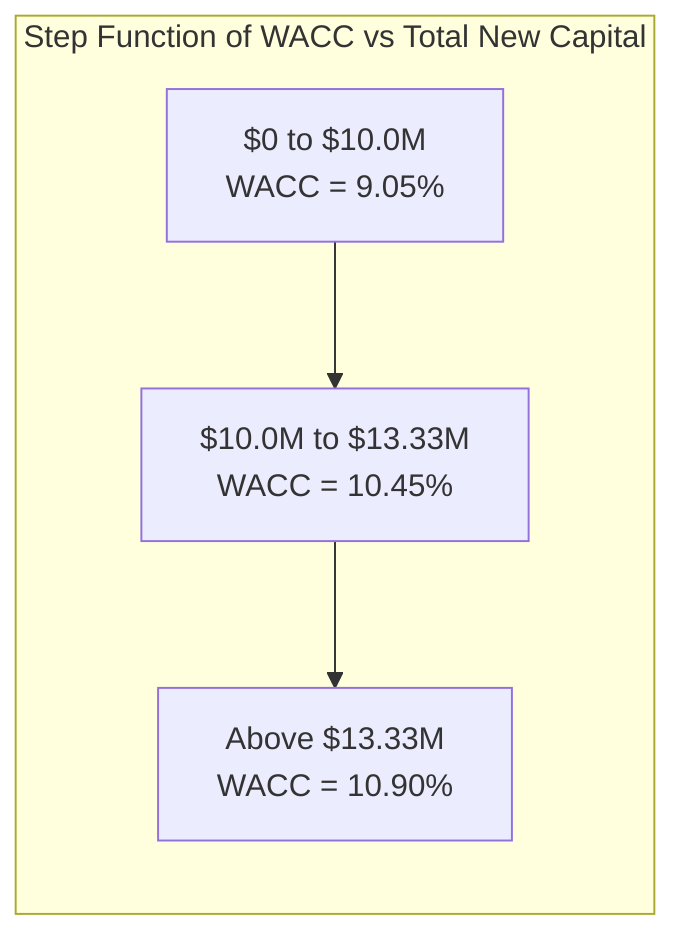
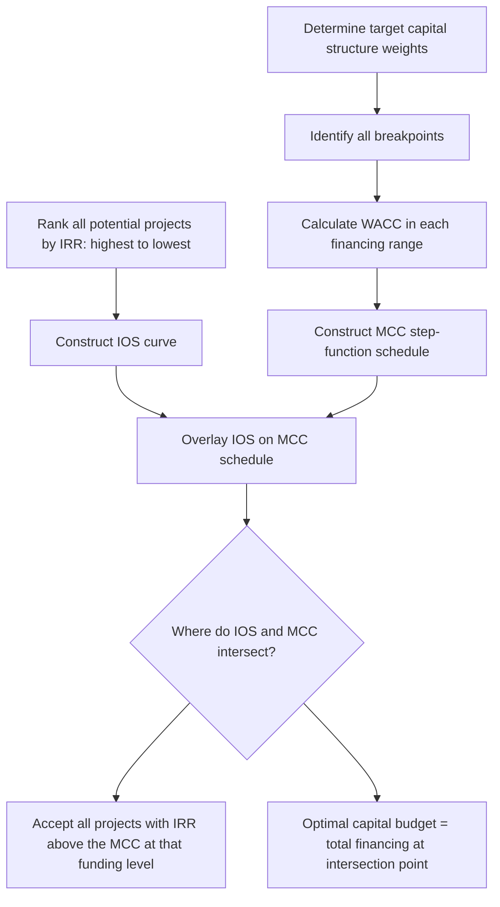

## Marginal Cost of Capital Schedules

### Definition and Conceptual Overview

The Marginal Cost of Capital (MCC) is the cost of the *next dollar* of new capital a firm raises, as opposed to the average cost of capital already on its books. As a firm raises progressively larger amounts of new financing, the cost of each component (debt, preferred stock, common equity) tends to rise — because cheaper sources of funds (like retained earnings) are exhausted, and the firm must tap more expensive sources (like new equity issuance), and because lenders and investors demand higher returns to compensate for the increased financial risk of a more heavily levered or rapidly growing firm.

The **MCC schedule** is a graphical or tabular representation of how the WACC changes as the total amount of new capital raised increases. It plots WACC (y-axis) against total new financing (x-axis), typically as an upward-sloping step function.

### Why WACC Rises with More Financing

**Key Points**

- Retained earnings are a limited, "free" (no flotation cost) source of equity capital — once exhausted, the firm must issue new common stock, which carries flotation costs and often a higher required return.
- Debt capacity is finite: as a firm raises more debt relative to its equity base, its default risk increases, pushing up the interest rate lenders demand and potentially increasing the cost of equity too (financial risk premium).
- Flotation costs on new security issues (see prior module) further raise the effective cost of newly raised external capital compared to internally generated funds.

### Breakpoints: The Core Mechanic

A **breakpoint** is the level of total new financing at which the cost of one or more capital components increases (i.e., where the firm exhausts a cheaper source and must move to a more expensive one). The MCC schedule is a series of these breakpoints.

**General Breakpoint Formula**

$$BP_j = \dfrac{\text{Total amount of lower-cost source } j \text{ available}}{\text{Target weight of that source in capital structure}}$$

More formally, for a specific capital component:

$$BP = \dfrac{AF_j}{w_j}$$

where:

- $AF_j$ = amount of funds available from source $j$ at its current (lower) cost before the cost increases
- $w_j$ = the target capital structure weight for that source

**Example — Retained Earnings Breakpoint**

A firm has a target capital structure of 40% debt, 60% equity. It expects to generate $6,000,000 in retained earnings this year, all of which can be used as the "cheap" equity source before it must issue new common stock (which costs more due to flotation costs).

$$BP_{RE} = \dfrac{6{,}000{,}000}{0.60} = \$10{,}000{,}000$$

This means the firm can raise up to $10,000,000 in *total* new capital (combining the 60% equity portion sourced from retained earnings and the 40% debt portion) before it exhausts retained earnings and must switch to more expensive new common equity.

### Constructing an MCC Schedule — Step by Step

**Step 1: Determine the target capital structure weights.**

Example: 40% Debt, 10% Preferred Stock, 50% Common Equity.

**Step 2: Identify all breakpoints — for each capital component, where does the marginal cost change?**

Each source may have multiple "tiers" (e.g., debt might be cheap up to a certain amount, then require a higher coupon beyond that due to increased default risk).

**Step 3: Calculate the component cost at each tier.**

**Step 4: Calculate the breakpoint (total new financing level) for each tier using $BP = AF_j / w_j$.**

**Step 5: Order the breakpoints from smallest to largest.**

**Step 6: Recompute WACC at each interval between breakpoints using the applicable marginal component costs.**

**Step 7: Plot/tabulate WACC as a step function against total new capital raised.**

### Worked Example

A firm's target capital structure: 30% Debt, 70% Common Equity. Tax rate $T = 25\%$.

**Debt tiers:**

- Up to $4,000,000 in new debt: pre-tax cost = 6%
- Above $4,000,000: pre-tax cost = 8% (higher risk premium)

**Equity tiers:**

- Retained earnings available: $7,000,000, cost = 11%
- New common stock (after retained earnings exhausted): cost = 13% (due to flotation costs)

**Step 1 — Debt breakpoint:**

$$BP_{Debt} = \dfrac{4{,}000{,}000}{0.30} = \$13{,}333{,}333$$

**Step 2 — Equity (retained earnings) breakpoint:**

$$BP_{RE} = \dfrac{7{,}000{,}000}{0.70} = \$10{,}000{,}000$$

**Step 3 — Order breakpoints:**

$$BP_1 = \$10{,}000{,}000 \text{ (equity switches from RE to new stock)}$$

BP_2 = \$13{,}333{,}333 \text{ (debt switches from 6% to 8%)}

**Step 4 — Compute WACC in each range**

*Range 1: $0 to $10,000,000* (cheap debt + retained earnings)

$$r_d^{after-tax} = 0.06(1-0.25) = 4.50\%$$

$$WACC_1 = 0.30(4.50\%) + 0.70(11\%) = 1.35\% + 7.70\% = 9.05\%$$

*Range 2: $10,000,000 to $13,333,333* (cheap debt + new common stock)

$$WACC_2 = 0.30(4.50\%) + 0.70(13\%) = 1.35\% + 9.10\% = 10.45\%$$

*Range 3: above $13,333,333* (expensive debt + new common stock)

$$r_d^{after-tax} = 0.08(1-0.25) = 6.00\%$$

$$WACC_3 = 0.30(6.00\%) + 0.70(13\%) = 1.80\% + 9.10\% = 10.90\%$$

**Resulting MCC Schedule (tabular form):**

| Total New Capital Range | WACC |
| --- | --- |
| $0 – $10,000,000 | 9.05% |
| $10,000,000 – $13,333,333 | 10.45% |
| Above $13,333,333 | 10.90% |

### MCC Schedule Visualization

### MCC Curve (SVG)

<svg xmlns="http://www.w3.org/2000/svg" viewBox="0 0 640 400">
<text x="320" y="24" text-anchor="middle" font-size="16" font-weight="bold" fill="#1a1a1a">Marginal Cost of Capital Schedule (svg_diagram)</text>
<line x1="70" y1="340" x2="600" y2="340" stroke="#333" stroke-width="2" />
<line x1="70" y1="340" x2="70" y2="50" stroke="#333" stroke-width="2" />
<text x="335" y="375" text-anchor="middle" font-size="13" fill="#333">Total New Capital Raised ($)</text>
<text x="25" y="195" text-anchor="middle" font-size="13" fill="#333" transform="rotate(-90 25,195)">WACC (%)</text>
<line x1="70" y1="280" x2="260" y2="280" stroke="#2563eb" stroke-width="3" />
<line x1="260" y1="280" x2="260" y2="220" stroke="#2563eb" stroke-width="1.5" stroke-dasharray="4,3" />
<line x1="260" y1="220" x2="360" y2="220" stroke="#2563eb" stroke-width="3" />
<line x1="360" y1="220" x2="360" y2="180" stroke="#2563eb" stroke-width="1.5" stroke-dasharray="4,3" />
<line x1="360" y1="180" x2="580" y2="180" stroke="#2563eb" stroke-width="3" />
<line x1="260" y1="340" x2="260" y2="220" stroke="#999" stroke-width="1" stroke-dasharray="3,3" />
<line x1="360" y1="340" x2="360" y2="180" stroke="#999" stroke-width="1" stroke-dasharray="3,3" />

<text x="260" y="358" text-anchor="middle" font-size="11" fill="#333">$10.0M</text>

<text x="360" y="358" text-anchor="middle" font-size="11" fill="#333">$13.33M</text>

<text x="165" y="270" text-anchor="middle" font-size="12" fill="`#1e40af`">9.05%</text>

<text x="310" y="210" text-anchor="middle" font-size="12" fill="`#1e40af`">10.45%</text>

<text x="470" y="170" text-anchor="middle" font-size="12" fill="`#1e40af`">10.90%</text>

<text x="165" y="300" text-anchor="middle" font-size="10" fill="#666">Retained Earnings + Cheap Debt</text>

<text x="310" y="245" text-anchor="middle" font-size="10" fill="#666">New Equity + Cheap Debt</text>

<text x="470" y="205" text-anchor="middle" font-size="10" fill="#666">New Equity + Costly Debt</text>

</svg>

### Applying the MCC Schedule to Capital Budgeting: The IOS Overlay

The MCC schedule is used alongside the firm's **Investment Opportunity Schedule (IOS)** — a ranking of potential projects by their internal rate of return (IRR), from highest to lowest — to determine the firm's optimal capital budget.

**Decision Rule**: A firm should accept all projects for which project IRR exceeds the marginal cost of capital *at that level of total financing*. The intersection of the IOS curve and the MCC schedule identifies the optimal capital budget and the appropriate discount rate (hurdle rate) to use for projects financed at that point.

### Key Considerations and Refinements

**Key Points**

- The MCC schedule assumes the target capital structure remains constant as the firm raises more capital — in practice, firms may deviate from target weights temporarily, which complicates real-world application. [Inference — a standard caveat raised in corporate finance texts regarding the simplifying assumptions of the MCC/IOS framework]
- Breakpoints can occur for *any* capital component, not just equity — debt covenants, credit rating thresholds, and lender risk limits can all create debt breakpoints.
- In practice, firms rarely have crisp, discrete "tiers" of cost as in textbook examples; real-world cost of capital tends to rise more continuously as leverage and financing needs increase, making the step-function MCC schedule a simplification. [Inference]
- The MCC schedule is a snapshot for a given planning period (e.g., one fiscal year) and must be recalculated as retained earnings, market conditions, and target weights change.
- Some firms integrate flotation costs directly into the tiered component costs used to build the MCC schedule (see the flotation costs and tax adjustments module), which affects both the component costs and the resulting breakpoints if flotation percentages differ by issuance size.

### Practical Formula Summary

| Concept | Formula |
| --- | --- |
| Breakpoint | $BP = AF_j / w_j$ |
| WACC (general) | $WACC = w_d r_d(1-T) + w_p r_p + w_e r_e$ |
| Retained earnings breakpoint | $BP_{RE} = \text{RE available} / w_e$ |
| Optimal capital budget | Point where IOS (IRR curve) intersects MCC (WACC step function) |

### Related Topics

- Investment Opportunity Schedule (IOS) construction and project ranking by IRR
- Flotation costs and tax adjustments (component cost inputs to MCC)
- Target vs. actual capital structure and the debt capacity constraint
- Cost of retained earnings vs. cost of new common stock
- Capital rationing and its interaction with the MCC/IOS framework
- WACC as a hurdle rate: divisional/project-specific risk adjustments to a single-point WACC