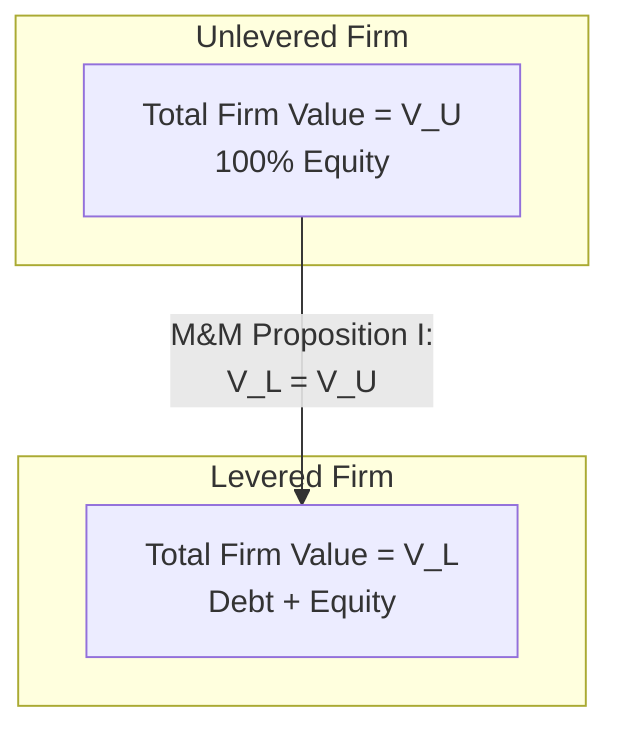

## Modigliani-Miller Propositions Without Taxes

### Definition and Conceptual Overview

The Modigliani-Miller (M&M) Propositions, published by Franco Modigliani and Merton Miller in their 1958 paper "The Cost of Capital, Corporation Finance and the Theory of Investment," establish the foundational theoretical baseline for modern capital structure theory. The "without taxes" (or "no-tax") version presents the original, most restrictive form of their argument: **under a specific set of idealized assumptions, a firm's capital structure — its mix of debt and equity financing — is irrelevant to its total value.**

This is often called the **Capital Structure Irrelevance Proposition**. It does not claim capital structure is irrelevant in the real world; rather, it isolates the conditions under which it *would* be irrelevant, so that departures from those conditions (taxes, bankruptcy costs, agency costs, information asymmetry) can be identified as the actual drivers of real-world capital structure decisions.

### The Perfect Capital Market Assumptions

**Key Points**

- No corporate or personal taxes
- No transaction costs (no brokerage fees, no costs to issue securities)
- No bankruptcy costs or financial distress costs
- Symmetric information: investors and managers have the same information
- Firms and individuals can borrow and lend at the same risk-free rate
- Investment policy is fixed — capital structure changes do not affect the firm's operating cash flows or investment decisions
- Perfect capital markets: securities are infinitely divisible, no investor is large enough to affect prices

These assumptions collectively define a "frictionless" world used as a theoretical benchmark rather than a realistic depiction of markets.

### Proposition I (M&M I): Capital Structure Irrelevance

**Statement**: In a world without taxes, the market value of a levered firm ($V_L$) equals the market value of an otherwise identical unlevered firm ($V_U$). The way a firm slices its cash flows between debt and equity holders does not change the total size of the pie.

$$V_L = V_U$$

This holds regardless of the debt-to-equity ratio the firm chooses.

**The Pie Model**

The total value of the firm is determined entirely by its underlying assets and their cash-flow-generating capacity — not by how the claims on those cash flows are divided between debt and equity investors.

### Proof by Arbitrage: Homemade Leverage

M&M's proof rests on an arbitrage argument: if $V_L \neq V_U$, investors could exploit the mispricing through **homemade leverage** — borrowing or lending on personal account to replicate or offset the firm's capital structure — until prices converge and the arbitrage opportunity disappears.

**Example — Arbitrage Proof**

Consider two identical firms except for capital structure:

- Firm U (Unlevered): 100% equity, total value $V_U = \$20{,}000{,}000$, expected annual operating income = $3,000,000
- Firm L (Levered): $10,000,000 in debt at 5% interest, plus equity; suppose (incorrectly, per the mispricing scenario) $V_L = \$22{,}000{,}000$, meaning equity of Firm L is valued at $\$22{,}000{,}000 - \$10{,}000{,}000 = \$12{,}000{,}000$

An investor who owns 10% of Firm L's equity has:

- Investment: $0.10 \times 12{,}000{,}000 = \$1{,}200{,}000$
- Annual income: $0.10 \times (3{,}000{,}000 - 0.05 \times 10{,}000{,}000) = 0.10 \times 2{,}500{,}000 = \$250{,}000$

**Alternative Strategy (Homemade Leverage)**: Sell the 10% stake in Firm L for $1,200,000, then:

1. Borrow personally an amount equal to 10% of Firm L's debt: $0.10 \times 10{,}000{,}000 = \$1{,}000{,}000$ at 5%
2. Use total funds ($1{,}200{,}000 + 1{,}000{,}000 = \$2{,}200{,}000$) to buy 10% of Firm U's equity, which costs $0.10 \times 20{,}000{,}000 = \$2{,}000{,}000$
3. Pocket the $200,000 difference immediately

Annual income from this replicated position:

$$0.10 \times 3{,}000{,}000 - 0.05 \times 1{,}000{,}000 = 300{,}000 - 50{,}000 = \$250{,}000$$

The investor replicates the *same* $250,000 annual income as holding Firm L equity directly, but pockets an immediate $200,000 arbitrage profit and holds an equivalent risk position. Rational investors will keep executing this trade — selling overvalued Firm L equity and buying Firm U equity with homemade leverage — until $V_L$ falls and $V_U$ rises to the point where $V_L = V_U$. This arbitrage mechanism is the crux of M&M's irrelevance proof.

### Proposition II (M&M II): Cost of Equity Rises with Leverage

**Statement**: The cost of equity for a levered firm increases linearly as the firm's debt-to-equity ratio increases, because equity holders bear increasing financial risk as leverage rises. However, this increase in the cost of equity is exactly offset by the greater proportional weight of cheaper debt in the capital structure, such that the *overall* WACC remains constant regardless of capital structure — consistent with Proposition I.

$$r_e = r_U + (r_U - r_d)\dfrac{D}{E}$$

where:

- $r_e$ = required return on levered equity
- $r_U$ = required return on unlevered (all-equity) firm's assets (the "business risk" component)
- $r_d$ = cost of debt
- $D/E$ = debt-to-equity ratio (market values)

**Key Points**

- $r_U$ represents pure **business risk** — the risk inherent in the firm's operations and assets, independent of financing.
- The term $(r_U - r_d)(D/E)$ represents the **financial risk premium** — additional required return equity holders demand for bearing the leverage-amplified risk.
- As $D/E \to 0$, $r_e \to r_U$ (an all-equity firm's cost of equity equals its unlevered cost of capital).
- As leverage increases, $r_e$ rises linearly — this is the graphical hallmark of M&M II.

**Example**

An unlevered firm has $r_U = 10\%$. The firm considers levering up with debt costing $r_d = 6\%$, targeting a debt-to-equity ratio of 1.5 (i.e., $D/E = 1.5$).

$$r_e = 10\% + (10\% - 6\%)(1.5) = 10\% + 4\% \times 1.5 = 10\% + 6\% = 16\%$$

**Verification that WACC remains constant:**

With $D/E = 1.5$, this implies $D = 1.5E$, so in terms of $V = D + E$: if $E = 1$, $D = 1.5$, $V = 2.5$, giving weights $w_e = 1/2.5 = 40\%$ and $w_d = 1.5/2.5 = 60\%$.

$$WACC = w_d r_d + w_e r_e = 0.60(6\%) + 0.40(16\%) = 3.60\% + 6.40\% = 10.00\%$$

WACC equals $r_U = 10\%$ exactly, confirming that under M&M's no-tax assumptions, capital structure does not affect the firm's overall cost of capital or its value — only how that constant WACC is decomposed between debt and equity costs.

### Graphical Representation of M&M II

<svg xmlns="http://www.w3.org/2000/svg" viewBox="0 0 640 420">
<text x="320" y="24" text-anchor="middle" font-size="16" font-weight="bold" fill="#1a1a1a">M&amp;M Proposition II — No Taxes (svg_diagram)</text>
<line x1="80" y1="360" x2="600" y2="360" stroke="#333" stroke-width="2" />
<line x1="80" y1="360" x2="80" y2="50" stroke="#333" stroke-width="2" />
<text x="340" y="395" text-anchor="middle" font-size="13" fill="#333">Debt-to-Equity Ratio (D/E)</text>
<text x="30" y="205" text-anchor="middle" font-size="13" fill="#333" transform="rotate(-90 30,205)">Required Return (%)</text>
<line x1="80" y1="200" x2="600" y2="200" stroke="#16a34a" stroke-width="2.5" />
<text x="590" y="190" text-anchor="end" font-size="12" fill="#166534">WACC = 10% (constant)</text>
<line x1="80" y1="330" x2="600" y2="330" stroke="#ca8a04" stroke-width="2" stroke-dasharray="6,4" />
<text x="590" y="320" text-anchor="end" font-size="12" fill="#854d0e">r_d = 6% (cost of debt)</text>
<line x1="80" y1="330" x2="600" y2="70" stroke="#2563eb" stroke-width="2.5" />
<text x="590" y="60" text-anchor="end" font-size="12" fill="#1e40af">r_e (cost of equity, rises with D/E)</text>
<circle cx="80" cy="200" r="4" fill="#2563eb" />
<text x="90" y="215" font-size="11" fill="#1e40af">r_U = 10% at D/E = 0</text>
</svg>

### Business Risk vs. Financial Risk

**Key Points**

- **Business risk** is the risk inherent to a firm's operations, industry, and asset base — captured by $r_U$, independent of how the firm is financed.
- **Financial risk** is the *additional* risk equity holders bear due to the firm's use of debt — fixed interest obligations amplify the variability of returns available to equity holders (financial leverage effect).
- M&M II decomposes the levered cost of equity into these two components explicitly, showing that leverage transfers risk (not value) between claimants.

### Why Capital Structure Is "Irrelevant" — Intuition

**Key Points**

- The firm's total cash flows to *all* investors (debt + equity combined) are unaffected by the debt/equity split, because leverage does not change the firm's underlying operations or investment decisions (a core assumption).
- Debt and equity are simply different ways of slicing the same total cash flow pie; changing the slicing does not change the size of the pie.
- Investors can replicate any capital structure using homemade leverage, meaning the firm cannot create value for investors by doing something (borrowing) that investors could just as easily do themselves on personal account, and no firm-level financing structure is fundamentally superior.

### Limitations and the Role of This Model

**Key Points**

- The no-tax M&M propositions are explicitly unrealistic — they exist as a theoretical benchmark, not a practical prescription. Corporate finance's subsequent development (M&M with corporate taxes, the trade-off theory, pecking order theory, agency cost theory) proceeds by systematically relaxing each of M&M's idealized assumptions to explain observed real-world capital structure behavior.
- The most significant relaxed assumption is the introduction of corporate taxes, which creates a tax shield benefit to debt financing and is covered separately in the "M&M with Taxes" module (M&M Proposition I with taxes: $V_L = V_U + TD$).
- Despite its unrealistic assumptions, the framework remains foundational because it correctly identifies *which* market imperfections must be present for capital structure to matter — directing subsequent theoretical and empirical research toward taxes, bankruptcy costs, agency conflicts, and information asymmetry as the actual determinants of real-world financing decisions. [Inference — this interpretation of M&M's enduring pedagogical role is the standard framing found in most corporate finance textbooks and is widely, though not universally in every phrasing, agreed upon]

### Practical Formula Summary

| Concept | Formula |
| --- | --- |
| M&M Proposition I (no taxes) | $V_L = V_U$ |
| M&M Proposition II (no taxes) | $r_e = r_U + (r_U - r_d)(D/E)$ |
| WACC under M&M (no taxes) | $WACC = r_U$ (constant, independent of leverage) |

### Related Topics

- Modigliani-Miller Propositions with corporate taxes ($V_L = V_U + TD$; the interest tax shield)
- Trade-off theory of capital structure (balancing tax shields against financial distress costs)
- Pecking order theory (asymmetric information and financing hierarchy)
- Agency cost theory of capital structure (Jensen and Meckling)
- Financial distress costs and bankruptcy costs as a real-world constraint on leverage
- Homemade leverage and arbitrage-based valuation proofs
- Beta unlevering/relevering (Hamada equation) as an application of M&M II to cost of equity estimation