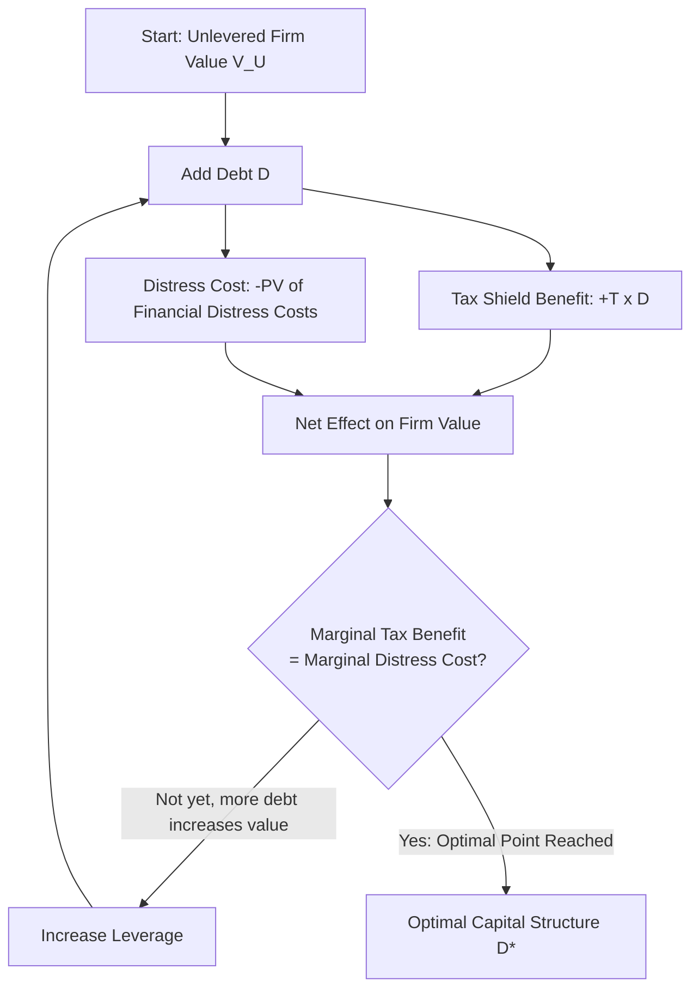

## Trade-off Theory of Capital Structure

### Definition and Conceptual Overview

The trade-off theory of capital structure resolves the unrealistic extreme prediction of the Modigliani-Miller model with taxes (that firms should finance with nearly 100% debt) by reintroducing a real-world cost of leverage: **financial distress and bankruptcy costs**. The theory holds that a firm's optimal capital structure balances the tax benefits of debt (the interest tax shield) against the expected costs of financial distress that rise as leverage increases. Firms are theorized to select a target debt ratio that maximizes firm value at the point where the marginal benefit of additional debt equals its marginal cost.

This is sometimes called the **static trade-off theory**, since it depicts an optimum reached in a single-period, equilibrium framework rather than describing a dynamic financing sequence over time (which is instead the domain of the pecking order theory).

### The Core Value Equation

$$V_L = V_U + TD - PV(\text{Financial Distress Costs})$$

This expands the with-tax M&M formula ($V_L = V_U + TD$) by subtracting the present value of expected costs associated with financial distress, which grow as the probability of distress increases with higher leverage.

**Key Points**

- $TD$ (the tax shield) increases linearly with debt, all else equal.
- $PV(\text{Financial Distress Costs})$ increases at an *increasing* rate as leverage rises — the probability of default and the severity of distress-related costs both grow disproportionately at high debt levels.
- The optimal capital structure ($D^*$) is the point at which the marginal tax benefit of one additional dollar of debt exactly equals the marginal increase in expected distress costs.

### Components of Financial Distress Costs

#### Direct (Bankruptcy) Costs

**Key Points**

- Legal fees, court costs, and administrative expenses associated with formal bankruptcy proceedings (e.g., Chapter 11 reorganization or Chapter 7 liquidation in the U.S. context)
- Fees paid to trustees, accountants, and investment bankers involved in restructuring
- These costs are typically estimated in academic studies to be a relatively small percentage of firm value (though estimates vary considerably by study and firm size) [Unverified — direct bankruptcy cost estimates vary widely across empirical studies and time periods; cite specific studies if precision is required]

#### Indirect Costs of Financial Distress

**Key Points**

- Lost sales and customers who avoid dealing with a firm perceived as financially unstable (particularly relevant for firms selling products requiring ongoing service, warranties, or spare parts)
- Loss of key employees and difficulty attracting new talent due to job security concerns
- Suppliers demanding stricter payment terms (e.g., cash-on-delivery instead of trade credit) due to counterparty risk
- Underinvestment problems: managers may forgo positive-NPV projects because the benefits would primarily accrue to existing debtholders rather than shareholders (a classic agency-cost-of-debt problem)
- Asset substitution / risk-shifting: equity holders in a financially distressed firm have an incentive to take on excessively risky projects, since they benefit from the upside while debtholders bear the downside (an option-like payoff structure)
- Indirect costs are generally considered by researchers to be substantially larger than direct costs, though they are inherently more difficult to measure precisely. [Inference — this relative ranking is a common finding/assertion in the capital structure literature, though exact magnitudes remain empirically contested]

### Graphical Depiction of the Trade-off

### The Trade-off Curve (SVG)

<svg xmlns="http://www.w3.org/2000/svg" viewBox="0 0 640 420">
<text x="320" y="24" text-anchor="middle" font-size="16" font-weight="bold" fill="#1a1a1a">Static Trade-off Theory of Capital Structure (svg_diagram)</text>
<line x1="80" y1="360" x2="600" y2="360" stroke="#333" stroke-width="2" />
<line x1="80" y1="360" x2="80" y2="50" stroke="#333" stroke-width="2" />
<text x="340" y="395" text-anchor="middle" font-size="13" fill="#333">Debt Level (D)</text>
<text x="30" y="205" text-anchor="middle" font-size="13" fill="#333" transform="rotate(-90 30,205)">Firm Value ($)</text>
<line x1="80" y1="330" x2="600" y2="90" stroke="#94a3b8" stroke-width="2" stroke-dasharray="6,4" />
<text x="590" y="80" text-anchor="end" font-size="11" fill="#64748b">V_L = V_U + T·D (M&amp;M with taxes, no distress)</text>
<path d="M 80 330 Q 260 150 380 130 Q 480 160 600 280" stroke="#2563eb" stroke-width="3" fill="none" />
<text x="380" y="115" text-anchor="middle" font-size="12" fill="#1e40af">Actual V_L with distress costs</text>
<line x1="380" y1="360" x2="380" y2="130" stroke="#16a34a" stroke-width="1.5" stroke-dasharray="3,3" />
<text x="380" y="378" text-anchor="middle" font-size="12" fill="#166534">D* (optimal debt level)</text>
<line x1="80" y1="330" x2="80" y2="330" stroke="#333" />
<text x="90" y="345" font-size="11" fill="#333">V_U</text>
<path d="M 380 130 Q 480 160 600 280" stroke="#dc2626" stroke-width="1.5" fill="none" stroke-dasharray="4,3" />
<text x="560" y="245" text-anchor="middle" font-size="10" fill="#991b1b">Distress costs dominate</text>
</svg>

### Determining the Optimal Debt Level: Marginal Analysis

The theoretical optimum occurs where:

$$\dfrac{\partial [PV(\text{Tax Shield})]}{\partial D} = \dfrac{\partial [PV(\text{Distress Costs})]}{\partial D}$$

In practice, firms cannot precisely calculate this marginal condition due to the difficulty of quantifying distress cost probabilities and magnitudes; the trade-off theory is therefore used more as a conceptual/directional framework than a precise optimization formula in practice. [Inference — this practical limitation is widely acknowledged in corporate finance pedagogy and practitioner literature, since expected distress costs are inherently probabilistic and firm-specific]

### Illustrative Numerical Example

A firm has $V_U = \$100{,}000{,}000$, tax rate $T = 25\%$. Management is evaluating three leverage levels.

| Debt Level ($D$) | Tax Shield ($T \times D$) | Estimated PV(Distress Costs) | Net Firm Value |
| --- | --- | --- | --- |
| $10,000,000 | $2,500,000 | $200,000 | $102,300,000 |
| $30,000,000 | $7,500,000 | $2,000,000 | $105,500,000 |
| $50,000,000 | $12,500,000 | $9,000,000 | $103,500,000 |
| $70,000,000 | $17,500,000 | $22,000,000 | $95,500,000 |

**Example** — reading this table: firm value rises from $102.3M to a peak of $105.5M at $30M in debt, then falls as distress costs begin to dominate the incremental tax shield beyond that point. This illustrates the theory's core intuition: an interior optimum exists where the marginal tax benefit equals the marginal distress cost — here, approximately at $D \approx \$30{,}000{,}000$, since value declines both before reaching insufficient leverage's opportunity cost is ignored in this simplified table and after this point. [Note: this table is an illustrative synthetic example to demonstrate the mechanic, not a derived or sourced empirical dataset]

### Determinants of a Firm's Target Debt Ratio

**Key Points**

- **Asset tangibility**: Firms with more tangible, collateralizable assets (e.g., real estate, heavy equipment) tend to support higher debt levels, since tangible assets retain more value in liquidation/distress and can serve as collateral, reducing lender risk.
- **Earnings volatility / business risk**: Firms with more stable, predictable cash flows can sustain higher debt levels without significant default risk; firms with volatile earnings (e.g., technology, biotech) typically maintain lower leverage.
- **Firm size**: Larger firms tend to be more diversified and have lower bankruptcy probability for a given leverage level, often supporting higher debt ratios.
- **Profitability and tax shield value**: Highly profitable firms with substantial taxable income benefit more from the interest tax shield (more income to shield), theoretically supporting higher optimal leverage — though this prediction is famously *at odds* with the empirical observation that highly profitable firms often carry *less* debt, a discrepancy explored under the pecking order theory.
- **Non-debt tax shields**: Firms with significant depreciation, R&D credits, or other non-debt tax shields may have less need for the debt tax shield specifically, implying lower optimal leverage. [Inference — this is a standard extension attributed to DeAngelo and Masulis (1980) in the capital structure literature]
- **Growth opportunities**: High-growth firms tend to have lower optimal debt levels, partly due to greater agency costs of debt (underinvestment problems are more severe when a large portion of firm value comes from future growth options rather than existing assets).

### Trade-off Theory vs. Pecking Order Theory (Brief Contrast)

**Key Points**

- Trade-off theory predicts firms *target* a specific optimal debt ratio and adjust toward it over time.
- Pecking order theory (covered separately) predicts firms follow a financing hierarchy (internal funds, then debt, then equity as a last resort) driven by information asymmetry costs, without necessarily targeting a specific optimal ratio.
- Empirical evidence offers mixed support for each theory; many researchers view them as complementary rather than mutually exclusive explanations of observed capital structure behavior. [Inference — a widely-cited synthesis position in the capital structure literature, reflecting ongoing empirical debate rather than a settled consensus]

### Practical Formula Summary

| Concept | Formula |
| --- | --- |
| Trade-off theory firm value | $V_L = V_U + TD - PV(\text{Distress Costs})$ |
| Optimal leverage condition | Marginal tax shield benefit = Marginal distress cost |
| M&M with taxes (special case, no distress) | $V_L = V_U + TD$ |

### Related Topics

- Modigliani-Miller Propositions with taxes (the tax-shield-only baseline this theory extends)
- Pecking order theory of capital structure
- Agency costs of debt: underinvestment and asset substitution problems
- Direct vs. indirect bankruptcy costs — empirical estimation approaches
- Credit ratings and their role as a practical proxy for target leverage constraints
- Dynamic trade-off theory (capital structure adjustment speed and adjustment costs)
- Non-debt tax shields (DeAngelo and Masulis model)