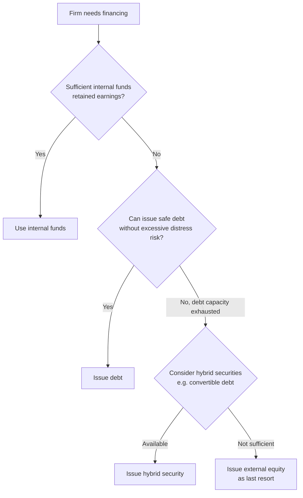

## Pecking Order Theory

### Definition and Conceptual Overview

The pecking order theory, developed primarily by Stewart Myers (1984) and Myers and Majluf (1984), explains observed corporate financing behavior as the result of **information asymmetry** between managers (insiders) and outside investors, rather than firms targeting an optimal debt ratio as in trade-off theory. The theory proposes that firms follow a strict hierarchy — a "pecking order" — of financing preferences: (1) internal funds first, (2) debt second, and (3) external equity only as a last resort. This ordering arises because each financing source carries different degrees of adverse selection cost, and managers, who possess superior information about firm value, choose financing sources that minimize the costs imposed by that information gap.

Unlike trade-off theory, pecking order theory does not posit a well-defined optimal or target capital structure. Instead, a firm's observed debt ratio at any point in time is simply the *cumulative result* of its past financing decisions and profitability, not a deliberately chosen target.

### The Financing Hierarchy

**Key Points**

1. **Internal funds (retained earnings)** — the most preferred source, since using internally generated cash involves no external parties, no information asymmetry costs, and no transaction/flotation costs.
2. **Debt financing** — the preferred external source when internal funds are insufficient, since debt is less sensitive to private information about firm value than equity (debt claims are relatively fixed and senior, making mispricing risk from information asymmetry smaller).
3. **Hybrid securities** (e.g., convertible debt) — occupy an intermediate position in the hierarchy.
4. **External equity issuance** — the least preferred source, used only when debt capacity is exhausted or financial distress risk from further borrowing becomes too high, because new equity issuance is the most exposed to information asymmetry costs and typically triggers the most negative market reaction.

### The Information Asymmetry Mechanism (Myers-Majluf Logic)

**Key Points**

- Managers know more about the firm's true value, prospects, and the quality of its assets/projects than outside investors do.
- If managers believe the firm's equity is **undervalued** by the market, they will avoid issuing new equity, since doing so would sell shares to new investors at a price below true value, transferring wealth from existing shareholders to new ones.
- If managers believe the firm's equity is **overvalued**, they have an incentive to issue equity to capture that overvaluation for existing shareholders — but rational investors anticipate this behavior.
- Because rational investors understand this asymmetric incentive, the *announcement* of a new equity issuance is interpreted as a negative signal — it suggests managers believe the stock is overvalued (or at least not undervalued) — causing the stock price to fall on the announcement, independent of the actual use of proceeds.
- This negative signaling effect is empirically well-documented: announcements of seasoned equity offerings (SEOs) are consistently associated with negative abnormal stock returns around the announcement date. [Inference — the general direction and existence of this negative announcement effect is a long-standing, widely replicated empirical finding in corporate finance (e.g., studies following Myers and Majluf's original framework), though the precise magnitude varies by study, market, and time period]
- Debt issuance, by contrast, carries a much weaker negative signal (or sometimes no significant signal) because debt's fixed payoff structure makes it far less sensitive to private information about the firm's underlying value than equity's residual claim structure.

### Adverse Selection Cost Ranking

$$\text{Adverse Selection Cost: Internal Funds} < \text{Debt} < \text{Hybrid Securities} < \text{External Equity}$$

This ranking directly drives the financing hierarchy: firms sequence their financing choices to minimize the adverse selection (mispricing) discount investors would otherwise demand.

### Signaling Effects by Security Type

<svg xmlns="http://www.w3.org/2000/svg" viewBox="0 0 640 380">
<text x="320" y="24" text-anchor="middle" font-size="16" font-weight="bold" fill="#1a1a1a">Market Reaction to Financing Announcements (svg_diagram)</text>
<line x1="80" y1="200" x2="600" y2="200" stroke="#333" stroke-width="2" />
<line x1="80" y1="60" x2="80" y2="340" stroke="#333" stroke-width="2" />
<text x="30" y="200" text-anchor="middle" font-size="12" fill="#333" transform="rotate(-90 30,200)">Abnormal Stock Return</text>
<rect x="150" y="185" width="80" height="15" fill="#16a34a" />
<text x="190" y="230" text-anchor="middle" font-size="11" fill="#166534">Internal Funds (no reaction)</text>
<text x="190" y="242" text-anchor="middle" font-size="10" fill="#166534">no reaction</text>
<rect x="290" y="200" width="80" height="15" fill="#ca8a04" />
<text x="330" y="230" text-anchor="middle" font-size="11" fill="#854d0e">Straight Debt</text>
<text x="330" y="242" text-anchor="middle" font-size="10" fill="#854d0e">slightly negative/neutral</text>
<rect x="430" y="200" width="80" height="35" fill="#dc2626" />
<text x="470" y="250" text-anchor="middle" font-size="11" fill="#991b1b">New Equity</text>
<text x="470" y="262" text-anchor="middle" font-size="10" fill="#991b1b">most negative</text>
</svg>

### Numerical Illustration of the Underinvestment/Signaling Problem

**Example**

A firm has existing assets worth (true value, known only to managers) $80,000,000, and a new project requiring $20,000,000 of investment with a true NPV of $5,000,000 to be financed via new equity. Suppose the market, lacking managers' private information, misestimates the firm's existing assets at only $60,000,000 (a 25% undervaluation).

- True firm value if project is undertaken and financed with fairly-priced equity: $80{,}000{,}000 + 20{,}000{,}000 + 5{,}000{,}000 = \$105{,}000{,}000$
- Market's perceived value of existing assets: $60,000,000
- If the firm issues $20,000,000 in new equity at the market's (undervalued) price, new investors receive a claim representing:

$$\text{New investor ownership \%} = \dfrac{20{,}000{,}000}{60{,}000{,}000 + 20{,}000{,}000} = \dfrac{20{,}000{,}000}{80{,}000{,}000} = 25\%$$

- New investors' claim on true post-project value: $0.25 \times 105{,}000{,}000 = \$26{,}250{,}000$ — they contributed $20,000,000 but receive a claim worth $26,250,000, a wealth transfer of $6,250,000 from existing shareholders to new shareholders, *despite* the project having a genuinely positive NPV of $5,000,000.

Because this wealth transfer ($6,250,000) exceeds the NPV gain ($5,000,000) accruing to all shareholders, **existing shareholders are worse off by $1,250,000 net** even though the underlying project creates value — this is the crux of the Myers-Majluf underinvestment result: managers acting in existing shareholders' interest may rationally reject a positive-NPV project if it must be financed with undervalued equity, unless a less information-sensitive financing source (like debt) is available.

**Key Points**

- If the firm could instead finance the $20,000,000 project with debt, no share dilution or mispricing wealth transfer would occur, and the full $5,000,000 NPV would accrue to existing shareholders — illustrating precisely why debt is preferred over equity in the pecking order.
- This underinvestment problem is a core theoretical justification for why firms maintain **financial slack** (unused debt capacity or cash reserves) — to preserve the ability to finance future positive-NPV projects without resorting to information-sensitive equity issuance.

### Financial Slack and Debt Capacity

**Key Points**

- Firms are theorized to preserve "financial slack" — a reserve of internal funds and/or unused borrowing capacity — specifically to avoid the necessity of raising equity in the future under conditions of asymmetric information.
- This behavior can lead firms to hold larger cash balances or lower current leverage than a pure trade-off-theory optimum would suggest, precisely to preserve future financing flexibility.
- Financial slack has a dual character in the literature: it is valuable defensively (avoiding costly equity issuance) but can also create agency costs if managers use excess slack for empire-building or inefficient investment rather than shareholder value maximization. [Inference — this dual characterization (financing flexibility benefit vs. free-cash-flow agency cost, the latter associated with Jensen's 1986 free cash flow theory) is a standard synthesis point connecting pecking order theory to agency cost theory in corporate finance curricula]

### Empirical Implications and Observed Patterns

**Key Points**

- **Profitability and leverage are negatively correlated** in many empirical studies — highly profitable firms tend to carry less debt, not more, which is broadly consistent with pecking order theory (profitable firms generate more internal funds, reducing the need for external financing) but is somewhat at odds with a naive reading of trade-off theory (which predicts profitable firms should use more debt to capture larger tax shields).
- Firms tend to issue debt far more frequently than equity when raising external capital, consistent with the predicted hierarchy.
- Pecking order theory does not predict a specific target debt ratio; a firm's leverage at any time is simply a byproduct of its cumulative financing deficit history, sometimes referred to as the "financing deficit" model of leverage.
- Empirical support for pecking order theory is mixed: it explains some patterns (profitability-leverage relationship, negative equity issuance announcement returns) well, but struggles to fully explain others (e.g., some firms issue equity even when they have unused debt capacity, and small high-growth firms often rely heavily on equity despite the theory's predictions). [Inference — this qualified/mixed empirical assessment reflects the general state of the corporate finance literature testing pecking order theory, notably including critiques from studies such as Shyam-Sunder and Myers (1999) versus Frank and Goyal (2003), among others; exact findings and their interpretation remain subject to ongoing academic debate]

### Pecking Order vs. Trade-off Theory: Key Contrasts

| Dimension | Pecking Order Theory | Trade-off Theory |
| --- | --- | --- |
| Driving force | Information asymmetry / adverse selection | Balancing tax shields vs. distress costs |
| Target debt ratio | No explicit target; leverage is a residual outcome | Firms actively target an optimal ratio |
| Profitability-leverage relationship | Negative (more profit → less need for external debt) | Positive (more profit → more tax shield value captured) |
| Equity issuance | Last resort, negative signal | Used when debt capacity/target ratio requires it |
| View of financial slack | Valuable to avoid future equity issuance costs | Not a central concept |

### Practical Formula Summary

| Concept | Formula/Relationship |
| --- | --- |
| Financing hierarchy | Internal funds > Debt > Hybrid securities > External equity |
| Adverse selection cost ranking | Internal funds < Debt < Hybrids < External equity |
| New investor ownership stake (equity issuance) | $\text{New \%} = \dfrac{\text{Amount Raised}}{\text{Perceived Pre-money Value} + \text{Amount Raised}}$ |

### Related Topics

- Trade-off theory of capital structure (the competing/complementary framework)
- Myers and Majluf (1984) underinvestment model and adverse selection
- Agency costs of free cash flow (Jensen, 1986) and the dual role of financial slack
- Seasoned equity offering (SEO) announcement effects — empirical event studies
- Signaling theory in corporate finance (dividend signaling, debt signaling)
- Financial flexibility and target cash holdings
- Market timing theory of capital structure (an alternative behavioral explanation for financing choices)