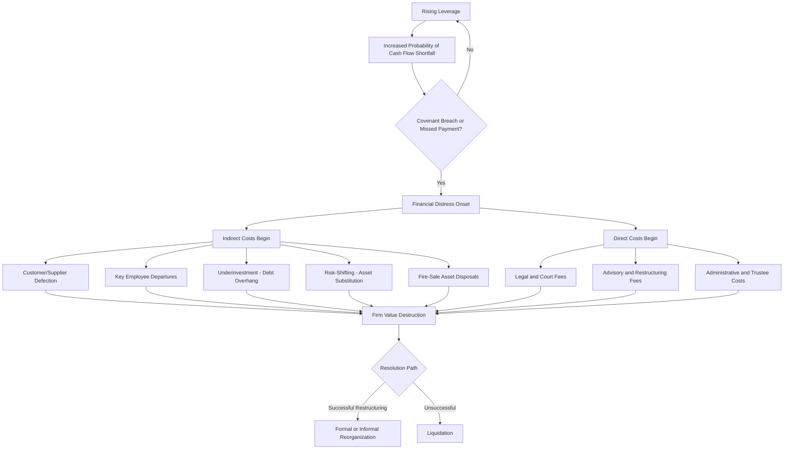

## Costs of Financial Distress

### Definition and Conceptual Overview

Financial distress refers to a condition in which a firm has difficulty meeting its contractual obligations to creditors, particularly fixed debt-service payments (interest and principal). The costs of financial distress are the value-destroying consequences that arise as a firm approaches, experiences, or attempts to resolve this condition. These costs are central to the **trade-off theory of capital structure**, which posits that firms select debt levels by balancing the tax benefits of debt (the interest tax shield) against the expected costs of financial distress.

The core insight is that firm value under leverage is not simply the Modigliani-Miller (MM) Proposition I value plus the present value of tax shields. Once distress costs are introduced:

$$V_L = V_U + PV(\text{Tax Shield}) - PV(\text{Costs of Financial Distress})$$

where $V_L$ is the value of the levered firm and $V_U$ is the value of the unlevered firm. As leverage increases, the probability of distress rises, and the present value of expected distress costs grows, eventually offsetting and then exceeding the marginal tax benefit of additional debt. This produces an interior optimal capital structure rather than the corner solution (100% debt) implied by the basic MM-with-taxes model.

### Direct Costs of Financial Distress

Direct costs are the explicit, out-of-pocket cash expenditures incurred when a firm undergoes formal bankruptcy or reorganization proceedings (e.g., Chapter 11 in the U.S., or equivalent insolvency regimes elsewhere).

**Key Points**

- **Legal and administrative fees**: Payments to bankruptcy attorneys, court fees, filing costs.
- **Professional fees**: Investment bankers, financial advisors, and turnaround consultants retained to restructure debt, value assets, or negotiate with creditors.
- **Accounting and audit costs**: Additional audits, forensic accounting, and compliance reporting required during proceedings.
- **Trustee and administrative fees**: Costs of court-appointed trustees or examiners overseeing the estate.

Empirical studies estimate direct bankruptcy costs typically range from approximately 3% to 7% of pre-distress firm value for large public firms, though the percentage tends to be significantly higher (sometimes 20%+) for smaller firms due to fixed-cost components of legal and administrative processes. [Unverified — specific percentages vary substantially by study, jurisdiction, time period, and firm size, and should be treated as illustrative ranges rather than precise universal figures.]

Direct costs exhibit a degree of **fixed-cost character**: many legal and administrative expenses do not scale proportionally with firm size, which is why direct costs as a percentage of value tend to be regressive (higher percentage burden for smaller firms).

### Indirect Costs of Financial Distress

Indirect costs are typically far larger in magnitude than direct costs, though they are harder to measure because they represent foregone value and behavioral distortions rather than explicit cash outflows.

#### 1. Loss of Customers, Suppliers, and Business Relationships

- **Customer defection**: Customers may avoid purchasing from a financially distressed firm if they fear the firm cannot honor warranties, provide ongoing service, or supply spare parts/support (e.g., automobile manufacturers, airlines, software firms with long-term service contracts).
- **Supplier tightening**: Suppliers may demand cash-on-delivery terms instead of trade credit, tightening the firm's working capital and liquidity.
- **Loss of key employees**: Talented employees, fearing job insecurity, may leave for more stable competitors, degrading firm human capital precisely when it is most needed.

#### 2. Underinvestment Problem (Debt Overhang)

Because a large share of any new project's value would accrue to existing creditors (whose claims are senior) rather than to shareholders, equity holders in distressed firms may rationally **reject positive-NPV projects** if the firm would need to raise new capital to fund them and creditors would capture most of the upside. This is a classic **agency cost of debt** that intensifies as distress deepens.

$$\text{Equity value of new project} = \max(0, \, V_{\text{new}} - D)$$

If existing debt $D$ is large relative to the payoff from a new project, equity holders may capture little or none of the project's NPV, destroying incentive to invest even in value-creating opportunities.

#### 3. Risk-Shifting (Asset Substitution)

Conversely, distressed-firm shareholders have an incentive to **shift toward riskier, even negative-NPV, projects** ("bet the company") because equity behaves like a call option on firm assets. Increased asset volatility increases option value to shareholders while transferring risk to creditors.

$$\text{Equity} = \max(0, \, V_A - D)$$

This convex payoff structure creates incentives for excessive risk-taking, a well-documented agency cost that becomes more pronounced as the firm nears the distress boundary.

#### 4. Fire Sales of Assets

Distressed firms often must sell assets quickly to raise cash, frequently at prices below fundamental (going-concern) value — termed a **fire sale discount**. Buyers exploit the firm's urgency and limited bargaining power, and industry-specific assets may have few natural buyers precisely when an entire industry is distressed simultaneously (asset illiquidity is often correlated across firms in the same sector).

#### 5. Deterioration in Operating Decisions and Management Distraction

Management attention shifts from value-maximizing operating and strategic decisions toward negotiating with creditors, restructuring debt, and managing liquidity crises — an opportunity cost of managerial time and focus.

#### 6. Reduced Trade Credit and Financing Constraints

Distressed firms often lose access to favorable financing, face higher costs of capital, and may need to forgo profitable investments due to constrained access to funds (interacting with the underinvestment problem above).

#### 7. Reputational Costs

Distress can damage brand equity and market perception, with effects persisting even after the firm exits formal distress or restructures successfully.

### Determinants of the Magnitude of Distress Costs

**Key Points**

- **Asset tangibility**: Firms with tangible, redeployable assets (real estate, equipment) tend to have lower distress costs because assets retain value in liquidation/sale. Firms with intangible assets (R&D, brand equity, human capital, growth options) suffer larger indirect costs because value is relationship- and confidence-dependent.
- **Industry characteristics**: Firms in industries requiring ongoing customer confidence (airlines, financial services, technology with long product life-cycle support) face higher indirect costs than firms selling simple, standardized, one-time-purchase products.
- **Growth opportunities**: Firms with substantial growth options are more vulnerable to underinvestment costs.
- **Asset specificity**: Highly specialized assets have thinner secondary markets, exacerbating fire-sale discounts.
- **Cash flow volatility**: Firms with volatile operating cash flows have a higher probability of triggering distress at any given leverage level, raising expected distress costs.

### The Trade-Off Theory: Integrating Distress Costs with Tax Shields

The static trade-off theory models the optimal capital structure as the point where the marginal present value of the tax shield from an additional dollar of debt equals the marginal present value of expected distress costs.

(svg_diagram)

<svg xmlns="http://www.w3.org/2000/svg" viewBox="0 0 720 420">
<text x="360" y="24" font-size="16" font-weight="bold" text-anchor="middle" fill="#1a1a1a">Trade-Off Theory: Optimal Capital Structure (svg_diagram)</text>

<line x1="80" y1="360" x2="680" y2="360" stroke="#333" stroke-width="2" />
<line x1="80" y1="360" x2="80" y2="40" stroke="#333" stroke-width="2" />
<text x="380" y="395" font-size="13" text-anchor="middle" fill="#333">Debt Level (D/V)</text>
<text x="30" y="200" font-size="13" text-anchor="middle" fill="#333" transform="rotate(-90 30 200)">Firm Value</text>

<line x1="80" y1="310" x2="680" y2="310" stroke="#888" stroke-width="2" stroke-dasharray="6,4" />
<text x="600" y="302" font-size="12" fill="#888">V(unlevered) = V_U</text>

<line x1="80" y1="310" x2="680" y2="90" stroke="#4a90d9" stroke-width="2" stroke-dasharray="4,3" />
<text x="520" y="120" font-size="12" fill="#4a90d9">V_U + PV(Tax Shield) [MM w/ taxes]</text>

<path d="M 80 310 Q 300 150 430 130 Q 560 150 680 280" stroke="#c0392b" stroke-width="3" fill="none" />
<text x="420" y="105" font-size="12" fill="#c0392b" font-weight="bold">V_L = V_U + PV(Tax Shield) - PV(Distress Costs)</text>

<circle cx="430" cy="130" r="5" fill="#c0392b" />
<line x1="430" y1="130" x2="430" y2="360" stroke="#999" stroke-width="1" stroke-dasharray="3,3" />
<text x="430" y="378" font-size="12" text-anchor="middle" fill="#c0392b" font-weight="bold">D*/V (Optimal)</text>

<text x="600" y="240" font-size="11" fill="`#c0392b`">PV(Distress Costs)</text>

<line x1="590" y1="245" x2="560" y2="180" stroke="`#c0392b`" stroke-width="1" />

</svg>

**Interpretation**: At low leverage, the tax shield dominates and firm value rises with debt. As leverage increases past the optimum $D^*/V$, the marginal expected cost of distress (weighted by increasing probability of default) exceeds the marginal tax benefit, and firm value declines. The curve's peak identifies the theoretically optimal capital structure.

### Formal Expression of Expected Distress Costs

The present value of expected distress costs can be conceptually decomposed as:

$$PV(\text{Distress Costs}) = P(\text{distress}) \times C_{\text{distress}} \times \text{(discount factor)}$$

where:

- $P(\text{distress})$ = probability of entering financial distress, which is increasing in leverage and cash flow volatility, and decreasing in profitability and asset coverage.
- $C_{\text{distress}}$ = the magnitude of direct plus indirect costs conditional on distress occurring.

Because both $P(\text{distress})$ and $C_{\text{distress}}$ can rise with leverage (higher leverage → both higher default probability and, in some models, more severe indirect costs due to deeper agency conflicts), the relationship between debt and expected distress cost is typically **convex** rather than linear — a key reason the trade-off curve is concave (hump-shaped) rather than linear like the pure MM-with-taxes line.

### Numerical Illustration

**Example**

Consider a firm with:

- Unlevered value: $V_U = \$500$ million
- Marginal corporate tax rate: $t_c = 25\%$
- Debt of $D = \$200$ million, assumed permanent, generating a tax shield of $t_c \times D = \$50$ million (under the simplified Modigliani-Miller permanent-debt assumption)
- Estimated probability of financial distress at this leverage: $P(\text{distress}) = 15\%$
- Estimated total distress costs (direct + indirect) if distress occurs: $\$120$ million (24% of $V_U$, consistent with indirect costs dominating direct costs)

$$PV(\text{Distress Costs}) \approx 0.15 \times \$120\text{M} = \$18\text{M}$$

$$V_L \approx \$500\text{M} + \$50\text{M} - \$18\text{M} = \$532\text{M}$$

If the firm increased debt to $D = \$350$ million, the tax shield would rise to $\$87.5$ million, but suppose $P(\text{distress})$ rises to 35% and $C_{\text{distress}}$ rises to $\$150$ million (reflecting worse asset substitution and underinvestment problems at higher leverage):

$$PV(\text{Distress Costs}) \approx 0.35 \times \$150\text{M} = \$52.5\text{M}$$

$$V_L \approx \$500\text{M} + \$87.5\text{M} - \$52.5\text{M} = \$535\text{M}$$

Value still rises slightly here, illustrating that the optimum depends sensitively on the specific probability and cost functions assumed — firms must estimate these empirically (or via judgment) rather than relying on a universal formula. [Inference: this numerical example uses illustrative, assumed inputs to demonstrate the mechanics of the trade-off framework; actual firm-specific probabilities and cost magnitudes require empirical estimation, e.g., via credit ratings, distance-to-default models, or historical peer bankruptcy data.]

### Relationship to Other Capital Structure Theories

**Key Points**

- **Static trade-off theory**: Firms target a specific optimal leverage ratio balancing tax shields against distress costs (as developed above).
- **Pecking order theory** (Myers and Majluf): De-emphasizes a target optimal structure; instead, firms prefer internal financing, then debt, then equity, due to information asymmetry costs — distress costs are not the central driver here, though high distress risk still discourages debt issuance.
- **Dynamic trade-off models**: Incorporate adjustment costs and the fact that firms drift away from and periodically rebalance toward target leverage, since continuously adjusting capital structure to stay exactly at the optimum is itself costly.
- **Agency cost theories** (Jensen and Meckling; Jensen's free cash flow theory): Distress costs interact with agency costs of debt (asset substitution, underinvestment) and agency benefits of debt (disciplining effect on free cash flow, reducing managerial overinvestment).

### Empirical Evidence

- Direct bankruptcy costs are relatively modest as a percentage of value for large firms but can be substantial for smaller firms, consistent with fixed-cost effects.
- Indirect costs are much harder to isolate empirically because they must be inferred from counterfactual firm performance (what would have happened absent distress), but studies using operating performance declines, lost market share, and profitability deterioration around distress episodes generally find indirect costs to be several multiples of direct costs.
- Industries with high customer-confidence sensitivity (e.g., airlines during the era of major U.S. carrier bankruptcies) have historically shown pronounced indirect costs through reduced ticket sales and elevated marketing/discounting needed to retain customers during distress. [Unverified — specific magnitude estimates vary by study and time period and should not be treated as precise universal constants.]
- Cross-sectional studies generally find that firms with more tangible assets and less growth-option-dependent value carry higher optimal leverage ratios, consistent with trade-off theory predictions regarding the determinants of distress cost magnitude.

### Distress Cost Escalation Sequence

### Mitigating Distress Costs: Practical and Policy Considerations

**Key Points**

- **Maintaining financial flexibility**: Holding lower leverage or cash reserves ("debt capacity" preservation) to retain the ability to invest in future opportunities without distress risk.
- **Covenant design**: Well-structured debt covenants can reduce agency costs (limiting risk-shifting) while avoiding covenants so restrictive they trigger technical default and precipitate unnecessary distress.
- **Private workouts vs. formal bankruptcy**: Firms often prefer negotiated, informal debt restructuring with creditors to avoid the direct costs and reputational damage of formal bankruptcy proceedings, though free-rider and hold-out problems among dispersed creditors can make private workouts difficult, sometimes necessitating formal proceedings.
- **Debt structure diversification**: Diversifying between bank debt (more flexible, easier to renegotiate) and public bonds (more dispersed, harder to renegotiate) affects the ease and cost of resolving distress.
- **Hedging strategies**: Using derivatives to reduce cash flow volatility lowers $P(\text{distress})$ for a given leverage level, indirectly supporting higher sustainable debt capacity.

### Conclusion

The costs of financial distress — comprising both direct costs (legal, administrative, and professional fees during bankruptcy) and indirect costs (customer/supplier defection, underinvestment, risk-shifting, fire sales, and managerial distraction) — are a critical counterweight to the tax advantages of debt financing. Indirect costs are typically the larger and more economically significant component, though they are inherently harder to measure. Together, these costs underpin the static trade-off theory's prediction of an interior optimal capital structure, and their magnitude varies systematically with asset tangibility, growth opportunities, cash flow volatility, and industry characteristics. Understanding these costs is essential for capital structure decision-making, credit analysis, and corporate financial policy design.

**Related Topics**

- Trade-off theory of capital structure (static and dynamic versions)
- Agency costs of debt: underinvestment (debt overhang) and asset substitution (risk-shifting)
- Modigliani-Miller Propositions I and II (with and without taxes)
- Pecking order theory of capital structure
- Optimal capital structure and target leverage ratios
- Bankruptcy and reorganization procedures (Chapter 7 vs. Chapter 11)
- Credit ratings and distance-to-default models
- Interest tax shield valuation
- Free cash flow theory and the disciplining role of debt (Jensen)
- Corporate debt covenants and creditor protections