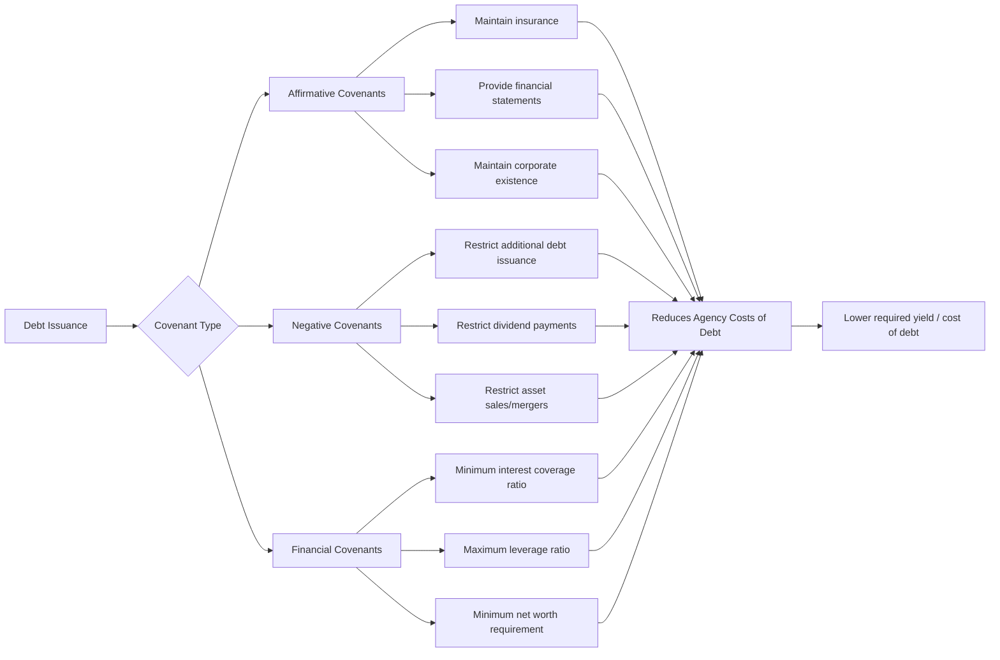

## Agency Costs of Debt and Equity

### Conceptual Foundation

Agency costs arise from conflicts of interest between parties with divergent objectives who are bound together by contracts — most centrally, conflicts between **managers and shareholders** (agency costs of equity) and between **shareholders and creditors** (agency costs of debt). The foundational framework was formalized by Jensen and Meckling (1976), who defined an agency relationship as a contract in which one party (the principal) engages another (the agent) to perform services involving delegation of decision-making authority.

Because agents may not always act in the principal's best interest, and because monitoring and contracting are costly and imperfect, agency costs emerge. Jensen and Meckling decompose total agency costs into three components:

$$\text{Total Agency Costs} = \text{Monitoring Costs} + \text{Bonding Costs} + \text{Residual Loss}$$

- **Monitoring costs**: Expenditures by the principal to observe and constrain the agent's behavior (audits, board oversight, covenants, performance-based compensation structuring).
- **Bonding costs**: Expenditures by the agent to credibly commit to acting in the principal's interest (contractual guarantees, voluntary disclosure, reputational bonding).
- **Residual loss**: The remaining welfare loss from divergence between the agent's actions and the value-maximizing decision, even after optimal monitoring and bonding.

Capital structure choice directly affects the magnitude and distribution of these agency costs, which is why agency theory is a core pillar (alongside trade-off and pecking-order theories) of modern capital structure theory.

### Agency Costs of Equity (Manager–Shareholder Conflicts)

When ownership and control are separated — as in most public corporations — managers (agents) may pursue objectives that diverge from shareholder value maximization (the principals' interest).

#### 1. Perquisite Consumption and Empire Building

Managers with substantial free cash flow and low equity ownership stakes have reduced incentive to maximize firm value and increased incentive to consume perquisites (lavish offices, corporate jets, excessive staff) or pursue **empire building** — growing firm size (and managerial power, prestige, and compensation, which are often correlated with firm size) even via negative-NPV acquisitions or overinvestment.

#### 2. Jensen's Free Cash Flow Theory

Michael Jensen (1986) formalized this problem: **free cash flow** (cash flow in excess of that required to fund all positive-NPV projects) creates conflict because managers prefer to retain and deploy this cash (even suboptimally) rather than distribute it to shareholders, since retained cash increases resources under managerial control.

$$FCF = \text{Operating Cash Flow} - \text{Investment in Positive-NPV Projects}$$

Debt financing serves as a **disciplining mechanism** here: mandatory interest and principal payments commit future cash flows to creditors, reducing the discretionary free cash flow available for managerial misallocation. This is the **control hypothesis** or **disciplinary role of debt**.

**Key Points**

- Debt reduces the "agency costs of free cash flow" by constraining managerial discretion.
- This creates an important **benefit of debt** that is separate from, and can be weighed against, the agency costs of debt discussed below.
- Highly-leveraged transactions (e.g., LBOs) are frequently explained partly through this lens — imposing debt discipline on cash-rich, low-growth firms with entrenched management.

#### 3. Managerial Risk Aversion (Underdiversification)

Because managers typically hold concentrated, underdiversified exposure to firm-specific risk (via equity, options, human capital, and reputation tied to one firm), they may be more risk-averse than diversified outside shareholders would prefer, leading to rejection of risky-but-positive-NPV projects — the reverse problem from the asset-substitution issue on the debt side.

#### 4. Horizon Problem

Managers nearing retirement may have shortened decision horizons, favoring projects with near-term payoffs over longer-term value-maximizing investments, since they will not personally capture the full benefit of long-duration projects.

### Agency Costs of Debt (Shareholder–Creditor Conflicts)

Once debt exists in the capital structure, a second layer of agency conflict emerges between shareholders (via the managers acting on their behalf) and creditors. These costs tend to intensify as leverage rises and as the firm approaches financial distress.

#### 1. Asset Substitution (Risk-Shifting) Problem

Equity functions as a call option on firm assets with strike price equal to the face value of debt:

$$E = \max(0, V_A - D)$$

Because option value increases with underlying asset volatility, shareholders have an incentive to increase firm risk after debt is issued — for example, substituting safer projects for riskier ones — even when this destroys total firm value, because the *convexity* of the equity payoff means shareholders capture a disproportionate share of the upside while creditors bear the increased downside risk.

**Example**: A firm has $100 in assets and $80 in debt due in one year. Management can choose:

- **Safe project**: Guaranteed payoff of $110 (NPV positive, low risk)
- **Risky project**: 50% chance of $150, 50% chance of $40 (lower expected value, higher risk)

Under the safe project, equity value $= 110 - 80 = 30$.

Under the risky project, expected equity value $= 0.5 \times \max(0, 150-80) + 0.5 \times \max(0, 40-80) = 0.5 \times 70 + 0.5 \times 0 = 35$.

Even though the risky project has lower expected total firm value, shareholders prefer it because the option-like payoff structure transfers downside risk to creditors while preserving upside participation. This is a classic wealth transfer from creditors to shareholders that also destroys total value.

#### 2. Underinvestment Problem (Debt Overhang)

Formalized by Myers (1977): when a firm has risky debt outstanding, shareholders may reject positive-NPV projects if a substantial portion of the project's value would accrue to existing creditors rather than to equity holders (particularly relevant for projects funded partly or wholly with new equity or internal funds).

$$\text{NPV to equity} = \max(0, V_A + NPV_{\text{project}} - D) - \max(0, V_A - D)$$

If $D$ is large relative to $V_A$, equity holders may capture little of $NPV_{\text{project}}$, even though the project would increase total firm value, because most of the incremental value flows to senior creditor claims. This is especially severe for firms near distress, and is a major reason growth firms tend to use less debt (consistent with trade-off theory predictions).

#### 3. Claim Dilution

Shareholders (via managers) may issue additional debt of equal or higher priority after existing debt is outstanding, diluting the value of existing creditors' claims without their consent — reducing the expected recovery to original bondholders and transferring wealth to shareholders.

#### 4. Excessive Dividend Payouts / Asset Stripping

Managers acting for shareholders may pay unusually large dividends or repurchase shares, depleting the asset base available to satisfy creditor claims — sometimes termed the "milking the property" problem.

#### 5. Playing for Time / Delaying Liquidation

In distress, shareholders (via management) may have incentives to delay a value-maximizing liquidation, gambling that firm value will recover enough to leave something for equity, even if liquidation now would maximize total value.

### Agency Cost Interaction with Capital Structure: The Optimal Trade-Off

Jensen and Meckling's key insight is that **total agency costs** (of equity plus debt) are a function of the debt-to-equity mix, and an optimal capital structure minimizes this sum.

(svg_diagram)

<svg xmlns="http://www.w3.org/2000/svg" viewBox="0 0 720 420">
<text x="360" y="24" font-size="16" font-weight="bold" text-anchor="middle" fill="#1a1a1a">Agency Costs and Optimal Leverage (svg_diagram)</text>
<line x1="80" y1="360" x2="680" y2="360" stroke="#333" stroke-width="2" />
<line x1="80" y1="360" x2="80" y2="40" stroke="#333" stroke-width="2" />
<text x="380" y="395" font-size="13" text-anchor="middle" fill="#333">Debt Level (D/V)</text>
<text x="30" y="200" font-size="13" text-anchor="middle" fill="#333" transform="rotate(-90 30 200)">Agency Costs</text>

<path d="M 100 90 Q 300 200 620 330" stroke="#2e7d32" stroke-width="3" fill="none" />
<text x="120" y="80" font-size="12" fill="#2e7d32" font-weight="bold">Agency Costs of Equity (decreasing in D)</text>

<path d="M 100 340 Q 400 220 640 90" stroke="#c0392b" stroke-width="3" fill="none" />
<text x="420" y="105" font-size="12" fill="#c0392b" font-weight="bold">Agency Costs of Debt (increasing in D)</text>

<path d="M 100 210 Q 250 145 370 150 Q 490 155 620 210" stroke="#1565c0" stroke-width="3" stroke-dasharray="2,2" fill="none" />
<text x="440" y="140" font-size="12" fill="#1565c0" font-weight="bold">Total Agency Costs</text>

<circle cx="370" cy="150" r="5" fill="#1565c0" />
<line x1="370" y1="150" x2="370" y2="360" stroke="#999" stroke-width="1" stroke-dasharray="3,3" />
<text x="370" y="378" font-size="12" text-anchor="middle" fill="#1565c0" font-weight="bold">D*/V (Min Total Agency Cost)</text>
</svg>

**Interpretation**: As debt increases from zero, agency costs of equity fall (debt disciplines managers, reduces free cash flow available for perquisites/empire-building), while agency costs of debt rise (asset substitution, underinvestment, and dilution problems intensify). The optimal capital structure minimizes the sum, occurring where the marginal reduction in equity agency costs equals the marginal increase in debt agency costs.

### Contracting and Governance Mechanisms to Mitigate Agency Costs

**Key Points**

*Mitigating agency costs of equity:*

- **Managerial equity ownership / stock and option compensation**: Aligns manager incentives with shareholder value (reduces the divergence Jensen and Meckling model directly).
- **Board monitoring**: Independent boards, active institutional investors, and proxy voting mechanisms.
- **Market for corporate control**: The threat of hostile takeover disciplines underperforming management.
- **Debt as a discipline device**: As discussed, committing cash flows to debt service reduces discretionary free cash flow (Jensen's control hypothesis).
- **Concentrated ownership / blockholders**: Large shareholders have greater incentive to monitor given their larger stake in outcomes.

*Mitigating agency costs of debt:*

- **Protective covenants**: Restrictive covenants (limiting additional debt issuance, dividend payouts, asset sales, or requiring minimum coverage ratios) constrain shareholder-favoring actions post-issuance.
- **Collateral and security interests**: Secured debt reduces asset substitution incentives by tying specific assets to specific creditors.
- **Shorter debt maturity**: Frequent refinancing forces more regular renegotiation and monitoring by creditors, reducing the window for value-destroying shareholder actions.
- **Convertible debt and warrants**: Giving creditors an equity-like upside participation reduces their incentive to demand higher rates for risk-shifting behavior, since they partially share in the upside from riskier projects.
- **Reputation and repeated borrowing**: Firms that expect to return to debt markets have incentives to avoid opportunistic behavior that would raise their future cost of capital.
- **Priority and seniority structuring**: Careful structuring of the capital stack to align incentives across different creditor classes.

### Debt Covenants as a Bonding/Monitoring Mechanism

Covenants are themselves costly to negotiate, monitor, and enforce (a bonding/monitoring cost), and overly restrictive covenants can create their own inefficiencies (reducing managerial flexibility to respond to legitimate business needs) — so covenant design itself reflects an optimization between reducing agency costs and preserving operating flexibility.

### Empirical Evidence and Applications

- Firms with higher free cash flow relative to growth opportunities tend to exhibit more evidence of empire-building and value-destroying acquisitions, consistent with Jensen's free cash flow hypothesis. [Unverified — findings vary by study, sample period, and empirical methodology and should be read as general patterns rather than universal results.]
- Leveraged buyouts (LBOs) are frequently cited as a real-world application of using debt to discipline free cash flow in mature, cash-generative firms with limited growth opportunities.
- Growth firms (higher proportion of value from future investment opportunities rather than assets in place) empirically tend to use less leverage, consistent with the underinvestment/debt overhang prediction.
- Bond covenants are more restrictive and yield spreads tend to be higher for firms with greater asset substitution potential (e.g., firms in volatile industries, firms with more intangible/flexible assets), consistent with agency-cost-of-debt theory. [Unverified — magnitude and statistical significance vary across studies and time periods.]

### Distinguishing Agency Costs from Related Capital Structure Concepts

**Key Points**

- Agency costs are distinct from, but interact with, **costs of financial distress**: distress costs are triggered by inability to meet obligations, while agency costs arise from incentive misalignment that can occur even absent formal distress (though agency costs of debt typically intensify near distress).
- Agency costs are distinct from **information asymmetry costs** underlying pecking order theory, though information asymmetry can exacerbate agency problems (e.g., managers exploiting private information to time equity issuance against outside shareholders' interests).
- The agency cost framework, together with trade-off theory (tax shields vs. distress costs) and pecking order theory (information asymmetry), form the three principal theoretical pillars explaining observed capital structure choices in modern corporate finance.

### Conclusion

Agency costs of debt and equity represent the value losses arising from incentive conflicts inherent in the separation of ownership, control, and claim priority within the modern corporation. Agency costs of equity (manager–shareholder conflicts) are mitigated by increasing leverage, which disciplines free cash flow and aligns managerial incentives, while agency costs of debt (shareholder–creditor conflicts — asset substitution, underinvestment, claim dilution) increase with leverage. The Jensen and Meckling framework implies an optimal capital structure that minimizes the sum of these two opposing cost categories, complementing the tax-shield/distress-cost trade-off as a foundational explanation for observed corporate financing decisions. Sophisticated contracting mechanisms — covenants, collateral, convertible securities, and managerial compensation design — serve to mitigate, though never fully eliminate, these agency costs.

**Related Topics**

- Jensen and Meckling (1976) agency theory of the firm
- Jensen's free cash flow hypothesis and the disciplinary role of debt
- Asset substitution / risk-shifting problem
- Underinvestment problem and debt overhang (Myers, 1977)
- Trade-off theory of capital structure
- Debt covenants: design, types, and enforcement
- Leveraged buyouts (LBOs) as an agency-cost solution
- Managerial compensation design and incentive alignment
- Costs of financial distress
- Corporate governance mechanisms and the market for corporate control