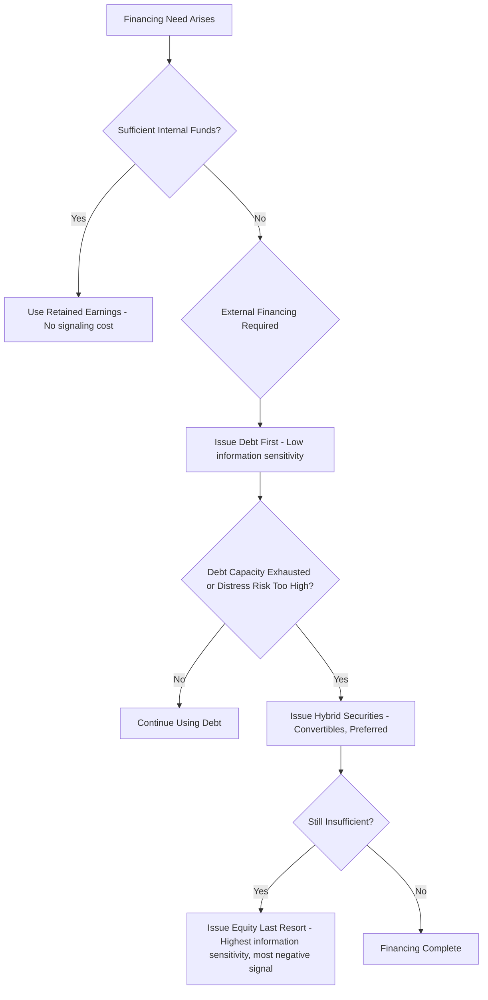

## Signaling Through Financing Choices

### Conceptual Foundation

Signaling theory in corporate finance addresses how firms' financing decisions convey information to outside investors under conditions of **asymmetric information** — where managers possess private information about firm value, prospects, or investment opportunities that outside investors do not have. Because market participants cannot directly observe true firm quality, they rationally infer information from observable actions, including capital structure choices, dividend policy, and the method of financing new investments.

The foundational insight, formalized in models by Ross (1977), Leland and Pyle (1977), and Myers and Majluf (1984), is that financing choices are not merely mechanical funding decisions — they function as **signals** because different types of firms (high-quality vs. low-quality) face different costs of mimicking each other's financing behavior. A signal is credible in equilibrium only if it is costly enough that low-quality firms would not find it profitable to imitate high-quality firms' behavior (a **separating equilibrium**).

### Ross (1977): Debt as a Signal of Firm Quality

Stephen Ross's model treats capital structure as a **signaling device** used by managers who possess private information about future cash flows.

#### Model Intuition

Managers of high-quality firms (with stable, high expected future cash flows) have an incentive to signal this quality to the market. Ross proposes that firms use **debt level** as this signal, because:

- Debt entails a fixed, legally binding obligation to pay interest and principal.
- If a firm's actual cash flows fall short of these obligations, the firm faces bankruptcy, penalties, or managerial reputational/compensation losses.
- Because high-quality firms are more confident in their ability to service higher debt loads without triggering distress, they can credibly take on more debt than low-quality firms are willing to risk.
- Low-quality firms, if they attempted to mimic high debt levels, would face a materially higher expected probability of costly distress or bankruptcy, making imitation unprofitable.

**Key Points**

- The result is a **separating equilibrium**: higher leverage signals higher (perceived) firm quality, and the market revises its valuation of the firm upward upon observing an increase in debt (or a leverage-increasing transaction, such as a debt-for-equity exchange offer).
- Managerial compensation structures that penalize managers for bankruptcy are essential to the model — without a personal cost to managers from failure, the signal would not be credible.

$$\text{Market's inferred firm value} = f(\text{observed leverage}), \quad \frac{\partial f}{\partial D} > 0 \text{ (in Ross's separating equilibrium)}$$

### Leland and Pyle (1977): Ownership Retention as a Signal

Leland and Pyle model signaling in the context of **entrepreneurial firms going public**, focusing on the fraction of equity the entrepreneur/insider retains rather than sells to outside investors.

#### Model Intuition

- Entrepreneurs have private information about the true quality/risk of their project's cash flows.
- Because entrepreneurs are typically risk-averse and underdiversified, retaining a larger equity stake is personally costly (it concentrates the entrepreneur's wealth in a single, undiversified asset).
- An entrepreneur with a genuinely high-quality project is willing to bear this diversification cost because they are confident in the project's value; an entrepreneur with a low-quality project is not willing to bear the same cost, since the expected payoff does not justify the risk concentration.
- Consequently, the **fraction of equity retained by insiders** signals project quality: higher insider ownership retention signals higher quality, and outside investors rationally pay a higher price per share for firms where insiders retain more ownership.

$$V(\text{firm}) = f(\alpha), \quad \frac{\partial f}{\partial \alpha} > 0$$

where $\alpha$ is the fraction of equity retained by the entrepreneur/insider.

This model is frequently applied to IPO underpricing and ownership structure analysis, explaining why founders retaining large stakes post-IPO is often interpreted as a positive quality signal by the market.

### Myers and Majluf (1984): The Pecking Order and the Negative Signal of Equity Issuance

While the pecking order theory is often treated as a distinct topic, its signaling mechanism is central to understanding financing-choice signaling and deserves treatment here as a complementary (and in some ways contrasting) model to Ross's debt-signaling framework.

#### Model Intuition

- Managers act in the interest of **existing shareholders** and possess private information about firm value that outside investors lack.
- If managers believe the firm's equity is **undervalued** by the market, issuing new equity to fund a project would dilute existing shareholders at an unfairly low price — managers of undervalued firms therefore avoid equity issuance.
- If managers believe the firm's equity is **overvalued**, issuing equity is attractive because new investors would be overpaying, benefiting existing shareholders at new shareholders' expense.
- Rational outside investors anticipate this behavior. Therefore, **the announcement of a new equity issuance is interpreted as a negative signal** — the market infers that management believes the stock is overvalued, and the stock price tends to fall upon announcement.

$$\text{Market reaction to equity issuance announcement} < 0 \text{ (on average)}$$

$$\text{Market reaction to debt issuance announcement} \approx 0 \text{ or slightly negative (much smaller in magnitude)}$$

This asymmetry produces the **pecking order** of financing preferences:

**Key Points**

- Securities are ranked by **information sensitivity** — the degree to which their value depends on private information the manager holds. Internal funds have zero information sensitivity (no signal); debt has low sensitivity (value depends primarily on firm's ability to pay, less on precise firm value); equity has high sensitivity (value is a direct residual claim tied to firm value).
- The pecking order is not necessarily driven by a target optimal capital structure (contrast with static trade-off theory) — leverage in this framework is the *cumulative result* of historical financing decisions, not a deliberately targeted ratio.

### Comparing the Signaling Frameworks

| Model | Signal | Direction | Mechanism |
| --- | --- | --- | --- |
| Ross (1977) | Increase in debt level | Positive signal | Only high-quality firms can bear higher fixed obligations without excessive distress risk |
| Leland and Pyle (1977) | Entrepreneur's equity retention | Positive signal | Only confident insiders accept undiversified risk concentration |
| Myers and Majluf (1984) | New equity issuance | Negative signal | Managers issue equity mainly when they believe shares are overvalued |
| Myers and Majluf (1984) | Debt issuance (relative to equity) | Neutral to mildly negative | Lower information sensitivity reduces adverse selection discount |

### Dividend Policy as a Related Signaling Channel

Although distinct from capital structure per se, dividend signaling (Bhattacharya, 1979; Miller and Rock, 1985) operates on similar logic and is frequently discussed alongside financing signals:

- **Dividend increases** are typically interpreted as positive signals of sustainable future cash flow, because cutting a dividend later is costly to managerial reputation and often triggers a sharp negative stock price reaction — so managers only raise dividends when confident the higher payout is sustainable.
- **Dividend initiations or increases** tend to produce positive abnormal stock returns around the announcement date; **dividend cuts** tend to produce pronounced negative reactions, consistent with signaling asymmetry.
- Similarly, **share repurchases** are often interpreted as a signal that management believes shares are undervalued, since the firm is using cash to buy back stock at what it privately believes to be a discount to intrinsic value — paralleling the Myers-Majluf logic in reverse.

### Empirical Evidence on Financing-Announcement Signaling Effects

**Key Points**

- Numerous event studies find that stock prices react **negatively, on average**, to announcements of new seasoned equity offerings (SEOs), consistent with Myers-Majluf adverse selection. [Unverified — precise magnitude of average abnormal returns varies across studies, markets, and time periods.]
- Debt issuance announcements historically show a much smaller and often statistically insignificant average price reaction relative to equity issuance announcements, consistent with the lower information sensitivity of debt claims.
- Leverage-increasing exchange offers (debt-for-equity swaps) have been found in some empirical studies to produce positive abnormal returns, while leverage-decreasing exchange offers (equity-for-debt swaps) tend to produce negative abnormal returns — broadly consistent with Ross's debt-signaling prediction. [Unverified — findings vary by study and should be treated as general empirical tendencies rather than universal constants.]
- IPO studies have found relationships between founder/insider ownership retention and offering price/valuation broadly consistent with the Leland-Pyle framework, though the strength and robustness of this relationship vary across markets, time periods, and IPO regulatory regimes. [Unverified]

### Signaling Equilibrium Diagram

(svg_diagram)

<svg xmlns="http://www.w3.org/2000/svg" viewBox="0 0 720 400">
<text x="360" y="24" font-size="16" font-weight="bold" text-anchor="middle" fill="#1a1a1a">Separating Equilibrium: Debt Level as Quality Signal (svg_diagram)</text>
<line x1="90" y1="340" x2="650" y2="340" stroke="#333" stroke-width="2" />
<line x1="90" y1="340" x2="90" y2="50" stroke="#333" stroke-width="2" />
<text x="370" y="375" font-size="13" text-anchor="middle" fill="#333">Debt Level Chosen (D)</text>
<text x="40" y="195" font-size="13" text-anchor="middle" fill="#333" transform="rotate(-90 40 195)">Manager's Expected Cost</text>

<path d="M 90 330 C 200 300, 280 150, 340 60" stroke="#c0392b" stroke-width="3" fill="none" />
<text x="330" y="50" font-size="12" fill="#c0392b" font-weight="bold">Low-Quality Firm Cost of Debt</text>

<path d="M 90 335 C 300 320, 450 270, 620 190" stroke="#2e7d32" stroke-width="3" fill="none" />
<text x="480" y="255" font-size="12" fill="#2e7d32" font-weight="bold">High-Quality Firm Cost of Debt</text>

<line x1="400" y1="50" x2="400" y2="340" stroke="#999" stroke-width="1" stroke-dasharray="4,4" />
<circle cx="400" cy="290" r="5" fill="#1565c0" />
<text x="400" y="365" font-size="12" text-anchor="middle" fill="#1565c0" font-weight="bold">D* (Separating debt level)</text>
<text x="440" y="300" font-size="11" fill="#1565c0">High-quality firm chooses D ≥ D*</text>
<text x="440" y="320" font-size="11" fill="#1565c0">Low-quality firm cannot profitably mimic</text>
</svg>

**Interpretation**: At debt level $D^*$, the cost of bearing that leverage is low enough for a high-quality firm to be worthwhile but high enough that a low-quality firm would find imitation unprofitable (given its higher probability of distress at the same debt level). This cost divergence sustains the separating equilibrium in which observed debt level credibly reveals firm type.

### Practical and Strategic Implications

**Key Points**

- **Timing of security issuance**: Firms may time equity issuances to periods when they believe the market has less severe information asymmetry (e.g., after major disclosures, following analyst coverage initiation, or during periods of high market-wide investor sentiment) to minimize the negative signaling discount.
- **Choice of security type for acquisitions**: In M&A, stock-financed deals are often associated with more negative acquirer stock reactions than cash/debt-financed deals, consistent with signaling theory — the market infers that acquirers favor stock financing partly when they believe their own shares are overvalued.
- **Communication and investor relations**: Firms often pair financing announcements with additional voluntary disclosure to mitigate the adverse signal (e.g., explaining the use of proceeds for a specific high-NPV project rather than general corporate purposes, which can reduce — though not eliminate — the negative market reaction).
- **Interaction with trade-off and agency theories**: Signaling considerations are not the sole determinant of financing choice; they interact with tax-shield/distress-cost trade-offs and agency-cost considerations, meaning a full capital structure decision typically synthesizes signaling, trade-off, agency, and pecking-order factors rather than following any single theory in isolation.

### Limitations and Critiques of Signaling Models

- Signaling models generally rely on the assumption of a clean separating equilibrium; in practice, **pooling equilibria** (where different-quality firms choose similar financing strategies, and the market cannot distinguish them) can also arise depending on model parameters and the cost structure of signaling.
- Empirical support for pure signaling motives is difficult to disentangle from alternative explanations for the same observed patterns, such as trade-off theory (leverage changes reflecting target adjustment) or market-timing behavior (issuing equity when market valuations are favorable, independent of private-information signaling per se).
- Signaling costs assumed in these models (e.g., managerial penalties for bankruptcy in Ross's model, undiversified risk-bearing in Leland-Pyle) require specific institutional or contractual assumptions that may not hold uniformly across firms, industries, or markets.

### Conclusion

Signaling theory demonstrates that financing choices — debt issuance, equity issuance, ownership retention, and dividend policy — are not merely mechanical funding decisions but function as credible information conduits under asymmetric information. Ross's model shows how higher leverage can signal firm quality because only strong firms can safely bear the associated distress risk; Leland and Pyle show how entrepreneurial equity retention signals confidence in project quality; and Myers and Majluf show why equity issuance is typically interpreted as a negative signal, generating a pecking order in which firms prefer internal funds, then debt, then equity. These frameworks collectively explain empirically observed market reactions to financing announcements and provide a crucial complement to trade-off and agency-cost theories in explaining real-world capital structure behavior.

**Related Topics**

- Pecking order theory of capital structure (Myers and Majluf, 1984)
- Asymmetric information and adverse selection in corporate finance
- Dividend signaling and the dividend irrelevance debate (Miller and Modigliani vs. Bhattacharya)
- Share repurchases as undervaluation signals
- IPO underpricing and ownership retention
- Trade-off theory of capital structure
- Agency costs of debt and equity
- Market timing theory of capital structure
- Event study methodology in corporate finance
- Seasoned equity offerings (SEOs) and announcement effects