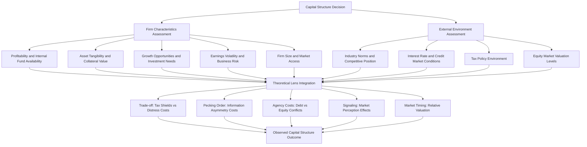

## Determinants of Capital Structure in Practice

### Conceptual Overview

While theoretical frameworks — Modigliani-Miller propositions, static trade-off theory, pecking order theory, agency cost theory, and signaling theory — provide the analytical foundations for understanding capital structure, empirical research has sought to identify which **firm-specific and macroeconomic factors** actually explain observed cross-sectional and time-series variation in leverage ratios. This body of work, often associated with researchers such as Titman and Wessels (1988), Rajan and Zingales (1995), Frank and Goyal (2009), and others, tests the predictive power of competing theories against real-world data and has identified a consistent, replicable set of empirical determinants.

No single theory fully explains observed capital structure patterns; in practice, firms' financing decisions reflect a blend of trade-off considerations, pecking-order behavior, agency dynamics, signaling effects, market timing, and institutional/regulatory constraints. The determinants below are organized by category, with the theoretical rationale and typical empirical relationship (direction of correlation with leverage) noted for each.

### Firm-Specific Determinants

#### 1. Profitability

**Key Points**

- **Empirical relationship**: Profitability is one of the most robust and consistently documented determinants — it is typically **negatively** correlated with leverage.
- **Trade-off theory prediction**: Would predict a *positive* relationship (more profitable firms have more taxable income to shield, and lower distress risk supports more debt capacity) — this is a well-known empirical puzzle where trade-off theory's directional prediction is often contradicted.
- **Pecking order explanation**: More profitable firms generate more internal funds (retained earnings), reducing their need for external financing altogether; when they do need external funds, they prefer debt over equity, but overall external financing need — and hence leverage — is lower for cash-generative firms. This is generally considered the better-fitting explanation for the observed negative relationship. [Inference: the pecking order explanation is the predominant interpretation in the literature, though the debate over trade-off vs. pecking-order fit for this specific relationship continues in various forms.]

#### 2. Firm Size

- **Empirical relationship**: Generally **positively** correlated with leverage (particularly with long-term and public debt).
- **Rationale**: Larger firms tend to be more diversified (lower earnings volatility, lower bankruptcy risk for a given leverage level), have lower relative direct bankruptcy costs (fixed-cost component of legal/administrative distress costs is a smaller percentage of larger firm value), and typically have greater access to public debt markets and lower information asymmetry (more analyst coverage, more public information, longer track records) — all of which support higher sustainable debt levels, consistent with trade-off theory.

#### 3. Asset Tangibility

- **Empirical relationship**: Generally **positively** correlated with leverage.
- **Rationale**: Tangible assets (property, plant, equipment) serve as effective collateral, reducing the severity of asset-substitution and underinvestment agency problems (secured lenders have a claim on specific, identifiable, often redeployable assets) and typically have higher liquidation value than intangible assets, reducing expected distress costs. This determinant is consistent with both trade-off theory and agency cost theory.

$$\text{Tangibility} = \frac{\text{Net PP\&E}}{\text{Total Assets}}$$

#### 4. Growth Opportunities (Market-to-Book Ratio)

- **Empirical relationship**: Generally **negatively** correlated with leverage.
- **Rationale**: Firms with substantial growth opportunities (proxied by market-to-book ratio, R&D intensity, or Tobin's Q) face heightened underinvestment/debt overhang risk (Myers, 1977) if they carry high leverage, since much of firm value derives from future investment options rather than assets in place. High-growth firms also tend to have greater information asymmetry regarding the value of future opportunities, reinforcing pecking-order-driven equity avoidance and reliance on internal funds/low leverage.

#### 5. Non-Debt Tax Shields

- **Empirical relationship**: Theoretically predicted **negative** relationship with leverage, though empirical support is mixed. [Unverified — findings across studies are notably inconsistent for this determinant specifically.]
- **Rationale**: Firms with substantial non-debt tax shields (depreciation, investment tax credits, net operating loss carryforwards) have less need for the interest tax shield to reduce taxable income, theoretically reducing the tax-related benefit of debt (DeAngelo and Masulis, 1980).

#### 6. Earnings Volatility / Business Risk

- **Empirical relationship**: Generally **negatively** correlated with leverage.
- **Rationale**: Higher cash flow volatility increases the probability of financial distress at any given debt level, raising expected distress costs (trade-off theory) and increasing the likelihood of covenant violations or missed payments, making creditors more reluctant to extend debt and firms more cautious about taking it on.

#### 7. Uniqueness / Asset Specificity

- **Empirical relationship**: Generally **negatively** correlated with leverage.
- **Rationale**: Firms producing unique products, or relying on specialized/customized assets and R&D-intensive processes, face higher costs if financial distress disrupts customer and supplier relationships (higher indirect distress costs), and specialized assets have thinner secondary markets (larger fire-sale discounts), discouraging high leverage (Titman and Wessels, 1988).

#### 8. Firm Age / Reputation / Track Record

- **Empirical relationship**: Generally **positively** correlated with leverage and improved access to debt markets over time, though newer firms sometimes rely more heavily on initial equity and trade credit due to lack of established creditworthiness.
- **Rationale**: Track record reduces information asymmetry with lenders and establishes reputational capital, supporting expanded debt capacity and market access over the firm's life cycle.

#### 9. Dividend Policy

- **Rationale**: Firms with established, stable dividend policies may have less flexibility for high leverage since dividend commitments compete with debt service for available cash flow; conversely, firms with residual cash after fixed obligations may sustain both moderate dividends and moderate leverage.

### Industry-Level Determinants

**Key Points**

- **Industry median leverage**: Firms tend to cluster around industry-median (or industry-average) leverage ratios, suggesting industry membership itself carries significant explanatory power — likely reflecting shared characteristics in asset tangibility, cash flow volatility, competitive dynamics, and regulatory environment across firms in the same industry.
- **Regulated industries** (utilities, financial institutions, telecommunications) often carry structurally higher leverage due to more stable, regulated cash flows and, in some cases, regulatory encouragement or requirements around capital structure.
- **Technology and R&D-intensive industries** tend to carry structurally lower leverage due to high intangible asset concentration, elevated growth options, and higher earnings volatility.
- **Capital-intensive industries** (manufacturing, transportation, energy, real estate) tend to carry higher leverage due to high asset tangibility supporting greater collateral-backed borrowing capacity.

### Macroeconomic and Market-Level Determinants

#### 1. Market Conditions and Market Timing

- Empirical evidence suggests that firms tend to issue equity when market valuations (and their own stock prices, relative to book value or historical valuations) are high, and rely more on debt when equity market conditions are less favorable — the **market timing theory** of capital structure (Baker and Wurgler, 2002). Under this view, current capital structure partly reflects the cumulative historical effect of past market-timing decisions rather than a deliberate target ratio.

#### 2. Interest Rate Environment

- Lower prevailing interest rates reduce the cost of debt financing, generally increasing the attractiveness of debt relative to equity, all else equal; conversely, higher rate environments raise debt service burdens and can shift the relative attractiveness of financing sources.

#### 3. Tax Policy

- Statutory corporate tax rate changes directly affect the value of the interest tax shield; jurisdictions or periods with higher corporate tax rates provide stronger tax-driven incentives toward debt financing (consistent with trade-off theory), while tax reforms reducing corporate rates (or introducing limitations on interest deductibility, such as thin-capitalization rules or interest expense caps) reduce this incentive.

#### 4. Credit Market Conditions

- Availability of credit (bank lending standards, bond market liquidity, credit spreads) affects firms' practical ability to access debt financing independent of firm-specific fundamentals — tighter credit conditions during financial crises or recessions can constrain leverage regardless of underlying firm characteristics.

#### 5. Legal and Institutional Environment

- Bankruptcy law regimes (creditor-friendly vs. debtor-friendly), corporate governance standards, investor protection laws, and financial market development all affect the relative costs and benefits of debt versus equity financing across countries, contributing to well-documented cross-country variation in observed capital structure patterns (La Porta et al. and related law-and-finance literature).

### Summary Table: Direction of Empirical Relationships with Leverage

| Determinant | Typical Empirical Relationship with Leverage | Primary Theoretical Explanation |
| --- | --- | --- |
| Profitability | Negative | Pecking order (internal funds substitute for debt) |
| Firm size | Positive | Trade-off (lower relative distress costs, better market access) |
| Asset tangibility | Positive | Trade-off / agency (collateral value, reduced distress costs) |
| Growth opportunities | Negative | Agency (underinvestment/debt overhang) / pecking order |
| Non-debt tax shields | Negative (mixed evidence) | Trade-off (substitute for interest tax shield) |
| Earnings volatility | Negative | Trade-off (higher distress probability) |
| Asset uniqueness | Negative | Trade-off / agency (higher indirect distress costs) |
| Firm age/reputation | Positive | Reduced information asymmetry, established track record |
| Industry median leverage | Positive correlation with firm's own leverage | Shared industry characteristics |

### Integrated Decision Framework

### Empirical Methodology Notes

**Key Points**

- Most empirical capital structure studies use panel regression methods (firm and year fixed effects) regressing leverage ratios (book or market debt-to-assets, debt-to-equity) on the firm characteristics above, often with industry and time controls.
- **Book leverage vs. market leverage**: Results can differ depending on whether leverage is measured using book value or market value of equity in the denominator, since market value of equity fluctuates with stock price independent of financing decisions — market timing effects, for instance, are typically more pronounced when leverage is measured using market values.
- **Target adjustment models**: Many studies estimate partial adjustment models, testing whether firms adjust toward a time-varying target leverage ratio, and if so, how quickly (adjustment speed estimates vary substantially across studies and specifications). [Unverified — estimated adjustment speeds differ considerably depending on model specification, data frequency, and sample composition.]
- Persistent challenges in this literature include endogeneity concerns (many "determinants" are themselves influenced by past financing decisions), the difficulty of cleanly separating competing theoretical explanations empirically (e.g., profitability's negative relationship with leverage is consistent with both certain trade-off model variants and pecking order theory), and cross-country/cross-time heterogeneity in results.

### Practical Synthesis for Financial Decision-Makers

**Key Points**

- In practice, CFOs and corporate finance practitioners typically do not rigidly apply a single academic theory; capital structure decisions reflect a **blend** of considerations: maintaining financial flexibility (reserve debt capacity for future opportunities — closely related to pecking order logic), peer/industry benchmarking, credit rating targets (many firms explicitly manage leverage to maintain a target credit rating), tax considerations, and market conditions at the time of financing need.
- **Credit rating targeting** is a widely cited practical consideration: firms often manage leverage ratios and coverage metrics to preserve a specific investment-grade or target rating tier, since rating downgrades can trigger higher borrowing costs, covenant triggers, and reduced access to commercial paper or other short-term funding markets.
- Life-cycle patterns are also commonly observed in practice: younger, high-growth firms tend to rely more on equity and internal funds; mature, stable-cash-flow firms tend to carry more debt, consistent with the aggregate effect of the determinants discussed above (growth opportunities decrease and tangible asset base/profitability stabilize over the firm life cycle).

### Conclusion

Empirical research identifies a robust set of firm-specific determinants of capital structure — profitability, size, asset tangibility, growth opportunities, earnings volatility, and asset uniqueness — along with industry, macroeconomic, and institutional factors that collectively shape observed leverage patterns. No single theoretical framework (trade-off, pecking order, agency cost, signaling, or market timing) fully explains the data in isolation; instead, real-world capital structure decisions reflect an interplay of these theories, filtered through firm-specific circumstances, industry norms, and prevailing market conditions. Understanding these empirical determinants equips financial analysts and corporate decision-makers to interpret observed capital structure choices and to benchmark a given firm's financing policy against theoretically-grounded and empirically-validated patterns.

**Related Topics**

- Trade-off theory of capital structure
- Pecking order theory of capital structure
- Agency costs of debt and equity
- Market timing theory of capital structure
- Target capital structure and adjustment speed models
- Credit ratings and their influence on financing decisions
- Cross-country capital structure variation and legal origin theory
- Life-cycle theory of corporate financing
- Costs of financial distress
- Signaling through financing choices