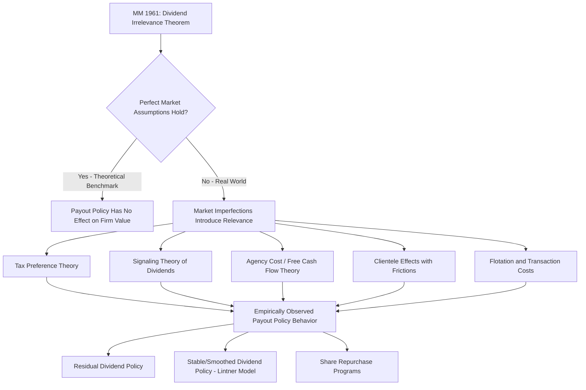

## Dividend Irrelevance Theory

### Conceptual Foundation

Dividend irrelevance theory, formalized by Franco Modigliani and Merton Miller (1961) in their seminal paper "Dividend Policy, Growth, and the Valuation of Shares," argues that under a specific set of idealized (perfect capital market) assumptions, a firm's choice of dividend payout policy has **no effect on its value** or on shareholder wealth. The firm's value is determined solely by the earning power and risk of its underlying assets and investment decisions — not by how the resulting cash flows are divided between dividends and retained earnings.

This is a direct extension of the broader Modigliani-Miller capital structure irrelevance logic (MM 1958) applied to payout policy rather than financing mix: in perfect markets, the way a fixed pie of value is "sliced" (whether paid out now as dividends or retained and reflected in capital gains) does not change the size of the pie.

### The MM Assumptions Underlying Dividend Irrelevance

**Key Points**

The dividend irrelevance proposition rests on the following idealized assumptions:

- **No taxes**: No differential tax treatment between dividends and capital gains, and no corporate or personal taxes at all in the base model.
- **No transaction costs**: Investors can buy and sell shares without brokerage fees, bid-ask spreads, or other trading frictions.
- **No flotation costs**: Firms can raise new capital (issue new shares) without underwriting fees or other issuance costs.
- **Symmetric information**: Managers and outside investors have identical information about the firm's future cash flows and investment opportunities (no signaling effects).
- **Fixed investment policy**: The firm's investment decisions (which projects to accept) are held constant and are independent of the dividend decision — dividend policy does not affect the set of positive-NPV projects the firm undertakes.
- **Rational investors** who are indifferent between receiving $1 of dividends versus $1 of capital appreciation, given no tax or transaction-cost wedge between the two.

### The Core Argument: Homemade Dividends

The central mechanism supporting irrelevance is the concept of **homemade dividends**: because investors can costlessly buy or sell shares to replicate any desired cash flow pattern, corporate dividend policy is redundant — investors can undo whatever payout policy the firm chooses.

#### Illustration of the Homemade Dividend Argument

**Example**

Consider an investor holding shares in a firm worth $100 per share, who desires $10 of cash this period.

*Scenario A — Firm pays a $10 dividend*: The investor receives $10 in cash. Ceteris paribus, the share price drops by the dividend amount (ex-dividend), to $90, since the firm has distributed $10 of value out of the company. The investor now holds $90 in stock plus $10 in cash — total wealth unchanged at $100.

*Scenario B — Firm pays no dividend*: The investor instead sells $10 worth of shares in the open market. The investor now holds $90 in stock plus $10 in cash from the sale — total wealth also $100.

In both scenarios, the investor ends up with identical total wealth ($100) and identical cash-plus-equity composition ($90 stock / $10 cash). The "homemade dividend" (selling shares) perfectly replicates the effect of an actual corporate dividend, demonstrating that the firm's payout choice is irrelevant to investor wealth under the MM assumptions.

Conversely, if an investor holding dividend-paying stock does **not** want the cash, they can simply use the dividend proceeds to purchase additional shares (reinvestment), again replicating the outcome of a no-dividend policy. This bidirectional flexibility is why MM conclude that dividend policy per se cannot affect share value — investors can synthesize any personal payout schedule they prefer regardless of the firm's actual policy.

### Formal Derivation

MM's formal proof proceeds by showing that firm value equals the present value of the firm's total cash flows generated by its investment policy, which is independent of how those cash flows are distributed between dividends and retained earnings (which fund investment or are reinvested on behalf of shareholders).

Consider a firm's value at time 0, given a fixed investment policy:

$$V_0 = \frac{D_1 + P_1}{1 + r}$$

where $D_1$ is the dividend paid at time 1, $P_1$ is the ex-dividend share price at time 1, and $r$ is the required return on equity. MM show that if the firm needs to raise $D_1$ in new equity to fund the dividend (since the investment policy — and thus internal cash generation — is held fixed), the resulting dilution to existing shareholders exactly offsets the value of the dividend received:

$$nP_0 = \frac{(n)(D_1 + P_1) - m \cdot P_1}{1+r} \cdot \text{(adjusted for new shares issued } m \text{ to fund the dividend)}$$

After accounting for the new shares $m$ issued at price $P_1$ to raise the cash needed to pay dividend $D_1$ (since investment policy is fixed and cannot be altered by the dividend decision), the algebra reduces to show that $nP_0$ (aggregate value to original shareholders) is **independent of $D_1$** — the dividend amount cancels out. This is the crux of the MM proof: paying a dividend and simultaneously raising equivalent replacement capital via new share issuance is a value-neutral transaction under perfect-market assumptions, since new investors pay a fair price for their claim, leaving original shareholders' aggregate wealth unchanged.

### Graphical Illustration of Ex-Dividend Price Adjustment

(svg_diagram)

<svg xmlns="http://www.w3.org/2000/svg" viewBox="0 0 700 380">
<text x="350" y="24" font-size="16" font-weight="bold" text-anchor="middle" fill="#1a1a1a">Ex-Dividend Price Adjustment and Investor Wealth (svg_diagram)</text>

<text x="175" y="60" font-size="13" font-weight="bold" text-anchor="middle" fill="#333">Scenario A: $10 Dividend Paid</text>

<rect x="90" y="80" width="80" height="180" fill="`#4a90d9`" opacity="0.85" />

<text x="130" y="175" font-size="12" text-anchor="middle" fill="white">Stock</text>

<text x="130" y="192" font-size="12" text-anchor="middle" fill="white">$90</text>

<rect x="180" y="240" width="80" height="20" fill="`#2e7d32`" opacity="0.85" />

<text x="220" y="254" font-size="11" text-anchor="middle" fill="white">Cash $10</text>

<text x="175" y="290" font-size="12" text-anchor="middle" fill="#333" font-weight="bold">Total Wealth: $100</text>

<text x="525" y="60" font-size="13" font-weight="bold" text-anchor="middle" fill="#333">Scenario B: Sell $10 of Shares</text>

<rect x="440" y="80" width="80" height="180" fill="`#4a90d9`" opacity="0.85" />

<text x="480" y="175" font-size="12" text-anchor="middle" fill="white">Stock</text>

<text x="480" y="192" font-size="12" text-anchor="middle" fill="white">$90</text>

<rect x="530" y="240" width="80" height="20" fill="`#2e7d32`" opacity="0.85" />

<text x="570" y="254" font-size="11" text-anchor="middle" fill="white">Cash $10</text>

<text x="525" y="290" font-size="12" text-anchor="middle" fill="#333" font-weight="bold">Total Wealth: $100</text>

<text x="350" y="180" font-size="28" text-anchor="middle" fill="`#c0392b`" font-weight="bold">=</text>

<text x="350" y="340" font-size="12" text-anchor="middle" fill="#555">Identical composition and total wealth: dividend policy is irrelevant to investor outcomes</text>

</svg>

### Investor Clientele Effect as a Reconciling Implication

Although MM argue dividend policy does not affect firm *value*, they acknowledge that different investors have different preferences for dividend income versus capital gains — driven by factors like tax bracket, liquidity needs, or institutional mandates (e.g., certain pension funds or trusts requiring current income). This gives rise to the **clientele effect**: firms attract specific investor clienteles whose preferences match the firm's payout policy, and firms do not need to alter policy to please all investors, since each clientele self-selects into firms offering their preferred payout style. In the pure MM world (no taxes/transaction costs), the clientele effect reinforces irrelevance — changing payout policy merely swaps one investor clientele for another, at no cost to firm value, since new clienteles arise to absorb any policy change without a valuation impact. [This clientele reasoning becomes materially more consequential once taxes and transaction costs are introduced, discussed below.]

### Relationship to Capital Structure Irrelevance (MM 1958)

**Key Points**

- Dividend irrelevance (MM 1961) is conceptually parallel to capital structure irrelevance (MM 1958): both propositions demonstrate that in perfect capital markets, the "packaging" or "slicing" of a fixed underlying cash flow stream (whether via debt/equity mix or dividend/retention mix) does not alter total firm value, which is determined solely by real asset productivity and risk, not financial engineering.
- Both propositions serve primarily as *theoretical benchmarks* — establishing a null hypothesis against which real-world market imperfections (taxes, transaction costs, asymmetric information, agency costs) can be introduced to explain why payout policy (and capital structure) *does* appear to matter empirically.

### Why Dividend Policy Matters in Practice: Relaxing the MM Assumptions

The theoretical elegance of irrelevance is widely used as a pedagogical baseline, but empirical observation clearly shows dividend policy changes are associated with significant stock price reactions, and firms devote substantial managerial attention to payout decisions — indicating the MM assumptions do not hold perfectly in practice. Relaxing each assumption reveals channels through which payout policy becomes relevant:

**Key Points**

- **Taxes**: When dividends and capital gains are taxed differently (historically, dividends often taxed at higher rates than long-term capital gains, and capital gains taxes can be deferred until realization), tax-disadvantaged dividends can reduce after-tax shareholder wealth relative to capital gains, creating a preference for share repurchases or low payout policies among taxable investors — this is the basis of the **tax-preference theory** of dividends.
- **Transaction costs**: If investors face brokerage costs or bid-ask spreads when constructing homemade dividends (selling shares to generate cash), a firm's actual dividend policy has value by saving investors these costs (or conversely, costs them if they must reinvest unwanted dividends).
- **Flotation costs**: If a firm must issue costly new equity to fund a dividend (since investment policy is fixed and internal funds are insufficient), these flotation costs represent a real value leakage that dividend payments can trigger, making high payout policy costly in a world with issuance costs — favoring retention.
- **Information asymmetry / signaling**: As MM's own follow-on literature (and Bhattacharya, 1979; Miller and Rock, 1985) explores, dividend changes convey information about managers' private assessment of future cash flow sustainability (see "Signaling through financing choices" for the parallel logic applied to capital structure) — a channel entirely absent from the pure MM dividend-irrelevance world.
- **Agency costs**: Dividends can reduce the free cash flow available for managerial misuse (echoing Jensen's free cash flow hypothesis), meaning payout policy can have real governance value in reducing agency costs of equity — again a channel excluded from the frictionless MM setting.
- **Behavioral factors**: Some investors exhibit "bird-in-hand" preferences (a documented behavioral tendency to prefer certain current dividends over uncertain future capital gains, even when MM show this preference should not affect share value under their assumptions) — while MM explicitly reject the bird-in-hand fallacy as a valuation argument (since the firm's risk is determined by its investment/operating policy, not its payout policy), the behavioral tendency itself can influence real-world investor demand and pricing dynamics.

### Common Misconception: The "Bird-in-Hand" Fallacy

**Key Points**

- A frequently cited counter-argument to MM is the **bird-in-hand theory** (associated with Gordon and Lintner), which argues investors prefer the certainty of current dividends to the uncertainty of future capital gains, and therefore require a lower return (implying a higher valuation) for dividend-paying stocks.
- MM directly rebut this argument: they demonstrate that the *riskiness* of a firm's cash flows is determined by its **operating and investment decisions**, not by its dividend policy — the firm's underlying business risk to shareholders is unaffected by whether cash is distributed now or later, since retained earnings are still shareholder wealth (reflected in expected future share price appreciation) and are subject to the same investment risk regardless of the payout decision.
- This is generally regarded as a **valuation fallacy** in the academic literature: preferring earlier cash is a matter of time-value/personal liquidity preference (fully addressable via homemade dividends), not evidence that the firm's fundamental risk—and hence its cost of capital and value—changes with payout timing. [Note: this is the mainstream academic position; it does not fully resolve behavioral or institutional dividend preferences seen in practice, which stem from the market-friction channels listed above rather than the original bird-in-hand risk argument.]

### Dividend Irrelevance vs. Real-World Payout Policy Frameworks

### Practical and Pedagogical Significance

**Key Points**

- Dividend irrelevance theory's primary practical value is as an **analytical baseline**: it isolates the conditions under which payout policy would not matter, thereby clarifying exactly which real-world frictions are responsible for observed payout-policy effects on valuation, stock price reactions, and corporate behavior.
- It underpins the broader corporate finance principle that **value is created by investment decisions** (real asset productivity, positive-NPV project selection), not by financial or payout engineering — a theme echoed throughout MM's broader body of work on capital structure and firm valuation.
- In valuation practice (e.g., discounted cash flow modeling), this principle supports the common convention of valuing a firm based on its total free cash flow generation capacity, independent of the specific dividend/retention split assumed in a particular period, provided reinvested cash earns the same required return as the firm's cost of capital.

### Empirical Reality Check

- Despite the theoretical irrelevance result, dividend **announcements** are empirically associated with significant abnormal stock returns (positive for increases/initiations, negative for cuts/omissions), which is generally attributed to the information/signaling content of the dividend change rather than a direct mechanical value effect of the payout itself — an observation fully consistent with MM's own framework, since MM's irrelevance proof assumes away information asymmetry; once that assumption is relaxed, dividend changes become informative and therefore price-relevant. [Unverified — precise magnitude of abnormal returns varies by study, market, and time period.]
- This means the MM irrelevance result is not empirically "falsified" by observed dividend-announcement price reactions; rather, those reactions are consistent with signaling and information effects operating *outside* the idealized assumptions of the base MM model, which the theory itself was never intended to preclude.

### Conclusion

Dividend irrelevance theory establishes that, under the idealized conditions of perfect capital markets — no taxes, no transaction costs, no flotation costs, symmetric information, and fixed investment policy — a firm's dividend payout policy has no effect on shareholder wealth or firm value, because investors can costlessly construct "homemade dividends" to replicate any desired personal cash flow pattern regardless of the firm's actual policy. While this result does not hold precisely in real-world markets due to taxes, transaction costs, signaling effects, and agency considerations, it remains foundational as an analytical baseline: it clarifies that observed real-world payout policy relevance stems specifically from market imperfections rather than from any inherent mechanical value effect of dividends themselves, and it reinforces the broader corporate finance principle that firm value is fundamentally determined by investment decisions rather than by financing or payout structure.

**Related Topics**

- Modigliani-Miller capital structure irrelevance propositions (MM 1958)
- Tax-preference theory of dividend policy
- Signaling theory of dividends (Bhattacharya; Miller and Rock)
- Clientele effects in dividend policy
- Agency costs and the free cash flow hypothesis (Jensen)
- Bird-in-hand fallacy and Gordon-Lintner critique
- Share repurchases vs. cash dividends
- Lintner's model of dividend smoothing
- Residual dividend policy
- Ex-dividend date price behavior