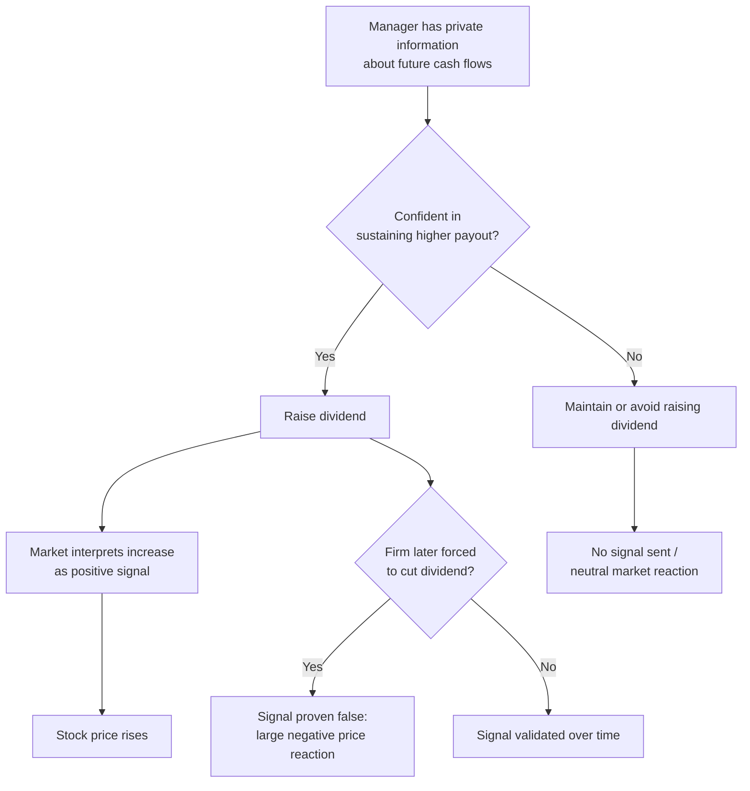
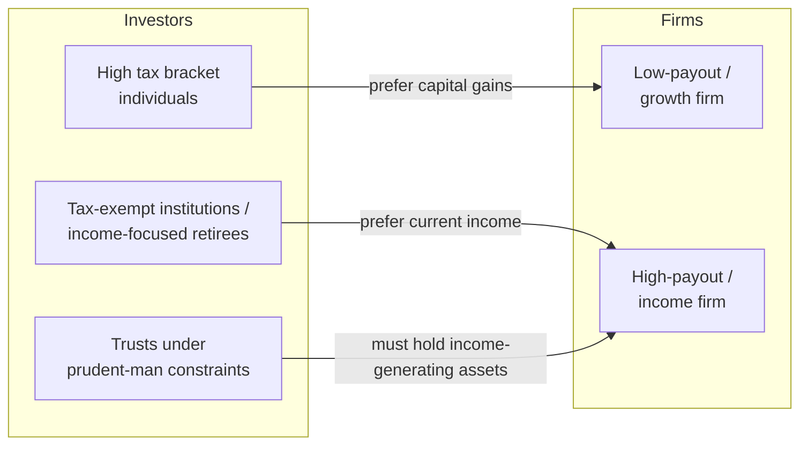

## Dividend Signaling and Clientele Effects

### Overview

Dividend signaling and clientele effects are two complementary theories explaining why dividend policy matters in practice despite the Modigliani-Miller (1961) irrelevance proposition, which holds under perfect capital markets (no taxes, no transaction costs, no asymmetric information, no agency conflicts). Signaling theory addresses *why* firms use dividends to convey information to markets under information asymmetry. Clientele theory addresses *why* different investor groups self-select into firms with particular dividend policies based on tax status, income needs, and institutional constraints.

### Theoretical Foundation: Why MM Irrelevance Breaks Down

Under Modigliani-Miller assumptions, a firm's value depends only on the earning power of its assets and investment policy, not on how earnings are split between dividends and retained earnings. Investors can create "homemade dividends" by selling shares if they want cash, or reinvesting dividends if they don't, making the firm's payout choice irrelevant.

Signaling and clientele theories both relax MM assumptions:

- **Signaling** relaxes the assumption of symmetric information between managers and outside investors.
- **Clientele effects** relax the assumptions of zero taxes and zero transaction costs.

---

### Part 1: Dividend Signaling Theory

#### Core Intuition

Managers possess private information about the firm's future cash flows that outside investors do not. Because dividend changes are costly to reverse (cutting a dividend triggers severe negative market reaction and signals distress), only managers who are confident about sustaining a higher payout will raise dividends. This makes dividend changes a *credible* signal — a form of costly signaling in the Spence (1973) tradition.

#### Key Points

- **Information asymmetry** is the necessary condition. If markets had full information about future cash flows, no signal would be needed.
- **Costly signal / separating equilibrium**: The signal must be costly enough that low-quality firms cannot profitably mimic it. A firm with weak future prospects that raises its dividend risks having to cut it later, incurring reputational and stock price penalties, so only genuinely strong firms find it worthwhile to signal this way.
- **Dividend increases** are generally interpreted as positive signals of sustainable higher future earnings.
- **Dividend decreases or omissions** are interpreted as strongly negative signals, since managers avoid cutting dividends unless the situation is severe. [Inference: the asymmetric market reaction — with cuts producing larger negative price responses than the positive response to comparable-sized increases — is a widely documented empirical pattern but magnitude varies across studies and time periods.]
- **Dividend smoothing / Lintner's model**: John Lintner's (1956) empirical model observed that managers set a long-run target payout ratio and adjust dividends toward it gradually rather than making dividends fully track volatile earnings. This partial-adjustment behavior itself is consistent with signaling — smoothing preserves the informativeness of a *change* in dividend.

#### Formal Models

**Bhattacharya (1979)** — one of the earliest formal signaling models. Dividends serve as a signal of cash flow, but paying dividends is costly because it may force the firm to access external capital markets, which carries transaction costs.

**Miller and Rock (1985)** — dividends signal current cash flow (not directly observable) because the dividend, plus retained earnings needed for investment, must reconcile with the firm's earnings identity. An unexpectedly high dividend implies higher-than-expected current earnings.

**John and Williams (1985)** — dividends signal firm value and are costly because dividend payments are taxed at a higher rate than capital gains; the tax cost is what makes the signal credible (this model bridges signaling and tax-clientele theory).

#### Lintner's Partial Adjustment Model

$$D_t = D_{t-1} + \text{SOA} \times (\text{POR} \times E_t - D_{t-1})$$

Where:

- $D_t$ = dividend in period $t$
- $D_{t-1}$ = dividend in prior period
- $\text{SOA}$ = speed-of-adjustment coefficient (0 to 1)
- $\text{POR}$ = target payout ratio
- $E_t$ = current earnings

A low SOA implies more smoothing (dividends adjust slowly toward the target), which is consistent with managers avoiding premature increases they may not be able to sustain.

#### Empirical Evidence

- **Dividend initiation and omission studies** (e.g., Michaely, Thaler, and Womack, 1995) find asymmetric price reactions: omissions produce larger negative abnormal returns than the positive abnormal returns from initiations.
- **Signaling vs. free cash flow hypothesis**: An alternative explanation (Easterbrook, 1984; Jensen, 1986) is that dividend increases reduce free cash flow available for managerial discretion, disciplining agency costs rather than signaling quality. [Unverified: which effect dominates empirically is still debated, and results vary depending on firm characteristics such as growth opportunities and ownership concentration.]
- **Post-signaling operating performance**: Some studies (e.g., DeAngelo, DeAngelo, and Skinner, 1996; Benartzi, Michaely, and Thaler, 1997) find dividend changes do *not* reliably predict future earnings changes, which challenges the strict信号ing interpretation. [Inference: this is a genuinely contested empirical area; the "information content of dividends" hypothesis has weaker support in predicting future earnings levels than it does in explaining the market's contemporaneous price reaction.]

#### Example

A mature telecom firm unexpectedly raises its quarterly dividend by 15%, despite flat reported earnings. The market interprets this as management's private signal that future cash flows will support the higher payout (e.g., a large capex cycle is ending). The stock price rises 3% on the announcement, even though current-period earnings gave no such indication. Six months later, if the firm is forced to cut the dividend back, the stock typically falls by a larger magnitude than the original 3% gain — reflecting the asymmetric penalty for a broken signal.

---

### Part 2: Dividend Clientele Effects

#### Core Intuition

Different investor groups have different tax situations, income needs, and regulatory constraints, causing them to prefer stocks with specific dividend policies. Firms therefore attract a "clientele" of investors matched to their payout policy, and a firm that changes its policy abruptly may see clientele-driven trading and price pressure as its investor base reshuffles.

#### Types of Clienteles

**1. Tax-Based Clienteles**

- In jurisdictions where dividend income is taxed at a higher rate than capital gains, high-marginal-tax-bracket investors prefer low-dividend, high-retention (growth) stocks, since deferring gains via price appreciation defers and potentially reduces tax liability.
- Tax-exempt or lower-bracket investors (pension funds, some retirees depending on jurisdiction, certain institutional structures) are relatively indifferent or may prefer higher dividends because they do not bear the tax penalty.
- Elton and Gruber (1970) provided classic empirical evidence: on ex-dividend dates, stock prices tend to drop by less than the full dividend amount, consistent with the marginal investor facing a tax disadvantage on dividends relative to capital gains. The ex-dividend price drop ratio has been used to infer the effective tax clientele of a stock's marginal investor.

**2. Institutional / Legal Clienteles**

- **Prudent-man rule / trust law**: Some fiduciaries (certain trusts, endowments) are legally required or constrained to spend only "income" (dividends/interest) and preserve principal, biasing them toward high-dividend stocks regardless of tax considerations.
- **Corporate investors**: In the U.S., corporations receive a dividends-received deduction (DRD) that partially or fully exempts intercorporate dividends from tax, making dividend-paying stocks relatively more attractive to corporate holders than to individuals in some contexts.
- **Regulatory payout requirements**: REITs and certain fund structures (e.g., RICs) are legally required to distribute a high percentage of taxable income (e.g., REITs generally must distribute at least 90% of taxable income to maintain pass-through tax status), which mechanically creates a clientele of income-oriented investors.

**3. Transaction-Cost Clienteles**

- Retirees and income-focused investors who rely on dividends for cash flow prefer high-payout stocks to avoid the transaction costs (brokerage fees, timing risk) of periodically selling shares to generate homemade dividends.
- This is distinct from the tax argument: even in a zero-tax world, transaction costs alone can generate a clientele preference.

#### Clientele Effect vs. Optimal Aggregate Policy

A key theoretical result (consistent with Black and Scholas 1974, and Miller and Modigliani's own discussion) is that clientele effects do **not** imply that any *individual* firm's dividend policy affects its value in equilibrium — clienteles simply *sort* investors to firms. If dividend policy were truly irrelevant at the margin, a firm changing its payout would only trigger a *reshuffling* of its shareholder base (existing high-tax-bracket clientele sells to low-tax-bracket buyers, or vice versa) rather than a permanent change in the firm's cost of capital or valuation, since supply and demand across the full cross-section of firms would already have matched clienteles to policies. This is the **clientele effect version of dividend irrelevance**: it explains cross-sectional variation in who holds which stock without necessarily implying any single firm can create value by adjusting payout, unless clienteles are undersupplied at the margin.

#### Empirical Evidence

- **Ex-dividend day studies**: Price drop ratios (price drop / dividend amount) less than 1.0 are widely documented and consistent with tax-based clienteles, though the effect is sensitive to short-term trading (dividend capture) by arbitrageurs, and results shift across regulatory tax regimes over time. [Inference: cross-country and cross-period comparisons show the effect is highly sensitive to the local dividend-vs-capital-gains tax differential, which supports the tax-clientele channel specifically rather than clienteles in general.]
- **Institutional ownership and dividend yield**: Studies find institutional investors (especially tax-exempt ones like pension funds) hold disproportionate shares of high-dividend-yield stocks, consistent with institutional/legal clientele sorting.
- **Clientele shifts after dividend policy changes**: Research (e.g., Michaely and Vila, 1996 on ex-day trading volume) shows abnormal trading volume around ex-dividend dates and around dividend initiation/omission announcements, consistent with clientele-driven portfolio rebalancing rather than pure information effects.

#### Example

A high-growth technology firm with a shareholder base concentrated in high-tax-bracket individual investors and growth-oriented mutual funds announces it will begin paying a large regular dividend for the first time. Existing clientele (who prefer capital gains for tax reasons or fund mandate) sell their shares; income-oriented investors (retirees, income funds, some pension funds) buy in. The net effect on firm value is theoretically ambiguous under pure clientele theory — it is primarily an ownership *composition* change — but in practice the transition can create short-term price pressure and elevated trading volume as the reallocation occurs. [Inference: whether such reallocation has a lasting valuation effect versus being purely transitory depends on whether the "supply" of the newly demanded clientele type was already saturated elsewhere in the market.]

---

### Interaction Between Signaling and Clientele Effects

These two theories are not mutually exclusive and are sometimes combined:

- **John and Williams (1985)** model dividends as costly signals precisely *because* of the tax clientele disadvantage — the tax cost of paying a dividend is what makes the signal credible, unifying both frameworks into a single mechanism.
- A dividend initiation can simultaneously (a) signal favorable private information about future cash flows, and (b) trigger a clientele shift toward income-oriented investors, making it empirically difficult to cleanly separate which effect drives an observed price reaction. [Unverified: disentangling the marginal contribution of each channel in a given empirical dataset generally requires structural identification strategies, and results are sample-dependent.]

---

### Comparison Table

| Dimension | Signaling Theory | Clientele Theory |
| --- | --- | --- |
| Market friction relaxed | Information asymmetry | Taxes / transaction costs |
| Mechanism | Dividend changes convey private manager information | Investors self-select into matching payout policies |
| Predicted price reaction | Asymmetric: sharp negative reaction to cuts, positive to increases | Reshuffling of shareholder base; ambiguous net value effect |
| Key empirical proxy | Announcement-period abnormal returns | Ex-dividend day price-drop ratio; institutional ownership patterns |
| Foundational papers | Bhattacharya (1979); Miller and Rock (1985) | Elton and Gruber (1970); Miller and Modigliani (1961) |

---

### Diagram: Signaling Mechanism (svg_diagram)

### Diagram: Clientele Sorting (svg_diagram)

---

### Practical Implications for Corporate Managers

- **Avoid unsustainable signals**: Raising dividends creates an implicit commitment; managers should be confident in the sustainability of a higher payout before signaling, given the asymmetric penalty for reversal.
- **Anticipate clientele shifts**: Initiating or substantially changing dividend policy will likely trigger a change in the shareholder base composition, with potential short-term price and volume effects independent of any information content.
- **Share repurchases as an alternative signal**: Firms wary of the "sticky" commitment nature of dividends may prefer repurchases to return cash, since repurchases carry more flexibility and lower expectations of continuation. [Inference: whether repurchases signal similarly credible information as dividends is a separate stream of literature (e.g., Vermaelen, 1981) and is not identical to dividend signaling in mechanism, since repurchases are typically not committed to recur.]
- **Tax regime sensitivity**: The strength of clientele effects is directly tied to the prevailing tax code's treatment of dividends versus capital gains; managers operating across jurisdictions with different dividend tax treatments should expect different clientele dynamics in each market.

---

**Related Topics**

- Share repurchases as a signaling and payout mechanism
- Lintner's dividend smoothing model in depth
- Free cash flow hypothesis and agency costs of dividends (Jensen, 1986)
- Ex-dividend day price behavior and tax-based arbitrage
- Dividend policy irrelevance under perfect markets (Modigliani-Miller, 1961)
- Catering theory of dividends (Baker and Wurgler, 2004)
- Payout policy in emerging markets vs. developed markets
- Dividend policy and the life-cycle theory of the firm