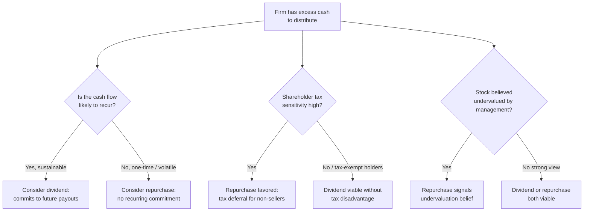

## Share Repurchases Versus Cash Dividends

### Overview

Share repurchases (buybacks) and cash dividends are the two primary mechanisms by which firms return capital to shareholders. While both reduce cash on the balance sheet and return value to investors, they differ substantially in tax treatment, flexibility, signaling properties, effect on capital structure, and impact on per-share metrics. The choice between them is a central question in payout policy and has shifted materially over recent decades, with repurchases becoming the dominant form of payout for many large public firms.

### Core Mechanics

**Cash dividend**: A pro-rata cash distribution to all shareholders of record as of a specified date, typically paid quarterly for regular dividends. Every shareholder receives cash proportional to their holdings; ownership percentage is unaffected.

**Share repurchase**: The firm uses cash to buy back its own shares, reducing the share count outstanding. Only shareholders who choose to sell participate directly; non-selling shareholders see their proportional ownership of the firm increase.

#### Key Points

- A dividend is **involuntary** for the shareholder (cash is received whether wanted or not, and is taxed accordingly in most jurisdictions); a repurchase is **voluntary** (only tendering/selling shareholders receive cash).
- A repurchase mechanically increases earnings per share (EPS) by reducing the share count denominator, all else equal, whereas a dividend does not directly affect EPS.
- Both reduce cash and stockholders' equity by the same total dollar amount, holding the transaction size constant.

---

### Methods of Share Repurchase

**1. Open Market Repurchase**

The firm buys back shares on the open market over time, similar to any other investor, subject to trading volume and timing constraints (e.g., in the U.S., SEC Rule 10b-18 provides a safe harbor with volume, timing, and price conditions).

**2. Fixed-Price Tender Offer**

The firm offers to buy back a specific number of shares at a specific price (typically at a premium to the current market price), open to all shareholders for a set period.

**3. Dutch Auction Tender Offer**

The firm specifies a range of prices; shareholders indicate how many shares they will sell at each price in the range. The firm determines the lowest clearing price that allows it to buy the desired number of shares.

**4. Accelerated Share Repurchase (ASR)**

The firm pays an investment bank upfront for a large block of shares; the bank borrows shares from its own inventory or the market to deliver them immediately, then buys shares over subsequent weeks/months to cover its position, with a final price-based settlement (true-up) between the firm and the bank.

**5. Targeted/Negotiated Repurchase**

The firm buys shares directly from a specific large shareholder in a privately negotiated transaction, sometimes at a premium (historically associated with "greenmail" in hostile-takeover defense contexts).

---

### Tax Treatment Comparison

| Dimension | Cash Dividend | Share Repurchase |
| --- | --- | --- |
| Tax trigger for shareholder | Mandatory, taxed in the year received (for all holders) | Only realized by shareholders who sell; non-sellers defer tax indefinitely |
| Tax character (typical) | Ordinary income or qualified dividend rate, depending on jurisdiction/holding period | Capital gains treatment (often only on the gain portion, not the full proceeds) |
| Effect on cost basis | No adjustment to basis | Selling shareholders reduce basis by shares sold; remaining shareholders' basis unaffected |

[Inference: the specific tax-rate differential between dividends and capital gains, and whether "qualified dividend" treatment applies, is jurisdiction- and holding-period-dependent, and has changed materially across U.S. tax law changes since 2003 (e.g., Jobs and Growth Tax Relief Reconciliation Act taxing qualified dividends at capital-gains rates). Firms operating internationally face materially different clientele incentives depending on local tax code.]

Because non-selling shareholders in a repurchase can defer taxation (and selling shareholders only pay tax on the *gain*, not the full distribution), repurchases are generally more tax-efficient than dividends for taxable investors in regimes where dividend income is taxed at a disadvantage relative to capital gains. This tax advantage is a major driver of the U.S. shift toward repurchases since the 1980s.

**U.S. excise tax on buybacks**: The Inflation Reduction Act of 2022 introduced a 1% federal excise tax on the fair market value of stock repurchased by publicly traded U.S. corporations, effective for repurchases after December 31, 2022, which partially narrows (but does not eliminate) the tax advantage of buybacks over dividends for U.S. firms. [Verify current rate and any subsequent legislative changes via web search if precision on the current statutory rate is required, since tax law is subject to amendment.]

---

### Signaling Differences

#### Dividends

- Dividend increases are viewed as **strong commitments**; markets penalize cuts asymmetrically and severely (see dividend signaling theory).
- Because of this commitment effect, managers are reluctant to raise dividends unless confident the higher payout is sustainable.

#### Repurchases

- Repurchases are generally viewed as **more flexible, non-recurring** signals. A firm can execute an authorized buyback program partially, pause it, or let it lapse without the same reputational penalty a dividend cut incurs.
- Repurchases are often interpreted as signaling that management believes the stock is **undervalued** (Vermaelen, 1981; Comment and Jarrell, 1991), since the firm is effectively investing in itself at the prevailing price rather than distributing cash unconditionally.
- Announced repurchase authorizations are frequently **not fully executed**; actual completion rates vary and the "authorization" itself may carry weaker informational content than the subsequent actual buying activity. [Inference: the gap between announced authorization size and actually executed repurchases is well documented empirically, though the magnitude of this gap varies by study period and market.]

---

### Effect on Financial Metrics

#### Earnings Per Share (EPS)

A repurchase mechanically raises EPS (assuming positive earnings) by shrinking the share count:

$$\text{EPS}_{\text{post}} = \frac{\text{Net Income}}{\text{Shares Outstanding} - \text{Shares Repurchased}}$$

This creates a potential agency concern: managers whose compensation is tied to EPS targets may have an incentive to use repurchases to mechanically inflate EPS rather than because the repurchase is the value-maximizing use of cash. [Inference: whether EPS-linked compensation systematically drives excess repurchase activity is an active empirical research question, with mixed findings depending on methodology and sample.]

#### Return on Equity (ROE)

Repurchases reduce total shareholders' equity (the denominator), which mechanically raises ROE for a given level of net income, independent of any change in underlying operating profitability.

$$\text{ROE} = \frac{\text{Net Income}}{\text{Shareholders' Equity}}$$

#### Leverage

Because repurchases reduce equity while (typically) leaving debt unchanged, they mechanically increase financial leverage (debt-to-equity ratio), which can be a deliberate capital structure lever — firms sometimes use debt-funded repurchases specifically to move toward a higher target leverage ratio.

---

### Example: Comparing the Two Mechanisms

A firm has:

- Net income: $100 million
- Shares outstanding: 50 million
- Current EPS: $2.00
- Stock price: $40
- Decides to distribute $20 million to shareholders

**Option A — Cash dividend:**

- Dividend per share: $20M / 50M shares = $0.40/share
- All 50 million shares remain outstanding
- EPS unchanged at $2.00
- Every shareholder receives $0.40/share in taxable cash, regardless of preference

**Option B — Share repurchase:**

- At $40/share, the firm repurchases: $20M / $40 = 500,000 shares
- New shares outstanding: 49.5 million
- New EPS: $100M / 49.5M = $2.02 (a ~1% increase)
- Only shareholders who chose to sell receive cash; remaining shareholders now own a slightly larger proportional stake in the firm and realize no immediate tax event

Under Modigliani-Miller-style perfect-market assumptions (no taxes, no signaling, no transaction costs), both options leave *total* shareholder wealth unchanged — Option B simply concentrates cash among selling shareholders while raising the proportional stake of remaining shareholders, and the stock price should adjust downward to $40 exactly offsetting the EPS gain in P/E terms if the market is efficient and no new information is conveyed. In practice, taxes, signaling, and flexibility create the actual real-world differences described above.

---

### Diagram: Decision Factors (svg_diagram)

---

### Agency Cost Considerations

- **Free cash flow hypothesis (Jensen, 1986)**: Both dividends and repurchases reduce cash under managerial control, mitigating the agency problem of managers overinvesting in low-return projects ("empire building"). Repurchases and dividends both serve this disciplining function, though repurchases offer managers more discretion over timing and amount, which can itself be an agency-relevant feature (positive or negative depending on framing).
- **Executive compensation interactions**: Because many executive compensation plans are tied to EPS growth or stock price performance, repurchases can directly benefit management's own compensation metrics, raising governance questions about whether repurchase decisions are being made in shareholders' broad interest versus management's narrower incentive alignment. [Inference: this is a governance concern raised in the literature and financial press; the extent to which it explains aggregate repurchase behavior versus legitimate capital allocation is empirically contested.]

---

### Empirical Trends

- U.S. aggregate share repurchases have grown substantially relative to dividends since the 1980s, with repurchases exceeding dividends as a share of total corporate payout for large-cap firms in many years since the early 2000s. [Inference: exact relative magnitudes fluctuate year to year with market conditions, tax law changes (e.g., the 2022 excise tax), and macroeconomic cycles; current-year figures should be verified via up-to-date data sources rather than assumed static.]
- Dividend-paying firms have, on average, become a smaller share of all publicly listed firms over recent decades in the U.S. (the "disappearing dividends" phenomenon documented by Fama and French, 2001), partly attributed to a changing population of publicly listed firms (more small, high-growth firms) and partly to substitution toward repurchases.

---

### Practical Considerations for Corporate Managers

- **Flexibility vs. commitment tradeoff**: Dividends signal confidence and commitment but constrain future flexibility; repurchases preserve flexibility but may carry a weaker or more ambiguous signal.
- **Timing and price sensitivity**: Because repurchases are executed against a market price, poorly timed buybacks (e.g., repurchasing heavily when the stock is later shown to have been overvalued) can destroy shareholder value even though they may still mechanically raise EPS.
- **Combination strategies**: Many mature firms use a mixed strategy — a stable, modestly growing "base" dividend supplemented by variable-sized repurchase programs, allowing the dividend to preserve its signaling credibility while repurchases absorb fluctuations in excess free cash flow.
- **Regulatory and disclosure environment**: Firms operating in jurisdictions with buyback excise taxes, disclosure mandates on repurchase activity, or restrictions on repurchases during defined periods (e.g., blackout periods around earnings) must factor these constraints into the payout method decision.

---

**Related Topics**

- Dividend signaling and clientele effects
- Free cash flow hypothesis and agency costs (Jensen, 1986)
- Accelerated share repurchase (ASR) mechanics and accounting treatment
- Dutch auction tender offers: bidding mechanics and clearing price determination
- Executive compensation design and buyback incentive alignment
- Optimal capital structure and leverage targeting via repurchases
- "Disappearing dividends" phenomenon (Fama and French, 2001)
- Cross-jurisdictional tax treatment of corporate payout methods