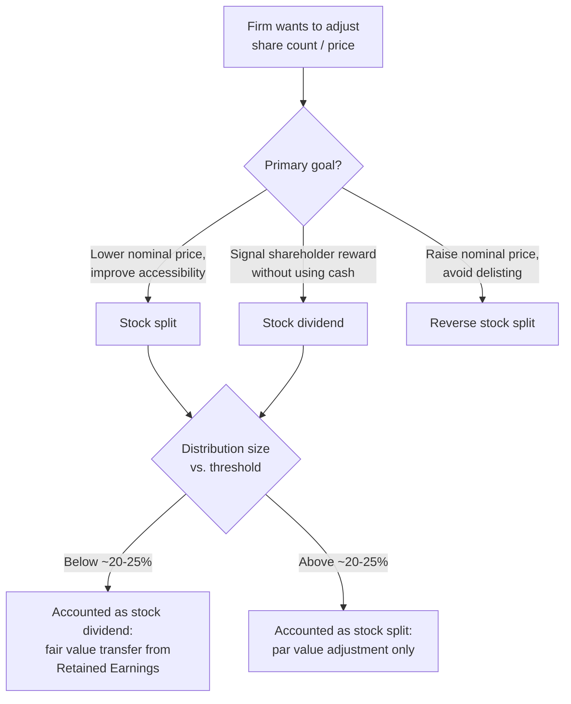

## Stock Dividends and Stock Splits

### Overview

Stock dividends and stock splits are payout-adjacent corporate actions that distribute additional shares to existing shareholders rather than cash. Unlike cash dividends or repurchases, neither transfers real economic value out of the firm — both are primarily bookkeeping and share-count adjustments that proportionally increase the number of shares each shareholder holds without changing anyone's percentage ownership or (under efficient-market assumptions) the shareholder's total wealth. They are typically motivated by considerations such as share price optics, liquidity, and signaling, rather than cash distribution.

### Core Mechanics

**Stock dividend**: The firm issues additional shares to existing shareholders in proportion to their current holdings, expressed as a percentage (e.g., a 10% stock dividend means a shareholder with 100 shares receives 10 additional shares). Accounted for by transferring an amount from retained earnings to the common stock (and additional paid-in capital) accounts on the balance sheet.

**Stock split**: The firm increases the number of shares outstanding by a specified ratio (e.g., 2-for-1, 3-for-1) without any transfer between equity accounts — each shareholder's existing shares are simply subdivided into more shares, and par value per share (if applicable) is proportionally reduced.

**Reverse stock split**: The inverse operation — shares outstanding are reduced by a specified ratio (e.g., 1-for-10), increasing the per-share price proportionally. Often used to regain compliance with minimum listing price requirements on an exchange, or to reduce the number of very small "odd-lot" shareholders.

#### Key Points

- Both stock dividends and stock splits **do not distribute any cash or assets** out of the firm; total shareholders' equity is unchanged.
- Both proportionally **dilute EPS** and reduce the stock price per share, while leaving total market capitalization theoretically unchanged (absent signaling effects).
- **Convention distinguishing the two**: Stock distributions below approximately 20-25% of previously outstanding shares are typically treated/accounted for as "stock dividends" (requiring a transfer from retained earnings at fair market value); distributions above that threshold are typically treated as "stock splits" (requiring only a par value adjustment, with no retained earnings transfer). This threshold convention varies somewhat by accounting guidance and jurisdiction. [Inference: the specific percentage threshold is a widely cited accounting convention rather than a universal bright-line rule, and firms/auditors may apply judgment near the boundary.]

---

### Accounting Treatment

#### Small Stock Dividend (below ~20-25% threshold)

Recorded at **fair market value** of the shares issued:

$$\text{Transfer from Retained Earnings} = \text{Shares Issued} \times \text{Market Price per Share}$$

This amount is credited to Common Stock (at par value) and Additional Paid-in Capital (the excess over par), with a corresponding debit to Retained Earnings.

#### Large Stock Dividend / Stock Split (above ~20-25% threshold, or split-effected)

Recorded at **par value** only, if a par value adjustment mechanism is used, or via a memo entry if no-par shares are involved:

$$\text{Transfer} = \text{Shares Issued} \times \text{Par Value per Share}$$

For a **pure stock split** (e.g., 2-for-1), typically no dollar entries are needed at all — only the par value per share and the share count are adjusted proportionally (e.g., $1.00 par value becomes $0.50 par value, share count doubles), leaving total Common Stock account value, Additional Paid-in Capital, and Retained Earnings all unchanged in dollar terms.

#### Example — Small Stock Dividend Accounting

A firm has 10 million shares outstanding, $1 par value, stock trading at $50/share, and declares a 10% stock dividend (1 million new shares).

- Fair value transferred: 1,000,000 × $50 = $50,000,000
- Par value portion: 1,000,000 × $1 = $1,000,000 (credited to Common Stock)
- Excess over par: $50,000,000 − $1,000,000 = $49,000,000 (credited to Additional Paid-in Capital)
- Retained Earnings is debited $50,000,000

Net effect: Total equity is unchanged; the composition shifts from Retained Earnings into Common Stock and APIC.

#### Example — Stock Split Accounting

The same firm instead executes a 2-for-1 stock split.

- Shares outstanding: 10 million → 20 million
- Par value per share: $1.00 → $0.50
- Total Common Stock account value: 20,000,000 × $0.50 = $10,000,000 (unchanged from 10,000,000 × $1.00)
- No transfer from Retained Earnings occurs

---

### Effect on Per-Share Metrics

Both actions proportionally adjust per-share figures without changing the underlying economics:

$$\text{EPS}_{\text{post}} = \frac{\text{EPS}_{\text{pre}}}{\text{Split Ratio}}$$

$$\text{Price}_{\text{post}} \approx \frac{\text{Price}_{\text{pre}}}{\text{Split Ratio}}$$

For a 2-for-1 split: EPS of $4.00 becomes $2.00; a $100 stock price becomes approximately $50. Book value per share, dividends per share (if the firm maintains a stated per-share dividend policy), and all other per-share metrics are adjusted by the same ratio. Financial reporting standards require **retroactive restatement** of EPS for all prior periods presented in financial statements, so historical comparisons remain consistent.

---

### Rationale and Motivations

#### 1. Optical / Psychological Price-Range Management

Firms often believe there is an optimal "trading range" for their stock price that maximizes liquidity and accessibility, particularly for retail investors who may purchase shares in round lots. A very high nominal share price (e.g., several hundred or thousand dollars) can be perceived as less accessible to smaller investors, motivating a split to bring the price into a more familiar range. [Inference: whether an objectively "optimal trading range" exists is a matter of ongoing debate; some firms — most notably a small number of prominent companies — have deliberately never split, suggesting the retail-accessibility rationale is not universally accepted by all managements. The proliferation of fractional-share trading in recent years has also reduced this rationale's practical force for retail access specifically.]

#### 2. Signaling

Stock splits (and, historically, stock dividends) are sometimes interpreted by the market as a positive signal, since management typically initiates a split when it is confident the stock price will remain elevated (i.e., they don't want the nominal price to fall too low post-split, which could trigger delisting risk or minimum-price violations). Empirical studies (e.g., Grinblatt, Masulis, and Titman, 1984) have found modestly positive abnormal returns around stock split announcements, though the magnitude is generally smaller than reactions to cash dividend changes or earnings surprises. [Inference: the split signaling literature finds a statistically positive but economically modest announcement effect; interpretations of the underlying mechanism (pure signaling vs. improved liquidity vs. attracting a different investor clientele) vary across studies.]

#### 3. Liquidity Effects

A lower nominal share price with more shares outstanding can, in some cases, increase trading volume and narrow bid-ask spreads (particularly historically, under fixed minimum tick-size regimes), improving market liquidity. [Unverified: the liquidity benefit of splits has become less clear-cut in modern decimalized, algorithmically-traded markets, and some research finds splits can even widen relative bid-ask spreads in percentage terms due to increased retail order flow and reduced average order size.]

#### 4. Stock Dividends as a Substitute for Cash Dividends

Firms that wish to appear to be rewarding shareholders without depleting cash reserves (e.g., growth firms preserving cash for reinvestment, or firms facing liquidity constraints) sometimes use stock dividends as a lower-cost alternative to cash dividends, though sophisticated investors recognize a stock dividend transfers no real value and merely dilutes the per-share base.

#### 5. Reverse Splits — Distinct Motivations

- **Exchange listing compliance**: Major exchanges impose minimum bid price requirements (e.g., a sustained price above $1.00 on certain U.S. exchanges); firms trading near this floor may execute a reverse split to avoid delisting.
- **Reducing administrative costs**: Consolidating a large number of small "odd-lot" shareholder accounts can reduce transfer agent and mailing costs.
- **Signaling concern**: Reverse splits are frequently interpreted as a **negative** signal, since they are often associated with firms whose stock price has declined substantially and are attempting to avoid delisting or improve institutional perception, rather than reflecting operational strength. [Inference: this negative association is a well-documented market perception pattern, though the causal driver is typically the underlying price decline that preceded the reverse split, not the reverse split mechanism itself.]

---

### Diagram: Stock Split vs. Stock Dividend Decision Logic (svg_diagram)

---

### Comparison Table

| Dimension | Cash Dividend | Stock Dividend | Stock Split |
| --- | --- | --- | --- |
| Cash leaves the firm | Yes | No | No |
| Shareholder tax event (typical) | Yes, on receipt | Generally no (in most jurisdictions, absent a cash option) | No |
| Total shareholders' equity | Decreases | Unchanged | Unchanged |
| Retained Earnings | Decreases | Decreases (transferred to paid-in capital, small dividend) | Unchanged |
| Ownership percentage per shareholder | Unchanged | Unchanged | Unchanged |
| EPS effect | None directly | Diluted proportionally | Diluted proportionally |
| Typical signaling interpretation | Strong, sticky commitment signal | Weak/ambiguous | Mildly positive (forward confidence) |

---

### Practical Considerations for Corporate Managers

- **No real value creation**: Managers and boards should recognize that neither action distributes real economic value or improves fundamental firm performance; any market reaction is attributable to signaling, liquidity, or investor psychology effects rather than a change in cash flows or asset value.
- **Threshold awareness for accounting treatment**: Firms structuring a share distribution should be aware of the accounting threshold distinguishing "stock dividend" treatment (fair value transfer, reducing Retained Earnings) from "stock split" treatment (par value only), as this affects reported Retained Earnings and, in jurisdictions or covenants that reference Retained Earnings balances (e.g., certain debt covenants restricting dividends based on available Retained Earnings), could have downstream implications.
- **Communication and market expectations**: Because markets attach a modestly positive signal to forward-looking splits, some firms times split announcements deliberately, though the effect is generally smaller in magnitude than earnings or cash dividend announcements and should not be relied upon as a primary value-creation lever.
- **Reverse split stigma management**: Firms considering a reverse split for compliance reasons should be prepared to communicate the rationale clearly to counter the market's default negative association with reverse splits.

---

**Related Topics**

- Dividend signaling and clientele effects
- Share repurchases versus cash dividends
- Exchange listing requirements and minimum bid price rules
- Retained earnings restrictions and debt covenant implications
- Stock split announcement effects and market microstructure (tick size, liquidity)
- Par value and no-par stock accounting conventions