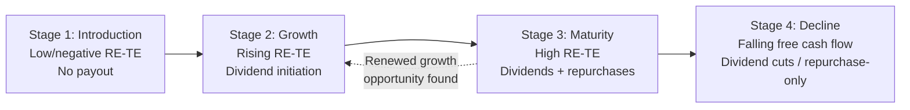

## Life Cycle Theory of Payout Policy

### Overview

The life cycle theory of payout policy holds that a firm's optimal dividend and repurchase behavior is systematically linked to its stage of maturity — proxied by variables such as profitability, growth opportunities, firm age, and the mix of internally generated versus externally raised capital. Young, high-growth firms with abundant investment opportunities but limited internally generated cash tend to retain all earnings and pay no dividends; mature firms with declining growth opportunities and substantial free cash flow tend to become dividend payers, and eventually may combine dividends with repurchases. This framework, most closely associated with DeAngelo, DeAngelo, and Stulz (2006), provides a unifying lens connecting payout policy to the broader corporate life cycle and to agency-cost considerations.

### Theoretical Foundation

#### Core Trade-off: The Earned/Contributed Capital Mix

DeAngelo, DeAngelo, and Stulz (2006) formalize the life-cycle hypothesis around the **mix of earned equity (retained earnings) versus contributed equity (capital raised from external sources, such as paid-in capital)** on the balance sheet, captured empirically by the ratio:

$$\text{RE/TE} = \frac{\text{Retained Earnings}}{\text{Total Shareholders' Equity}}$$

- **Low RE/TE ratio** (capital predominantly contributed/raised externally): characteristic of young firms still reliant on external financing relative to internally generated earnings. These firms are hypothesized to be poor candidates for paying dividends, since diverting scarce internal cash to shareholders while simultaneously needing to raise external capital is costly (external financing carries flotation costs and potential adverse-selection costs under information asymmetry).
- **High RE/TE ratio** (capital predominantly earned/retained internally): characteristic of mature firms that have accumulated substantial retained earnings relative to contributed capital, signaling that the firm has moved past the phase of needing to retain all earnings for growth, and has more of a "surplus" of internally generated capital relative to remaining investment opportunities.

The theory predicts, and DeAngelo, DeAngelo, and Stulz find empirically, that the RE/TE ratio is a strong predictor of the likelihood a firm pays a dividend, often stronger than profitability or growth measures used individually in earlier literature.

#### Key Points

- The life-cycle model integrates several earlier, separate strands of payout theory (signaling, agency costs, clientele effects) into a single framework organized around firm maturity rather than treating them as competing explanations.
- It explains a well-documented empirical regularity: **the propensity to pay dividends has historically been strongly correlated with firm age and profitability**, with young/small/high-growth firms rarely paying dividends and older/larger/mature firms much more likely to do so.
- It provides a natural explanation for why a firm's payout policy typically **evolves over its life** rather than being static: initiation of the first dividend, subsequent dividend growth, later supplementation with repurchases, and (in decline phases) potential dividend cuts or omissions.

---

### The Firm Life Cycle and Payout Stages

#### Stage 1 — Introduction / Early Growth

- Characteristics: negative or minimal earnings, high investment needs relative to internally generated cash, heavy reliance on external equity or debt financing, low or negative RE/TE ratio.
- Payout behavior: no dividends; typically no repurchases either, since cash is scarce and needed for investment and operations.
- Rationale: paying dividends while simultaneously raising external capital would be value-destructive due to the transaction costs and potential negative signaling of needing external financing shortly after (or concurrent with) a cash distribution.

#### Stage 2 — Growth

- Characteristics: earnings turn positive and begin growing, but substantial investment opportunities remain; the firm is increasingly able to internally fund a growing share of its investment needs, but the RE/TE ratio remains moderate.
- Payout behavior: dividend initiation typically begins in this phase as the firm's free cash flow starts to exceed its immediate reinvestment needs at the margin, though initial dividends and payout ratios tend to be modest.
- Related signaling consideration: dividend initiation in this phase is often interpreted as a positive credibility signal (see dividend signaling theory), since it indicates management's confidence that sufficient sustainable cash flow now exists to support a recurring distribution.

#### Stage 3 — Maturity

- Characteristics: growth opportunities decline relative to the firm's asset base and cash-generating capacity; RE/TE ratio rises substantially as retained earnings accumulate faster than the firm's ability to profitably reinvest them; free cash flow (per the Jensen 1986 agency framework) becomes economically significant.
- Payout behavior: dividends become a larger, more stable component of payout; firms in this stage increasingly supplement dividends with share repurchases to distribute variable or "excess" free cash flow without committing to a permanently higher dividend level (see share repurchases versus cash dividends).
- Agency rationale: distributing free cash flow in this stage mitigates the risk of value-destructive overinvestment or empire-building, consistent with the free cash flow hypothesis.

#### Stage 4 — Decline

- Characteristics: declining profitability, shrinking investment opportunities, potentially deteriorating balance sheet quality.
- Payout behavior: dividend cuts or omissions become more likely as sustainable free cash flow declines; per signaling theory, such cuts typically trigger significant negative market reactions given the asymmetric penalty associated with broken dividend commitments.
- Some declining firms may instead shift entirely to repurchases (if still generating cash but wishing to avoid the sticky commitment of a dividend) or wind down payout altogether if cash generation deteriorates severely.

---

### Diagram: Life Cycle Stages and Payout Evolution (svg_diagram)

---

### Empirical Evidence

- **DeAngelo, DeAngelo, and Stulz (2006)** find that the RE/TE ratio is among the strongest predictors of dividend-paying status in a large panel of U.S. firms, outperforming profitability and growth-opportunity proxies used individually.
- **Fama and French (2001)** document the "disappearing dividends" phenomenon — a declining propensity to pay dividends among U.S. public firms from the 1970s through the late 1990s — and attribute a substantial portion of the decline to a changing composition of publicly listed firms (an increasing share of newly listed firms being small, unprofitable, high-growth companies characteristic of Stage 1/2 in the life-cycle framework), consistent with the life-cycle prediction rather than a broad shift away from dividends by all firms uniformly.
- **Grullon, Michaely, and Swaminathan (2002)** find that dividend increases are associated with subsequent declines in firm risk and profitability growth rates, consistent with dividend increases signaling a firm's transition into a more mature phase with fewer growth opportunities (sometimes termed the "maturity hypothesis," closely related to the life-cycle framework).
- [Inference: the life-cycle theory is broadly complementary to, rather than a wholesale replacement of, signaling and agency-cost theories — it primarily explains *when in a firm's life* the conditions for signaling or agency-cost-driven payout become economically relevant, rather than proposing an entirely separate causal mechanism.]

---

### Relationship to Other Payout Theories

| Theory | Primary Driver | How Life-Cycle Theory Relates |
| --- | --- | --- |
| Signaling | Information asymmetry about future cash flows | Life-cycle explains *when* firms have sufficient sustainable cash flow to credibly signal via dividend initiation/increases |
| Clientele effects | Tax and institutional investor preferences | Life-cycle explains which clientele types (growth-oriented vs. income-oriented) a firm is likely to attract at each stage |
| Free cash flow / agency costs (Jensen, 1986) | Reducing managerial discretion over surplus cash | Life-cycle explains that free cash flow agency problems become economically significant primarily in the maturity stage, once investment opportunities decline relative to cash generation |
| Catering theory (Baker and Wurgler, 2004) | Investor sentiment/demand for dividend payers | Life-cycle is a complementary, more structural (firm-fundamentals-driven) explanation, as opposed to catering's more sentiment/demand-driven explanation |

---

### Practical Implications for Corporate Managers and Analysts

- **Payout policy as a diagnostic signal of firm stage**: Analysts can use a firm's payout behavior (no dividend vs. dividend initiation vs. mature dividend-plus-repurchase mix vs. dividend cuts) as a rough diagnostic of where the firm sits in its life cycle, complementing other fundamental analysis.
- **Timing dividend initiation**: Boards considering initiating a first dividend should evaluate not just current profitability but the durability of the RE/TE trend and the firm's remaining pipeline of positive-NPV investment opportunities, since premature initiation (before the firm has genuinely reached the point of surplus internally generated capital) raises the risk of a future costly reversal.
- **M&A and corporate development context**: A firm's life-cycle stage (as reflected in its payout policy) can inform acquirers or investors about the target's capital allocation discipline and the likely durability of its current payout policy post-transaction.
- **Portfolio construction implications**: Income-oriented investors seeking a sustainable and growing dividend stream may specifically screen for firms transitioning into or established within the maturity stage (rising RE/TE, moderating growth, initiating or sustaining dividends), consistent with clientele-effect sorting behavior.

---

**Related Topics**

- Dividend signaling and clientele effects
- Share repurchases versus cash dividends
- Free cash flow hypothesis and agency costs of managerial discretion (Jensen, 1986)
- "Disappearing dividends" phenomenon (Fama and French, 2001)
- Catering theory of dividends (Baker and Wurgler, 2004)
- Firm valuation across the corporate life cycle (Damodaran life-cycle framework)
- Capital structure decisions across firm maturity stages