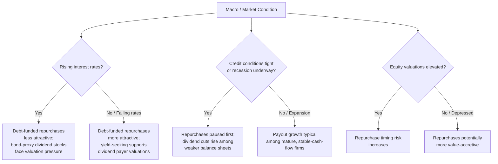

## Payout Policy Across Industries and Market Conditions

### Overview

Payout policy is not uniform across the economy: it varies systematically by industry (driven by differences in capital intensity, growth opportunities, cash flow volatility, and regulatory structure) and by macroeconomic and market conditions (driven by interest rates, credit availability, aggregate earnings, and investor sentiment). Understanding this cross-sectional and time-series variation extends the firm-level theories of payout (signaling, clientele effects, life-cycle, agency costs) into a broader framework for comparative and cyclical analysis.

### Cross-Industry Variation in Payout Policy

#### Key Drivers of Industry-Level Differences

- **Capital intensity and investment needs**: Industries requiring continuous heavy capital reinvestment (e.g., semiconductors, telecommunications infrastructure buildout phases, biotechnology R&D) tend to retain more earnings and pay lower or no dividends, consistent with life-cycle theory applied at the sector level.
- **Cash flow stability and predictability**: Industries with stable, predictable cash flows (utilities, consumer staples, mature industrials) are better positioned to sustain a stable dividend without the risk of a future cut, since dividend cuts carry a severe asymmetric signaling penalty.
- **Regulatory payout mandates**: Certain legal structures impose minimum payout requirements as a condition of favorable tax treatment — most notably REITs (Real Estate Investment Trusts), which in the U.S. are generally required to distribute at least 90% of taxable income to shareholders to maintain pass-through tax status, and Regulated Investment Companies (RICs)/mutual funds with similar distribution requirements. These structures mechanically produce high, and often less discretionary, payout ratios compared to ordinary corporations.
- **Growth-stage concentration by sector**: Technology and biotechnology sectors have historically been dominated by younger, high-growth firms reinvesting most or all cash flow, resulting in sector-wide low dividend participation rates relative to sectors like utilities, energy (in stable-price environments), and financials.
- **Capital structure and regulatory capital requirements**: Financial institutions (banks, insurers) are subject to regulatory capital adequacy requirements (e.g., Basel III capital ratios for banks) that directly constrain payout capacity — regulators can restrict or require supervisory approval for dividends and buybacks if a bank's capital ratios are near required minimums, particularly following stress-test results in jurisdictions with formal stress-testing regimes (e.g., the U.S. Federal Reserve's CCAR/stress capital buffer framework). [Inference: the specific mechanics and thresholds of bank payout restrictions are jurisdiction- and regime-specific and subject to periodic regulatory revision; current details should be verified against the applicable regulator's current rules if precision is required.]

#### Illustrative Sector Payout Patterns

| Sector | Typical Payout Characteristics | Primary Driver |
| --- | --- | --- |
| Utilities | High, stable dividend yield; low growth | Stable regulated cash flows; mature life-cycle stage; income-clientele demand |
| REITs | Very high mandated payout ratio | Regulatory pass-through tax requirement |
| Technology (growth-stage) | Low/no dividends; may use repurchases once mature | High reinvestment needs; early life-cycle stage; historically favored repurchases for flexibility |
| Biotechnology / early-stage pharma | Typically no payout | Negative or volatile earnings; heavy R&D reinvestment |
| Energy (commodity-linked) | Variable/volatile dividends; some use special dividends | Cash flows tied to volatile commodity prices; some firms adopt flexible/variable dividend frameworks explicitly to avoid the commitment problem of a fixed payout |
| Banks and financial institutions | Payout constrained by regulatory capital requirements | Capital adequacy regulation; stress-test-linked approval processes |
| Consumer staples | High, stable, often growing dividends ("dividend aristocrats" concentration) | Stable demand, mature life-cycle stage, strong free cash flow generation |

[Inference: these are generalized sector tendencies based on widely observed patterns; individual firm payout policy within any sector varies considerably, and sector characteristics themselves evolve over time (e.g., large technology firms that historically paid no dividends have in some cases initiated dividends and/or substantial repurchase programs as they matured).]

---

### Payout Policy Across Market and Macroeconomic Conditions

#### Interest Rate Environment

- **Rising rate environments**: Higher rates increase the relative attractiveness of fixed-income alternatives to dividend-paying equities for income-seeking investors, which can pressure the valuations of high-dividend-yield "bond proxy" stocks (e.g., utilities, REITs) that are sensitive to discount-rate changes. Higher rates also raise the cost of debt-funded repurchases, potentially reducing repurchase activity funded via new debt issuance.
- **Low/falling rate environments**: Cheaper debt financing can make debt-funded repurchases more attractive, and can also support elevated dividend-yield equity valuations as investors seek yield in a low-rate environment ("reach for yield" behavior).

#### Credit Market Conditions

- In periods of tight credit availability or elevated borrowing costs (e.g., credit market stress), firms — particularly those with lower cash reserves — may reduce or suspend repurchase programs and, in more severe cases, cut dividends to preserve liquidity and covenant compliance, since dividends and repurchases are typically lower priority than debt service and operational needs during periods of financial distress.
- Firms with strong balance sheets and stable cash flow may continue or even accelerate payout during downturns, partly to signal financial strength relative to more constrained peers (a competitive signaling dynamic).

#### Recessions and Earnings Downturns

- Aggregate dividend cuts and omissions tend to rise during broad economic downturns and earnings recessions, as more firms face declining or negative free cash flow. [Inference: the precise magnitude and breadth of aggregate dividend cuts in any specific downturn is empirically observable after the fact but varies by the severity, sector composition, and duration of the downturn; general statements about "typical" recession payout behavior should be treated as directional tendencies rather than precise forecasts.]
- Repurchase programs are generally more readily paused or reduced than dividends during downturns, consistent with the greater flexibility and weaker commitment nature of repurchases relative to dividends (see share repurchases versus cash dividends) — firms can suspend an authorized buyback program without the severe negative signaling penalty associated with a dividend cut.
- Regulatory intervention during severe systemic stress: in some historical episodes of acute financial-sector stress, regulators have directly restricted or suspended bank dividends and buybacks as a systemic risk mitigation measure (an example of regulatory override of ordinary payout decision-making during crisis conditions). [Unverified: specific historical instances and their exact scope should be verified against contemporaneous regulatory records if being cited for a specific episode, since the details are event- and jurisdiction-specific.]

#### Bull vs. Bear Equity Markets

- In sustained bull markets with elevated valuations, repurchases executed at high prices carry greater risk of destroying shareholder value if the elevated valuation later proves unsustainable, raising governance questions about repurchase timing discipline.
- In bear markets or periods of depressed valuations, repurchases can be value-accretive if management successfully buys back shares below intrinsic value, though distinguishing a genuinely undervalued price from a justified lower valuation (e.g., reflecting deteriorating fundamentals) is inherently difficult in real time.

---

### Diagram: Payout Sensitivity Across Conditions (svg_diagram)

---

### Cross-Country and Regulatory Variation

- **Tax regime differences**: The relative attractiveness of dividends versus repurchases varies substantially by country depending on the local tax treatment of dividend income versus capital gains (see dividend signaling and clientele effects for the underlying tax-clientele mechanism); some countries historically favored dividends due to imputation tax credit systems (crediting corporate tax already paid against individual shareholder tax liability on dividends), which reduces the double-taxation disadvantage of dividends relative to jurisdictions without imputation.
- **Legal system and investor protection**: La Porta et al. (2000) and related corporate governance literature find that dividend payout patterns correlate with the strength of minority shareholder legal protections — in weaker investor-protection regimes, dividends can serve a governance function by limiting the cash available for potential expropriation by controlling shareholders or insiders, whereas in stronger investor-protection regimes, payout policy is more purely a function of firm-level investment opportunity and life-cycle considerations. [Inference: this is an influential strand of comparative corporate finance literature; the precise magnitude of the investor-protection effect versus other cross-country drivers (tax regime, capital market development) remains an area of ongoing empirical refinement.]
- **State/government ownership considerations**: In economies with significant state ownership of large firms (e.g., certain state-owned enterprises), dividend policy can be influenced by government revenue needs in addition to, or instead of, the standard corporate finance considerations described above.

---

### Practical Implications for Analysts and Managers

- **Sector-relative benchmarking**: Payout ratio and yield analysis should generally be benchmarked against industry peers rather than the broader market, given the systematic sector-level differences in capital intensity, regulatory constraints, and life-cycle concentration described above.
- **Cyclical timing awareness**: Analysts evaluating the sustainability of a firm's dividend should assess not just current payout ratio but the firm's likely cash flow resilience under a plausible downside macro/credit scenario, given the asymmetric market penalty for a future cut.
- **Repurchase discipline in elevated-valuation environments**: Boards authorizing large repurchase programs during periods of elevated market-wide valuations should apply particular scrutiny to whether the repurchase price represents genuine intrinsic undervaluation versus simply following a market-wide trend.
- **Regulatory constraint awareness for financial institutions**: Analysts and managers in regulated financial sectors must incorporate capital adequacy and stress-test-related payout constraints directly into payout policy planning, since these can override standard corporate finance payout logic during periods of regulatory concern.

---

**Related Topics**

- Dividend signaling and clientele effects
- Share repurchases versus cash dividends
- Life cycle theory of payout policy
- REIT and regulated investment company mandatory distribution requirements
- Bank capital regulation and payout restrictions (Basel III, stress testing)
- Cross-country corporate governance and investor protection (La Porta et al. framework)
- Dividend imputation tax systems and their effect on payout policy