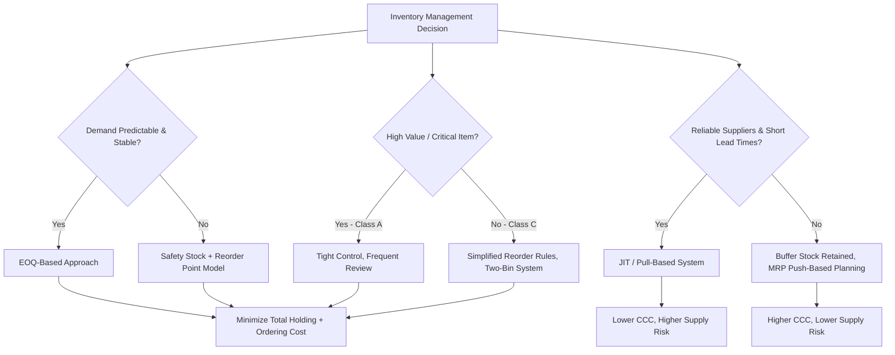

## Inventory Management Approaches

### Overview

Inventory management within working capital policy concerns the level, composition, and control mechanisms a firm uses for raw materials, work-in-process (WIP), and finished goods. Since inventory is a current asset financed by a mix of current liabilities and long-term capital, the central tradeoff is between the costs of holding inventory (carrying costs) and the costs of not holding enough (shortage/stockout costs, ordering costs). Inventory management approaches are the frameworks and decision rules firms use to resolve this tradeoff.

### The Core Cost Tradeoff

**Key Points**

- **Carrying costs** (holding costs): storage, insurance, obsolescence, spoilage, taxes, and the opportunity cost of capital tied up in inventory. These rise with inventory level.
- **Ordering costs** (procurement costs): costs of placing and receiving an order — administrative, shipping, quality inspection — largely fixed per order, independent of order size.
- **Shortage costs**: lost sales, expedited shipping premiums, production stoppages, and reputational/customer-goodwill damage from stockouts.
- **Total inventory cost** is minimized where the marginal reduction in ordering costs from larger orders equals the marginal increase in carrying costs.

$$TC = \frac{Q}{2}C + \frac{D}{Q}S$$

Where $Q$ is order quantity, $C$ is carrying cost per unit per period, $D$ is annual demand, and $S$ is ordering cost per order.

### Economic Order Quantity (EOQ) Model

The EOQ model is the foundational quantitative approach to inventory management, determining the order quantity that minimizes total inventory costs.

**Assumptions**

- Demand is known and constant.
- Lead time is constant and known.
- No quantity discounts.
- Order quantity arrives in a single batch.
- Stockouts are not permitted (in the basic model).

**Formula**

$$EOQ = \sqrt{\frac{2DS}{C}}$$

**Derivation logic**: Total cost is minimized by taking the derivative of $TC$ with respect to $Q$, setting it to zero, and solving. At the EOQ, ordering cost equals carrying cost.

**Example**

A firm sells 24,000 units annually ($D = 24{,}000$), each order costs $50 to place ($S = 50$), and annual carrying cost per unit is $4 ($C = 4$).

$$EOQ = \sqrt{\frac{2(24{,}000)(50)}{4}} = \sqrt{600{,}000} = 774.6 \approx 775 \text{ units}$$

Number of orders per year: $D / EOQ = 24{,}000 / 775 \approx 31$ orders. Time between orders: $365 / 31 \approx 11.8$ days.

**Reorder Point (ROP)**

$$ROP = d \times L$$

Where $d$ is average daily demand and $L$ is lead time in days. When safety stock is included:

$$ROP = (d \times L) + SS$$

**[Inference]** In practice, firms rarely use pure EOQ because demand and lead times fluctuate; it functions more as a baseline or benchmark than a literal operating rule.

### Safety Stock and Service Level Approaches

Safety stock buffers against demand and lead-time variability. The optimal safety stock balances the marginal cost of holding extra units against the marginal cost of a stockout.

$$SS = z \times \sigma_{dL}$$

Where $z$ is the z-score corresponding to the desired service level (probability of not stocking out during lead time), and $\sigma_{dL}$ is the standard deviation of demand during lead time.

**Common service level targets and z-scores**

| Service Level | z-score |
| --- | --- |
| 90% | 1.28 |
| 95% | 1.65 |
| 97.5% | 1.96 |
| 99% | 2.33 |

**Example**: If lead-time demand has a standard deviation of 50 units and the firm targets a 95% service level, $SS = 1.65 \times 50 = 82.5 \approx 83$ units.

### ABC Analysis (Selective Inventory Control)

ABC analysis classifies inventory items by value and priority rather than treating all SKUs uniformly, applying the Pareto principle (80/20 rule) to inventory control effort.

- **Class A**: Roughly 10–20% of items, accounting for 70–80% of inventory value. Tight control, frequent review, accurate records, low safety stock margins justified by close monitoring.
- **Class B**: Roughly 20–30% of items, 15–25% of value. Moderate control, periodic review.
- **Class C**: Roughly 50–70% of items, 5–10% of value. Loose control, simple reorder rules (e.g., two-bin system), larger safety stock relative to value since monitoring cost isn't justified.

**Key Points**

- Concentrates managerial and analytical resources where financial exposure is greatest.
- Often combined with EOQ: Class A items get individually calculated EOQ and tight reorder points; Class C items use simplified periodic reordering.

### Just-in-Time (JIT) Inventory Management

JIT minimizes inventory holdings by synchronizing material arrival closely with production or sales need, ideally approaching zero buffer stock.

**Key Points**

- Requires reliable suppliers, short lead times, and high-quality, defect-free inputs (since there is little buffer to absorb quality problems).
- Reduces carrying costs, warehousing needs, and obsolescence risk substantially.
- Increases vulnerability to supply chain disruption, since there is minimal buffer against delays.
- Often paired with **kanban** systems (visual/card-based signaling of replenishment need) and long-term supplier partnerships.

**[Unverified]** The specific inventory reduction and cost-savings percentages often cited for JIT implementations (e.g., in case studies of Toyota's production system) are firm- and context-specific and should not be treated as generalizable benchmarks.

### Materials Requirement Planning (MRP)

MRP is a push-based, computer-driven planning system that works backward from a master production schedule to determine what materials are needed, in what quantities, and when.

**Key Points**

- Inputs: master production schedule, bill of materials (BOM), inventory records.
- Outputs: purchase orders and production orders timed to avoid both stockouts and excess inventory.
- Suited to manufacturing environments with complex, multi-level product structures (assemblies with many components).
- Contrasts with JIT's pull-based philosophy — MRP schedules production based on forecasted demand, while JIT/pull systems trigger replenishment based on actual consumption signals.

### Vendor-Managed Inventory (VMI) and Other Supply Chain Approaches

- **VMI**: The supplier monitors the buyer's inventory levels and manages replenishment, shifting some inventory-holding decisions (and often risk) upstream.
- **Consignment inventory**: Supplier retains ownership of inventory physically located at the buyer's site until it's used or sold; buyer's working capital is not tied up until consumption, improving the buyer's cash conversion cycle.
- **Drop-shipping**: Retailer never holds inventory; orders are routed directly from supplier to end customer, effectively eliminating inventory investment for that retailer (at the cost of margin and control).

### Inventory Management and the Cash Conversion Cycle

Inventory policy directly affects **Days Inventory Outstanding (DIO)**, a core component of the cash conversion cycle (CCC):

$$DIO = \frac{\text{Average Inventory}}{\text{COGS}} \times 365$$

$$CCC = DIO + DSO - DPO$$

Reducing DIO (through tighter inventory approaches like JIT or better ABC-driven control) shortens the CCC, freeing up working capital and reducing the firm's reliance on short-term financing.

**Example**: A firm with average inventory of $2,000,000 and annual COGS of $12,000,000 has:

$$DIO = \frac{2{,}000{,}000}{12{,}000{,}000} \times 365 = 60.8 \text{ days}$$

If the firm shifts toward a leaner JIT-style approach and reduces average inventory to $1,500,000, DIO falls to $\frac{1{,}500{,}000}{12{,}000{,}000} \times 365 = 45.6$ days, releasing roughly $500,000 in cash previously tied up in inventory.

### Decision Framework Diagram

### Comparative Summary

| Approach | Best Suited For | Working Capital Impact | Key Risk |
| --- | --- | --- | --- |
| EOQ | Stable, predictable demand items | Moderate, optimized at theoretical minimum | Model assumptions rarely hold exactly |
| Safety Stock / ROP | Variable demand or lead time | Increases inventory investment vs. pure EOQ | Trade-off between service level and cost |
| ABC Analysis | Multi-SKU firms with varied item value | Concentrates capital efficiency on high-value items | Misclassification of items over time |
| JIT | Stable, high-trust supplier relationships | Minimizes inventory investment, shortens CCC | High exposure to supply disruption |
| MRP | Complex, multi-level manufacturing | Aligns inventory to production schedule | Forecast errors propagate through the BOM |
| VMI / Consignment | Strong supplier partnerships | Shifts inventory carrying burden to supplier | Requires strong information sharing and trust |

**Related Topics**

- Cash conversion cycle and its interaction with receivables/payables management
- Economic Order Quantity sensitivity analysis and quantity discount models
- Supply chain finance and reverse factoring
- Working capital financing strategies (aggressive vs. conservative)
- Inventory valuation methods (FIFO, LIFO, weighted average) and their financial statement effects