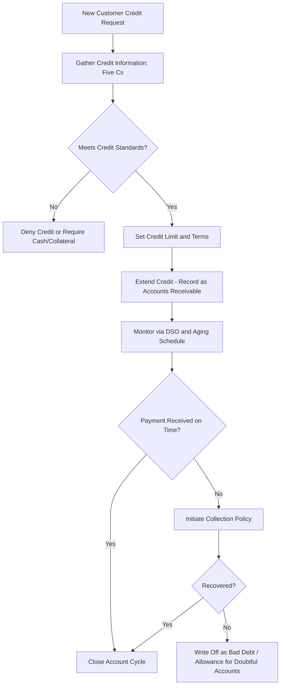

## Accounts Receivable and Credit Policy

### Overview

Accounts receivable (AR) represent credit extended to customers and constitute a major current asset for most firms selling on credit terms. Credit policy is the set of decisions governing how much credit to extend, to whom, on what terms, and how to collect it. The central tradeoff is between the sales-and-margin benefits of extending credit versus the costs of carrying receivables and the risk of default.

### The Five Cs of Credit

**Key Points**

Used to qualitatively assess a customer's creditworthiness before extending trade credit:

- **Character**: Willingness to pay, historical payment behavior, reputation.
- **Capacity**: Ability to pay, typically assessed via cash flow and liquidity ratios.
- **Capital**: Financial reserves and net worth as a cushion against loss.
- **Collateral**: Assets pledged or available to secure the credit.
- **Conditions**: Economic and industry conditions affecting the customer's ability to pay.

**[Inference]** The Five Cs framework is a qualitative heuristic rather than a scoring model; firms often supplement it with quantitative credit scoring for consistency across large customer bases.

### Components of Credit Policy

A firm's credit policy consists of four interrelated elements:

1. **Credit standards**: The minimum financial strength required of a customer to qualify for credit (e.g., minimum credit score, financial ratio thresholds).
2. **Credit terms**: The repayment conditions, including the credit period and any discount for early payment, typically expressed as $d/n$, net $N$ (e.g., "2/10, net 30" — 2% discount if paid within 10 days, full amount due in 30 days).
3. **Collection policy**: The procedures used to collect past-due accounts (reminder letters, calls, collection agencies, legal action).
4. **Credit limits**: Maximum credit exposure allowed per customer.

### Evaluating Credit Terms: Cost of Trade Discount

When a supplier offers terms like "2/10, net 30," the discount forgone by paying on day 30 instead of day 10 has an implicit annualized cost:

$$\text{Cost of Not Taking Discount} = \left(\frac{d}{1-d}\right) \times \left(\frac{365}{N - n}\right)$$

Where $d$ is the discount percentage, $n$ is the discount period, and $N$ is the full credit period.

**Example**: For terms "2/10, net 30":

$$\left(\frac{0.02}{0.98}\right) \times \left(\frac{365}{20}\right) = 0.0204 \times 18.25 = 37.2\%$$

**[Inference]** An implied annualized cost this high generally signals that a buyer with access to short-term financing at a lower rate should take the discount and pay early using borrowed funds, since forgoing the discount is economically equivalent to borrowing at ~37% annually. This is a standard textbook conclusion but ignores relationship and liquidity considerations that may apply in practice.

### Marginal Analysis of Credit Policy Changes

When considering loosening credit standards (extending credit to riskier customers) to increase sales, the decision should compare the marginal profitability of additional sales against the marginal costs.

$$\Delta \pi = (\Delta S)(1-v) - (\Delta S)(v)(\%\text{bad debt}) - k \times [ASO + \Delta S \times v]$$

Where:

- $\Delta S$ = change in sales
- $v$ = variable cost ratio
- $k$ = required return / opportunity cost of funds tied up in receivables
- $ASO$ = additional investment in receivables from existing sales

**Simplified decision rule**: Loosen credit standards if the incremental contribution margin from new sales exceeds the incremental costs of additional bad debts, higher collection expenses, and the opportunity cost of funds tied up in the additional receivables.

**Example**

A firm considers relaxing credit standards, projecting:

- Additional sales: $500,000
- Variable cost ratio: 70% (so contribution margin = 30%)
- Bad debt losses on new sales: 5%
- Additional collection costs: $10,000
- Required return on investment in receivables: 12%
- Additional investment in receivables (at cost): $80,000

$$\Delta \pi = 500{,}000(0.30) - 500{,}000(0.05) - 10{,}000 - 0.12(80{,}000)$$

$$= 150{,}000 - 25{,}000 - 10{,}000 - 9{,}600 = 105{,}400$$

Since $\Delta\pi > 0$, the policy relaxation is profitable under these assumptions.

### Monitoring Accounts Receivable

**Days Sales Outstanding (DSO)**

$$DSO = \frac{\text{Accounts Receivable}}{\text{Total Credit Sales}} \times 365$$

Measures the average number of days it takes to collect receivables. Should be compared against the firm's own stated credit terms — a DSO significantly higher than the stated credit period signals collection problems.

**Aging Schedule**

Classifies outstanding receivables by how long they have been outstanding, revealing the quality and collectability of the AR portfolio beyond what DSO alone shows.

| Age of Account | Amount ($) | % of Total |
| --- | --- | --- |
| 0–30 days | 400,000 | 57.1% |
| 31–60 days | 180,000 | 25.7% |
| 61–90 days | 80,000 | 11.4% |
| Over 90 days | 40,000 | 5.7% |
| **Total** | **700,000** | **100%** |

**Key Points**

- A rising proportion of accounts in the "over 90 days" bucket over time indicates deteriorating collection effectiveness or credit quality, even if DSO appears stable (DSO can be distorted by seasonal sales patterns).
- The **payments pattern approach** tracks what fraction of a given month's sales remains uncollected in subsequent months, controlling for the seasonality distortion that affects DSO and aging schedules calculated on a single snapshot basis.

### Allowance for Doubtful Accounts

Firms estimate uncollectible receivables under the **expected credit loss** approach (required under ASC 326 / CECL in U.S. GAAP, and IFRS 9 internationally), recognizing anticipated losses on receivables rather than waiting for an actual default.

$$\text{Bad Debt Expense} = \text{Estimated Uncollectible \%} \times \text{Credit Sales (or AR balance)}$$

**[Fact]** This forward-looking, expected-loss approach replaced the older incurred-loss model, which recognized bad debt expense only once a loss event had occurred.

### Credit Insurance and Risk Transfer

- **Trade credit insurance**: Protects the seller against customer default, typically covering 75–95% of the insured receivable.
- **Factoring**: Selling receivables (with or without recourse) to a third party (factor) at a discount for immediate cash, transferring collection responsibility and, in non-recourse factoring, credit risk.
- **Recourse vs. non-recourse factoring**: Under recourse, the seller bears default risk if the customer fails to pay; under non-recourse, the factor bears it (at a higher discount rate to compensate).

### Credit Policy Decision Flow

### Accounts Receivable and the Cash Conversion Cycle

AR policy directly determines **Days Sales Outstanding (DSO)**, which feeds into the cash conversion cycle:

$$CCC = DIO + DSO - DPO$$

Tightening credit policy (shorter terms, stricter standards) reduces DSO and shortens the CCC, reducing the firm's working capital financing needs — but at the potential cost of lost sales to customers who require more generous terms. This mirrors the same fundamental tradeoff structure seen in inventory policy: tighter control reduces capital tied up but risks lost business.

**Related Topics**

- Cash conversion cycle and its components (DIO, DSO, DPO)
- Factoring and asset-based lending as receivables financing tools
- Credit scoring models (e.g., Altman Z-score) applied to customer risk assessment
- Accounts payable management and optimal payment timing
- Working capital financing strategies (aggressive vs. conservative)