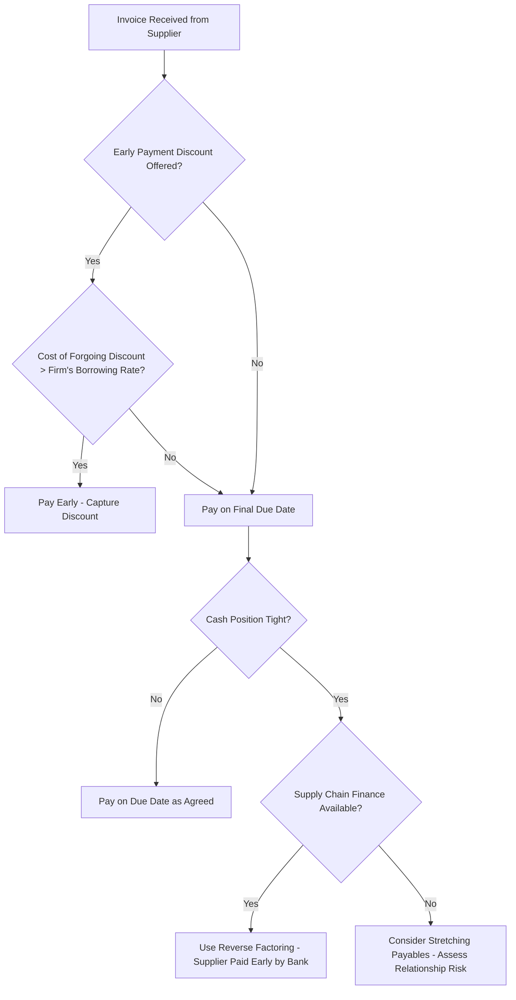

## Accounts Payable and Trade Credit Management

### Overview

Accounts payable (AP) represent a spontaneous, largely interest-free source of short-term financing arising from purchasing goods and services on credit from suppliers. Trade credit management concerns how a firm optimizes the timing and terms of its payables to preserve cash and working capital without damaging supplier relationships or forgoing valuable discounts. AP sits on the opposite side of the cash conversion cycle from accounts receivable — the same trade credit dynamics analyzed from the seller's perspective become payables management from the buyer's perspective.

### Trade Credit as a Financing Source

**Key Points**

- Trade credit is typically the largest source of short-term financing for many firms, particularly small and mid-sized businesses with limited access to formal credit markets.
- It is often **spontaneous financing**: it grows automatically with the level of purchases/operations, requiring no formal negotiation for each transaction (within an established credit relationship).
- Trade credit terms are usually expressed as $d/n$, net $N$ (e.g., "2/10, net 30"), specifying a discount $d$ for payment within $n$ days, with the full amount due within $N$ days.

### Cost of Forgoing the Discount

The core payables decision — take the discount and pay early, or forgo it and pay on the final due date — hinges on comparing the implicit annualized cost of forgoing the discount against the firm's cost of capital or available short-term borrowing rate.

$$\text{Annualized Cost of Forgoing Discount} = \left(\frac{d}{1-d}\right) \times \left(\frac{365}{N-n}\right)$$

**Example**

For terms "2/10, net 30":

$$\left(\frac{0.02}{0.98}\right) \times \left(\frac{365}{20}\right) = 0.0204 \times 18.25 \approx 37.2\%$$

**Decision rule**: If the firm's short-term borrowing rate (e.g., a line of credit at 10%) is lower than the implicit cost of forgoing the discount (37.2%), the firm should borrow to pay early and capture the discount. If no discount is offered ("net 30" only), the firm should generally pay on the last day of the credit period, since paying earlier forfeits use of interest-free funds without any offsetting benefit.

**[Inference]** This decision framework assumes the firm has ready access to alternative short-term financing at the stated rate; firms that are financing-constrained may forgo discounts even when the implied cost is high, simply because no cheaper source of funds is accessible.

### Stretching Payables

"Stretching" (or "leaning on the trade") refers to deliberately delaying payment beyond the stated due date to conserve cash.

**Key Points**

- Extends the effective interest-free financing period beyond what suppliers intended.
- Risks: damages supplier relationships, may result in loss of future discount eligibility, can trigger tighter credit terms or credit holds, and may harm the firm's credit rating and reputation with other suppliers/lenders (via credit bureaus or trade references).
- **[Inference]** The practice is generally viewed as a short-term, last-resort liquidity tactic rather than a sustainable financing strategy, since suppliers can and often do respond by shortening credit terms, requiring cash-on-delivery, or raising prices to compensate for the implicit cost.

### Days Payable Outstanding (DPO)

$$DPO = \frac{\text{Accounts Payable}}{\text{COGS (or Purchases)}} \times 365$$

Measures the average number of days a firm takes to pay its suppliers. A higher DPO indicates the firm is retaining cash longer, improving short-term liquidity, but excessively high DPO relative to stated terms may signal cash flow distress or aggressive/damaging stretching of the payables.

**Example**: A firm with average accounts payable of $900,000 and annual COGS of $10,950,000:

$$DPO = \frac{900{,}000}{10{,}950{,}000} \times 365 = 30 \text{ days}$$

### Integration with the Cash Conversion Cycle

DPO is the offsetting term in the cash conversion cycle, reducing the net financing period the firm must otherwise cover with external short-term borrowing:

$$CCC = DIO + DSO - DPO$$

**Key Points**

- Lengthening DPO (within reason) shortens CCC and reduces reliance on costly external short-term financing.
- Firms must balance the CCC benefit of a longer DPO against the cost of forgone discounts and strained supplier relationships — this is a direct mirror of the buyer-side tradeoff already covered under credit terms above.

**Example**: Continuing prior examples: $DIO = 60.8$ days, $DSO$ (assume) $= 45$ days, $DPO = 30$ days:

$$CCC = 60.8 + 45 - 30 = 75.8 \text{ days}$$

If the firm extends DPO to 40 days without losing discounts or damaging relationships, CCC falls to $60.8 + 45 - 40 = 65.8$ days — a reduction of 10 days in the period requiring external financing.

### Supply Chain Finance / Reverse Factoring

A more sophisticated approach to payables optimization that decouples the buyer's and supplier's cash flow needs:

**Key Points**

- A financial institution pays the supplier early (at a discount reflecting the buyer's, not the supplier's, credit rating — typically stronger), and the buyer repays the financial institution on the original due date or later.
- Allows the buyer to extend its own DPO (improving its CCC) while the supplier still receives early payment (improving the supplier's DSO), effectively transferring the financing cost to the financial institution/platform.
- **[Inference]** This differs from simple stretching because it is a negotiated, mutually beneficial arrangement rather than a unilateral delay, generally preserving or even improving supplier relationships rather than straining them.

### Comparative View: Payables Strategy Choices

| Strategy | Cash Flow Impact | Relationship Risk | Cost |
| --- | --- | --- | --- |
| Take early-payment discount | Cash paid out earlier | None | Opportunity cost of funds used to pay early |
| Pay on due date (no discount offered) | Neutral — full use of credit period | None | None (as intended by supplier) |
| Stretch payables beyond due date | Extends cash retention | High | Potential loss of future credit terms, reputational damage |
| Reverse factoring / supply chain finance | Extends buyer's effective DPO | Low to none | Financing fee, typically borne by supplier or shared |

### Payables Decision Flow

### Risks of Poor Payables Management

**Key Points**

- **Over-aggressive stretching**: supplier credit holds, loss of priority during shortages, higher future prices, damaged trade references affecting future borrowing.
- **Paying too early without capturing discounts**: unnecessary erosion of the firm's own cash position and working capital.
- **Inconsistent payment behavior**: can trigger stricter terms industry-wide as the firm's reputation with credit-reporting and trade-reference services deteriorates.

**Related Topics**

- Cash conversion cycle and its three components (DIO, DSO, DPO)
- Accounts receivable and credit policy (the seller-side mirror of this topic)
- Short-term financing alternatives: lines of credit, commercial paper, factoring
- Supply chain finance platforms and reverse factoring mechanics
- Working capital financing strategies (aggressive vs. conservative)