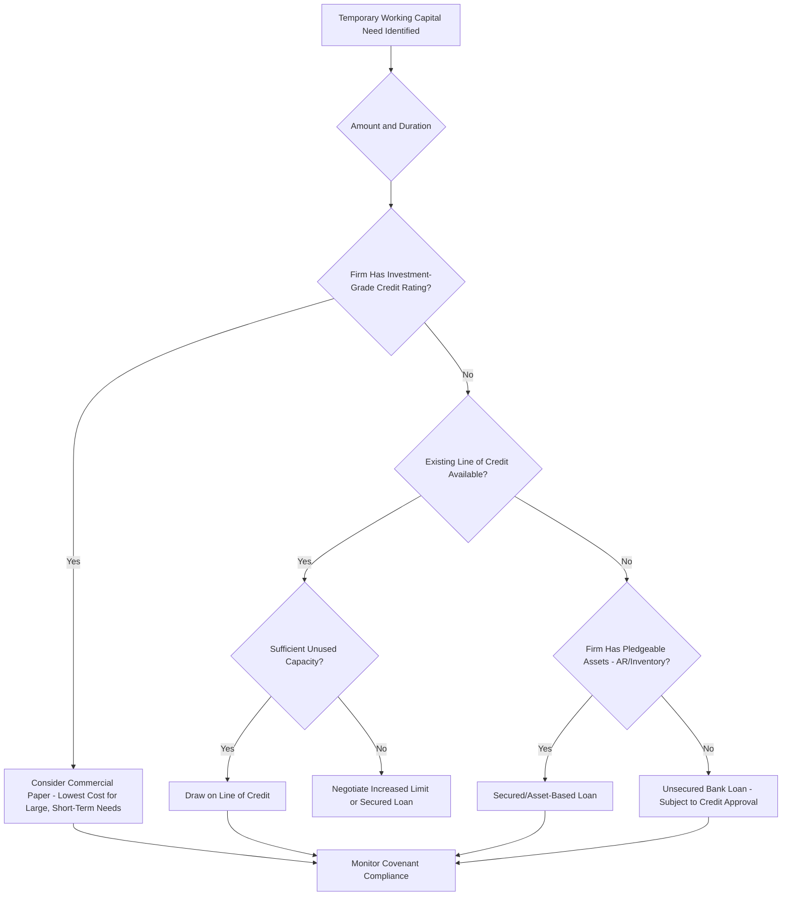

## Short Term Borrowing and Lines of Credit

### Overview

Short-term borrowing refers to financing obtained for repayment within one year, used primarily to fund temporary working capital needs such as seasonal inventory buildups, receivables gaps, or unexpected cash shortfalls. Unlike spontaneous financing (trade credit), short-term borrowing is negotiated financing that typically carries explicit interest costs and formal terms. Lines of credit are the most common and flexible instrument in this category.

### Sources of Short-Term Borrowing

**Key Points**

- **Unsecured bank loans**: Extended based on the borrower's creditworthiness alone, without pledged collateral. Typically reserved for financially strong borrowers.
- **Secured (asset-based) loans**: Collateralized by specific assets — accounts receivable, inventory, or equipment — reducing lender risk and often expanding the amount/availability of credit for weaker-credit borrowers.
- **Commercial paper**: Unsecured, short-term promissory notes issued by large, high-credit-quality corporations directly to institutional investors, typically at rates below bank loan rates but accessible only to firms with strong credit ratings.
- **Banker's acceptances**: Time drafts guaranteed by a bank, commonly used in trade finance to facilitate international transactions.
- **Factoring and receivables-based financing**: Selling or borrowing against receivables (covered in depth under accounts receivable management).

### Lines of Credit: Structure and Types

A line of credit is a pre-arranged borrowing agreement that allows a firm to draw funds up to a specified maximum as needed, rather than negotiating a new loan for each borrowing need.

**Uncommitted (Regular) Line of Credit**

- An informal arrangement; the bank is not legally obligated to lend, and can withdraw the facility at its discretion.
- No commitment fee, since there is no binding legal obligation.
- Typically used by financially strong, long-standing customers with a good banking relationship.

**Committed (Revolving) Line of Credit**

- A formal, legally binding agreement obligating the bank to lend up to the specified limit for the term of the agreement, provided the borrower meets stated conditions (e.g., covenant compliance).
- Requires a **commitment fee** on the unused portion of the credit line, compensating the bank for holding capital available.
- Generally more expensive than an uncommitted line due to this guarantee, but provides certainty of access to funds.

**Revolving Credit Agreement**

- A multi-year committed facility (often 2–5 years) allowing repeated draw-down and repayment cycles, functioning as ongoing working capital support rather than a one-time loan.

### Cost of a Line of Credit

Total borrowing cost includes both the stated interest rate on funds actually drawn and the commitment fee on the unused portion.

$$\text{Total Cost} = (\text{Rate} \times \text{Amount Borrowed}) + (\text{Commitment Fee \%} \times \text{Unused Balance})$$

**Example**

A firm has a $1,000,000 committed line of credit with a 6% annual interest rate on borrowed funds and a 0.5% commitment fee on the unused balance. The firm borrows $600,000 for the full year.

$$\text{Interest Cost} = 0.06 \times 600{,}000 = 36{,}000$$

$$\text{Commitment Fee} = 0.005 \times (1{,}000{,}000 - 600{,}000) = 0.005 \times 400{,}000 = 2{,}000$$

$$\text{Total Cost} = 36{,}000 + 2{,}000 = 38{,}000$$

$$\text{Effective Annual Rate} = \frac{38{,}000}{600{,}000} = 6.33\%$$

### Compensating Balances

Some lines of credit require the borrower to maintain a **compensating balance** — a minimum non-interest-bearing deposit balance with the lending bank — which effectively raises the true cost of borrowing because the borrower doesn't have use of the full loan amount.

$$\text{Effective Rate} = \frac{\text{Stated Interest Rate} \times \text{Loan Amount}}{\text{Loan Amount} - \text{Compensating Balance}}$$

**Example**

A firm borrows $500,000 at a stated rate of 8%, with a required compensating balance of 15% of the loan.

$$\text{Compensating Balance} = 0.15 \times 500{,}000 = 75{,}000$$

$$\text{Usable Funds} = 500{,}000 - 75{,}000 = 425{,}000$$

$$\text{Interest Paid} = 0.08 \times 500{,}000 = 40{,}000$$

$$\text{Effective Rate} = \frac{40{,}000}{425{,}000} = 9.41\%$$

**[Inference]** Compensating balance requirements are less common in contemporary commercial banking than in past decades but still appear in some credit agreements, particularly for smaller or higher-risk borrowers; their prevalence varies significantly by lender, jurisdiction, and market conditions.

### Loan Pricing Structures

**Discount interest**: Interest is deducted from the loan proceeds upfront rather than paid at maturity, raising the effective cost.

$$\text{Effective Rate (Discount Basis)} = \frac{\text{Interest}}{\text{Face Value} - \text{Interest}}$$

**Example**: A $100,000 loan at 10% discount interest for one year:

$$\text{Interest} = 0.10 \times 100{,}000 = 10{,}000$$

$$\text{Usable Funds} = 100{,}000 - 10{,}000 = 90{,}000$$

$$\text{Effective Rate} = \frac{10{,}000}{90{,}000} = 11.11\%$$

**Add-on interest / installment loans**: Interest is calculated on the full face value even as principal is repaid in installments, resulting in an effective rate roughly double the stated rate since the borrower does not have use of the full principal for the full term.

### Loan Covenants

Formal borrowing agreements typically include covenants protecting the lender's interests:

**Key Points**

- **Affirmative covenants**: Actions the borrower must take (e.g., maintain insurance, provide periodic financial statements, maintain minimum working capital).
- **Negative covenants**: Actions the borrower must avoid (e.g., restrictions on additional debt, limits on dividend payments, restrictions on asset sales).
- **Financial covenants**: Specific financial ratio thresholds (e.g., minimum current ratio, maximum debt-to-equity ratio, minimum interest coverage ratio) that must be maintained; breach can trigger technical default even if payments are current.

### Choosing Between Short-Term Borrowing and Other Financing

**Key Points**

- Short-term borrowing (line of credit, bank loan) offers flexibility for temporary or seasonal needs without the long-term commitment of term debt or equity.
- Compared to trade credit, bank borrowing is typically more expensive on a stated-rate basis but does not risk supplier relationships and can be structured more flexibly for larger amounts.
- Compared to commercial paper, bank lines of credit are accessible to a much broader range of firms (commercial paper generally requires an investment-grade rating and access to money markets) but typically carry higher rates for firms that qualify for both.
- **[Inference]** The choice among these sources in practice reflects a combination of cost, availability, flexibility, and the firm's existing banking relationships, rather than cost minimization alone.

### Short-Term Financing Decision Flow

### Integration with Working Capital Policy

**Key Points**

- Short-term borrowing is the residual financing source under an **aggressive working capital financing strategy**, where permanent current assets are financed partly with short-term debt to exploit generally lower short-term rates, accepting higher refinancing/rollover risk.
- Under a **conservative strategy**, short-term borrowing is used only for temporary fluctuations in current assets, with long-term financing covering permanent working capital needs, reducing rollover risk but typically raising financing cost since long-term rates are usually higher.

**Related Topics**

- Cash conversion cycle and its role in determining financing needs
- Aggressive vs. conservative working capital financing strategies
- Commercial paper markets and credit rating requirements
- Loan covenant analysis and technical default risk
- Accounts receivable financing (factoring, asset-based lending) as an alternative to unsecured borrowing