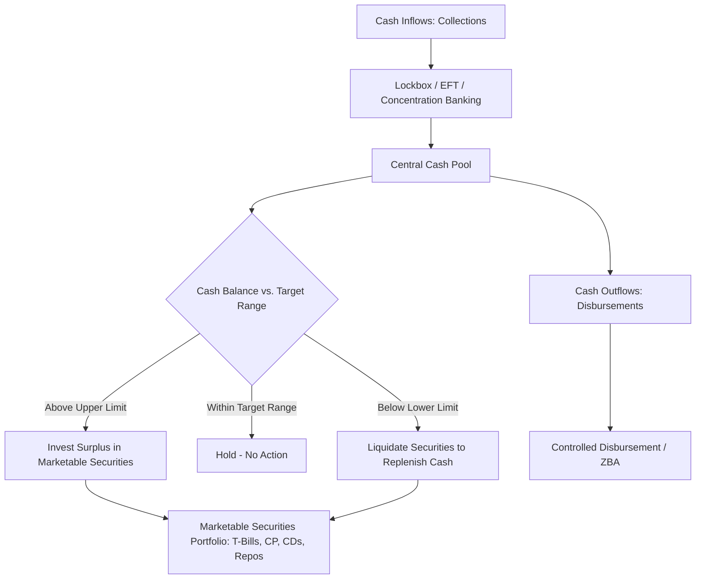

## Cash and Marketable Securities Management

### Overview

Cash and marketable securities management concerns how firms determine the optimal level of liquid assets to hold, how to manage the collection and disbursement of cash efficiently, and how to invest temporary cash surpluses in low-risk, liquid instruments pending future operating or investment needs. The central tradeoff is between liquidity/safety and the opportunity cost of forgone returns from investing in higher-yielding but less liquid assets.

### Motives for Holding Cash

**Key Points**

- **Transaction motive**: Cash needed to meet day-to-day operating obligations (payroll, supplier payments, taxes).
- **Precautionary motive**: A buffer held against unexpected cash flow shortfalls or emergencies.
- **Speculative motive**: Cash held to take advantage of unexpected favorable opportunities (e.g., bargain purchases, acquisition opportunities).
- **Compensating balance requirements**: Minimum balances required by banks as part of loan agreements or in exchange for banking services, discussed further under short-term borrowing.

### Cash Management Models

**Baumol Model**

Adapts the EOQ inventory model to cash management, treating cash as an "inventory" that is depleted steadily and replenished periodically by selling marketable securities.

$$C^* = \sqrt{\frac{2 \times F \times T}{k}}$$

Where $C^*$ is the optimal cash transfer/replenishment amount, $F$ is the fixed cost per transaction (transfer/sale of securities), $T$ is total cash needed over the period, and $k$ is the opportunity cost (interest rate forgone by holding cash instead of securities).

**Example**

A firm needs $1,200,000 in cash over the year, each securities-to-cash transfer costs $100, and the opportunity cost of holding cash is 5% annually.

$$C^* = \sqrt{\frac{2(100)(1{,}200{,}000)}{0.05}} = \sqrt{4{,}800{,}000{,}000} \approx 69{,}282$$

The firm should transfer approximately $69,282 from securities to cash each time, resulting in $1{,}200{,}000 / 69{,}282 \approx 17.3$ transfers per year.

**[Inference]** The Baumol model assumes steady, predictable cash outflows and a single, known transaction cost, making it a simplified theoretical benchmark rather than a precise operational tool for firms with volatile or seasonal cash flows.

**Miller-Orr Model**

Extends the Baumol model to accommodate random, unpredictable daily cash flows by establishing a cash balance range with upper and lower control limits.

$$Z = \left(\frac{3F\sigma^2}{4k}\right)^{1/3} + L$$

Where $Z$ is the return point (target cash balance), $F$ is the fixed transaction cost, $\sigma^2$ is the variance of daily net cash flows, $k$ is the daily opportunity cost of holding cash, and $L$ is the lower control limit (minimum cash balance, often set by management policy).

**Upper limit**:

$$H = 3Z - 2L$$

**Decision rule**: When cash balance hits the upper limit $H$, the firm invests the difference $(H - Z)$ in securities to bring the balance back to $Z$. When cash balance hits the lower limit $L$, the firm sells securities to raise cash and restore the balance to $Z$. Within the range $(L, H)$, no transaction occurs.

**Example**

Given: $F = \$50$ per transaction, daily standard deviation of cash flows $\sigma = \$2{,}000$ (so $\sigma^2 = 4{,}000{,}000$), daily opportunity cost $k = 0.0002$ (approx. 5% annual / 250 business days), and $L = \$5{,}000$.

$$Z = \left(\frac{3(50)(4{,}000{,}000)}{4(0.0002)}\right)^{1/3} + 5{,}000 = \left(\frac{600{,}000{,}000}{0.0008}\right)^{1/3} + 5{,}000$$

$$= (750{,}000{,}000{,}000)^{1/3} + 5{,}000 \approx 9{,}086 + 5{,}000 = 14{,}086$$

$$H = 3(14{,}086) - 2(5{,}000) = 42{,}258 - 10{,}000 = 32{,}258$$

The firm maintains its cash balance between $5,000 and $32,258, targeting a return point of $14,086 whenever a control limit is triggered.

### Cash Collection and Disbursement Systems

**Float** — the time delay between when a payment is initiated and when funds actually become usable — is central to cash management efficiency.

- **Collection float**: Delay between when a customer sends payment and when the firm has usable funds. Components include mail float (transit time), processing float (time to process incoming payments), and availability float (time for the bank to clear the check/payment).
- **Disbursement float**: Delay between when a firm issues payment and when funds are actually debited from its account. Firms generally seek to *maximize* disbursement float (within legal and ethical/relationship limits) while *minimizing* collection float.

**Techniques to Accelerate Collections**

- **Lockbox systems**: Customers remit payments to a post office box managed by the firm's bank, which processes and deposits payments directly, reducing mail and processing float.
- **Concentration banking**: Consolidating collections from multiple regional accounts into a central concentration account to improve funds availability and investment efficiency.
- **Electronic funds transfer (EFT) / ACH**: Largely eliminates mail and much processing float compared to paper checks.

**Techniques to Manage Disbursements**

- **Zero-balance accounts (ZBA)**: Disbursement accounts maintained at a zero balance, automatically funded from a master account only as checks clear, minimizing idle cash balances.
- **Controlled disbursement**: Bank notifies the firm each morning of the day's expected check clearings, allowing precise same-day funding.

**[Fact]** The shift toward electronic payments (ACH, wire transfers, real-time payment networks) has substantially compressed traditional float relative to paper-check-based systems, reducing the strategic importance of float management relative to earlier decades.

### Marketable Securities: Investment Criteria

When investing temporary cash surpluses, firms prioritize (in order) safety, liquidity, and yield:

**Key Points**

- **Safety**: Minimizing default/credit risk — often prioritized above return, since these are typically funds needed for near-term operating purposes.
- **Liquidity**: Ability to convert to cash quickly without significant loss of value (marketability).
- **Yield**: Return earned, generally the lowest priority of the three given the short investment horizon and risk-aversion appropriate for operating cash reserves.

### Common Marketable Securities Instruments

| Instrument | Issuer | Typical Maturity | Risk Level | Notes |
| --- | --- | --- | --- | --- |
| Treasury bills (T-bills) | U.S. government | 4–52 weeks | Minimal (default-risk-free) | Highly liquid, benchmark risk-free short-term rate |
| Commercial paper | Large corporations | Up to 270 days | Low to moderate | Rated by credit agencies; unsecured |
| Certificates of deposit (CDs) | Banks | Days to years | Low | May have early-withdrawal penalties |
| Repurchase agreements (repos) | Financial institutions | Overnight to short-term | Low | Collateralized by securities (often Treasuries) |
| Money market mutual funds | Fund companies | N/A (open-ended) | Low | Diversified pool of short-term instruments, high liquidity |
| Banker's acceptances | Banks (trade finance) | Up to 180 days | Low | Common in international trade |

### Cash Management Process Flow

### Integration with Overall Working Capital Management

**Key Points**

- Efficient cash management directly reduces the amount of low-yielding idle cash a firm must hold, freeing capital for higher-return uses (investment, debt reduction, or shareholder distributions) without compromising liquidity or operational continuity.
- Cash and marketable securities policy interacts with the firm's overall working capital financing strategy: firms following an aggressive strategy typically hold minimal cash buffers, relying on committed lines of credit as a liquidity backstop, whereas conservative firms hold larger precautionary cash and securities balances.

**Related Topics**

- Cash budgeting and cash flow forecasting techniques
- Working capital financing strategies (aggressive vs. conservative)
- Short-term borrowing and lines of credit as a liquidity backstop
- Treasury management systems and electronic payment infrastructure
- Money market instrument pricing and yield calculations (discount yield vs. bond-equivalent yield)