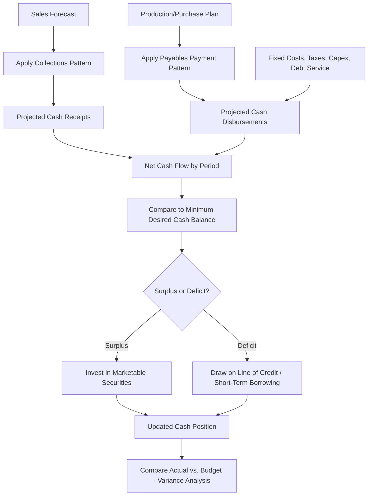

## Cash Budgeting and Forecasting

### Overview

Cash budgeting is the process of projecting a firm's cash inflows and outflows over a future period to anticipate cash surpluses or shortfalls in advance. Unlike accrual-based income statement forecasting, cash budgets focus exclusively on the timing of actual cash movements, making them the primary planning tool for short-term financing and investment decisions. Cash forecasting feeds directly into the cash and marketable securities management decisions covered previously.

### Purpose and Role in Financial Planning

**Key Points**

- Identifies periods of cash shortage in advance, allowing the firm to arrange short-term financing (line of credit draws) proactively rather than reactively.
- Identifies periods of cash surplus, allowing timely investment in marketable securities to earn a return on otherwise idle funds.
- Supports negotiation with lenders by demonstrating the timing and magnitude of financing needs.
- Provides a benchmark against which actual cash performance can be monitored, enabling early detection of variances from plan.

### The Cash Budget Structure

A cash budget is typically built period-by-period (monthly, weekly, or even daily for tightly managed firms) and follows a standard structure:

1. **Beginning cash balance**
2. **Cash receipts** (collections)
3. **Cash disbursements** (payments)
4. **Net cash flow** = Cash receipts − Cash disbursements
5. **Ending cash balance before financing** = Beginning balance + Net cash flow
6. **Financing needed or surplus available** = Ending balance before financing − Minimum desired cash balance
7. **Ending cash balance after financing**

$$\text{Ending Cash} = \text{Beginning Cash} + \text{Receipts} - \text{Disbursements} \pm \text{Financing Activity}$$

### Forecasting Cash Receipts

**Key Points**

- Cash receipts are typically driven by a **sales forecast**, converted to cash collections using the firm's historical collection pattern (what percentage of a month's sales is collected in the same month, the following month, and so on).
- This collection pattern is directly informed by the accounts receivable aging and payments pattern analysis covered under receivables management.
- Other receipts include cash sales, asset sales, loan proceeds, and any other non-operating cash inflows.

**Example: Collections Pattern**

Assume a firm's sales collection pattern is: 20% collected in the month of sale, 50% in the month following, and 30% two months following (with negligible bad debt for simplicity).

| Month | Sales | Collections (from current + prior 2 months) |
| --- | --- | --- |
| January | $100,000 | — |
| February | $120,000 | — |
| March | $150,000 | $0.20(150{,}000) + 0.50(120{,}000) + 0.30(100{,}000) = 30{,}000 + 60{,}000 + 30{,}000 = 120{,}000$ |

### Forecasting Cash Disbursements

**Key Points**

- **Purchases**: Driven by projected production/sales needs and the firm's payables payment pattern (linking directly to accounts payable/DPO management).
- **Wages and salaries**: Generally predictable and tied to production/staffing schedules.
- **Fixed operating expenses**: Rent, insurance, and similar contractually fixed costs.
- **Taxes**: Estimated tax payments, typically made on a quarterly schedule for many jurisdictions.
- **Capital expenditures**: Planned equipment or facility purchases.
- **Interest and principal payments**: On existing debt obligations.
- **Dividends**: If a dividend policy is in place.

### Worked Example: Simplified Monthly Cash Budget

Assume the following for a firm (in $000s), with a minimum desired cash balance of $10,000:

|  | March | April | May |
| --- | --- | --- | --- |
| Beginning Cash | 10,000 | 10,000 | 10,000 |
| Collections | 120,000 | 135,000 | 140,000 |
| Total Cash Available | 130,000 | 145,000 | 150,000 |
| Purchases | 70,000 | 75,000 | 72,000 |
| Wages | 30,000 | 32,000 | 31,000 |
| Rent & Other Fixed Costs | 15,000 | 15,000 | 15,000 |
| Taxes | 0 | 20,000 | 0 |
| Total Disbursements | 115,000 | 142,000 | 118,000 |
| Ending Cash Before Financing | 15,000 | 3,000 | 32,000 |
| Financing Needed / (Surplus) | (5,000) | 7,000 | (22,000) |
| Ending Cash After Financing | 10,000 | 10,000 | 10,000 |

**Interpretation**: In March, the firm generates a $5,000 surplus above its minimum desired balance, which can be invested in marketable securities. In April, a $7,000 shortfall (driven partly by the tax payment) requires drawing on a line of credit. In May, a $22,000 surplus is available for investment or debt repayment.

### Sensitivity and Scenario Analysis

**Key Points**

- Because sales forecasts and collection patterns are inherently uncertain, firms often build cash budgets under multiple scenarios (optimistic, most likely, pessimistic) to understand the range of possible financing needs.
- **[Inference]** Scenario-based forecasting is particularly valuable when a firm's revenue is highly seasonal or cyclical, since a single-point forecast can understate the peak financing requirement during trough periods.
- Sensitivity analysis on key assumptions (collection lag, payment terms, sales growth rate) helps identify which variables have the largest impact on projected cash needs, focusing management attention on the most critical forecasting risks.

### Forecasting Horizons and Methods

| Horizon | Typical Use | Common Method |
| --- | --- | --- |
| Daily/Weekly | Short-term liquidity management, line of credit draws | Direct receipts-and-disbursements tracking |
| Monthly | Operating cash budget, quarterly planning | Sales-driven pro forma with collection/payment patterns |
| Annual | Strategic and capital planning | Pro forma financial statements, percent-of-sales method |

**[Inference]** Shorter forecasting horizons generally achieve higher accuracy because fewer compounding assumptions are involved, while longer horizons trade precision for strategic planning value; this is a general property of forecasting rather than a claim specific to any one firm's practice.

### Cash Budget Process Flow

### Linking the Cash Budget to Working Capital Decisions

**Key Points**

- The cash budget operationalizes the cash conversion cycle: it translates DIO, DSO, and DPO assumptions into period-by-period cash flow projections rather than the static, average-based CCC metric.
- Projected financing needs from the cash budget directly determine the required size of a line of credit or other short-term borrowing facility.
- Projected surpluses inform the amount and timing of marketable securities investment, connecting back to the Baumol/Miller-Orr framework for optimal cash balance management.

**Related Topics**

- Cash conversion cycle and its components (DIO, DSO, DPO)
- Cash and marketable securities management (Baumol and Miller-Orr models)
- Pro forma financial statement forecasting (percent-of-sales method)
- Short-term borrowing and lines of credit
- Variance analysis between budgeted and actual cash flows