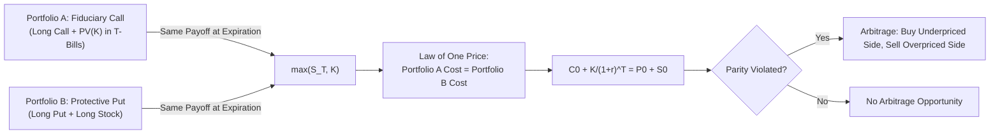

## Put Call Parity

### Overview

Put-call parity is a foundational no-arbitrage relationship in option pricing theory that links the prices of European call and put options with identical strike prices and expiration dates on the same underlying asset. It does not depend on any particular option pricing model (such as Black-Scholes) — it follows purely from the absence of arbitrage opportunities, making it one of the most robust relationships in derivatives theory.

### The Core Relationship

For European options on a non-dividend-paying underlying asset:

$$C_0 + \frac{K}{(1+r)^T} = P_0 + S_0$$

Where:

- $C_0$ = current price (premium) of the European call
- $P_0$ = current price (premium) of the European put
- $S_0$ = current price of the underlying asset
- $K$ = common strike price of both options
- $r$ = risk-free interest rate
- $T$ = time to expiration

In continuous compounding form (common in derivatives pricing):

$$C_0 + Ke^{-rT} = P_0 + S_0$$

### Derivation via Replicating Portfolios

Put-call parity arises because two different portfolios produce identical payoffs at expiration, and portfolios with identical payoffs must have identical current prices under the law of one price.

**Portfolio A (Fiduciary Call)**: Buy one call option + invest $\frac{K}{(1+r)^T}$ in a risk-free bond that matures to exactly $K$ at expiration.

**Portfolio B (Protective Put)**: Buy one put option + buy one share of the underlying stock.

**Payoff comparison at expiration ($S_T$):**

| Scenario | Portfolio A Payoff | Portfolio B Payoff |
| --- | --- | --- |
| $S_T \geq K$ | $(S_T - K) + K = S_T$ | $0 + S_T = S_T$ |
| $S_T < K$ | $0 + K = K$ | $(K - S_T) + S_T = K$ |

Since both portfolios yield identical payoffs ($\max(S_T, K)$) in every possible future state, they must have identical present-day costs, which is precisely the put-call parity equation.

### Arbitrage if Parity is Violated

**Key Points**

If the relationship does not hold, a riskless arbitrage profit can be locked in immediately by buying the underpriced portfolio and selling the overpriced one.

**Example**

Assume: $S_0 = \$100$, $K = \$100$, $r = 5\%$, $T = 1$ year, $C_0 = \$8$, $P_0 = \$5$.

Fair put price implied by parity:

$$P_0 = C_0 + \frac{K}{(1+r)^T} - S_0 = 8 + \frac{100}{1.05} - 100 = 8 + 95.24 - 100 = \$3.24$$

Since the actual put price ($5) exceeds the fair value ($3.24), the put is overpriced relative to parity. The arbitrage strategy is:

1. **Sell (write) the overpriced put** for $5.
2. **Buy the underpriced synthetic put** by buying the call ($8 cost) and short-selling the stock ($100 proceeds), then investing the net proceeds.

Net cash flow at initiation: $+5$ (put sold) $- 8$ (call bought) $+ 100$ (stock shorted) $= +\$97$, which is invested at 5% to grow to $97 \times 1.05 = \$101.85$ at expiration.

**At expiration:**

- If $S_T \geq 100$: Call exercised for $S_T - 100$; short stock covered costing $S_T$; put expires worthless. Net obligation: $-(S_T - 100) - S_T = -2S_T + 100$...

**[Inference]** Working through the exact position reconciliation requires careful sign-tracking across all four legs (long call, short put, short stock, risk-free investment); the essential takeaway for exam purposes is that the arbitrageur locks in a riskless profit equal to the mispricing (approximately $5 - 3.24 = \$1.76$ per share, compounded appropriately) regardless of the stock's terminal price, since the combined position is constructed to be payoff-neutral.

### Solving for Individual Option Prices

Put-call parity can be rearranged to solve for any one variable given the other four — commonly used to find a call price given a known put price, or vice versa, without needing a full option pricing model.

$$C_0 = P_0 + S_0 - \frac{K}{(1+r)^T}$$

$$P_0 = C_0 + \frac{K}{(1+r)^T} - S_0$$

**Example**

Given $P_0 = \$4$, $S_0 = \$52$, $K = \$50$, $r = 4\%$, $T = 0.5$ years:

$$C_0 = 4 + 52 - \frac{50}{(1.04)^{0.5}} = 56 - \frac{50}{1.0198} = 56 - 49.03 = \$6.97$$

### Adjustments for Dividends

When the underlying pays dividends before expiration, the parity relationship must be adjusted because the stockholder in the protective put portfolio receives dividends that the call holder in the fiduciary call portfolio does not.

**Discrete dividends** (present value of dividends, $PV(D)$):

$$C_0 + \frac{K}{(1+r)^T} = P_0 + S_0 - PV(D)$$

**Continuous dividend yield** ($q$):

$$C_0 + Ke^{-rT} = P_0 + S_0 e^{-qT}$$

**[Fact]** The dividend adjustment reduces the effective current stock price used in the parity relationship, reflecting that a dividend-paying stock's expected value at expiration is reduced by the dividends paid out along the way.

### American Options and Parity

**Key Points**

- Put-call parity as an *exact equality* holds only for European options; American options, which permit early exercise, generally satisfy only an inequality relationship rather than strict equality, because the early exercise feature has independent value that complicates the simple replicating-portfolio argument.
- The approximate relationship for American options is often expressed as a bounded range:

$$S_0 - K \leq C_0^{Am} - P_0^{Am} \leq S_0 - \frac{K}{(1+r)^T}$$

- **[Inference]** In practice, for American call options on non-dividend-paying stocks, early exercise is never optimal (since exercising early forfeits remaining time value with no offsetting benefit), so American and European call prices coincide in that specific case — but this equivalence does not extend to American puts, where early exercise can be optimal even without dividends.

### Applications in Corporate Finance

**Key Points**

- **Synthetic positions**: Parity allows construction of synthetic calls, puts, or stock positions using combinations of the other instruments plus the risk-free asset — useful for hedging when a directly desired instrument is unavailable or mispriced.
- **Valuing embedded options**: Corporate securities such as convertible bonds and warrants contain embedded call options; parity-based reasoning helps decompose these hybrid securities into their component values.
- **Capital structure as an option**: Parity-style reasoning underlies the classic insight that equity in a levered firm can be modeled as a call option on the firm's assets with a strike price equal to the face value of debt, while risky debt can be modeled as a risk-free bond minus a put option on the firm's assets — a direct corporate finance extension of the parity framework.

### Parity Relationship Diagram

### Summary of Key Formulas

| Purpose | Formula |
| --- | --- |
| Basic parity (no dividends) | $C_0 + K/(1+r)^T = P_0 + S_0$ |
| Continuous compounding | $C_0 + Ke^{-rT} = P_0 + S_0$ |
| With discrete dividends | $C_0 + K/(1+r)^T = P_0 + S_0 - PV(D)$ |
| With continuous dividend yield | $C_0 + Ke^{-rT} = P_0 + S_0e^{-qT}$ |
| Solve for call | $C_0 = P_0 + S_0 - K/(1+r)^T$ |
| Solve for put | $P_0 = C_0 + K/(1+r)^T - S_0$ |

**Related Topics**

- Option pricing models (Black-Scholes-Merton, binomial model)
- Equity as a call option on firm assets (Merton model of capital structure)
- Convertible bonds and warrant valuation
- Arbitrage-free pricing principles in derivatives
- Real options analysis in capital budgeting