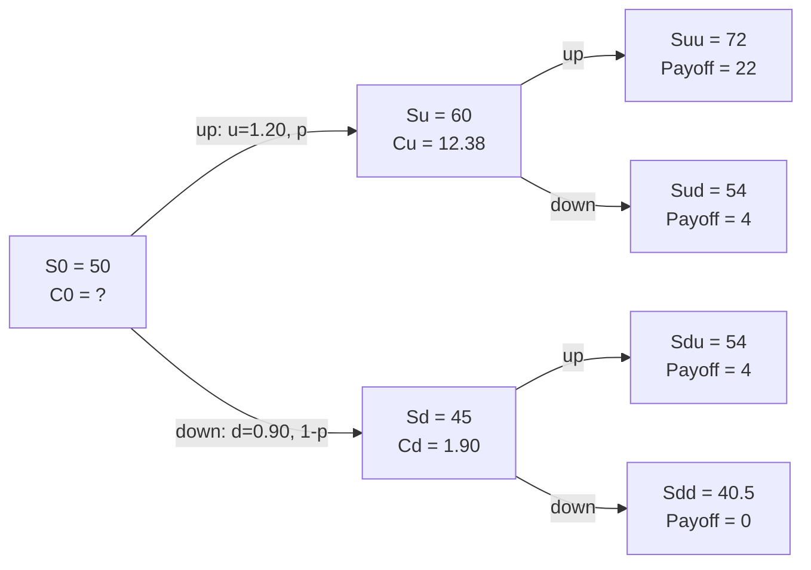

## Binomial Option Pricing

### Overview

The binomial option pricing model values options by modeling the underlying asset's price as moving to one of two possible values (up or down) over discrete time steps, building a lattice (tree) of possible future prices. Unlike the Black-Scholes model, which assumes continuous price movement, the binomial model's discrete-time structure makes it intuitive to derive, flexible enough to handle American-style early exercise, and pedagogically valuable for understanding the risk-neutral valuation principle that underlies all modern option pricing.

### The One-Period Binomial Model

**Setup**

An underlying asset with current price $S_0$ can move to one of two values at the end of one period:

- **Up state**: $S_u = S_0 \times u$, where $u > 1$
- **Down state**: $S_d = S_0 \times d$, where $d < 1$

A call option on this asset has known payoffs in each state:

- $C_u = \max(0, S_u - K)$
- $C_d = \max(0, S_d - K)$

**No-Arbitrage Valuation via Replicating Portfolio**

The model values the option by constructing a portfolio of the underlying stock and a risk-free bond that exactly replicates the option's payoff in both states, then pricing the option equal to the cost of that replicating portfolio (since two portfolios with identical payoffs must have identical prices under no-arbitrage).

**Hedge ratio (delta)**:

$$\Delta = \frac{C_u - C_d}{S_u - S_d}$$

This represents the number of shares of stock needed per option to create a riskless hedge.

### Risk-Neutral Valuation Approach

A more direct computational method avoids explicitly constructing the replicating portfolio by instead computing **risk-neutral probabilities** — the probabilities that would prevail if investors were risk-neutral, under which the expected return on the stock equals the risk-free rate.

**Risk-neutral probability of the up state**:

$$p = \frac{(1+r) - d}{u - d}$$

Where $r$ is the risk-free rate per period.

**Option value**:

$$C_0 = \frac{p \times C_u + (1-p) \times C_d}{1+r}$$

**Key Points**

- $p$ is *not* the actual (real-world) probability of the stock going up; it is a mathematical construct that makes discounted expected payoffs consistent with no-arbitrage pricing.
- The risk-neutral valuation approach gives identical results to the replicating-portfolio approach — they are two equivalent ways of expressing the same no-arbitrage condition.
- This principle — pricing derivatives as the discounted expected payoff under risk-neutral probabilities — is the foundation of essentially all subsequent option pricing theory, including Black-Scholes.

### Worked Example: One-Period Binomial Call

**Given**: $S_0 = \$50$, $K = \$50$, $u = 1.20$ (20% up move), $d = 0.90$ (10% down move), $r = 5\%$ per period.

**Step 1: Compute terminal stock prices**

$$S_u = 50 \times 1.20 = \$60 \qquad S_d = 50 \times 0.90 = \$45$$

**Step 2: Compute option payoffs**

$$C_u = \max(0, 60-50) = \$10 \qquad C_d = \max(0, 45-50) = \$0$$

**Step 3: Compute risk-neutral probability**

$$p = \frac{(1.05) - 0.90}{1.20 - 0.90} = \frac{0.15}{0.30} = 0.50$$

**Step 4: Compute option value**

$$C_0 = \frac{0.50(10) + 0.50(0)}{1.05} = \frac{5}{1.05} = \$4.76$$

**Verification via replicating portfolio**:

$$\Delta = \frac{10 - 0}{60 - 45} = \frac{10}{15} = 0.667 \text{ shares}$$

Borrow amount $B$ such that the portfolio replicates the down-state payoff: $0.667(45) - B(1.05) = 0 \Rightarrow B = \frac{30}{1.05} = 28.57$.

Cost of replicating portfolio: $0.667(50) - 28.57 = 33.33 - 28.57 = \$4.76$ ✓ (matches the risk-neutral result)

### Multi-Period Binomial Trees

**Key Points**

- Extending to multiple periods creates a **recombining lattice**, where an up-then-down move reaches the same node as a down-then-up move, keeping the tree computationally manageable (the number of terminal nodes grows linearly, not exponentially, with the number of periods).
- Valuation proceeds via **backward induction**: compute terminal payoffs at the final period, then work backward one period at a time, applying the one-period risk-neutral valuation formula at each node until reaching the current value at $t=0$.
- As the number of periods increases (holding total time to expiration fixed) and each time step shrinks, the binomial model's price converges to the Black-Scholes-Merton continuous-time price.

### Two-Period Example (Backward Induction)

**Given**: $S_0 = \$50$, $K = \$50$, $u = 1.20$, $d = 0.90$, $r = 5\%$ per period, $p = 0.50$ (as computed above).

**Terminal nodes (after 2 periods):**

- $S_{uu} = 50(1.2)^2 = 72$, payoff $= 22$
- $S_{ud} = S_{du} = 50(1.2)(0.9) = 54$, payoff $= 4$
- $S_{dd} = 50(0.9)^2 = 40.5$, payoff $= 0$

**Step back to period 1 nodes:**

Node "u" (after one up move, $S=60$):

$$C_u = \frac{0.50(22) + 0.50(4)}{1.05} = \frac{13}{1.05} = 12.38$$

Node "d" (after one down move, $S=45$):

$$C_d = \frac{0.50(4) + 0.50(0)}{1.05} = \frac{2}{1.05} = 1.90$$

**Step back to period 0:**

$$C_0 = \frac{0.50(12.38) + 0.50(1.90)}{1.05} = \frac{7.14}{1.05} = \$6.80$$

### Determining Up and Down Factors from Volatility

In practice, $u$ and $d$ are typically calibrated to match the underlying asset's volatility, most commonly via the **Cox-Ross-Rubinstein (CRR)** parameterization:

$$u = e^{\sigma\sqrt{\Delta t}} \qquad d = \frac{1}{u} = e^{-\sigma\sqrt{\Delta t}}$$

Where $\sigma$ is the annualized volatility of the underlying asset's returns and $\Delta t$ is the length of each time step (in years).

**[Fact]** The CRR parameterization ensures $u \times d = 1$, which produces a symmetric, recombining tree and is the most widely used calibration method in both academic treatments and practical implementations.

### Valuing American Options with the Binomial Model

**Key Points**

- The binomial model's discrete backward-induction structure makes it well-suited to valuing American options, since at each node the model can compare the value of holding the option (continuation value, computed via risk-neutral discounting) against the value of exercising immediately (intrinsic value), taking the maximum of the two.

$$V_{\text{node}} = \max\left(\text{Intrinsic Value at Node}, \frac{p \times V_u + (1-p) \times V_d}{1+r}\right)$$

- This early-exercise comparison at every node is the key structural advantage of the binomial model over Black-Scholes for American-style options, since Black-Scholes has no closed-form solution accommodating early exercise.
- **[Inference]** For American puts, this feature is essential since early exercise can be optimal in some scenarios (e.g., a deep in-the-money put with little remaining time value); for American calls on non-dividend-paying stocks, the early-exercise branch will typically never be selected since immediate exercise is never optimal in that case.

### Binomial Tree Structure Diagram

### Comparison: Binomial Model vs. Black-Scholes

| Feature | Binomial Model | Black-Scholes |
| --- | --- | --- |
| Time structure | Discrete steps | Continuous time |
| American options | Directly accommodated | Requires modification/approximation |
| Computational method | Backward induction through lattice | Closed-form analytical formula |
| Convergence | Approaches Black-Scholes as steps → ∞ | Exact (under its assumptions) |
| Intuition | Transparent, step-by-step | More abstract (stochastic calculus-based) |
| Flexibility | Easily handles dividends, varying volatility, path-dependency | Requires closed-form adjustments for each feature |

### Corporate Finance Applications

**Key Points**

- **Real options analysis**: The binomial framework is the standard tool for valuing real options embedded in capital budgeting decisions (option to expand, delay, or abandon a project), since project cash flows are often modeled at discrete decision points (e.g., annual) rather than continuously.
- **Employee stock options**: Binomial models can incorporate features like vesting schedules and early-exercise behavior that are difficult to capture in closed-form models.
- **Convertible securities**: The lattice approach naturally accommodates the path-dependent and decision-point features of convertible bonds and other hybrid securities.

**Related Topics**

- Black-Scholes-Merton option pricing model
- Real options analysis in capital budgeting (expansion, abandonment, timing options)
- Risk-neutral valuation and its role in derivatives pricing
- Put-call parity as a cross-check on binomial model outputs
- Volatility estimation methods (historical vs. implied volatility)