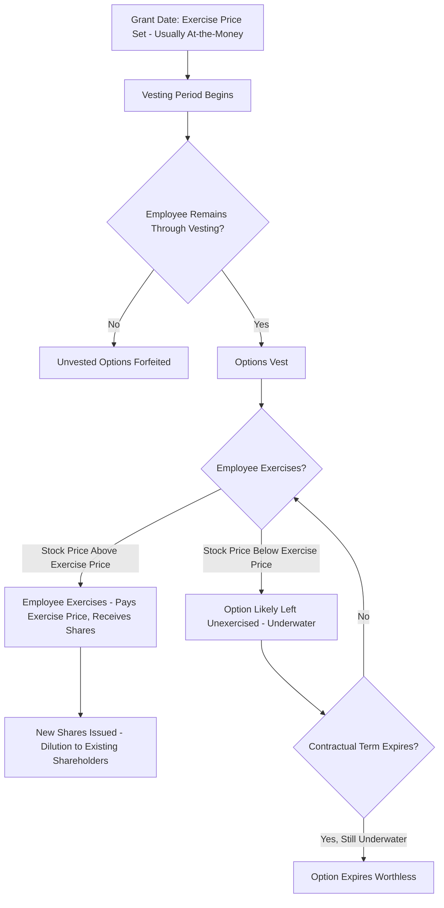

## Employee Stock Options

### Overview

Employee stock options (ESOs) are contracts granted by a company to employees, giving them the right to purchase company stock at a predetermined price (the exercise or grant price) after a specified vesting period. They are a widely used form of equity-based compensation intended to align employee incentives with shareholder value creation, and they share the fundamental payoff structure of a standard call option while differing in several important structural and valuation respects.

### Key Terminology and Structural Features

**Key Points**

- **Grant date**: The date the option is awarded to the employee; the exercise price is typically set equal to the stock's fair market value on this date.
- **Exercise price (strike price)**: The fixed price at which the employee can purchase shares, usually set at-the-money at grant.
- **Vesting period**: The time the employee must remain with the company before the option can be exercised. Common structures include **cliff vesting** (all options vest at once after a period, e.g., one year) and **graded vesting** (options vest incrementally, e.g., 25% per year over four years).
- **Contractual term**: The maximum life of the option, commonly 10 years from grant, after which unexercised options expire worthless.
- **Expected life**: The anticipated actual holding period before exercise, which is typically shorter than the contractual term because employees often exercise early for liquidity, diversification, or employment-change reasons.
- **Forfeiture**: Unvested options are typically forfeited if the employee leaves the company before vesting, a feature with no equivalent in standard exchange-traded options.

### Why ESOs Differ from Standard Exchange-Traded Options

| Feature | Standard Exchange-Traded Option | Employee Stock Option |
| --- | --- | --- |
| Transferability | Freely tradable | Generally non-transferable |
| Exercise style | European or American | American, but subject to vesting restrictions |
| Early exercise behavior | Driven by rational profit-maximization | Often driven by liquidity needs, diversification, or employment changes |
| Forfeiture risk | None | Significant — unvested options forfeited on departure |
| Dilution effect | None (settled by exchange/counterparty) | New shares often issued, diluting existing shareholders |
| Term | Typically short (weeks to ~2 years, LEAPS longer) | Long (often up to 10 years) |

**[Inference]** These structural differences mean that a standard Black-Scholes or binomial valuation, if applied without adjustment, will tend to overstate ESO fair value relative to a model that properly accounts for non-transferability, forfeiture, and early exercise driven by non-financial motives.

### Valuation Approaches

**Black-Scholes with Adjustments**

Firms commonly apply the Black-Scholes formula using the **expected life** of the option (rather than its full contractual term) as the time-to-expiration input, along with an estimated forfeiture rate, to approximate fair value for financial reporting purposes.

$$C_0 = S_0 N(d_1) - Ke^{-rT_{\text{expected}}}N(d_2)$$

**Key Points**

- Substituting expected life for contractual term is a widely used practical adjustment to compensate for the fact that Black-Scholes assumes European exercise, while ESOs are exercised early far more often than a purely profit-maximizing American option holder would.
- Estimated forfeiture rates (based on historical employee turnover data) reduce the total compensation expense recognized, reflecting that some granted options will never vest.

**Binomial / Lattice Models**

**Key Points**

- Lattice-based models can explicitly incorporate vesting schedules, expected early-exercise behavior as a function of the stock price relative to the exercise price, and post-vesting exercise multiples (behavioral assumptions about when employees tend to exercise), making them more flexible than the Black-Scholes adjustment approach.
- **[Fact]** Accounting guidance for stock-based compensation (e.g., under U.S. GAAP ASC 718 and IFRS 2) permits either the Black-Scholes model or a lattice model, provided the model and its assumptions are applied consistently and reflect the substantive terms of the award.

### Worked Example: Black-Scholes with Expected Life Adjustment

**Given**: $S_0 = \$40$ (grant-date fair value), $K = \$40$ (at-the-money grant), $r = 4\%$, $\sigma = 35\%$, contractual term $= 10$ years, but expected life $T = 6$ years (reflecting typical early-exercise behavior).

**Step 1: Compute $d_1$**

$$d_1 = \frac{\ln(40/40) + (0.04 + 0.35^2/2)(6)}{0.35\sqrt{6}} = \frac{0 + (0.04+0.06125)(6)}{0.857} = \frac{0.6075}{0.857} = 0.709$$

**Step 2: Compute $d_2$**

$$d_2 = 0.709 - 0.857 = -0.148$$

**Step 3: Cumulative normal values**

$$N(0.709) \approx 0.7611 \qquad N(-0.148) \approx 0.4412$$

**Step 4: Option value per share**

$$C_0 = 40(0.7611) - 40e^{-0.04(6)}(0.4412) = 30.44 - 40(0.7866)(0.4412) = 30.44 - 13.88 = \$16.56$$

**Total compensation expense**: If 1,000,000 options are granted with an estimated forfeiture rate of 10%, expected compensation expense $= 1{,}000{,}000 \times 0.90 \times \$16.56 = \$14{,}904{,}000$, recognized on a straight-line (or graded) basis over the vesting period.

### Accounting Treatment

**Key Points**

- Compensation expense equal to the grant-date fair value (as computed above) is recognized over the requisite service (vesting) period, rather than at grant or at exercise.
- This expense reduces reported net income but does not represent an immediate cash outflow — it is a non-cash expense that dilutes existing shareholders upon eventual exercise and share issuance.
- **[Fact]** The requirement to expense employee stock options at fair value (rather than using intrinsic-value-only accounting, which allowed at-the-money grants to be expensed at zero) was a major and historically contentious accounting change, formalized in U.S. GAAP under the predecessor to ASC 718 (SFAS 123R) in the mid-2000s.

### Dilution Effects

**Key Points**

- Outstanding employee stock options increase a company's **diluted shares outstanding**, calculated using the **treasury stock method** for financial reporting purposes: assumed proceeds from option exercise (exercise price × options exercised) are assumed to be used to repurchase shares at the current market price, with the net share increase added to diluted shares.

$$\text{Incremental Shares} = \text{Options Exercised} - \frac{\text{Options Exercised} \times \text{Exercise Price}}{\text{Average Market Price}}$$

- This dilution directly reduces diluted earnings per share (EPS), a key input to per-share valuation multiples used in equity analysis.

**Example**: 1,000,000 options outstanding with exercise price $40, average market price $60.

$$\text{Assumed Proceeds} = 1{,}000{,}000 \times 40 = \$40{,}000{,}000$$

$$\text{Shares Repurchased} = \frac{40{,}000{,}000}{60} = 666{,}667$$

$$\text{Incremental Diluted Shares} = 1{,}000{,}000 - 666{,}667 = 333{,}333$$

### Incentive Alignment and Corporate Governance Considerations

**Key Points**

- ESOs are intended to align employee interests with shareholders by giving employees direct upside exposure to stock price appreciation, theoretically motivating performance and retention.
- **[Inference]** Because option payoffs are asymmetric (unlimited upside, no downside below the exercise price beyond forfeiture of the unrealized award), heavy reliance on options as compensation can incentivize excessive risk-taking by employees or executives relative to what a risk-neutral or risk-averse shareholder might prefer — a concern frequently raised in corporate governance and executive compensation design discussions.
- **Repricing** (lowering the exercise price of underwater options after a stock price decline) is a controversial practice, since it can be viewed as removing downside consequences that were intended to be part of the incentive structure; many companies require shareholder approval for repricing as a governance safeguard.
- Alternatives and complements to standard ESOs include **restricted stock units (RSUs)** (outright grants of stock vesting over time, with less leverage/risk than options), **performance shares** (vesting tied to performance metrics rather than time alone), and **stock appreciation rights (SARs)** (cash or stock payment equal to the appreciation in value, without requiring the employee to fund an exercise price).

### ESO Lifecycle Flow

### Comparison to Standard Option Valuation Frameworks

**Key Points**

- Both Black-Scholes and binomial/lattice approaches rely on the same core option pricing theory covered previously, but ESO valuation requires adapting these frameworks for non-transferability, vesting/forfeiture, and behaviorally-driven early exercise rather than pure profit-maximizing exercise.
- The choice between the Black-Scholes-with-adjustments approach and a full lattice model is often a function of company size, sophistication, and the complexity of the award's terms — plain-vanilla at-the-money options with simple vesting are commonly valued with the adjusted Black-Scholes approach, while awards with more complex features (performance conditions, market conditions) more often warrant lattice or Monte Carlo methods.

**Related Topics**

- The Black-Scholes model and its standard assumptions
- Binomial option pricing and lattice-based valuation methods
- Restricted stock units and performance-based equity compensation
- Diluted earnings per share and the treasury stock method
- Executive compensation design and corporate governance