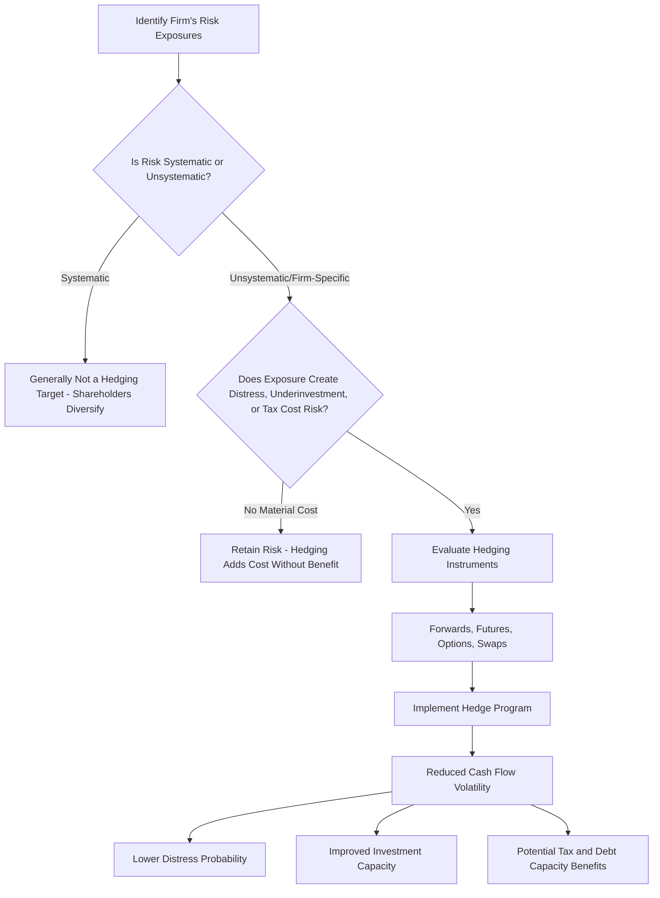

## Motivations for Corporate Risk Management

### Overview

Corporate risk management involves the deliberate use of financial instruments and operational strategies to reduce a firm's exposure to various risks — interest rate, currency, commodity price, and credit risk among them. A foundational question in corporate finance theory is *why* firms should hedge at all, given that in a world of perfect capital markets (as in the Modigliani-Miller framework), shareholders could diversify away firm-specific risk themselves at no cost, making corporate-level hedging seemingly redundant. Understanding the specific market imperfections that make hedging value-adding is essential context before studying the derivative instruments used to implement it.

### The Modigliani-Miller Baseline: Why Hedging "Shouldn't" Matter

**Key Points**

- Under the assumptions of the Modigliani-Miller (MM) framework — no taxes, no transaction costs, no costs of financial distress, and symmetric information — the firm's total value is independent of how its risk is managed, because shareholders can independently hedge or diversify at the same cost the firm could, making corporate risk management a redundant activity that could actually reduce shareholder value by imposing hedging costs without offsetting benefit.
- This baseline result serves as the theoretical starting point for risk management theory: firms hedge in practice specifically to the extent that real-world market imperfections violate MM's idealized assumptions, so the rationales below are essentially derived from cataloguing which imperfections are empirically important.

### Rationale 1: Reducing the Costs of Financial Distress

**Key Points**

- Financial distress imposes real costs on firms — direct costs (legal and administrative fees in bankruptcy) and indirect costs (lost customers, key employee departures, strained supplier relationships, reduced access to credit, and impaired ability to pursue positive-NPV investments).
- By reducing the volatility of cash flows and firm value, hedging reduces the probability of falling into financial distress, thereby preserving firm value that would otherwise be eroded by these distress costs.
- **[Inference]** This rationale implies that hedging value is greatest for firms with high existing leverage, significant fixed costs, or cash flows highly sensitive to a specific risk factor (e.g., commodity-price-exposed firms with high fixed operating costs), since these firms face the highest marginal probability of transitioning into costly distress states.

### Rationale 2: Reducing Underinvestment (the "Debt Overhang" Problem)

**Key Points**

- When a firm has existing debt, volatile cash flows increase the risk that in bad states of the world, the firm lacks internally generated cash to fund positive-NPV projects, and may be unable or unwilling to raise external financing (due to costly external financing or the classic underinvestment problem, where value from a new project would partly accrue to existing debtholders rather than shareholders).
- Hedging reduces cash flow volatility, making it more likely the firm has sufficient internal funds available precisely when good investment opportunities arise, thereby reducing the incidence of value-destroying underinvestment.
- This rationale is closely associated with the academic argument (developed notably by Froot, Scharfstein, and Stein in the early 1990s) that hedging is most valuable for firms whose investment opportunities are correlated with states in which cash flow is otherwise low.

### Rationale 3: Tax Benefits from Reduced Earnings Volatility

**Key Points**

- In jurisdictions with a **convex effective tax function** (where the tax rate schedule causes average tax liability to rise disproportionately with income due to features like progressive tax brackets or the limited ability to carry forward tax losses indefinitely), reducing the volatility of pre-tax income can reduce the firm's *expected* tax liability, since Jensen's inequality implies that taxes on a volatile income stream exceed taxes on a smoothed income stream with the same average value, when the tax function is convex.
- **[Inference]** This tax-based rationale is generally considered a secondary or supporting motivation relative to the financial distress and underinvestment rationales in most academic treatments, since the degree of convexity in actual corporate tax schedules (especially after the reduction of high progressive corporate tax brackets in many jurisdictions) is often modest.

### Rationale 4: Improving Debt Capacity and Lowering the Cost of Capital

**Key Points**

- By reducing cash flow volatility and the associated probability of distress, hedging can allow a firm to sustain a higher level of debt (greater debt capacity) at a given credit rating, potentially allowing the firm to capture a larger tax shield benefit from debt financing.
- Lenders may also offer more favorable borrowing terms (lower interest rates, less restrictive covenants) to firms with demonstrated risk management practices, since reduced cash flow volatility lowers the lender's own credit risk exposure.

### Rationale 5: Managerial Risk Aversion (Agency-Based Motivation)

**Key Points**

- Managers and executives typically hold concentrated, undiversified exposure to their firm (through compensation, reputation, and career capital) unlike diversified outside shareholders, giving managers a personal incentive to reduce firm-level risk that may exceed what would maximize shareholder value alone.
- This is generally treated as an **agency cost** explanation for hedging rather than a shareholder-value-maximizing rationale — it explains observed hedging behavior but does not necessarily justify it from a pure shareholder-wealth perspective, since a fully diversified shareholder may not want the firm to spend resources hedging away risks they could bear more cheaply within their own diversified portfolio.
- **[Inference]** Well-designed compensation structures (e.g., appropriately calibrated equity-based pay) are sometimes suggested in the literature as a partial solution to align managerial risk preferences more closely with diversified shareholder interests, reducing reliance on costly corporate hedging driven primarily by managerial risk aversion.

### Rationale 6: Comparative Advantage in Risk-Bearing / Information Asymmetry

**Key Points**

- Firms may possess informational or operational advantages that make certain risk-bearing decisions more efficient at the corporate level than if left entirely to individual shareholders — for example, a firm's management may have superior information about the firm's specific exposure to a commodity price or currency movement compared to dispersed outside shareholders.
- Corporate-level hedging can be executed at lower transaction costs (via established banking relationships, larger notional volumes, and specialized treasury expertise) than individual shareholders could achieve hedging the equivalent exposure on their own.

### Why Shareholders Cannot Simply "Hedge It Themselves" in Practice

**Key Points**

- While the MM baseline assumes shareholders can costlessly replicate any hedging the firm could do, several practical frictions break this assumption: individual investors face higher relative transaction costs, lack the firm-specific information needed to size an appropriate hedge, cannot directly hedge risks that are entangled with firm-specific operational decisions, and may not have access to the same derivative markets or credit terms available to the corporation.
- These frictions collectively provide the practical justification for corporate-level (rather than purely shareholder-level) risk management, even though the theoretical MM starting point suggests hedging should be irrelevant to firm value.

### Which Risks Are Typically Hedged vs. Retained

**Key Points**

- **Systematic (market-wide) risk** — the risk shareholders are already compensated for bearing via the risk premium embedded in the cost of equity — is generally *not* a target of corporate hedging, since diversified shareholders can bear this risk more efficiently themselves and hedging it away would not increase (and could decrease) shareholder value.
- **Unsystematic (firm-specific or idiosyncratic) risk** that creates the specific costs described above (distress costs, underinvestment, tax convexity) is the primary target of value-adding corporate hedging programs — currency exposure from foreign operations, commodity input price exposure, and interest rate exposure on floating-rate debt are common examples.
- **[Inference]** This distinction is central to why corporate risk management theory does not simply advocate "hedge everything" — the goal is to mitigate the specific frictions/costs outlined above, not to minimize total risk or volatility as an end in itself.

### Summary Framework: Motivations and Their Mechanism

| Motivation | Mechanism | Most Relevant For |
| --- | --- | --- |
| Reduce financial distress costs | Lower probability of costly distress states | Highly levered firms, firms with high fixed costs |
| Reduce underinvestment | Preserve internal funds for good investment opportunities | Growth firms with correlated cash-flow/investment-opportunity risk |
| Tax benefits | Reduce expected tax under convex tax schedules | Firms with volatile pre-tax income facing progressive/limited-carryforward tax treatment |
| Improve debt capacity | Enable higher leverage at given credit rating | Firms seeking to maximize the interest tax shield |
| Managerial risk aversion | Align firm risk with undiversified manager exposure | Firms with concentrated managerial equity/career exposure |
| Comparative advantage in hedging | Lower transaction costs / better information than shareholders | Firms with complex, firm-specific risk exposures |

### Corporate Risk Management Decision Flow

**Related Topics**

- Modigliani-Miller propositions and capital structure irrelevance
- Forward and futures contracts as hedging instruments
- Interest rate and currency swaps
- Financial distress costs and the tradeoff theory of capital structure
- Option-based hedging strategies (collars, protective puts) in corporate treasury management