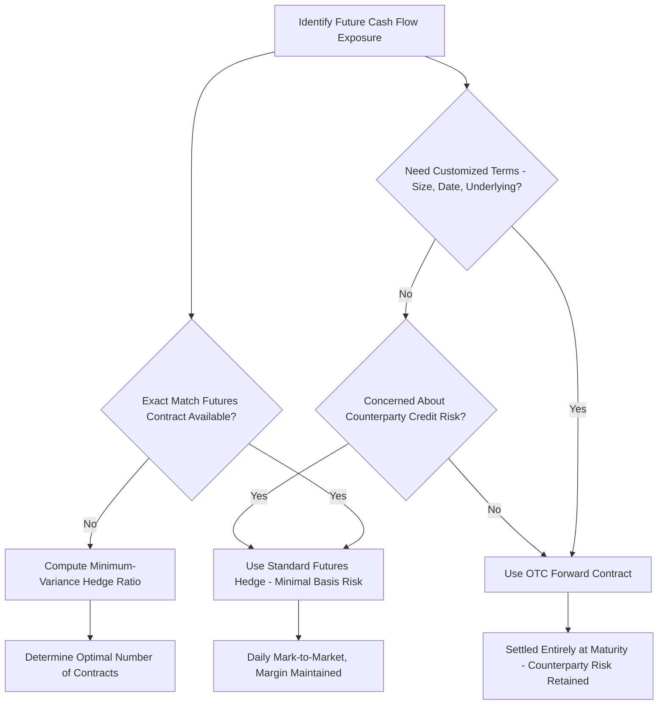

## Forward and Futures Contracts

### Overview

Forward and futures contracts are the most fundamental derivative instruments used in corporate risk management, both obligating two parties to transact an underlying asset at a predetermined price on a future date. While economically similar in their basic payoff structure, forwards and futures differ substantially in their institutional structure — customization, counterparty risk, and cash flow timing — which determines which instrument is more appropriate for a given corporate hedging application.

### Basic Definitions

**Key Points**

- A **forward contract** is a customized, privately negotiated (over-the-counter, OTC) agreement between two parties to buy or sell an asset at a specified price (the **forward price**) on a specified future date.
- A **futures contract** is a standardized agreement, traded on an organized exchange, to buy or sell an asset at a specified price (the **futures price**) on a specified future date, with the exchange (via its clearinghouse) acting as the counterparty to every trade.
- The party agreeing to **buy** the underlying asset holds the **long position**; the party agreeing to **sell** holds the **short position**.

### Forward vs. Futures: Structural Comparison

| Feature | Forward Contract | Futures Contract |
| --- | --- | --- |
| Trading venue | Over-the-counter (OTC), privately negotiated | Organized exchange |
| Contract terms | Customized (size, expiration, underlying) | Standardized |
| Counterparty | The other party to the trade directly | Clearinghouse (via novation) |
| Counterparty (default) risk | Present — depends on the specific counterparty's creditworthiness | Minimal — clearinghouse guarantees performance |
| Liquidity | Generally lower, harder to exit before maturity | Generally higher, easily offset by an opposing trade |
| Cash flows before maturity | None — settled entirely at maturity | Daily settlement via marking-to-market |
| Margin requirements | Typically none (or negotiated bilaterally) | Initial margin and maintenance margin required |
| Regulatory oversight | Historically lighter (though this varies significantly by jurisdiction and has increased since the 2008 financial crisis for many OTC derivatives) | Heavily regulated by exchange and (in the U.S.) the CFTC |

### Payoff at Maturity

For both forwards and futures, the payoff to each position at contract maturity depends on the difference between the spot price of the underlying asset at maturity ($S_T$) and the contract's agreed price ($F_0$):

$$\text{Payoff}_{\text{long}} = S_T - F_0$$

$$\text{Payoff}_{\text{short}} = F_0 - S_T$$

**Key Points**

- Unlike options, forward and futures payoffs are **symmetric and unbounded** in both directions — there is no premium paid upfront, and both parties are obligated (not merely entitled) to transact, meaning both potential gains and losses are theoretically unlimited (bounded on the downside for the underlying asset only by the asset's price falling to zero).
- This symmetric, obligation-based payoff structure is the defining distinction from options, which provide asymmetric, rights-only payoffs in exchange for an upfront premium.

### Marking-to-Market and Daily Settlement (Futures Only)

**Key Points**

- Futures contracts are **marked to market daily**: gains and losses are settled in cash at the end of each trading day based on the change in the futures price, rather than accumulating until contract maturity as with forwards.
- This daily settlement process, combined with **initial margin** (a good-faith deposit required to open a position) and **maintenance margin** (a minimum balance that must be maintained, triggering a **margin call** if breached), is the primary mechanism by which exchanges and clearinghouses minimize counterparty default risk.

**Example: Marking-to-Market**

An investor takes a long position in one futures contract on 1,000 barrels of oil at a futures price of $70/barrel, posting an initial margin of $5,000 (maintenance margin $3,500).

| Day | Futures Price | Daily Price Change | Daily Gain/(Loss) | Margin Balance |
| --- | --- | --- | --- | --- |
| 0 (open) | $70.00 | — | — | $5,000 |
| 1 | $68.50 | -$1.50 | -$1,500 | $3,500 |
| 2 | $67.00 | -$1.50 | -$1,500 | $2,000 → margin call to $5,000 |
| 3 | $69.00 | +$2.00 | +$2,000 | $7,000 |

**[Fact]** When the margin balance falls below the maintenance margin level (as on Day 2), the holder receives a margin call requiring a deposit sufficient to restore the balance to the initial margin level, not merely to the maintenance level.

### Pricing Forward Contracts: Cost-of-Carry Model

For a forward contract on an asset with no income (e.g., a non-dividend-paying stock), the no-arbitrage forward price is:

$$F_0 = S_0(1+r)^T$$

Or in continuous compounding:

$$F_0 = S_0 e^{rT}$$

**With storage costs or income (dividends, coupon payments):**

$$F_0 = (S_0 + PV(\text{storage costs}) - PV(\text{income}))(1+r)^T$$

Or with continuous income yield $q$ (e.g., dividend yield) and continuous storage cost $u$:

$$F_0 = S_0 e^{(r+u-q)T}$$

**Key Points**

- This relationship follows from a no-arbitrage/cash-and-carry argument: an arbitrageur could buy the asset today (financed at the risk-free rate) and simultaneously sell it forward; if the forward price deviates from this cost-of-carry relationship, a riskless arbitrage profit is available.
- For commodities, the concept of **convenience yield** (the non-monetary benefit of holding the physical commodity, e.g., avoiding stockouts in production) can cause the actual forward price to be lower than the pure cost-of-carry formula would suggest, since convenience yield acts similarly to a dividend/income yield reducing the forward price.

### Worked Example: Forward Pricing

**Given**: A non-dividend-paying stock trades at $S_0 = \$50$, the risk-free rate is $r=4\%$ (annual), and a forward contract has $T=0.5$ years to maturity.

$$F_0 = 50(1.04)^{0.5} = 50 \times 1.0198 = \$50.99$$

If the actual quoted forward price were, say, $52, an arbitrageur could sell the forward, borrow $50 to buy the stock today, and lock in a riskless profit of $52 - 50.99 = \$1.01$ per share at maturity, since the cost-of-carry pricing must hold under no-arbitrage.

### Corporate Hedging Applications

**Key Points**

- **Currency forwards**: A firm with a known future foreign-currency receivable or payable (e.g., an exporter expecting payment in euros in 90 days) can lock in today's exchange rate using a forward contract, eliminating uncertainty about the domestic-currency value of the future cash flow.
- **Commodity futures**: A manufacturer with significant exposure to a raw material input price (e.g., an airline hedging jet fuel, a food producer hedging wheat or corn) can use futures contracts to lock in input costs, reducing the volatility of operating margins.
- **Interest rate futures**: Firms can hedge exposure to future interest rate changes (e.g., locking in a borrowing rate for an anticipated future debt issuance) using instruments like Treasury futures or Eurodollar futures.

### Example: Hedging a Foreign Currency Receivable

**Given**: A U.S. exporter expects to receive €1,000,000 in 90 days. Current spot rate: $1.10/€. 90-day forward rate: $1.095/€.

Without hedging, if the euro depreciates to $1.05/€ by the payment date, the receivable is worth $1{,}000{,}000 \times 1.05 = \$1{,}050{,}000$ — a $50,000 shortfall relative to today's spot value.

By entering a forward contract to sell €1,000,000 at $1.095/€ in 90 days, the firm locks in receipt of $1{,}000{,}000 \times 1.095 = \$1{,}095{,}000$ regardless of where the spot rate moves, eliminating the currency risk on this specific cash flow (at the cost of forgoing any upside if the euro instead appreciated).

### Basis Risk (Futures-Specific Consideration)

**Key Points**

- **Basis** is defined as the difference between the spot price of the asset being hedged and the futures price used to hedge it: $\text{Basis} = S_t - F_t$.
- **Basis risk** arises when the asset being hedged is not identical to the underlying asset of the available futures contract (a common situation, since standardized futures contracts may not exactly match a firm's specific commodity grade, delivery location, or hedge horizon), meaning the hedge may not perfectly offset the underlying exposure even though a futures position was taken.
- **[Inference]** Basis risk is a practical limitation acknowledged in essentially all textbook treatments of futures hedging: a hedge using an imperfectly matched futures contract reduces but does not necessarily eliminate risk, and the effectiveness of such a hedge depends on the historical correlation and volatility relationship between the spot and futures prices involved.

### Hedge Ratio and Optimal Hedging

For hedges using a futures contract that does not perfectly match the underlying exposure, the **minimum-variance hedge ratio** determines the optimal number of futures contracts to use:

$$h^* = \rho \times \frac{\sigma_S}{\sigma_F}$$

Where $\rho$ is the correlation coefficient between spot price changes and futures price changes, $\sigma_S$ is the standard deviation of spot price changes, and $\sigma_F$ is the standard deviation of futures price changes.

**Number of contracts**:

$$N^* = h^* \times \frac{Q_A}{Q_F}$$

Where $Q_A$ is the size of the position being hedged and $Q_F$ is the size of one futures contract.

### Forward/Futures Hedging Decision Flow

### Key Tradeoffs in Choosing Forwards vs. Futures

| Consideration | Favors Forward | Favors Futures |
| --- | --- | --- |
| Need for exact customization (amount, date) | ✓ |  |
| Need to avoid daily cash flow/margin calls | ✓ |  |
| Concern about counterparty default risk |  | ✓ |
| Need to exit the position before maturity |  | ✓ |
| Regulatory/accounting simplicity preference | Varies by jurisdiction | Varies by jurisdiction |

**Related Topics**

- Interest rate and currency swaps as extensions of forward contract logic
- Option-based hedging (collars, protective puts) as an alternative to symmetric forward/futures hedges
- Cost-of-carry pricing and convenience yield in commodity markets
- Hedge accounting treatment under corporate financial reporting standards
- Motivations for corporate risk management (the underlying rationale for using these instruments)