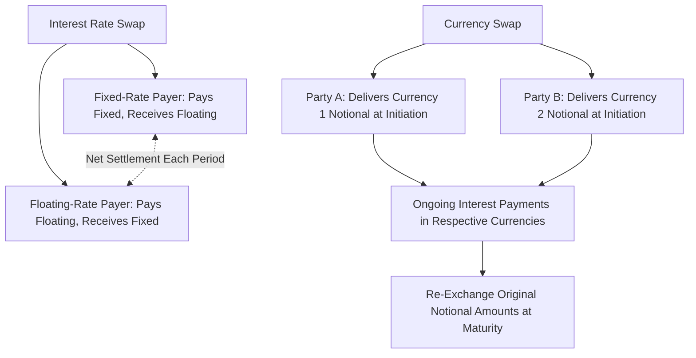

## Interest Rate Swaps and Currency Swaps

### Overview

Swaps are OTC derivative contracts in which two parties agree to exchange cash flows according to a predetermined formula over multiple future dates. They extend the basic forward contract concept to a series of exchanges rather than a single settlement, making them the primary tool corporations use to manage longer-term, recurring exposures to interest rate and currency risk.

### Interest Rate Swaps: Structure

**Key Points**

- The most common structure is the **plain vanilla (fixed-for-floating) interest rate swap**: one party pays a fixed interest rate on a notional principal amount, while the other pays a floating rate (historically often tied to LIBOR; increasingly tied to alternative reference rates such as SOFR following the LIBOR transition) on the same notional principal.
- The **notional principal** is never exchanged between the parties — it serves only as the base amount on which interest payments are calculated.
- Payments are typically **netted**: only the difference between the fixed and floating payment obligations changes hands on each settlement date, rather than both parties making gross payments.

### Interest Rate Swap Cash Flow Mechanics

$$\text{Net Payment (Fixed-Rate Payer)} = (\text{Fixed Rate} - \text{Floating Rate}) \times \text{Notional} \times \frac{\text{Days in Period}}{360 \text{ or } 365}$$

**Example**

A firm enters a 3-year interest rate swap with $10,000,000 notional principal, agreeing to pay a fixed rate of 4.5% annually and receive a floating rate based on the prevailing reference rate, with annual settlement.

| Year | Floating Rate (SOFR-based) | Fixed Payment Owed | Floating Payment Received | Net Cash Flow (Fixed Payer) |
| --- | --- | --- | --- | --- |
| 1 | 3.8% | $450,000 | $380,000 | -$70,000 (fixed payer pays net) |
| 2 | 4.9% | $450,000 | $490,000 | +$40,000 (fixed payer receives net) |
| 3 | 5.2% | $450,000 | $520,000 | +$70,000 (fixed payer receives net) |

**Key Points**

- The fixed-rate payer benefits when floating rates rise above the fixed rate (receiving a net payment), and is disadvantaged when floating rates fall below the fixed rate (making a net payment) — the fixed-rate payer is economically positioned similarly to having converted floating-rate debt into fixed-rate debt.

### Why Firms Use Interest Rate Swaps

**Key Points**

- **Converting floating-rate debt to fixed-rate (or vice versa)**: A firm that issued floating-rate debt but prefers the payment certainty of fixed-rate obligations can enter a swap to pay fixed and receive floating, effectively converting its debt service profile without refinancing the underlying debt instrument itself.
- **Comparative advantage argument**: A classic rationale for swaps holds that two firms may face different relative borrowing costs in fixed vs. floating markets (due to differing credit assessments in each market segment), and by each borrowing in the market where they have a comparative advantage and then swapping their payment obligations, both firms can achieve a lower effective cost than borrowing directly in their preferred market.
- **Asset-liability matching**: Financial institutions and other firms with interest-rate-sensitive assets and liabilities use swaps to better match the interest rate sensitivity of their asset and liability portfolios (a core application in bank interest rate risk management).

### Comparative Advantage Example

**Given**: Two firms face the following borrowing rates:

| Firm | Fixed Rate | Floating Rate |
| --- | --- | --- |
| Firm A (higher credit quality) | 5.0% | SOFR + 0.3% |
| Firm B (lower credit quality) | 6.5% | SOFR + 1.0% |

Firm A wants floating-rate exposure; Firm B wants fixed-rate exposure.

**Step 1: Identify the comparative advantage**

Fixed rate differential: $6.5\% - 5.0\% = 1.5\%$

Floating rate differential: $(SOFR+1.0\%) - (SOFR+0.3\%) = 0.7\%$

Firm A has a comparative advantage in fixed-rate borrowing (its advantage there, 1.5%, exceeds its advantage in floating, 0.7%); Firm B has a relative (though not absolute) advantage in floating-rate borrowing.

**Step 2: Total potential gain from swapping**

$$\text{Total Gain} = 1.5\% - 0.7\% = 0.8\%$$

**Step 3: Structure the swap**

Firm A borrows fixed at 5.0% (its advantage market) and Firm B borrows floating at SOFR+1.0% (its comparative advantage market); they then swap payment obligations, splitting the 0.8% total gain between them (e.g., 0.4% each, though the exact split depends on negotiation, often facilitated by a swap dealer who also takes a spread).

**[Inference]** This comparative advantage argument, while a standard textbook explanation, has been academically critiqued on the grounds that the "advantage" partly reflects differences in credit risk exposure across fixed vs. floating markets rather than a pure arbitrage-free gain from trade; nonetheless it remains a widely taught illustrative framework for why swap markets developed and persist.

### Valuing Interest Rate Swaps

**Key Points**

- A swap can be valued as the difference between two bonds: a fixed-rate bond (with coupons equal to the swap's fixed rate) and a floating-rate bond (which is valued at par immediately following each reset date, since its coupon resets to the prevailing market rate).

$$V_{\text{swap (fixed payer)}} = B_{\text{floating}} - B_{\text{fixed}}$$

- At initiation, a swap is typically structured so that the fixed rate is set to make the swap's initial value equal to zero for both parties (no upfront payment required), analogous to how a forward price is set to make an initial forward contract have zero value.
- As market interest rates move after initiation, the swap's value shifts away from zero for both counterparties, since the fixed-rate bond's value changes with rates while the floating-rate bond continually resets near par.

### Currency Swaps: Structure

**Key Points**

- A **currency swap** involves the exchange of principal and interest payments denominated in two different currencies between two parties.
- Unlike interest rate swaps, currency swaps typically involve an **actual exchange of notional principal** — both at the inception of the swap and again (usually at the original exchange rate) at maturity — because the two notional amounts are denominated in different currencies and thus are not directly comparable without conversion.
- Interest payments during the life of the swap are made in each party's respective currency (not netted in a single currency, since exchange rate movements over the swap's life mean the two payment streams are not directly fungible until converted).

### Currency Swap Cash Flow Structure

**Typical Structure (fixed-for-fixed currency swap)**:

1. **At initiation**: Party A delivers a notional amount in Currency 1 to Party B; Party B delivers the equivalent notional amount (at the current spot exchange rate) in Currency 2 to Party A.
2. **During the life of the swap**: Each party pays interest on the notional they received, denominated in that currency (e.g., Party A pays interest in Currency 2, Party B pays interest in Currency 1).
3. **At maturity**: The original notional principal amounts are re-exchanged (typically at the original exchange rate agreed at initiation, not the prevailing spot rate at maturity), effectively unwinding the initial exchange.

**Example**

A U.S. firm needs €50,000,000 for a European subsidiary, while a European firm needs the dollar equivalent for a U.S. operation. Spot rate: $1.10/€, so notional equivalence is $50{,}000{,}000 \times 1.10 = \$55{,}000{,}000$.

- **At initiation**: U.S. firm delivers $55,000,000 to the European firm; European firm delivers €50,000,000 to the U.S. firm.
- **During the swap**: U.S. firm pays euro-denominated interest on €50,000,000 (e.g., at a euro fixed rate of 3%, paying €1,500,000 annually); European firm pays dollar-denominated interest on $55,000,000 (e.g., at a dollar fixed rate of 5%, paying $2,750,000 annually).
- **At maturity**: The original principal amounts are re-exchanged — U.S. firm returns €50,000,000, receiving back its original $55,000,000, regardless of the spot exchange rate prevailing at that time.

**Key Points**

- Because principal is re-exchanged at the original rate, a currency swap effectively locks in the exchange rate for the return of principal, eliminating currency risk on that specific cash flow — this is the core hedging value of the instrument for firms with genuine cross-currency financing needs.

### Why Firms Use Currency Swaps

**Key Points**

- **Accessing foreign capital markets indirectly**: A firm may face better borrowing terms in its home currency market than in a foreign market where it actually needs funds (e.g., for a foreign subsidiary's operations); a currency swap allows the firm to borrow in its preferred (home) market and swap into the currency it actually needs, similar in spirit to the comparative advantage rationale for interest rate swaps.
- **Hedging long-term transaction exposure**: Multinational firms with long-term foreign-currency-denominated revenue or expense streams (e.g., a long-term supply contract or foreign bond issuance) use currency swaps to hedge exposure over a horizon too long to be practically managed with a series of short-dated forward contracts.
- **Combining interest rate and currency risk management**: Many real-world currency swaps also involve a fixed-for-floating structure in one or both currency legs (a **cross-currency basis swap**), simultaneously managing both interest rate and currency exposure in a single instrument.

### Comparison: Interest Rate Swaps vs. Currency Swaps

| Feature | Interest Rate Swap | Currency Swap |
| --- | --- | --- |
| Currencies involved | Single currency | Two different currencies |
| Notional principal exchange | Not exchanged | Exchanged at initiation and maturity |
| Payment netting | Typically netted (single currency) | Not netted (different currencies) |
| Primary risk managed | Interest rate risk | Currency risk (often combined with interest rate risk) |
| Typical corporate use | Convert fixed/floating debt exposure | Hedge cross-border financing and long-term currency exposure |

### Swap Cash Flow Diagram

### Counterparty Credit Risk in Swaps

**Key Points**

- Because swaps are typically OTC instruments involving multi-period exposure, counterparty credit risk is a significant consideration, particularly for currency swaps given the larger notional amounts actually exchanged.
- Since the 2008 financial crisis, many jurisdictions have moved toward requiring **central clearing** of standardized swaps through clearinghouses (analogous to futures market structures) to reduce systemic counterparty risk, alongside collateral/margin requirements for non-cleared swaps.
- **[Fact]** This regulatory shift toward central clearing represents a structural convergence between swap markets and the exchange-traded futures model in terms of counterparty risk management, even though swaps remain more customizable than standardized futures contracts.

**Related Topics**

- Forward and futures contracts as building blocks for swap structures
- Motivations for corporate risk management (financial distress costs, underinvestment)
- Cross-currency basis swaps and combined interest rate/currency hedging
- Credit risk in OTC derivatives and central clearing requirements
- Multinational capital budgeting and translation/transaction currency exposure