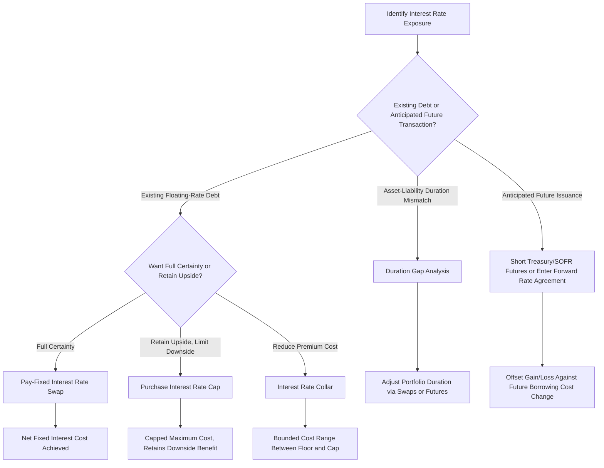

## Hedging Interest Rate Exposure

### Overview

Interest rate exposure arises whenever a firm's asset values, liability costs, or cash flows are sensitive to changes in market interest rates. Hedging this exposure involves measuring the sensitivity of the exposure and applying instruments — swaps, futures, forward rate agreements, and options — to offset unwanted rate risk. This topic synthesizes the interest rate swap and futures instruments already covered into a practical framework for measuring exposure and constructing hedges.

### Sources of Interest Rate Exposure

**Key Points**

- **Floating-rate debt**: A firm with floating-rate borrowings faces higher interest expense if rates rise, directly increasing cash outflows and potentially straining coverage ratios and covenant compliance.
- **Fixed-rate debt (opportunity cost exposure)**: A firm locked into fixed-rate debt faces the risk that if rates fall, it is paying above-market interest relative to what refinancing could achieve (though it is protected if rates rise) — this is a form of exposure to *not* benefiting from favorable rate movements rather than direct cash flow risk.
- **Anticipated future borrowing**: A firm planning a future debt issuance (e.g., to fund a capital project) is exposed to the risk that rates rise between now and the issuance date, increasing the eventual cost of that financing.
- **Asset-side exposure**: Financial institutions and firms holding fixed-income assets face the risk that rising rates reduce the market value of those assets (price risk) or that reinvestment of maturing assets occurs at unfavorable rates (reinvestment risk).
- **Asset-liability duration mismatch**: Firms (especially financial institutions) with assets and liabilities of different interest-rate sensitivities (duration) face **net interest margin risk** — the risk that a rate change affects asset yields and liability costs asymmetrically.

### Measuring Interest Rate Sensitivity: Duration

**Duration** measures the sensitivity of a fixed-income instrument's price to changes in interest rates, expressed as the approximate percentage price change per unit change in yield.

$$\text{Modified Duration} = \frac{\text{Macaulay Duration}}{1 + y/n}$$

$$\frac{\Delta P}{P} \approx -D_{\text{mod}} \times \Delta y$$

Where $D_{\text{mod}}$ is modified duration, $\Delta y$ is the change in yield, $y$ is the yield to maturity, and $n$ is the number of compounding periods per year.

**Example**

A bond has a modified duration of 7 years and is currently priced at $1,000. If interest rates rise by 50 basis points (0.50%):

$$\frac{\Delta P}{P} \approx -7 \times 0.005 = -3.5\%$$

$$\Delta P \approx -0.035 \times 1{,}000 = -\$35$$

**Key Points**

- Duration provides a first-order (linear) approximation of price sensitivity; **convexity** captures the second-order (curvature) effect and improves accuracy for larger rate changes, since the actual price-yield relationship for most fixed-income instruments is convex rather than linear.
- **Duration gap analysis** (comparing the weighted average duration of assets to the weighted average duration of liabilities) is a standard framework financial institutions use to assess and manage net interest rate exposure at the balance-sheet level.

### Hedging with Interest Rate Swaps

**Key Points**

- The most common corporate application: a firm with floating-rate debt that wishes to fix its interest cost enters a **pay-fixed, receive-floating swap**. The floating payments received from the swap offset the floating payments owed on the underlying debt, leaving the firm with a net fixed payment obligation (the swap's fixed rate).
- Conversely, a firm with fixed-rate debt seeking to benefit from potentially falling rates (accepting more cash flow variability) can enter a **pay-floating, receive-fixed swap**, synthetically converting its fixed-rate obligation into a floating-rate one.

**Example: Converting Floating-Rate Debt to Fixed**

A firm has $20,000,000 in floating-rate debt at SOFR + 1.5%. It enters a swap to pay a fixed rate of 4.0% and receive SOFR on a matching $20,000,000 notional.

$$\text{Net Cost} = (\text{SOFR} + 1.5\%) - \text{SOFR} + 4.0\% = 1.5\% + 4.0\% = 5.5\% \text{ fixed}$$

The floating payments on the debt and the floating receipts from the swap cancel out (both tied to SOFR), leaving the firm paying an effective fixed rate of 5.5% regardless of how SOFR moves going forward.

### Hedging with Interest Rate Futures

**Key Points**

- **Treasury futures** (e.g., on Treasury bonds or notes) allow firms to hedge exposure to broad interest rate movements affecting fixed-income asset values or borrowing costs.
- **Eurodollar futures (or SOFR futures, following the transition away from LIBOR)** are commonly used to hedge short-term interest rate exposure, particularly for anticipated future borrowing or floating-rate debt reset risk.
- A firm anticipating a future fixed-rate debt issuance can **short Treasury futures** today: if rates rise before issuance (raising the firm's eventual borrowing cost), the futures position gains value, offsetting the higher cost of the anticipated issuance; if rates fall, the futures position loses value, offsetting the benefit of lower borrowing costs (a symmetric hedge, consistent with the general forward/futures payoff structure).

**Example: Hedging an Anticipated Debt Issuance**

A firm plans to issue $50,000,000 in fixed-rate bonds in 3 months and is concerned rates will rise before issuance. It shorts an appropriate quantity of Treasury futures (calculated using a duration-based hedge ratio matching the anticipated bond's price sensitivity).

If rates rise by 50 basis points before issuance:

- The anticipated bond issuance now must be priced at a higher yield, effectively raising the firm's borrowing cost — an economic loss relative to the original plan.
- The short Treasury futures position gains value as Treasury prices fall (since bond prices move inversely to yields), offsetting the higher borrowing cost.

**[Inference]** The precision of this hedge depends on the correlation between the specific Treasury futures contract used and the firm's actual borrowing rate/spread — since corporate credit spreads can widen or narrow independently of the underlying Treasury rate, this hedge addresses only the risk-free rate component of the firm's borrowing cost, not credit spread risk, which is typically hedged separately if at all.

### Hedging with Forward Rate Agreements (FRAs)

**Key Points**

- A **forward rate agreement (FRA)** is an OTC contract that fixes an interest rate for a specified future period on a notional principal amount, settled in cash based on the difference between the agreed (contract) rate and the actual reference rate prevailing at settlement, without any exchange of the notional principal itself.
- FRAs are conceptually a single-period version of an interest rate swap (or equivalently, a forward contract on an interest rate), offering more customization than exchange-traded futures for firms hedging a specific, non-standard future interest period.

$$\text{FRA Settlement} = \frac{(\text{Reference Rate} - \text{Contract Rate}) \times \text{Notional} \times \frac{\text{Days}}{360}}{1 + \text{Reference Rate} \times \frac{\text{Days}}{360}}$$

(The denominator reflects that FRA settlement is typically paid at the start of the reference period, requiring discounting since the rate differential otherwise would apply to a payment due at the end of the period.)

### Hedging with Interest Rate Options

**Key Points**

- **Interest rate caps**: A series of purchased call options on an interest rate (caplets), providing payoffs when the reference rate exceeds a specified cap rate — used by floating-rate borrowers to limit maximum interest expense while retaining the benefit of lower rates if they occur, at the cost of an upfront premium.
- **Interest rate floors**: A series of put options on an interest rate (floorlets), providing payoffs when the reference rate falls below a specified floor rate — used by floating-rate lenders/investors to guarantee a minimum yield.
- **Interest rate collars**: A combination of a purchased cap and a written floor (or vice versa), which reduces or eliminates the net premium cost by giving up some potential benefit from favorable rate movements in exchange for the reduced cost of the protection — this mirrors the same collar logic used in equity and currency hedging.

**Key Points on the Cap/Swap/Collar Tradeoff**

- A swap (pay-fixed) provides complete rate certainty (no upside participation, no premium cost) — a symmetric hedge.
- A cap provides downside protection while preserving upside participation, at the cost of an upfront premium — an asymmetric hedge.
- A collar reduces or eliminates the premium cost of a cap by sacrificing some or all upside participation — a partial, cost-reduced hedge.

### Comparison of Interest Rate Hedging Instruments

| Instrument | Symmetry | Upfront Cost | Flexibility | Typical Use Case |
| --- | --- | --- | --- | --- |
| Interest rate swap | Symmetric | None (initially zero-value) | Standard terms negotiable | Convert floating debt to fixed (or vice versa) |
| Treasury/SOFR futures | Symmetric | Margin only, no premium | Standardized contract sizes | Hedge anticipated issuance or short-term rate moves |
| Forward rate agreement | Symmetric | None | Highly customizable | Hedge a specific, non-standard future rate period |
| Interest rate cap | Asymmetric (protection only) | Upfront premium | Customizable strike (cap rate) | Limit floating-rate cost while retaining upside |
| Interest rate floor | Asymmetric (protection only) | Upfront premium | Customizable strike (floor rate) | Guarantee minimum yield on floating-rate assets |
| Interest rate collar | Partially asymmetric | Reduced or zero net premium | Customizable strikes for both legs | Lower-cost alternative to a standalone cap |

### Interest Rate Hedging Decision Flow

### Integration with Broader Risk Management Framework

**Key Points**

- The choice among these instruments reflects the same underlying motivations covered under general corporate risk management — reducing cash flow volatility to lower financial distress costs, preserve investment capacity, and stabilize earnings — applied specifically to the interest rate risk factor.
- **[Inference]** In practice, treasury departments often use a combination of these instruments across a firm's debt portfolio (e.g., swapping a portion of floating debt to fixed while using caps on the remainder) rather than applying a single instrument uniformly, reflecting differing views on rate direction, cost tolerance, and the specific maturity profile of underlying exposures.

**Related Topics**

- Interest rate swaps and currency swaps (instrument mechanics)
- Forward and futures contracts (pricing and hedging fundamentals)
- Motivations for corporate risk management
- Duration and convexity in fixed-income analysis
- Asset-liability management in financial institutions