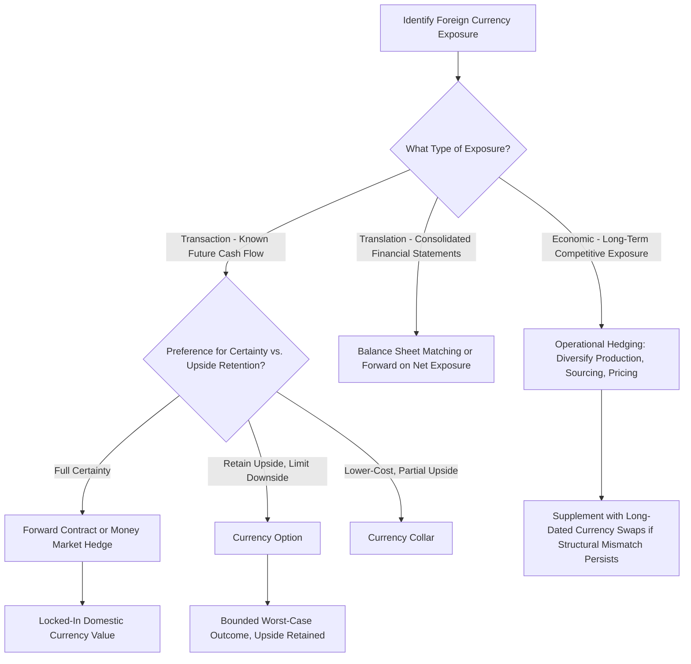

## Hedging Foreign Exchange Exposure

### Overview

Foreign exchange (FX) exposure arises whenever a firm's cash flows, assets, liabilities, or reported earnings are sensitive to changes in exchange rates. Multinational firms and companies engaged in cross-border trade face this exposure across several distinct dimensions, each requiring different measurement approaches and hedging strategies. This topic synthesizes the forward, futures, swap, and option instruments already covered into a framework specifically for currency risk management.

### Three Types of Foreign Exchange Exposure

**Transaction Exposure**

**Key Points**

- Arises from specific, contractually committed foreign-currency-denominated cash flows — a known future receivable or payable (e.g., an export sale invoiced in a foreign currency, an import purchase to be paid in a foreign currency, or a foreign-currency loan repayment).
- This is the most direct and most commonly hedged form of FX exposure, since the cash flow amount and timing are known with reasonable certainty, making it straightforward to size an appropriate hedge.

**Translation Exposure (Accounting Exposure)**

**Key Points**

- Arises from the need to translate the financial statements of foreign subsidiaries (denominated in local currency) into the parent company's reporting currency for consolidated financial reporting purposes.
- Affects reported book values (balance sheet and income statement) but does not necessarily represent an actual cash flow impact — it is primarily an accounting/reporting phenomenon.
- **[Inference]** Because translation exposure does not directly affect cash flows, whether and how much to hedge it is more debated in the finance literature than transaction exposure; some firms choose not to hedge translation exposure at all, reasoning that hedging non-cash accounting effects can itself require real cash expenditure (hedging costs) to manage a purely reported-earnings volatility concern.

**Economic (Operating) Exposure**

**Key Points**

- The broadest and most difficult-to-measure category: the sensitivity of a firm's *future* cash flows and competitive position to unanticipated exchange rate changes, arising from the firm's underlying operational and competitive structure (e.g., a firm competing against foreign producers whose costs are denominated in a different currency).
- Unlike transaction exposure, economic exposure often cannot be hedged with a simple financial instrument because it reflects structural competitive dynamics rather than a specific, quantifiable cash flow; management responses often involve operational strategies (diversifying production locations, adjusting pricing strategy, sourcing inputs in multiple currencies) rather than purely financial hedges.

### Hedging Transaction Exposure: Forward Contracts

**Key Points**

- The most direct hedge for a known future foreign-currency cash flow: lock in today's forward exchange rate for the future transaction date, eliminating uncertainty about the domestic-currency value of the cash flow (as detailed under forward and futures contracts).
- **Exporters** (expecting to receive foreign currency) hedge by **selling the foreign currency forward**.
- **Importers** (expecting to pay foreign currency) hedge by **buying the foreign currency forward**.

**Example**

A U.S. importer owes ¥100,000,000 in 6 months. Current spot rate: ¥145/$. 6-month forward rate: ¥143/$.

Without hedging, if the yen appreciates to ¥135/$ by the payment date, the dollar cost becomes $100{,}000{,}000 / 135 = \$740,741$ — a substantial increase from the current spot-implied cost of $100{,}000{,}000/145 = \$689,655$.

By locking in the forward rate of ¥143/$, the firm fixes its dollar cost at $100{,}000{,}000/143 = \$699{,}301$ regardless of where the spot rate moves.

### Hedging Transaction Exposure: Money Market Hedge

**Key Points**

- An alternative to a forward contract that replicates the same economic effect using the money and capital markets directly, based on the covered interest rate parity relationship.
- **For a foreign-currency payable**: Borrow domestic currency today, convert to foreign currency at the spot rate, and invest the foreign currency at the foreign risk-free rate until the payment is due (the investment grows to exactly cover the payable).
- **For a foreign-currency receivable**: Borrow foreign currency today (against the known future receivable), convert to domestic currency at the spot rate, and invest domestically; the future receivable is used to repay the foreign currency loan.
- **[Fact]** Under covered interest rate parity, a properly constructed money market hedge should produce an outcome economically equivalent to a forward contract hedge, since both derive from the same no-arbitrage relationship between spot rates, forward rates, and the interest rate differential between the two currencies.

### Covered Interest Rate Parity

The theoretical relationship linking spot rates, forward rates, and interest rate differentials:

$$F_0 = S_0 \times \frac{1+r_d}{1+r_f}$$

Where $F_0$ is the forward rate (domestic currency per unit of foreign currency), $S_0$ is the spot rate, $r_d$ is the domestic risk-free rate, and $r_f$ is the foreign risk-free rate.

**Example**: $S_0 = \$1.20/£$, $r_d = 4\%$ (USD), $r_f = 2\%$ (GBP), $T=1$ year:

$$F_0 = 1.20 \times \frac{1.04}{1.02} = 1.20 \times 1.0196 = \$1.2235/£$$

**Key Points**

- The currency with the higher interest rate ($r_d = 4\%$ here) trades at a **forward discount** relative to its own value when viewed from that currency's perspective, while the currency with the lower interest rate ($r_f = 2\%$, GBP) trades at a **forward premium** — this relationship prevents arbitrage opportunities between the money markets of the two currencies and the forward FX market.

### Hedging Transaction Exposure: Currency Options

**Key Points**

- Provides asymmetric protection: a firm can hedge against adverse currency movements while retaining the ability to benefit from favorable movements, at the cost of an upfront option premium.
- An importer concerned about the foreign currency appreciating (raising the domestic cost of payment) buys a **call option** on the foreign currency, capping the maximum domestic cost while preserving the benefit if the currency instead depreciates.
- An exporter concerned about the foreign currency depreciating (reducing the domestic value of a future receivable) buys a **put option** on the foreign currency, establishing a minimum guaranteed domestic-currency value while preserving upside if the currency instead appreciates.
- **Currency collars** (combining a purchased option with a written option in the opposite direction) reduce or eliminate the net premium cost, at the expense of giving up some or all of the retained upside — directly analogous to the collar structures covered under interest rate hedging.

### Comparison: Forward vs. Money Market Hedge vs. Options for Transaction Exposure

| Instrument | Certainty of Outcome | Upfront Cost | Retains Favorable-Movement Upside | Best Suited For |
| --- | --- | --- | --- | --- |
| Forward contract | Fixed, known outcome | None | No | Firms wanting simple, complete rate certainty |
| Money market hedge | Fixed, known outcome (economically equivalent to forward) | Uses firm's own borrowing/investing capacity | No | Firms without access to forward markets, or wanting on-balance-sheet transactions |
| Currency option | Bounded outcome (worst case known) | Upfront premium | Yes | Firms wanting downside protection with upside retained |
| Currency collar | Bounded range | Reduced/zero net premium | Partially | Firms wanting lower-cost protection, accepting limited upside |

### Hedging Translation Exposure

**Key Points**

- **Balance sheet hedging**: Adjusting the currency composition of assets and liabilities on the consolidated balance sheet (e.g., matching foreign-currency-denominated debt to foreign-currency-denominated assets) so that translation gains and losses on assets are offset by translation gains and losses on liabilities.
- **Forward contracts on net asset exposure**: Some firms use forward contracts sized to the net translation exposure (foreign assets minus foreign liabilities) to hedge the accounting effect, though this uses real financial instruments (with real cash settlement) to hedge a primarily non-cash accounting exposure — a practice with mixed support in the finance literature, per the inference noted above.

### Hedging Economic Exposure

**Key Points**

- Because economic exposure reflects structural, long-term competitive dynamics rather than a specific quantifiable cash flow, it is typically addressed through **operational hedging strategies** rather than financial derivatives alone:
  - **Diversifying production and sourcing locations** across multiple currency zones, so that cost structures move with (rather than against) revenue currency exposure.
  - **Diversifying the customer/revenue base** across multiple currencies and markets.
  - **Pricing strategy adjustments**: adjusting prices in different markets to reflect currency movements (pricing-to-market behavior).
  - **Matching the currency of financing to the currency of operating cash flows** (e.g., a foreign subsidiary financed with debt denominated in the local operating currency).
- **[Inference]** Financial derivatives can still play a supporting role in managing economic exposure (e.g., longer-dated currency swaps for firms with a stable, structural long-term currency mismatch), but they are generally considered a partial and imperfect substitute for the operational adjustments described above, since economic exposure is inherently forward-looking and only imprecisely quantifiable.

### FX Exposure and Hedging Decision Flow

### Corporate Currency Risk Management Policy Considerations

**Key Points**

- Firms typically establish formal hedging policies specifying which exposures are hedged (often prioritizing transaction exposure), the target hedge ratio (percentage of exposure covered), and the approved instruments and counterparties, reflecting the broader risk management motivations (reducing distress costs, preserving investment capacity, stabilizing reported earnings) covered previously.
- **[Inference]** The choice of hedge ratio (rarely 100% in practice for many firms) often reflects a tradeoff between the cost/complexity of comprehensive hedging and management's risk tolerance, as well as a view that some natural hedging already exists within the firm's broader currency exposure portfolio (offsetting exposures across different transactions or subsidiaries).

**Related Topics**

- Forward and futures contracts (pricing and mechanics)
- Interest rate swaps and currency swaps
- Covered interest rate parity and international parity conditions
- Motivations for corporate risk management
- Multinational capital budgeting and cross-border investment analysis