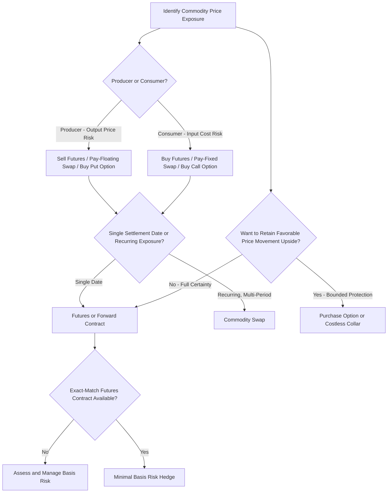

## Hedging Commodity Price Exposure

### Overview

Commodity price exposure arises for firms whose input costs (raw materials, energy) or output revenues (for commodity producers) are sensitive to fluctuations in commodity prices. This exposure affects producers, consumers/processors, and firms with indirect exposure through supply chains, and is managed using many of the same instrument classes already covered — futures, forwards, swaps, and options — adapted to the specific institutional features of physical commodity markets.

### Who Faces Commodity Price Exposure

**Key Points**

- **Producers** (e.g., oil and gas companies, mining firms, farmers) face revenue exposure: falling commodity prices reduce revenue on their output.
- **Consumers/processors** (e.g., airlines exposed to jet fuel, food manufacturers exposed to agricultural commodities, industrial manufacturers exposed to metals) face cost exposure: rising commodity prices increase input costs.
- **Firms with indirect exposure**: companies whose costs or competitors' costs are commodity-sensitive even without directly purchasing the commodity themselves (e.g., a plastics manufacturer indirectly exposed to crude oil prices through resin costs).

### Hedging with Commodity Futures

**Key Points**

- The most widely used instrument for commodity hedging, given deep, liquid futures markets for major commodities (crude oil, natural gas, agricultural products, industrial and precious metals).
- **Producers hedge by selling (shorting) futures**, locking in a sale price for their future output and protecting against price declines.
- **Consumers hedge by buying (going long) futures**, locking in a purchase price for future input needs and protecting against price increases.
- As detailed under forward and futures contracts, this is a **symmetric hedge**: the firm gives up potential benefit from favorable price movements in exchange for eliminating the risk of adverse movements, with no upfront premium cost (aside from margin requirements).

### Worked Example: Airline Fuel Hedging

**Given**: An airline expects to purchase 1,000,000 gallons of jet fuel in 6 months. Current price: $2.50/gallon. The airline is concerned about rising fuel costs and buys futures contracts (using a related energy futures contract, e.g., heating oil futures, as a proxy given the absence of a perfectly matched jet fuel futures market in many cases) to lock in an effective price of $2.55/gallon (reflecting the futures price plus expected basis).

**Scenario A: Fuel prices rise to $3.00/gallon**

- Unhedged cost: $1{,}000{,}000 \times 3.00 = \$3{,}000{,}000$
- Futures gain: approximately $1{,}000{,}000 \times (3.00 - 2.50) = \$500{,}000$ (before basis effects)
- Effective net cost: approximately $3{,}000{,}000 - 500{,}000 = \$2{,}500{,}000$, close to the locked-in effective price

**Scenario B: Fuel prices fall to $2.00/gallon**

- Unhedged cost: $1{,}000{,}000 \times 2.00 = \$2{,}000{,}000$
- Futures loss: approximately $1{,}000{,}000 \times (2.50 - 2.00) = \$500{,}000$
- Effective net cost: approximately $2{,}000{,}000 + 500{,}000 = \$2{,}500{,}000$, again close to the locked-in effective price

**Key Points**

- In both scenarios, the hedge fixes the effective cost close to the level locked in at inception, illustrating the symmetric nature of the futures hedge: protection against the adverse scenario comes paired with forgone benefit in the favorable scenario.
- **[Inference]** The use of a related but non-identical futures contract (heating oil as a proxy for jet fuel, in this illustrative example) introduces basis risk, meaning the actual hedge effectiveness in practice depends on how closely the prices of the two commodities move together; airlines and other commodity consumers often use a combination of contracts or over-the-counter swaps referencing the specific commodity grade to reduce this basis risk where more precisely matched instruments are available.

### Hedging with Commodity Swaps

**Key Points**

- A **commodity swap** allows a firm to exchange a floating (market) commodity price for a fixed price over multiple periods, without physically delivering the commodity — economically similar to an interest rate swap but referencing a commodity price index instead of an interest rate.
- Commonly used by firms with recurring, ongoing commodity exposure (e.g., a manufacturer with continuous input needs over several years) where a single futures or forward contract would only cover one settlement date, and rolling futures contracts repeatedly would be operationally cumbersome.
- The consumer typically **pays fixed and receives floating** on the swap (offsetting the floating market price they pay when actually purchasing the physical commodity), while the producer typically **pays floating and receives fixed** (offsetting the floating market price they receive when actually selling their physical output).

### Hedging with Commodity Options

**Key Points**

- Commodity **call options** allow consumers to cap their maximum input cost while retaining the benefit of lower prices, at the cost of an upfront premium — directly analogous to using currency call options to hedge a foreign-currency payable.
- Commodity **put options** allow producers to establish a minimum guaranteed sale price for their output while retaining upside if prices rise, at the cost of an upfront premium.
- **Costless collars** (combining a purchased option with a written option in the opposite direction, sized so premiums offset) are widely used in commodity hedging, particularly among producers in the energy and agricultural sectors, to obtain price protection without upfront cash outlay, at the expense of capping upside participation.

### Comparison of Commodity Hedging Instruments

| Instrument | Symmetry | Upfront Cost | Retains Favorable Price Movement Benefit | Typical User |
| --- | --- | --- | --- | --- |
| Futures/Forwards | Symmetric | None (futures require margin) | No | Both producers and consumers |
| Commodity swap | Symmetric | None | No | Firms with recurring, multi-period exposure |
| Purchased call option | Asymmetric | Premium paid | Yes | Consumers wanting cost protection with upside retained |
| Purchased put option | Asymmetric | Premium paid | Yes | Producers wanting price floor with upside retained |
| Costless collar | Partially asymmetric | Net-zero premium (typically) | Partially (bounded range) | Producers/consumers wanting low-cost protection |

### Basis Risk in Commodity Hedging

**Key Points**

- Basis risk is often more pronounced in commodity hedging than in financial hedging (interest rate or currency), because commodities frequently vary by **grade, quality, and delivery location**, and standardized futures contracts may not exactly match a firm's specific physical exposure (e.g., a specific crude oil grade, a specific regional natural gas hub, or a specific grain variety and delivery point).
- **[Inference]** This is why many commodity-intensive firms rely on customized OTC swaps referencing an index closely matched to their actual physical exposure, accepting greater counterparty credit risk (as with any OTC instrument) in exchange for reduced basis risk relative to standardized exchange-traded contracts.
- Transportation and storage cost differentials between the futures contract's delivery point and the firm's actual physical delivery point are a specific and well-recognized source of basis risk in commodity markets.

### Convenience Yield and Commodity Forward Pricing

**Key Points**

- As introduced under forward and futures contracts, **convenience yield** — the non-monetary benefit of holding a physical commodity inventory (e.g., ensuring continuous production without stockout risk) — can cause commodity forward/futures prices to deviate from the simple cost-of-carry model.
- When convenience yield is high (e.g., during periods of tight physical supply), markets can exhibit **backwardation** (futures prices below spot prices), whereas normal cost-of-carry dynamics (storage costs exceeding convenience yield) typically produce **contango** (futures prices above spot prices).
- **[Inference]** The prevailing term structure shape (contango vs. backwardation) affects the cost of maintaining a rolling futures hedge over time, since a firm that must roll futures contracts as they approach expiration experiences a cost (in contango) or a benefit (in backwardation) from the roll, independent of the outright commodity price direction — a practical consideration for firms with hedging horizons longer than the maturity of available futures contracts.

### Commodity Hedging Decision Flow

### Integration with Broader Risk Management Strategy

**Key Points**

- Commodity hedging decisions reflect the same core motivations covered under general corporate risk management: reducing cash flow volatility to lower financial distress costs, protect investment capacity for capital-intensive commodity-sector firms, and stabilize margins in the face of volatile input or output prices.
- **[Inference]** Firms in commodity-intensive industries often integrate hedging decisions directly into their capital budgeting and strategic planning processes, since commodity price assumptions are frequently a first-order driver of project NPV in sectors such as energy, mining, and agriculture — making the hedging policy and the capital allocation policy closely interrelated in practice.

**Related Topics**

- Forward and futures contracts (cost-of-carry pricing, convenience yield)
- Interest rate swaps and currency swaps (structural parallels to commodity swaps)
- Motivations for corporate risk management
- Real options analysis in capital budgeting for commodity-sector investments
- Basis risk and minimum-variance hedge ratio calculation